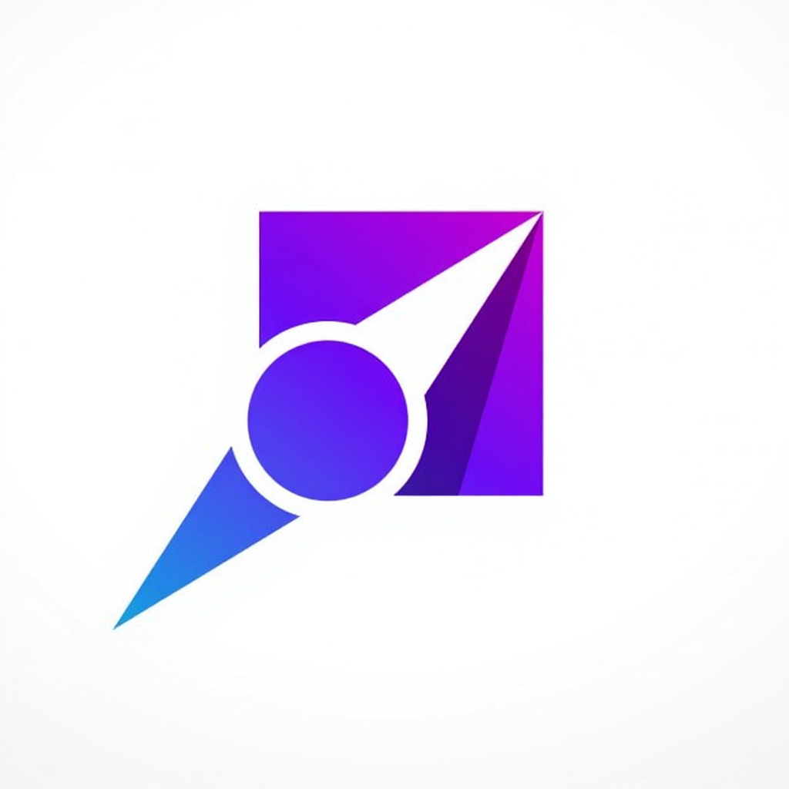

# Cahier des Charges Fonctionnel (CdCF)

    
    

## Sommaire
- [1. Introduction](#1-introduction)
- [2. Description du projet](#2-description-du-projet)
- [3. Acteurs et Rôles](#3-acteurs-et-rôles)
- [4. Fonctionnalités Détaillées](#4-fonctionnalités-détaillées)
- [5. Exigences non fonctionnelles](#5-exigences-non-fonctionnelles)
- [6. Critères de succès](#6-critères-de-succès)

---

## 1. Introduction

### 1.1 Objet du document
Ce document a pour but de définir de manière exhaustive les spécifications fonctionnelles de l'application **TaskForce**. Il sert de référence pour l'équipe de développement, la maîtrise d'ouvrage et les parties prenantes pour valider la conformité du produit final avec les besoins exprimés.

### 1.2 Portée
Le périmètre couvre l'ensemble des modules de l'application : gestion des utilisateurs, gestion des tâches, moteur d'assignation intelligent (IA), tableaux de bord et reporting.

---

## 2. Description du projet

**TaskForce** est une solution SaaS (Software as a Service) de gestion de projet assistée par Intelligence Artificielle. Elle se distingue par sa capacité à analyser les compétences des collaborateurs et leur charge de travail pour proposer une répartition optimale des tâches, réduisant ainsi le micromanagement et les risques de surcharge.

---

## 3. Acteurs et Rôles

L'application gère plusieurs niveaux d'accès et de responsabilités :

| Acteur | Description | Responsabilités Principales |
| :--- | :--- | :--- |
| **Administrateur** | Gestionnaire technique de la plateforme | Configuration globale, gestion des utilisateurs, audit des logs. |
| **Manager / Chef de Projet** | Responsable d'équipe ou de projet | Création de projets, validation des assignations IA, supervision de l'avancement, gestion des compétences de l'équipe. |
| **Collaborateur** | Membre de l'équipe opérationnelle | Consultation des tâches assignées, mise à jour de l'avancement, déclaration des compétences. |
| **Système (IA)** | Agent intelligent | Analyse des données, proposition d'assignations, détection des anomalies (surcharges, retards). |

---

## 4. Fonctionnalités Détaillées

### 4.1 Module Gestion des Utilisateurs & Compétences
*   **Authentification** : Connexion sécurisée (Email/Mot de passe), support SSO (Single Sign-On) futur.
*   **Profil Collaborateur** :
    *   Informations personnelles.
    *   **Matrice de compétences** : Liste des compétences techniques et soft skills avec niveau de maîtrise (1 à 5).
    *   **Disponibilité** : Gestion des congés, temps partiel, et fuseaux horaires.

### 4.2 Module Gestion des Projets et Tâches
*   **Création de Projet** : Définition du nom, description, dates, budget, et équipe allouée.
*   **Création de Tâche** :
    *   Titre, description riche.
    *   Compétences requises (tags).
    *   Estimation de charge (en heures ou points de complexité).
    *   Date d'échéance (Deadline).
    *   Priorité (Basse, Moyenne, Haute, Critique).
*   **Workflow** : Statuts personnalisables (ex: À faire, En cours, En revue, Terminé).

### 4.3 Module d'Assignation Intelligente (Cœur du système)
*   **Algorithme de Matching** :
    *   Analyse la tâche (compétences requises, complexité).
    *   Analyse les collaborateurs (compétences possédées, charge actuelle, historique de performance sur tâches similaires).
*   **Modes d'assignation** :
    *   *Automatique* : L'IA assigne directement (pour les tâches mineures).
    *   *Assisté* : L'IA propose 3 candidats idéaux au manager avec un score de pertinence (ex: "Recommandé à 95%").
*   **Rééquilibrage dynamique** : Suggestion de redistribution si un collaborateur est en surcharge ou si une tâche critique est en retard.

### 4.4 Tableaux de Bord et Suivi
*   **Vue Manager** :
    *   Vue globale multi-projets.
    *   Indicateurs de santé des projets (délais, budget).
    *   **Heatmap de charge** : Visualisation graphique de la charge de travail de l'équipe (Rouge = Surcharge, Vert = Disponible).
*   **Vue Collaborateur** :
    *   "Ma journée" : Liste priorisée des tâches à faire aujourd'hui.
    *   Notifications de nouvelles assignations.
*   **Vues Projet** : Kanban, Liste, Gantt (Planification temporelle).

### 4.5 Notifications et Alertes
*   **Canaux** : In-app, Email.
*   **Types d'alertes** :
    *   Nouvelle tâche assignée.
    *   Approche d'une deadline.
    *   Alerte "Risque de Burn-out" (détecté par l'IA sur base d'heures cumulées).
    *   Blocage signalé par un collaborateur.

---

## 5. Exigences non fonctionnelles

### 5.1 Ergonomie (UI/UX)
*   Interface "Mobile First" et Responsive.
*   Design System cohérent (Shadcn/ui), mode Sombre/Clair.
*   Accessibilité respectant les normes WCAG 2.1 (niveau AA).
*   Temps de réponse interface < 200ms.

### 5.2 Performance
*   Support de 500 utilisateurs simultanés sans dégradation notable.
*   Temps de calcul de l'algorithme d'assignation < 2 secondes pour un lot de 50 tâches.

### 5.3 Disponibilité
*   Taux de disponibilité cible : 99.9% (heures ouvrées).
*   Maintenance planifiée hors heures de bureau.

---

## 6. Critères de succès
*   Adoption par les utilisateurs (taux d'utilisation active > 80%).
*   Réduction du temps passé par les managers sur la planification (-30%).
*   Diminution des tâches en retard (-20%).
*   Satisfaction des collaborateurs sur la pertinence des tâches reçues.
