# Dossier UI/UX

    
    

## Sommaire

- [1. Introduction](#1-introduction)
- [2. Recherche utilisateur](#2-recherche-utilisateur)
- [3. Personas](#3-personas)
- [4. Parcours utilisateur (User Journey)](#4-parcours-utilisateur-user-journey)
- [5. Wireframes](#5-wireframes)
- [6. Prototypes](#6-prototypes)
- [7. Tests utilisateur](#7-tests-utilisateur)
- [8. Conclusion et recommandations](#8-conclusion-et-recommandations)
- [9. Annexes](#9-annexes)

## 6. Prototypes

**Landing page**
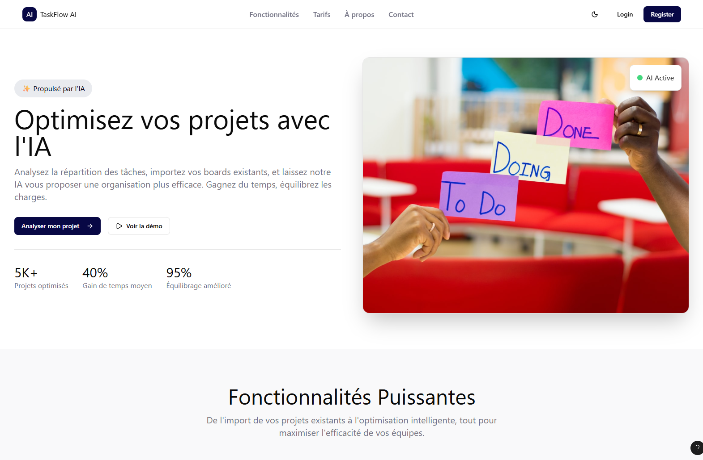
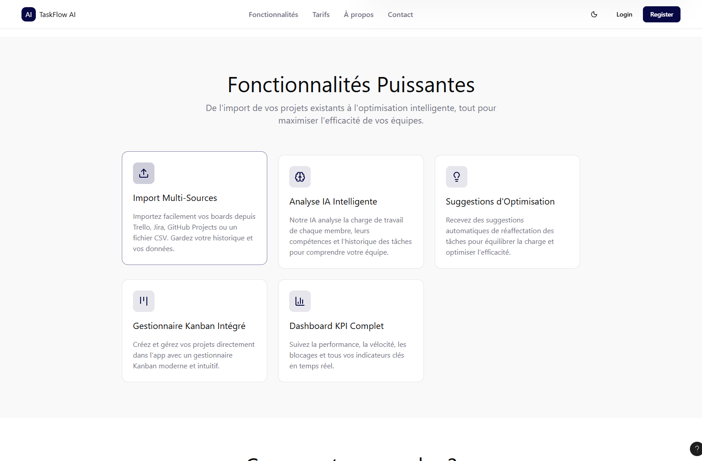
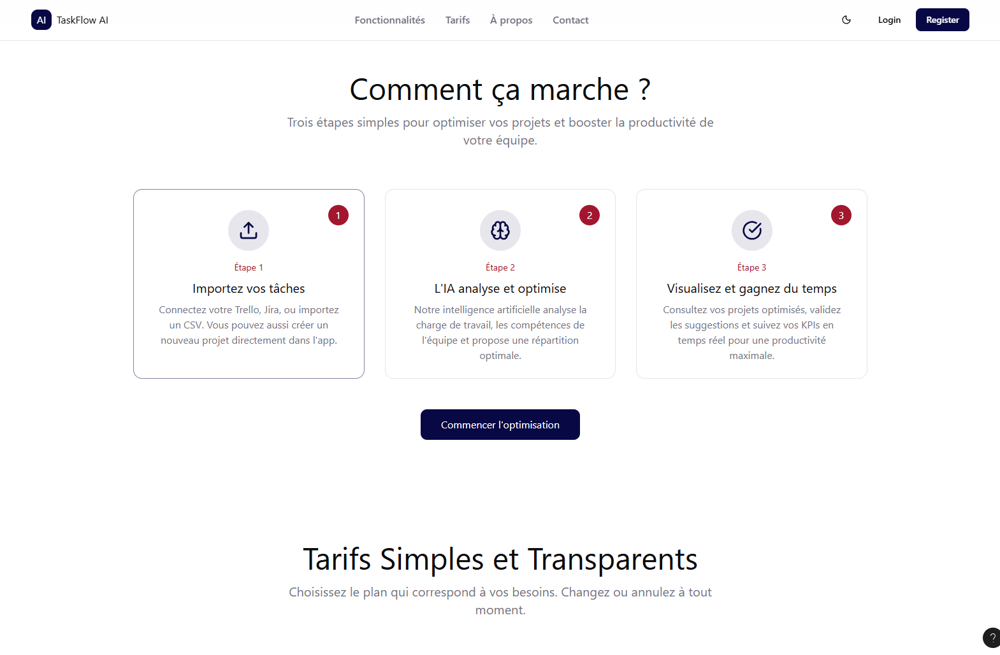
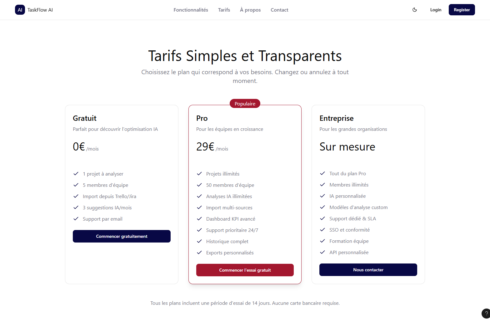
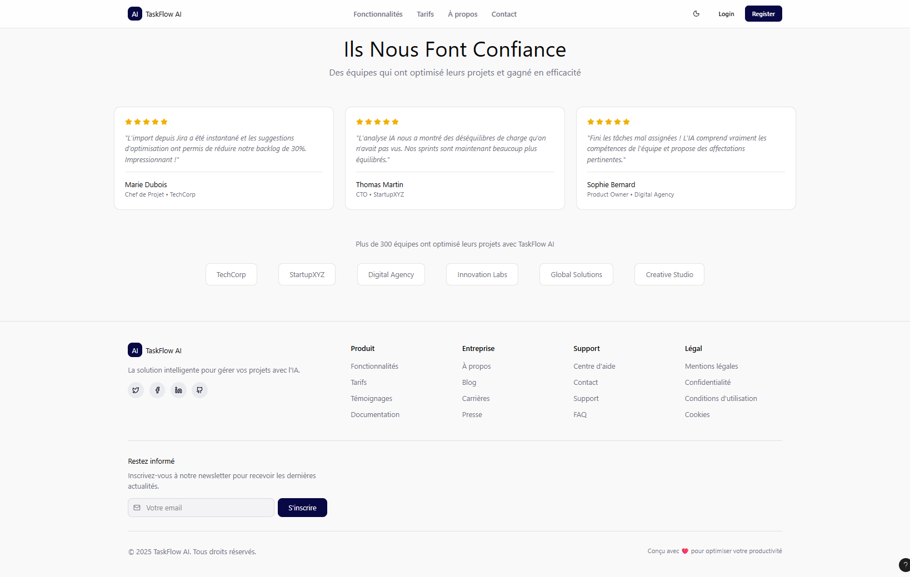

**Portail de connexion et création de compte:**
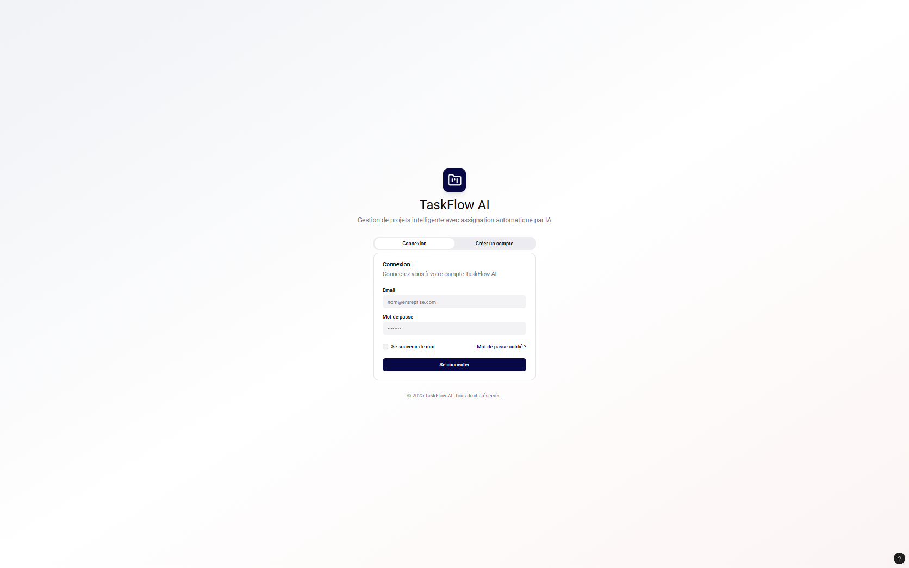
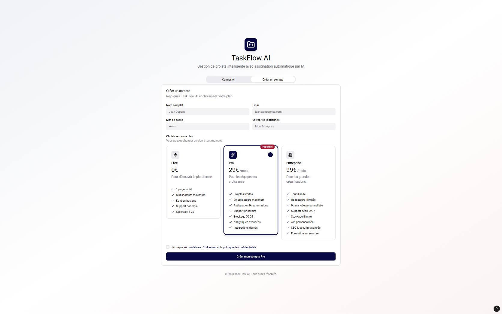

**Dashboard :**
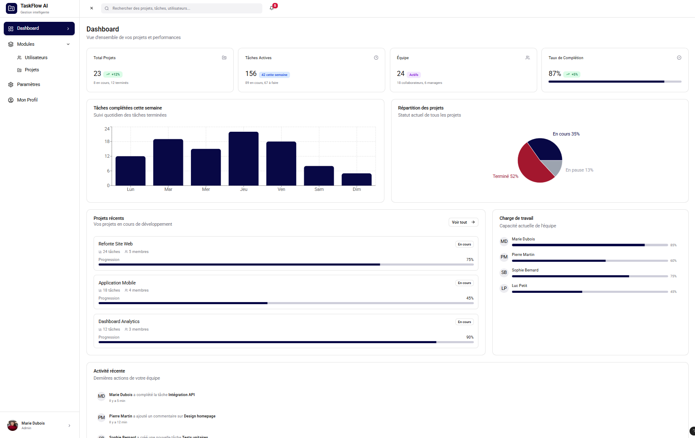

**Modules - Utilisateurs**
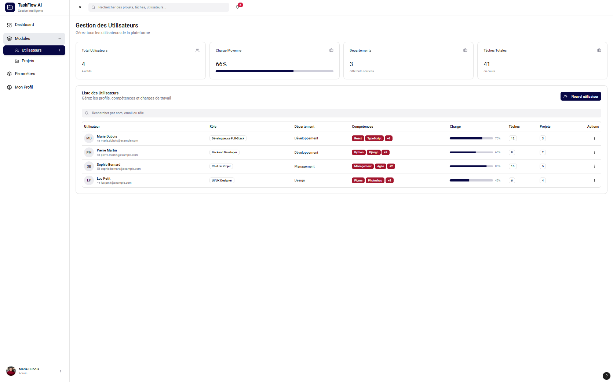

**Modules - Projets 1**
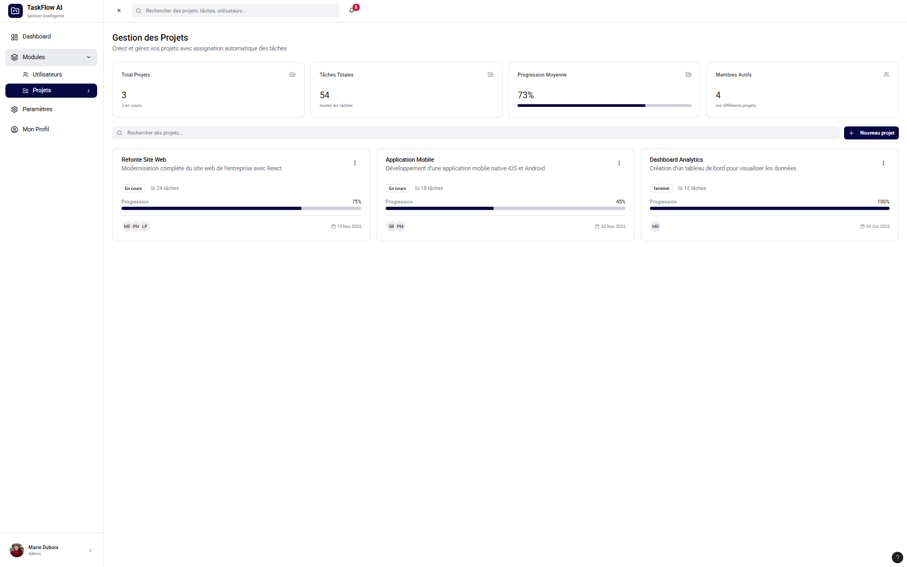

**Modules - Projets 2**
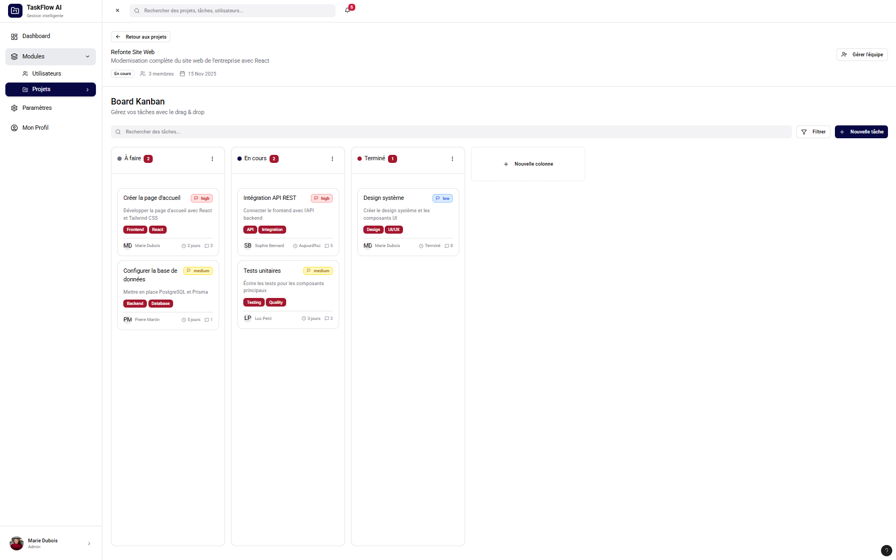

**Paramètres**
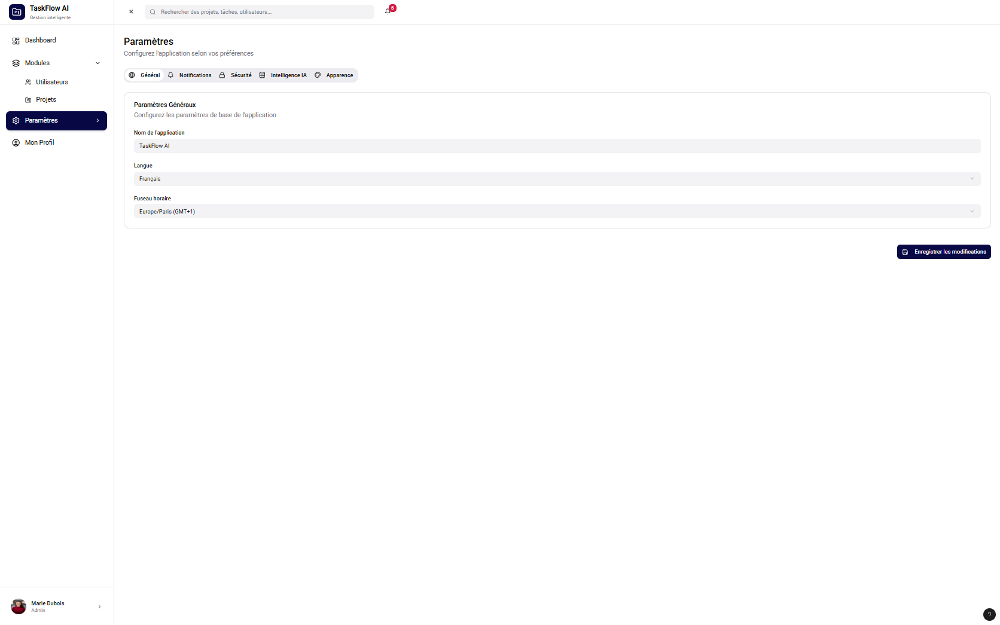

**Profil**
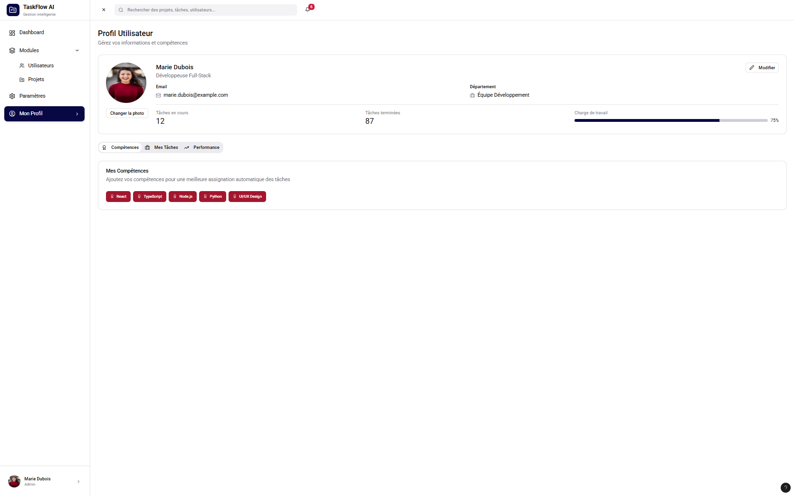
