# 🐳 Utilisation des Images Docker (GHCR)

Guide pour récupérer et tester les images Docker publiées sur **GitHub Container Registry (GHCR)**.

---

## 📦 Images Disponibles

Chaque merge vers `dev` ou `main` publie automatiquement les images Docker des services modifiés :

| Service | Image GHCR | Tags |
|---------|-----------|------|
| **Backend** | `ghcr.io/taskforce-project/taskforce-fullstack/backend` | `latest`, `backend-vX.Y.Z-rcN`, `sha-XXXXXXX` |
| **Frontend** | `ghcr.io/taskforce-project/taskforce-fullstack/frontend` | `latest`, `frontend-vX.Y.Z-rcN`, `sha-XXXXXXX` |
| **Landing** | `ghcr.io/taskforce-project/taskforce-fullstack/landing` | `latest`, `landing-vX.Y.Z-rcN`, `sha-XXXXXXX` |

---

## 🔐 Authentification

### Prérequis

1. **Docker Desktop** installé et démarré
2. **GitHub CLI** installé : `winget install GitHub.cli`
3. Accès au repository (membre de l'organisation)

### Connexion à GHCR

```powershell
# Méthode 1 : Via GitHub CLI (recommandé)
gh auth token | docker login ghcr.io -u VOTRE_USERNAME --password-stdin

# Méthode 2 : Token manuel
# 1. Créer un token : https://github.com/settings/tokens/new
#    - Cocher : read:packages
# 2. Se connecter :
$TOKEN = "ghp_VotreTOKENici"
echo $TOKEN | docker login ghcr.io -u VOTRE_USERNAME --password-stdin
```

**Important** : Remplace `VOTRE_USERNAME` par ton username GitHub (ex: `Miche1-Pierre`)

---

## 📥 Récupérer une Image

### Par Tag de Version

```powershell
# Dernière version stable (main)
docker pull ghcr.io/taskforce-project/taskforce-fullstack/landing:backend-v1.2.3

# Dernière version RC (dev)
docker pull ghcr.io/taskforce-project/taskforce-fullstack/landing:backend-v1.3.0-rc5

# Tag latest
docker pull ghcr.io/taskforce-project/taskforce-fullstack/landing:latest
```

### Par SHA de Commit

Utile pour tester une version exacte d'un commit :

```powershell
# Trouver le SHA sur GitHub
# https://github.com/taskforce-project/taskforce-fullstack/packages

docker pull ghcr.io/taskforce-project/taskforce-fullstack/landing:sha-bb0bba5b8454e6dde4c46cfaa1f76505d8d35a2d
```

---

## 🚀 Tester une Image

### Test Rapide (Foreground)

```powershell
# Landing (port 4321)
docker run --rm -p 4321:4321 ghcr.io/taskforce-project/taskforce-fullstack/landing:latest

# Frontend (port 3000)
docker run --rm -p 3000:3000 ghcr.io/taskforce-project/taskforce-fullstack/frontend:latest

# Backend (port 8080)
docker run --rm -p 8080:8080 ghcr.io/taskforce-project/taskforce-fullstack/backend:latest
```

Puis ouvrir :
- **Landing** : http://localhost:4321
- **Frontend** : http://localhost:3000
- **Backend** : http://localhost:8080

**Arrêter** : `Ctrl+C`

---

### Test en Background

```powershell
# Lancer en arrière-plan
docker run -d -p 4321:4321 --name landing-test ghcr.io/taskforce-project/taskforce-fullstack/landing:latest

# Voir les logs
docker logs -f landing-test

# Arrêter et supprimer
docker stop landing-test
docker rm landing-test
```

---

## 🧪 Tester Plusieurs Services

### Avec Docker Compose

Créer un fichier `docker-compose.test.yml` :

```yaml
version: '3.8'

services:
  backend:
    image: ghcr.io/taskforce-project/taskforce-fullstack/backend:latest
    ports:
      - "8080:8080"
    environment:
      - DATABASE_URL=postgresql://user:pass@db:5432/taskforce

  frontend:
    image: ghcr.io/taskforce-project/taskforce-fullstack/frontend:latest
    ports:
      - "3000:3000"
    environment:
      - NEXT_PUBLIC_API_URL=http://localhost:8080

  landing:
    image: ghcr.io/taskforce-project/taskforce-fullstack/landing:latest
    ports:
      - "4321:4321"
```

Puis :

```powershell
# Lancer tous les services
docker-compose -f docker-compose.test.yml up -d

# Voir les logs
docker-compose -f docker-compose.test.yml logs -f

# Arrêter tout
docker-compose -f docker-compose.test.yml down
```

---

## 🔍 Commandes Utiles

### Lister les Images Locales

```powershell
# Toutes les images GHCR
docker images | Select-String "ghcr.io/taskforce-project"

# Image spécifique
docker images ghcr.io/taskforce-project/taskforce-fullstack/landing
```

### Inspecter une Image

```powershell
# Voir les détails de l'image
docker inspect ghcr.io/taskforce-project/taskforce-fullstack/landing:latest

# Voir l'historique des layers
docker history ghcr.io/taskforce-project/taskforce-fullstack/landing:latest
```

### Nettoyer les Images

```powershell
# Supprimer une image spécifique
docker rmi ghcr.io/taskforce-project/taskforce-fullstack/landing:latest

# Supprimer toutes les images inutilisées
docker image prune -a
```

---

## 📋 Trouver les Tags Disponibles

### Via GitHub Web

1. Aller sur : https://github.com/orgs/taskforce-project/packages
2. Cliquer sur le package (backend/frontend/landing)
3. Voir tous les tags dans l'onglet "Versions"

### Via GitHub CLI

```powershell
# Lister les packages
gh api /orgs/taskforce-project/packages/container

# Lister les versions d'un package
gh api /orgs/taskforce-project/packages/container/taskforce-fullstack%2Flanding/versions
```

---

## 🛠️ Dépannage

### Erreur : Docker Desktop not running

```
error during connect: Post "http://%2F%2F.%2Fpipe%2FdockerDesktopLinuxEngine"
```

**Solution** : Démarrer Docker Desktop
```powershell
start "C:\Program Files\Docker\Docker\Docker Desktop.exe"
# Attendre 30 secondes
docker version
```

---

### Erreur : 403 Forbidden

```
Error response from daemon: unknown: unexpected status from HEAD request: 403 Forbidden
```

**Causes possibles** :
1. **Pas authentifié** → Refaire `docker login ghcr.io`
2. **Package privé** → Vérifier les permissions sur GitHub
3. **Token expiré** → Créer un nouveau token

**Solution** :
```powershell
# Se reconnecter
gh auth token | docker login ghcr.io -u VOTRE_USERNAME --password-stdin

# Vérifier l'accès au repo
gh repo view taskforce-project/taskforce-fullstack
```

---

### Erreur : Tag not found

```
Error response from daemon: manifest for ghcr.io/.../landing:vX.Y.Z not found
```

**Solution** : Vérifier que le tag existe
```powershell
# Lister les tags disponibles sur GitHub
start https://github.com/orgs/taskforce-project/packages/container/taskforce-fullstack%2Flanding/versions

# Ou utiliser 'latest'
docker pull ghcr.io/taskforce-project/taskforce-fullstack/landing:latest
```

---

## 🔒 Rendre un Package Public

Pour permettre le pull sans authentification :

1. Aller sur : https://github.com/orgs/taskforce-project/packages/container/taskforce-fullstack%2Flanding/settings
2. Dans "Danger Zone" > **Change visibility** > **Public**
3. Confirmer

**Attention** : Cela rend l'image accessible publiquement !

---

## 📊 Workflow Complet

```mermaid
graph LR
    A[PR mergée] --> B[GitHub Actions]
    B --> C[Build Docker]
    C --> D[Push GHCR]
    
    D --> E[Tag: latest]
    D --> F[Tag: service-vX.Y.Z-rcN]
    D --> G[Tag: sha-XXXXXXX]
    
    E --> H[docker pull]
    F --> H
    G --> H
    
    H --> I[docker run]
    I --> J[Test application]
```



---

## 🎯 Cas d'Usage

### 1. Tester une Feature en Review

```powershell
# 1. Trouver le SHA du dernier commit de la PR
# Sur GitHub > PR > Commits > Copier le SHA

# 2. Pull l'image de ce commit exact
docker pull ghcr.io/taskforce-project/taskforce-fullstack/backend:sha-abc123def456

# 3. Lancer et tester
docker run --rm -p 8080:8080 ghcr.io/taskforce-project/taskforce-fullstack/backend:sha-abc123def456
```

### 2. Comparer Deux Versions

```powershell
# Version actuelle (latest)
docker run -d -p 4321:4321 --name landing-latest ghcr.io/taskforce-project/taskforce-fullstack/landing:latest

# Version précédente
docker run -d -p 4322:4321 --name landing-old ghcr.io/taskforce-project/taskforce-fullstack/landing:landing-v1.0.0-rc3

# Tester les deux
start http://localhost:4321  # Latest
start http://localhost:4322  # Old
```

### 3. Rollback Rapide

```powershell
# Identifier la dernière version stable
docker pull ghcr.io/taskforce-project/taskforce-fullstack/backend:backend-v1.2.3

# Déployer (exemple avec docker-compose)
# Éditer docker-compose.yml pour utiliser le tag spécifique
# Puis :
docker-compose up -d backend
```

---

## 📚 Références

- [GitHub Container Registry Docs](https://docs.github.com/en/packages/working-with-a-github-packages-registry/working-with-the-container-registry)
- [Docker CLI Reference](https://docs.docker.com/engine/reference/commandline/cli/)
- [Versioning par Service](../git-workflow/versioning-par-service.md)
- [GitHub Actions](../git-workflow/github-actions.md)
