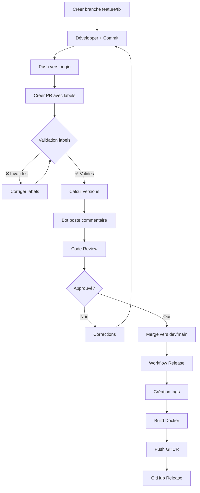

# 📋 Guide de Création de Pull Request

## 🎯 Workflow avec Versioning par Service

Depuis la mise à jour du système, chaque service (Backend, Frontend, Landing) possède **son propre versioning indépendant**.

---

## 🚀 Création d'une PR

### Étape 1 : Créer la branche

```bash
# Feature Backend
git checkout dev
git pull origin dev
git checkout -b feature/add-user-api

# Fix Frontend
git checkout dev
git pull origin dev
git checkout -b fix/header-responsive
```

### Étape 2 : Développer et commit

```bash
# Développer votre fonctionnalité
# ...

# Commit avec message conventionnel
git add .
git commit -m "feat(backend): add user CRUD API endpoints"
git push origin feature/add-user-api
```

### Étape 3 : Créer la PR avec les bons labels

```bash
# Exemple 1: Feature Backend → label backend:release:minor
gh pr create \
  --base dev \
  --title "feat(backend): Add user CRUD API" \
  --body "Adds REST endpoints for user management" \
  --label "backend:release:minor,type:feature"

# Exemple 2: Bugfix Frontend → label frontend:release:patch
gh pr create \
  --base dev \
  --title "fix(frontend): Fix header on mobile" \
  --body "Corrects header layout issues on small screens" \
  --label "frontend:release:patch,type:bug"

# Exemple 3: Modification de plusieurs services
gh pr create \
  --base dev \
  --title "feat: Add authentication system" \
  --body "Implements JWT auth on backend + frontend" \
  --label "backend:release:minor,frontend:release:minor,type:feature"
```

---

## 🏷️ Choix du Label de Release

### Backend

| Label | Quand l'utiliser | Exemple |
|-------|------------------|---------|
| `backend:release:major` | Breaking change API, migration BDD | Suppression d'un endpoint, changement de schéma |
| `backend:release:minor` | Nouvelle feature, nouvel endpoint | Ajout d'une API REST, nouvelle fonctionnalité |
| `backend:release:patch` | Bugfix, optimisation | Correction d'un bug, amélioration perf |

### Frontend

| Label | Quand l'utiliser | Exemple |
|-------|------------------|---------|
| `frontend:release:major` | Refonte UI complète, migration majeure | Changement de Next.js v13 → v15 |
| `frontend:release:minor` | Nouvelle page, nouveau composant | Ajout dashboard utilisateur |
| `frontend:release:patch` | Bugfix, correctif CSS | Correction responsive, fix typo |

### Landing

| Label | Quand l'utiliser | Exemple |
|-------|------------------|---------|
| `landing:release:major` | Refonte complète du site | Nouveau design complet |
| `landing:release:minor` | Nouvelle section, feature | Ajout section pricing |
| `landing:release:patch` | Bugfix, optimisation | Fix image loading, SEO |

---

## ✅ Validation Automatique

Une fois la PR créée, le workflow **version-management.yml** va :

1. **Vérifier les labels** :
   ```
   ✅ Au moins un label service:release:* présent
   ✅ Chaque service a maximum 1 label de release
   ✅ Les labels sont valides (backend|frontend|landing:release:major|minor|patch)
   ```

2. **Calculer les versions** :
   ```
   📦 Backend: backend-v1.2.0-rc0 → backend-v1.3.0-rc1
   📦 Frontend: frontend-v2.0.1-rc0 → frontend-v2.0.2-rc1
   ```

3. **Poster un commentaire** :
   ```markdown
   ## 📦 Version Preview
   
   This PR will create the following versions:
   
   - **Backend**: `backend-v1.3.0-rc1`
   - **Frontend**: `frontend-v2.0.2-rc1`
   
   ---
   _These versions will be created when this PR is merged._
   ```

---

## 📝 Exemples de Scénarios

### Scénario 1 : Nouvelle Feature Backend

**Contexte** : Ajout d'un système de notifications

```bash
# 1. Créer la branche
git checkout dev
git checkout -b feature/notifications-api

# 2. Développer
# ... code ...

# 3. Commit
git add backend/
git commit -m "feat(backend): add notifications API"
git push origin feature/notifications-api

# 4. PR
gh pr create \
  --base dev \
  --title "feat(backend): Add notifications API" \
  --body "Implements real-time notifications via WebSocket" \
  --label "backend:release:minor,type:feature"
```

**Résultat attendu** :
```
✅ Labels validés : backend:release:minor
📦 Version calculée : backend-v1.3.0-rc1
🚀 Build : backend uniquement (frontend et landing non buildés)
```

---

### Scénario 2 : Bugfix Frontend + Landing

**Contexte** : Correction d'un bug CSS présent sur les deux

```bash
# 1. Créer la branche
git checkout dev
git checkout -b fix/header-alignment

# 2. Développer
# ... code ...

# 3. Commit
git add frontend/ landing-page/
git commit -m "fix: header alignment on mobile"
git push origin fix/header-alignment

# 4. PR
gh pr create \
  --base dev \
  --title "fix: Header alignment on mobile" \
  --body "Fixes header CSS issues on small screens (< 768px)" \
  --label "frontend:release:patch,landing:release:patch,type:bug"
```

**Résultat attendu** :
```
✅ Labels validés : frontend:release:patch, landing:release:patch
📦 Versions calculées :
   - frontend-v2.0.2-rc1
   - landing-v1.0.1-rc1
🚀 Build : frontend + landing (backend non buildé)
```

---

### Scénario 3 : Breaking Change Backend

**Contexte** : Migration de l'ORM (Prisma → TypeORM)

```bash
# 1. Créer la branche
git checkout dev
git checkout -b refactor/migrate-typeorm

# 2. Développer
# ... code ...

# 3. Commit
git add backend/
git commit -m "refactor(backend): migrate from Prisma to TypeORM"
git push origin refactor/migrate-typeorm

# 4. PR
gh pr create \
  --base dev \
  --title "refactor(backend): Migrate to TypeORM" \
  --body "**BREAKING CHANGE**: Replaces Prisma with TypeORM for better flexibility" \
  --label "backend:release:major,type:refactor"
```

**Résultat attendu** :
```
✅ Labels validés : backend:release:major
📦 Version calculée : backend-v2.0.0-rc1 (incrémentation MAJOR)
🚀 Build : backend uniquement
⚠️  Breaking change → communication équipe nécessaire
```

---

### Scénario 4 : Hotfix Production

**Contexte** : Bug critique en production

```bash
# 1. Créer la branche depuis main
git checkout main
git pull origin main
git checkout -b hotfix/security-fix

# 2. Développer le fix
# ... code ...

# 3. Commit
git add backend/
git commit -m "fix(backend): patch security vulnerability CVE-2024-XXXX"
git push origin hotfix/security-fix

# 4. PR vers main (!)
gh pr create \
  --base main \
  --title "hotfix(backend): Security patch CVE-2024-XXXX" \
  --body "**URGENT**: Fixes critical security vulnerability" \
  --label "backend:release:patch,priority:critical,type:security"
```

**Résultat attendu** :
```
✅ Labels validés : backend:release:patch
📦 Version calculée : backend-v1.2.4 (sans -rc car main)
🚀 Build : backend uniquement
⚠️  Hotfix → déploiement immédiat en prod
```

**Important** : Après merge vers `main`, **backporter vers `dev`** :
```bash
git checkout dev
git pull origin main
git push origin dev
```

---

## 🛠️ Commandes Utiles

### Vérifier les labels disponibles
```bash
gh label list | grep "release"
```

### Ajouter un label à une PR existante
```bash
gh pr edit 42 --add-label "backend:release:minor"
```

### Retirer un mauvais label
```bash
gh pr edit 42 --remove-label "backend:release:major"
```

### Voir l'aperçu des versions (via le bot)
```bash
# Le bot poste automatiquement, mais vous pouvez voir manuellement :
gh pr view 42 --comments
```

---

## ❌ Erreurs Courantes

### Erreur 1 : Pas de label de release

```
❌ This PR must have at least one service release label
```

**Solution** :
```bash
gh pr edit --add-label "backend:release:minor"
```

---

### Erreur 2 : Plusieurs labels pour le même service

```
❌ Multiple release labels found for the same service
```

**Solution** :
```bash
# Retirer le mauvais label
gh pr edit --remove-label "backend:release:major"
# Garder seulement le bon
gh pr edit --add-label "backend:release:minor"
```

---

### Erreur 3 : Label invalide

```
❌ Invalid release label: backend:release:experimental
```

**Solution** : Utiliser uniquement `major`, `minor`, ou `patch` :
```bash
gh pr edit --remove-label "backend:release:experimental"
gh pr edit --add-label "backend:release:minor"
```

---

## 📊 Workflow Visuel



---

## 📚 Références

- [Versioning par Service](./versioning-par-service.md) - Guide complet du versioning
- [Labels Reference](./labels-reference.md) - Liste exhaustive des labels
- [GitHub Actions](./github-actions.md) - Détails techniques des workflows
