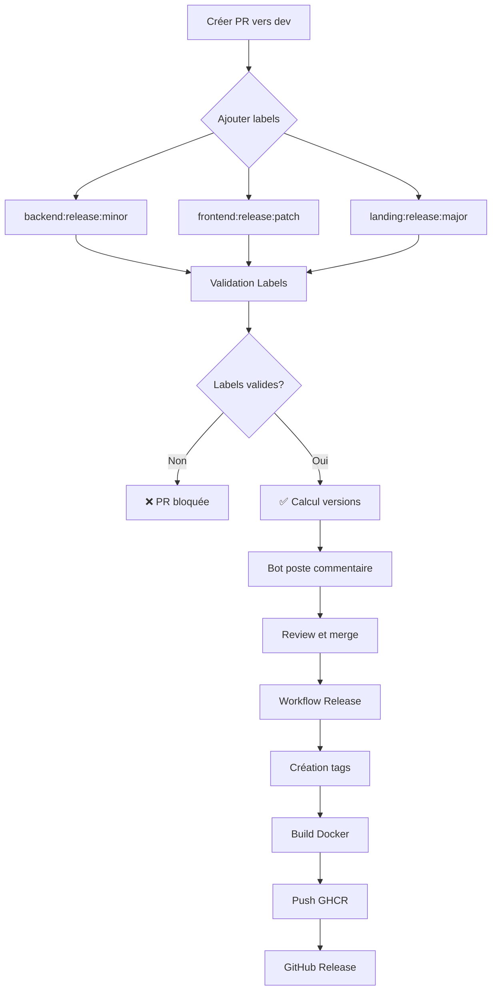

# 🔖 Système de Versioning par Service

## Vue d'ensemble

Chaque service du projet TaskForce possède **son propre versioning indépendant** :
- **Backend** : `backend-v1.2.3`
- **Frontend** : `frontend-v2.0.1`
- **Landing** : `landing-v1.0.0`

Cela permet de déployer et versionner chaque service séparément.

---

## 📋 Format des Tags

### Environnement Dev (branche `dev`)
```
backend-v1.2.3-rc1
frontend-v2.0.1-rc2
landing-v1.0.0-rc5
```

### Environnement Production (branche `main`)
```
backend-v1.2.3
frontend-v2.0.1
landing-v1.0.0
```

---

## 🏷️ Labels GitHub

### Backend
| Label | Couleur | Description | Exemple |
|-------|---------|-------------|---------|
| `backend:release:major` | 🔴 Rouge | Breaking changes | `v1.x.x` → `v2.0.0` |
| `backend:release:minor` | 🟢 Vert | Nouvelles features | `v1.2.x` → `v1.3.0` |
| `backend:release:patch` | 🟡 Jaune | Corrections bugs | `v1.2.3` → `v1.2.4` |

### Frontend
| Label | Couleur | Description | Exemple |
|-------|---------|-------------|---------|
| `frontend:release:major` | 🔴 Rouge | Breaking changes | `v1.x.x` → `v2.0.0` |
| `frontend:release:minor` | 🟢 Vert | Nouvelles features | `v1.2.x` → `v1.3.0` |
| `frontend:release:patch` | 🟡 Jaune | Corrections bugs | `v1.2.3` → `v1.2.4` |

### Landing
| Label | Couleur | Description | Exemple |
|-------|---------|-------------|---------|
| `landing:release:major` | 🔴 Rouge | Breaking changes | `v1.x.x` → `v2.0.0` |
| `landing:release:minor` | 🟢 Vert | Nouvelles features | `v1.2.x` → `v1.3.0` |
| `landing:release:patch` | 🟡 Jaune | Corrections bugs | `v1.2.3` → `v1.2.4` |

---

## 🚀 Utilisation

### 1. Créer une Pull Request

Selon les services modifiés, ajouter les labels appropriés :

```bash
# Exemple 1: Modification Backend uniquement
gh pr create --base dev --label "backend:release:minor"

# Exemple 2: Modification Frontend et Landing
gh pr create --base dev --label "frontend:release:patch,landing:release:patch"

# Exemple 3: Tous les services
gh pr create --base dev --label "backend:release:major,frontend:release:minor,landing:release:patch"
```

### 2. Validation Automatique

Le workflow `version-management.yml` vérifie :
- ✅ Au moins un label `service:release:*` est présent
- ✅ Chaque service a **maximum 1** label de release
- ✅ Les labels sont valides

### 3. Calcul des Versions

Le bot GitHub poste un commentaire sur votre PR :

```markdown
## 📦 Version Preview

This PR will create the following versions:

- **Backend**: `backend-v1.3.0-rc1`
- **Frontend**: `frontend-v2.0.1-rc1`

---
_These versions will be created when this PR is merged._
```

### 4. Merge et Release

Lors du merge vers `dev` ou `main` :
1. **Création des tags** : Un tag est créé pour chaque service modifié
2. **Build Docker** : Seuls les services modifiés sont buildés
3. **Publication** : Images Docker poussées vers `ghcr.io` avec les bons tags
4. **GitHub Release** : Une release est créée pour chaque tag

---

## 📊 Exemples de Scénarios

### Scénario 1 : Feature Backend uniquement

**Contexte** : Ajout d'une API REST pour la gestion des tâches

```yaml
PR: feature/task-api → dev
Label: backend:release:minor
Fichiers: backend/tf-api/src/**

Résultat:
  Tag créé: backend-v1.3.0-rc1
  Docker: ghcr.io/org/backend:backend-v1.3.0-rc1
  Services buildés: backend ✅ | frontend ❌ | landing ❌
```

### Scénario 2 : Bugfix Frontend et Landing

**Contexte** : Correction d'un bug CSS sur le header (présent sur frontend + landing)

```yaml
PR: fix/header-css → dev
Labels: 
  - frontend:release:patch
  - landing:release:patch
Fichiers: 
  - frontend/components/Header.tsx
  - landing-page/src/components/Header.astro

Résultat:
  Tags créés: 
    - frontend-v2.0.2-rc1
    - landing-v1.0.1-rc1
  Docker: 
    - ghcr.io/org/frontend:frontend-v2.0.2-rc1
    - ghcr.io/org/landing:landing-v1.0.1-rc1
  Services buildés: backend ❌ | frontend ✅ | landing ✅
```

### Scénario 3 : Breaking Change Backend

**Contexte** : Migration de PostgreSQL à MongoDB (changement de schéma complet)

```yaml
PR: refactor/migrate-mongodb → dev
Label: backend:release:major
Fichiers: backend/tf-api/**

Résultat:
  Tag créé: backend-v2.0.0-rc1
  Docker: ghcr.io/org/backend:backend-v2.0.0-rc1
  Services buildés: backend ✅ | frontend ❌ | landing ❌
```

### Scénario 4 : Release vers Production

**Contexte** : Merge de `dev` vers `main` après tests réussis

```yaml
PR: dev → main
Labels: 
  - backend:release:minor
  - frontend:release:patch
Fichiers: Tous les fichiers mergés depuis dev

Résultat:
  Tags créés: 
    - backend-v1.3.0 (sans -rc)
    - frontend-v2.0.2 (sans -rc)
  Docker: 
    - ghcr.io/org/backend:backend-v1.3.0
    - ghcr.io/org/frontend:frontend-v2.0.2
  Release GitHub: 2 releases créées (une par tag)
```

---

## 🔍 Détection Automatique

Le workflow détecte les services modifiés via :

1. **Labels GitHub** (prioritaire) :
   ```bash
   Si PR a "backend:release:*" → Backend modifié
   Si PR a "frontend:release:*" → Frontend modifié
   Si PR a "landing:release:*" → Landing modifié
   ```

2. **Fichiers modifiés** (fallback) :
   ```bash
   Fichiers dans backend/** → Backend modifié
   Fichiers dans frontend/** → Frontend modifié
   Fichiers dans landing-page/** → Landing modifié
   ```

---

## 🛠️ Commandes Utiles

### Lister les tags d'un service
```bash
# Backend
git tag -l "backend-v*" --sort=-v:refname | head -n5

# Frontend
git tag -l "frontend-v*" --sort=-v:refname | head -n5

# Landing
git tag -l "landing-v*" --sort=-v:refname | head -n5
```

### Voir la version actuelle d'un service
```bash
# Dernière version RC du backend
git tag -l "backend-v*-rc*" --sort=-v:refname | head -n1

# Dernière version stable du frontend
git tag -l "frontend-v*" --sort=-v:refname | grep -v "rc" | head -n1
```

### Créer un tag manuellement (⚠️ déconseillé)
```bash
git tag -a backend-v1.0.0 -m "Backend Release 1.0.0"
git push origin backend-v1.0.0
```

---

## ❓ FAQ

### Puis-je merger une PR sans label de release ?

**Non.** Le workflow `version-management.yml` bloquera la PR si aucun label `service:release:*` n'est présent.

### Que se passe-t-il si j'ajoute 2 labels pour le même service ?

**Erreur.** Le workflow refusera la PR. Un service ne peut avoir qu'un seul label de release :
```
❌ Multiple release labels found for the same service
```

### Comment savoir quelle version sera créée ?

Le bot GitHub poste automatiquement un commentaire sur votre PR avec un **aperçu des versions** :
```markdown
## 📦 Version Preview
- **Backend**: `backend-v1.3.0-rc1`
```

### Puis-je versionner uniquement certains services ?

**Oui !** Si vous modifiez seulement le backend, ajoutez uniquement `backend:release:minor`. Les autres services ne seront pas versionnés.

### Comment fonctionne le versioning en prod vs dev ?

| Branche | Format | Exemple | Auto-increment |
|---------|--------|---------|----------------|
| `dev` | `service-vX.Y.Z-rcN` | `backend-v1.2.3-rc5` | Incrémente RC à chaque merge |
| `main` | `service-vX.Y.Z` | `backend-v1.2.3` | Version stable sans RC |

---

## 🎯 Workflow Complet



---

## 📚 Références

- [Semantic Versioning 2.0.0](https://semver.org/)
- [GitHub Actions Workflows](./github-actions.md)
- [Guide Pull Requests](./pull-requests.md)
- [Référence Labels](./labels-reference.md)
