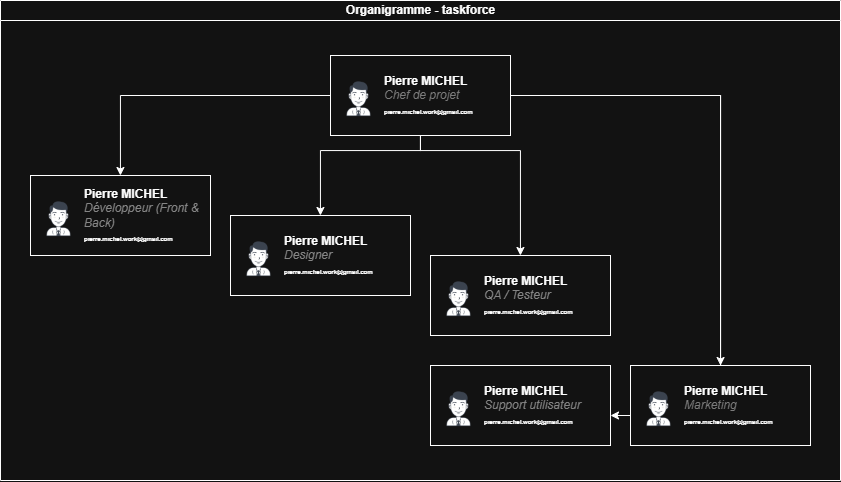
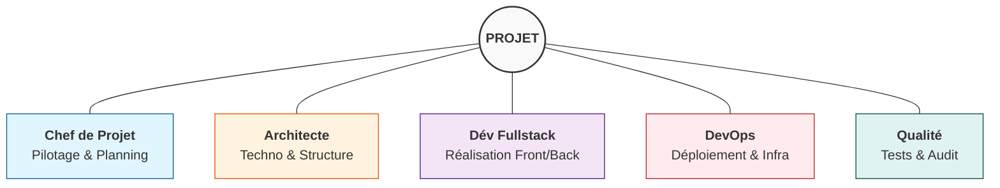
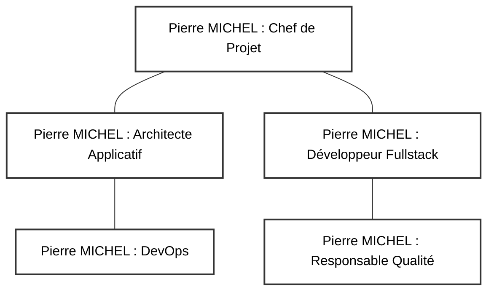
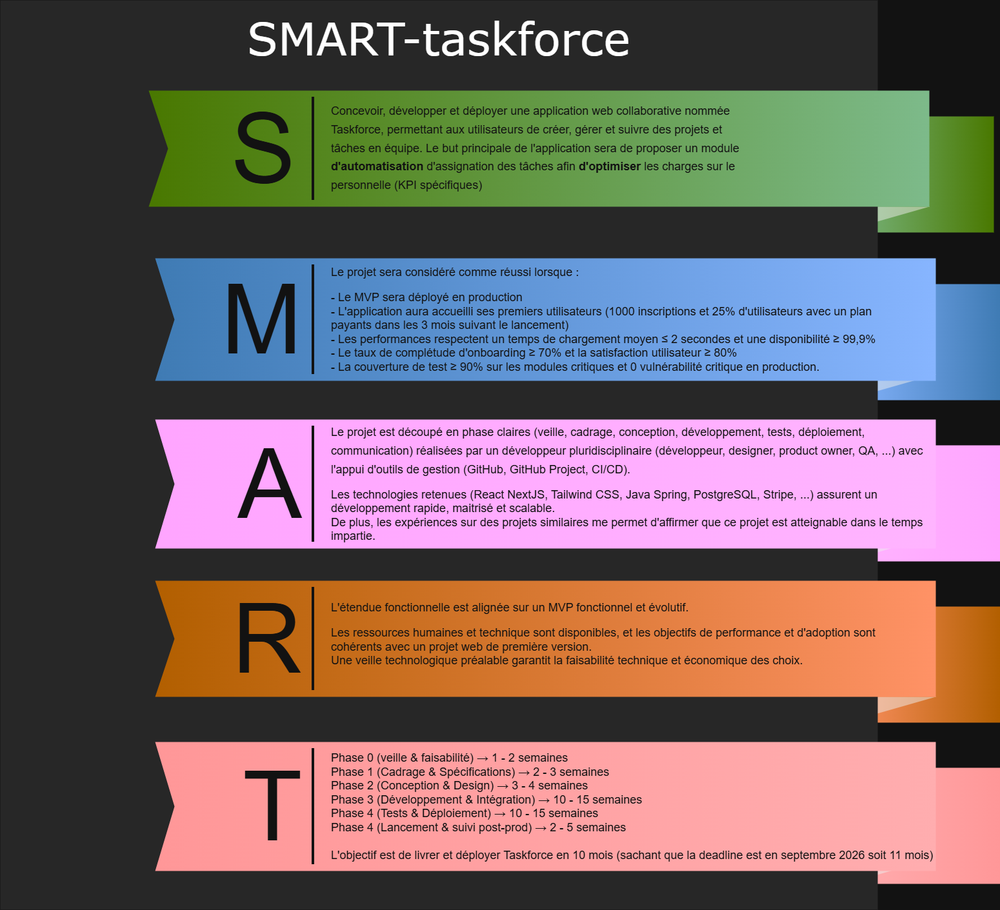
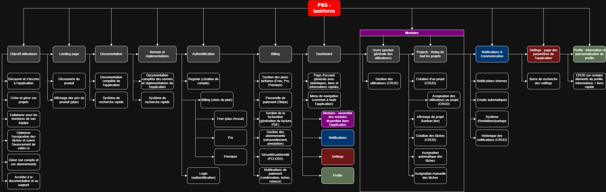

<!--
Logo établissement : assets/images/logo_metz_numeric_school.svg
Logo projet        : assets/images/logo_taskforce.png
-->

# Dossier Projet

**Version :** 1.2  
**Date :** 17/01/2026  
**Auteur(s) :** Pierre MICHEL

  

## Liens rapides

- [Dossier Projet](./Dossier_Projet.md)
- [CdCF – Cahier des Charges Fonctionnel](./01_CdCF.md)
- [CdCT – Cahier des Charges Technique](./02_CdCT.md)
- [Business & Analyse de marché](./Etude_business.md)
- [Stratégie Marketing & Commerciale](./Strategie_Marketing.md)
- [Repository GitHub](https://github.com/...)

**Tags :** `#gestion-de-projet` `#documentation` `#webapp` `#architecture` `#erp` `#saas`

## 1. Contexte et vision du projet

Ce document présente une synthèse du contexte et de la vision du projet. Pour une description fonctionnelle détaillée, se référer au [CdCF - Cahier des Charges Fonctionnel](./01_CdCF.md).

### Contexte général

Le projet **Taskforce** vise la conception et le développement d'une plateforme de gestion de projet professionnelle, positionnée comme un ERP modulaire et extensible. Au cœur de cette plateforme se trouve un système de répartition dynamique et automatisée des tâches au sein d'équipes de travail. L'objectif principal est d'optimiser l'allocation des missions en prenant en compte les compétences, la charge de travail, les disponibilités, les priorités et d'autres critères, afin d'améliorer la performance collective et de réduire les situations de surcharge individuelle.

La **vision produit** repose sur une plateforme modulaire composée d'un **Core applicatif** qui constitue l'infrastructure technique (authentification, multi-tenant, sécurité) et d'un **module de gestion de projet** regroupant les fonctionnalités métier complètes (projets, tâches, compétences, assignation automatique, reporting). Cette architecture permet une extensibilité future vers des modules optionnels destinés à des usages réglementés (comme LIMS pour les laboratoires ou des modules qualité), ou encore l'adaptation aux besoins de structures plus importantes en développant de nouveaux modules spécifiques. L'approche privilégie la validation initiale du socle technique (Core) et du module métier principal avant d'envisager l'ajout de modules spécialisés selon les besoins clients. Cette stratégie garantit une structure plus simple à développer et à maintenir, en isolant l'infrastructure des fonctionnalités métier.

### Problématique adressée

Dans un contexte professionnel moderne, les entreprises font face à une complexité croissante dans la gestion des ressources humaines et la coordination des équipes. La répartition manuelle des tâches devient très vite inefficace, source de déséquilibres de charge, de perte de productivité et de démotivation. Le projet répond à ce besoin en proposant un outil intelligent d'aide à la décision pour les managers, tout en offrant une visibilité partagée aux collaborateurs sur la répartition et l'avancement des tâches.

### Objectifs fonctionnels majeurs

L'application a pour ambition de transformer la gestion quotidienne des tâches en entreprise. Elle permettra notamment l'assignation automatique des tâches en fonction des compétences disponibles, de la charge de travail actuelle, des priorités définies et d'autres critères pertinents. Le suivi en temps réel de la charge de travail des collaborateurs constituera un pilier central, permettant une optimisation continue de l'utilisation des ressources humaines. Cette optimisation privilégiera les profils les plus adaptés tout en garantissant une répartition équitable des missions. L'interface collaborative offrira une vue globale de l'état d'avancement des tâches, tandis qu'un système de détection et d'alerte signalera les situations de surcharge avec possibilité de réajustement immédiat.

### Démarche projet attendue

Le projet s'inscrit dans une approche structurée qui débute par une analyse approfondie des besoins et la définition des Users Stories, fil rouge de toute la réalisation. La conception de l'architecture logicielle et du modèle de données constituera une phase clé, permettant de poser les bases d'un système évolutif. Le développement suivra un cycle agile avec une première itération consacrée à la partie Core accompagnée des tests nécessaires, suivie d'une itération similaire pour le module métier principal. Une phase de déploiement et d'ajustement précédera les tests auprès d'un groupe pilote, avant l'ajustement final de la plateforme et l'accompagnement des utilisateurs dans leur prise en main de l'outil.

### Livrables et évaluation

Le projet donnera lieu à plusieurs livrables majeurs. Une documentation technique complète accompagnera le code source de l'application, permettant sa maintenance et son évolution future. Un manuel utilisateur adapté aux différents profils (collaborateurs et managers) facilitera l'adoption de l'outil, tandis qu'un support post-déploiement assurera la continuité du service. Le projet sera évalué sur sa capacité à automatiser et simplifier la gestion des tâches, à prévenir les surcharges de travail et à améliorer durablement la productivité des équipes, dans une logique d'amélioration continue basée sur les retours utilisateurs.

## 2. Présentation de l'équipe projet

### Composition et profil

Le projet est porté par un seul membre qui assume l'ensemble des fonctions stratégiques et opérationnelles. En tant que chef de projet, il assure le pilotage global avec la gestion des plannings, l'arbitrage des priorités et le suivi des livrables. Sa casquette d'architecte applicatif lui permet de définir l'architecture logicielle, de procéder aux choix technologiques et de maintenir une veille technique continue. Le rôle de développeur fullstack implique la conception et la réalisation des modules front-end et back-end, ainsi que l'intégration continue du code. La fonction DevOps englobe la gestion des environnements, l'automatisation des déploiements, la supervision et l'observabilité de l'infrastructure. Enfin, en qualité de responsable qualité, il met en place les tests, assure le contrôle qualité et maintient la documentation à jour.

### Compétences mobilisées

Le projet mobilise une expertise approfondie en développement web, avec notamment Java et Spring Boot utilisant Gradle DSL Kotlin pour le back-end, ainsi que React, TypeScript, Next.js et Astro pour le front-end. La maîtrise des architectures modulaires et des pratiques DevOps constitue un atout majeur pour structurer efficacement le projet. La connaissance des normes réglementaires telles que le RGPD, WCAG 2.1, RGAA, ISO 27001, OWASP Top 10 et les recommandations de la CNIL garantit la conformité de la solution. Enfin, l'expérience en gestion de projet agile et la maîtrise des outils collaboratifs comme GitHub, GitHub Projects et l'intégration continue facilitent l'organisation du travail.

### Organisation du travail

L'organisation repose sur la création d'un GitHub project pour la gestion des tâches, des issues et des jalons prédéfinis. La répartition du temps s'effectue selon les phases projet, avec une adaptation continue des priorités en fonction des jalons, des risques identifiés et du niveau de progression atteint. Cette approche flexible permet de répondre efficacement aux aléas tout en maintenant le cap sur les objectifs fixés.

### Visualisation des rôles

## 3. Organisation de l'équipe projet

### Structure organisationnelle

L'organisation repose sur la gestion multi-rôles du porteur de projet, avec une formalisation claire des responsabilités. Chaque rôle est défini avec ses missions principales couvrant le pilotage, la conception, le développement, la qualité et le déploiement. La gestion des conflits de rôle s'effectue par une priorisation des tâches selon l'urgence et l'importance, avec un arbitrage systématique par le porteur. Le suivi des responsabilités utilise une matrice RACI pour clarifier les responsabilités et les livrables associés, garantissant ainsi une traçabilité complète de l'exécution du projet.

### Outils et méthodes

L'organisation s'appuie sur plusieurs outils structurants. La matrice RACI détaillée (disponible dans la documentation de suivi agile) permet d'identifier précisément les responsabilités pour chaque tâche et livrable. Les tableaux de suivi des tâches et des jalons utilisent la matrice d'Eisenhower pour une priorisation efficace basée sur l'urgence et l'importance. L'ensemble de la documentation est centralisée sur GitHub, garantissant un versionnement rigoureux et une accessibilité permanente pour le suivi et l'évaluation du projet.

## 4. Méthodologie de projet employée

### Approche méthodologique

Le projet s'appuie sur une méthodologie agile adaptée au contexte mono-acteur. Le cycle de vie projet se décompose en phases clairement identifiées : initialisation, conception, développement, tests, déploiement et bilan. Chaque itération, ou sprint, vise un livrable fonctionnel ou technique, avec une durée adaptée à la charge de travail. La gestion des tâches s'effectue via GitHub Projects, permettant le suivi des tâches, des jalons, des issues et des User Stories à travers les Milestones.

La gestion documentaire suit une approche de documentation continue sur GitHub, avec un versionnement systématique des documents et du code. Les versions sont gérées via des branches Git dédiées par fonctionnalité ou lot, avec une intégration continue orchestrée par GitHub Actions. La gestion des priorités fait l'objet d'un arbitrage hebdomadaire, prenant en compte l'avancement réel, les risques identifiés et les éventuels retours utilisateurs.

### Outils utilisés

L'écosystème d'outils repose principalement sur GitHub Projects pour la gestion fine des Issues et des Milestones, ainsi que sur GitHub Actions pour l'automatisation des pipelines de CI/CD. Cette intégration native garantit une cohérence entre le code, la documentation et le suivi projet. Pour plus de détails sur l'implémentation technique et l'organisation des workflows, consulter la documentation GitHub du projet.

## 5. Veille technologique et moyens de veille

La veille technologique constitue un élément essentiel du projet, compte tenu de l'évolution rapide des technologies web et des exigences réglementaires. Une veille active est maintenue sur les technologies front-end, notamment Next.js, Astro, React, TypeScript, ainsi que les librairies complémentaires comme Zustand, TanStack Query et Zod. Du côté back-end, la veille couvre Spring Boot, Gradle avec Kotlin DSL, les évolutions de Java, PostgreSQL, Keycloak, l'API Stripe et Docker.

Le suivi des évolutions réglementaires porte sur le RGPD, les normes applicables aux systèmes LIMS et l'écosystème SaaS en général. Les sources d'information incluent des publications spécialisées, des newsletters techniques, des communautés open source et des forums de développeurs. Cette veille permanente permet d'anticiper les évolutions technologiques et de maintenir l'alignement du projet avec les meilleures pratiques du marché. Pour la démarche complète de veille et son application concrète, se référer au [CdCT](./02_CdCT.md) et à l'analyse de marché dans le document [Business](./Etude_business.md).

### Outils et plateformes de veille utilisés

La veille s'appuie sur plusieurs plateformes et outils spécialisés garantissant une couverture complète de l'écosystème technologique :

**Agrégateurs de contenu technique** :

- [Daily.dev](https://daily.dev/) - Agrégateur personnalisé d'actualités tech avec fil d'actualité pour développeurs couvrant les dernières tendances front-end, back-end et DevOps
- [Dev.to](https://dev.to/) - Communauté de développeurs partageant articles, tutoriels et retours d'expérience
- [Hacker News](https://news.ycombinator.com/) - Discussions sur l'innovation tech et les nouvelles pratiques

**Newsletters techniques** :

- [JavaScript Weekly](https://javascriptweekly.com/) - Actualités hebdomadaires sur l'écosystème JavaScript/TypeScript
- [PostgreSQL Weekly](https://postgresweekly.com/) - Évolutions et optimisations de PostgreSQL
- [Spring Weekly](https://spring.io/blog) - Blog officiel Spring Framework avec annonces et guides
- [TLDR Newsletter](https://tldr.tech/) - Résumé quotidien des actualités tech et startup

**Documentation officielle et blogs** :

- [Next.js Blog](https://nextjs.org/blog) - Annonces officielles et best practices Next.js
- [Spring Blog](https://spring.io/blog) - Guides et actualités Spring Boot
- [Stripe Developer Updates](https://stripe.com/blog/engineering) - Évolutions API et intégrations
- [Keycloak Blog](https://www.keycloak.org/blog) - Sécurité et authentification

**Communautés et forums spécialisés** :

- [Stack Overflow](https://stackoverflow.com/) - Résolution de problèmes techniques et échanges entre développeurs
- [Reddit r/webdev](https://www.reddit.com/r/webdev/) et [r/java](https://www.reddit.com/r/java/) - Discussions et retours d'expérience
- [GitHub Discussions](https://github.com/) - Veille sur les repos des technologies utilisées (Spring Boot, Next.js, Keycloak)

**Veille réglementaire** :

- [CNIL](https://www.cnil.fr/) - Actualités RGPD et recommandations françaises
- [OWASP](https://owasp.org/) - Vulnérabilités et sécurité applicative
- [W3C WAI](https://www.w3.org/WAI/) - Standards d'accessibilité WCAG

Cette stratégie de veille multi-sources garantit une information à jour sur les évolutions technologiques, les vulnérabilités de sécurité, les meilleures pratiques du marché et les évolutions réglementaires, permettant d'anticiper les besoins d'adaptation du projet.

## 6. Analyse fonctionnelle et objectifs (SMART)

Les objectifs du projet sont formalisés selon la méthode SMART (Spécifique, Mesurable, Atteignable, Réaliste, Temporellement défini) pour garantir leur clarté et leur suivi efficace :

| Objectif                                        | Spécifique                                                                            | Mesurable                                                                                                                                                     | Atteignable                                                     | Réaliste                                                            | Temporel       |
| ----------------------------------------------- | ------------------------------------------------------------------------------------- | ------------------------------------------------------------------------------------------------------------------------------------------------------------- | --------------------------------------------------------------- | ------------------------------------------------------------------- | -------------- |
| **Développer le Core applicatif fonctionnel**   | Livrer un MVP avec gestion de projets, tâches, compétences et assignation automatique | Authentification fonctionnelle (Keycloak), CRUD projets/tâches, algorithme d'assignation opérationnel, tests unitaires avec une couverture supérieure à 70%   | Porteur unique avec stack maîtrisée (Spring Boot, Next.js)      | Architecture modulaire limitant la complexité initiale              | **31/01/2026** |
| **Assurer la conformité réglementaire de base** | Mettre en place les mécanismes RGPD et accessibilité WCAG 2.1 niveau AA               | Consentement cookies, droit à l'oubli implémenté, tests accessibilité automatisés (axe-core), score Lighthouse accessibility supérieur à 90                   | Solutions éprouvées (design system accessible, librairies RGPD) | Obligation légale, frameworks supportant l'accessibilité            | **28/03/2026** |
| **Déployer l'application en production**        | Mettre en ligne l'application avec CI/CD et observabilité                             | Pipeline GitHub Actions opérationnel, environnements dev/prod séparés, monitoring Grafana configuré, déploiement automatisé via Docker                        | Infrastructure Docker maîtrisée, hébergement simple             | Pas de contraintes haute disponibilité initiales                    | **26/04/2026** |
| **Implémenter le modèle SaaS multi-tenant**     | Proposer un plan gratuit et un plan payant avec limitation de fonctionnalités         | Intégration Stripe fonctionnelle, 2 plans tarifaires actifs, limitations par plan appliquées, workflow de souscription testé                                  | API Stripe bien documentée, nombreux exemples                   | Modèle économique SaaS standard                                     | **28/02/2026** |
| **Garantir la qualité et la maintenabilité**    | Obtenir une base de code propre, testée et documentée                                 | Couverture tests supérieure à 70%, 0 vulnérabilité critique (scan sécurité), documentation API (OpenAPI/Swagger), dette technique inférieure à 5% (SonarQube) | Pratiques DevOps intégrées dès le départ                        | Tests et documentation continus évitent l'accumulation de dette     | **20/06/2026** |
| **Préparer l'extensibilité modulaire**          | Architecturer le Core pour permettre l'ajout futur de modules optionnels              | Séparation Core / Module métier claire, interface d'extension définie, documentation architecture modulaire, POC activation/désactivation module              | Architecture modulaire planifiée dès la conception              | Anticipation uniquement, implémentation modules optionnels hors MVP | **28/03/2026** |

Pour l'analyse fonctionnelle détaillée incluant les cas d'usage, les exigences et les règles métier, se référer au [CdCF](./01_CdCF.md).

## 7. Choix technologiques – vue d'ensemble

Le choix des technologies s'appuie sur plusieurs critères stratégiques qui garantissent la pérennité et l'évolutivité du projet. L'évolutivité implique le support de l'architecture modulaire et de la scalabilité horizontale pour accompagner la croissance. La modularité facilite l'ajout de modules optionnels sans nécessiter de refonte majeure de l'existant. La conformité assure que les technologies retenues sont compatibles avec les exigences réglementaires actuelles (RGPD, accessibilité) et futures (anticipation 21 CFR Part 11 pour les environnements réglementés). L'écosystème privilégie les solutions open source éprouvées, bénéficiant d'une communauté active et d'une documentation abondante. La maîtrise technique garantit que la stack est compatible avec l'expertise du porteur de projet en Java et TypeScript. Enfin, la performance assure la capacité à gérer une charge croissante avec des temps de réponse optimaux.

### Tableau comparatif des technologies

| Catégorie      | Technologie retenue           | Alternatives évaluées              | Justification du choix                                                                                 |
| -------------- | ----------------------------- | ---------------------------------- | ------------------------------------------------------------------------------------------------------ |
| **Back-end**   | Spring Boot (Java 21)         | NestJS, Django, Laravel            | Écosystème mature, architecture modulaire native, support enterprise, sécurité éprouvée, maîtrise Java |
| **Build**      | Gradle (DSL Kotlin)           | Maven                              | Configuration plus concise, performance supérieure, flexibilité                                        |
| **Front-end**  | Next.js 16 (React)            | Vue.js/Nuxt, Angular               | Server Components, SSR/SSG hybride, performance optimale, écosystème React mature                      |
| **Landing**    | Astro                         | Next.js, Nuxt.js                   | Performance optimale (islands architecture), SEO natif, flexibilité composants (React/Vue)             |
| **BDD**        | PostgreSQL                    | MySQL, MongoDB                     | Robustesse, ACID, support JSON, extensibilité, conformité réglementaire, fonctionnalités ML            |
| **Auth**       | Keycloak                      | Auth0, Okta, Firebase Auth, Clerk  | Open source, SSO, RBAC avancé, conformité RGPD, maîtrise totale des données                            |
| **Paiement**   | Stripe                        | PayPal, Braintree, Buy Me a Coffee | API moderne, documentation excellente, support SaaS natif, webhooks fiables                            |
| **Container**  | Docker + Docker Compose       | Podman, Kubernetes                 | Standard industriel, simplicité pour mono-acteur, portabilité, écosystème mature                       |
| **CI/CD**      | GitHub Actions                | GitLab CI, Jenkins                 | Intégration native GitHub, configuration simple, runners gratuits, marketplace d'actions               |
| **Monitoring** | Grafana + Prometheus (Loki ?) | Datadog, New Relic, Posthog        | Open source, visualisation puissante, alerting configurable, coût maîtrisé                             |

Pour la justification détaillée des choix techniques, l'architecture complète et les alternatives évaluées, consulter le [CdCT](./02_CdCT.md).

## 8. Modélisation du projet (PBS / WBS)

### Product Breakdown Structure (PBS)

Le PBS décompose le produit final en composants structurels selon une logique hiérarchique. Le **Core Applicatif** constitue le socle technique réutilisable, regroupant l'authentification et la gestion des accès via Keycloak, la gestion multi-tenant avec isolation des données par organisation, la sécurité et les autorisations basées sur RBAC, une API REST générique développée avec Spring Boot, l'interface utilisateur de base réalisée avec Next.js, la base de données PostgreSQL, ainsi que l'intégration de Stripe pour la gestion des abonnements SaaS.

Le **Module Gestion de Projet** représente le module métier principal, comprenant la gestion de projets et tâches, la gestion des compétences et profils utilisateurs, l'algorithme d'assignation automatique des tâches, les tableaux de bord et le reporting, la gestion de la charge de travail, ainsi que le système de notifications et d'alertes.

Les **Modules Optionnels Futurs** sont anticipés dans l'architecture, notamment un module LIMS pour la gestion de laboratoire, un module Qualité pour les processus qualité, un module de gestion documentaire, et d'autres modules métier sectoriels selon les besoins du marché.

L'**Infrastructure & DevOps** englobe la conteneurisation via Docker, les pipelines CI/CD avec GitHub Actions, le monitoring et l'observabilité via Grafana, ainsi que le déploiement cloud.

### Work Breakdown Structure (WBS)

Le WBS organise le travail en lots et tâches selon une progression logique. La phase de **cadrage et initialisation** couvre l'analyse des besoins, la définition du périmètre et la rédaction de la documentation projet (Dossier, CdCF, CdCT). La **conception** inclut l'architecture technique, la modélisation des données et le design UX/UI. Le **développement** comprend le setup de l'infrastructure, le développement du Core, le développement des modules métier, et l'intégration des services tiers. Les **tests et validation** englobent les tests unitaires et d'intégration, les tests d'accessibilité, et les tests de sécurité. Le **déploiement** couvre la configuration des environnements, la migration des données et la mise en production. Enfin, la phase de **documentation et bilan** produit la documentation technique, le manuel utilisateur et le bilan projet.

Pour les diagrammes détaillés et la modélisation complète avec les dépendances entre les lots, se référer au [CdCF](./01_CdCF.md) et aux diagrammes dans le dossier [assets/diagrammes](./assets/diagrammes/).

## 9. Modélisation UML – vue synthétique

La modélisation UML structure l'analyse fonctionnelle et technique du projet en plusieurs diagrammes complémentaires. Les **diagrammes fonctionnels** incluent le diagramme de cas d'utilisation qui identifie les acteurs (Manager, Collaborateur, Administrateur, Système) et les cas d'utilisation principaux tels que la gestion des projets, des tâches, des compétences, la consultation de la charge de travail, le déclenchement de l'assignation automatique, la gestion des abonnements et la facturation, ainsi que l'activation ou la désactivation de modules optionnels. Le diagramme d'activité détaille les processus d'assignation automatique des tâches, le workflow de souscription à un plan et le processus de création et validation de projet.

Les **diagrammes structurels** comprennent le diagramme de classes qui modélise les classes principales (Organisation, Utilisateur, Projet, Tâche, Compétence, Équipe, Abonnement, Module) avec leurs relations (associations, compositions, héritages), leurs attributs et leurs méthodes. Le diagramme de packages organise l'architecture en Package Core (authentification, sécurité, multi-tenant), Package Métier (projets, tâches, compétences, assignation), Package Infrastructure (persistance, API, services) et Package Modules (LIMS, Qualité, extensions).

Les **diagrammes dynamiques** incluent les diagrammes de séquence qui décrivent l'authentification via Keycloak, la création de tâche avec assignation automatique, le workflow de paiement avec webhook Stripe, et l'activation de module optionnel. Les diagrammes d'états-transitions modélisent l'évolution des états d'une tâche (Brouillon → En attente → En cours → Terminée → Archivée), d'un projet (Planification → Actif → Suspendu → Clôturé) et d'un abonnement (Essai → Actif → Suspendu → Résilié).

Les diagrammes détaillés et leur implémentation sont disponibles dans le [CdCF - Section 7](./01_CdCF.md) pour l'analyse fonctionnelle et le [CdCT - Section 4](./02_CdCT.md) pour la conception technique.

## 10. Modélisation des données

Le modèle de données repose sur plusieurs entités principales interconnectées. L'entité **Organisation** représente la structure multi-tenant et contient les équipes et utilisateurs, garantissant l'isolation des données entre clients. L'entité **Utilisateur** modélise les collaborateurs, managers et administrateurs avec leurs rôles et permissions respectifs, permettant une gestion fine des droits d'accès. L'entité **Projet** constitue l'entité centrale de gestion, contenant les tâches et les jalons associés, avec un suivi de l'avancement global. L'entité **Tâche** représente l'unité de travail, assignée à un utilisateur, et liée aux compétences requises pour sa réalisation.

L'entité **Compétence** établit le référentiel de compétences avec les niveaux de maîtrise, permettant une évaluation fine des capacités de chaque collaborateur. L'entité **Équipe** regroupe les utilisateurs et est rattachée à une organisation, facilitant la structuration hiérarchique. L'entité **Abonnement** gère les plans tarifaires (gratuit/payant) via l'intégration Stripe, supportant le modèle économique SaaS. Enfin, l'entité **Module** représente les modules optionnels activables par organisation, permettant une personnalisation flexible de la plateforme.

Les **relations principales** s'articulent selon le schéma suivant : une Organisation possède plusieurs Équipes (relation 1-N), chaque Équipe regroupe plusieurs Utilisateurs (relation 1-N), et chaque Utilisateur peut être assigné à plusieurs Tâches (relation 1-N). Les Tâches sont liées aux Compétences selon une relation N-N, permettant de spécifier plusieurs compétences requises par tâche et de retrouver toutes les tâches nécessitant une compétence donnée.

Pour la modélisation complète incluant le Modèle Conceptuel de Données (MCD), le Modèle Logique de Données (MLD), le Modèle Physique de Données (MPD) et les diagrammes de classes détaillés, consulter le [CdCT](./02_CdCT.md).

## 11. Identification des parties prenantes

### Maîtrise d'Ouvrage (MOA)

**Port porteur de projet** : Pierre MICHEL

Le rôle de Maîtrise d'Ouvrage englobe la définition des besoins, la validation des livrables et les décisions stratégiques du projet. Les responsabilités incluent l'expression précise des besoins fonctionnels, la validation de la conformité du produit par rapport aux exigences initiales, la priorisation des fonctionnalités selon leur valeur métier, et l'arbitrage des choix fonctionnels en cas de contraintes ou de compromis nécessaires. L'engagement porte sur une disponibilité continue tout au long du projet, la validation rigoureuse de chaque jalon, et un suivi qualité permanent pour garantir l'adéquation de la solution avec les objectifs fixés.

### Maîtrise d'Œuvre (MOE)

**Chef de projet / Architecte / Développeur** : Pierre MICHEL

Le rôle de Maîtrise d'Œuvre couvre la conception, la réalisation et le déploiement de la solution technique. Les responsabilités englobent l'analyse technique et la conception architecturale, le développement et l'intégration des différents modules, les tests et la validation technique à chaque étape, la rédaction de la documentation technique complète, ainsi que le déploiement et la mise en production de l'application. L'engagement porte sur le respect des délais planifiés, la qualité du code selon les standards établis, et la conformité aux normes techniques et réglementaires applicables.

### Parties prenantes académiques

Le **jury d'évaluation** joue un rôle central dans l'évaluation du projet et la validation des compétences acquises. Ses attentes portent sur une documentation complète et structurée suivant les standards académiques, une démonstration fonctionnelle convaincante de l'application, le respect des exigences académiques spécifiques au cursus, ainsi qu'une qualité technique et méthodologique témoignant d'une approche professionnelle du projet.

Le **tuteur académique**, lorsqu'il est présent, assure un accompagnement méthodologique et conseil tout au long du projet. Ses responsabilités incluent le suivi régulier de l'avancement, l'identification des difficultés rencontrées, et la validation des choix pédagogiques effectués pour garantir l'adéquation avec les objectifs de formation.

### Utilisateurs finaux (cibles)

Les **managers et chefs de projet** constituent le profil principal des responsables d'équipes et gestionnaires de projets. Leurs besoins portent sur une visibilité claire de la charge de travail des équipes, des outils d'aide à la décision efficaces pour l'assignation des tâches, ainsi que des tableaux de bord et du reporting pertinents. Leurs attentes se concentrent sur une interface intuitive, un gain de temps significatif dans la gestion quotidienne, et une fiabilité irréprochable du système.

Les **collaborateurs**, membres d'équipes projet et contributeurs actifs, recherchent avant tout une visibilité sur leurs tâches assignées, un suivi précis de leur charge de travail personnelle, et une transparence totale sur les critères d'assignation. Leurs attentes portent sur une répartition équitable des missions et une clarté absolue sur les priorités à respecter.

Les **administrateurs système**, responsables de l'infrastructure et des aspects DevOps, ont besoin d'outils robustes pour la gestion des organisations et utilisateurs, la configuration flexible des modules, ainsi qu'un monitoring et une supervision efficaces. Leurs attentes se concentrent sur des outils d'administration performants et une observabilité complète du système.

### Partenaires techniques

Les **fournisseurs de services tiers** jouent un rôle essentiel dans l'architecture de la solution. **Keycloak** assure l'authentification et la gestion des identités avec support SSO et RBAC avancé. **Stripe** gère les paiements et abonnements avec un système de webhooks fiable. L'**hébergeur cloud** fournit l'infrastructure de production avec garanties de disponibilité. **GitHub** héberge le code source, orchestre les workflows CI/CD et facilite la gestion de projet avec les Issues et Projects.

### Matrice de communication

La communication avec les différentes parties prenantes suit un rythme et des canaux adaptés à chaque profil. Le **jury académique** est sollicité aux jalons clés via des présentations formelles accompagnées de documentation, portant sur l'avancement général, les livrables produits et les démonstrations fonctionnelles. Le **tuteur académique** bénéficie d'échanges hebdomadaires par email ou réunion, abordant les difficultés rencontrées, les choix à valider et les orientations à confirmer. Les **utilisateurs pilotes** sont consultés de manière bi-mensuelle pour des sessions de feedback et tests, permettant de recueillir les retours fonctionnels, identifier les bugs et collecter les suggestions d'amélioration. Les **fournisseurs de services** sont contactés au besoin via leur documentation et support technique, principalement pour la résolution d'incidents et les questions techniques spécifiques.

> La matrice RACI détaillée par user story et livrable, incluant les responsabilités précises (Responsible, Accountable, Consulted, Informed), est disponible dans le fichier [IC-ITIL-RACI-Template-with-Gantt-Chart-17734_FR.pdf](../assets/diagrammes/IC-ITIL-RACI-Template-Chart-17734_FR.pdf) pour une vision complète de la répartition des rôles et des interactions entre les parties prenantes.

## 12. Planification du projet

### Roadmap et calendrier prévisionnel

La planification du projet s'articule autour de jalons majeurs, chacun associé à des objectifs précis, des livrables identifiés et des critères de réussite mesurables. La phase d'**initialisation et cadrage** (du 04/11/25 au 15/11/25) vise à définir le périmètre détaillé du projet, identifier les besoins fonctionnels et techniques, ainsi qu'évaluer les risques potentiels. Les livrables attendus comprennent le dossier projet complet, le CdCF et le CdCT initiaux.

La **conception fonctionnelle** (du 18/11/25 au 29/11/25) formalise les fonctionnalités de l'application, définit précisément les modules et leur articulation, et établit les wireframes initiaux. Les livrables incluent le CdCF enrichi, les wireframes validés, ainsi que les structures PBS et WBS complètes.

La **conception technique** (du 02/12/25 au 20/12/25) définit l'architecture détaillée du système, finalise les choix technologiques avec leurs justifications, et produit les modèles de données complets. Les livrables comprennent le CdCT détaillé, les diagrammes UML complets et les modèles de données validés.

Le **développement incrémental** se décompose en trois modules distincts. Le Module 1 (du 02/01/26 au 31/01/26) se concentre sur la partie Core de l'application, incluant l'authentification, le multi-tenant et l'infrastructure de base. Le Module 2 (du 03/02/26 au 28/02/26) implémente l'outil de gestion de projet avec les fonctionnalités métier principales. Le Module 3 (du 03/03/26 au 28/03/26) apporte les améliorations générales, optimisations et fonctionnalités complémentaires. Chaque module produit du code source testé, une suite de tests automatisés et une documentation technique à jour.

La phase de **tests et validation** (du 31/03/26 au 26/04/26) vérifie la conformité fonctionnelle et technique, valide la qualité globale du code et de l'application, et s'assure du respect des normes réglementaires. Les livrables incluent les rapports de tests détaillés, les rapports d'accessibilité et de sécurité, ainsi que la documentation utilisateur mise à jour.

Le **déploiement et bilan** (du 28/04/26 au 23/05/26) effectue la mise en production effective de l'application, la configuration des environnements de production, et la réalisation d'un retour d'expérience complet. Les livrables comprennent les images Docker de production, le guide de déploiement et un bilan projet initial.

La phase d'**itérations et améliorations** (du 26/05/26 au 20/06/26) optimise les performances et l'expérience utilisateur, intègre les retours des premiers utilisateurs, et corrige les derniers bugs identifiés. Les livrables incluent le code optimisé, des tests supplémentaires et les corrections appliquées.

Enfin, la **clôture projet et documentation finale** (du 23/06/26 au 28/06/26) consolide l'ensemble des livrables, rédige le bilan complet du projet, et finalise toute la documentation. Les livrables finaux comprennent le dossier projet complet et validé, ainsi que le CdCF et le CdCT dans leurs versions définitives.

<strong>Outils de suivi</strong> : GitHub Projects assure la gestion fine des tâches, des jalons et du reporting en temps réel. La <strong>gestion des retards</strong> s'appuie sur une réévaluation hebdomadaire des priorités et une adaptation dynamique du calendrier en cas d'aléas. Les <strong>livrables intermédiaires</strong> font l'objet d'une validation systématique à chaque étape avant passage au jalon suivant, garantissant ainsi la qualité progressive de la réalisation.

Le **diagramme de Gantt** complet, incluant les dépendances entre tâches et les chemins critiques, est disponible dans la [Matrice RACI](../assets/diagrammes/IC-ITIL-RACI-Template-Chart-17734_FR.pdf).

## 13. Analyse des risques

### Identification et gestion des risques

L'analyse des risques identifie plusieurs menaces potentielles avec leurs stratégies d'atténuation associées. La **surcharge liée à la gestion multi-rôles** présente une probabilité élevée avec un impact fort, compte tenu de la concentration des responsabilités sur un seul acteur. Le plan d'atténuation repose sur une planification rigoureuse des tâches, une priorisation stricte selon la matrice d'Eisenhower, et une révision régulière de la charge de travail.

La **complexité technique** inhérente à l'architecture modulaire et l'intégration de services tiers présente une probabilité moyenne mais un impact fort. Le plan d'atténuation privilégie le prototypage précoce des composants critiques, une documentation technique continue, et un recours systématique à la veille technologique pour bénéficier des retours d'expérience d'autres projets similaires.

Les **contraintes réglementaires**, notamment le RGPD et les normes d'accessibilité, présentent une probabilité moyenne avec un impact fort en cas de non-conformité. Le plan d'atténuation s'appuie sur une veille réglementaire active, une documentation précise des mécanismes de conformité, et des tests dédiés automatisés et manuels pour garantir le respect continu des exigences.

La **dépendance à des technologies open source** présente une probabilité faible mais un impact moyen en cas de problème majeur ou d'abandon d'une technologie. Le plan d'atténuation privilégie la sélection de solutions éprouvées avec des communautés actives, et maintient une veille continue sur les évolutions et éventuelles alternatives.

Les **risques liés à la sécurité et à la conformité** présentent une probabilité moyenne avec un impact fort. Le plan d'atténuation inclut la mise en place systématique de tests de sécurité automatisés, des audits réguliers du code, et une documentation rigoureuse de l'ensemble des mécanismes de sécurité implémentés.

Le **retard sur les livrables** présente une probabilité moyenne avec un impact moyen sur le projet global. Le plan d'atténuation repose sur un suivi hebdomadaire rigoureux de l'avancement, une adaptation dynamique du planning en fonction de la réalité du terrain, et la possibilité de réviser le périmètre fonctionnel si nécessaire.

La **perte de motivation ou l'isolement** du porteur de projet présente une probabilité faible mais un impact moyen. Le plan d'atténuation inclut un suivi personnel régulier de l'état d'avancement, la valorisation systématique des jalons atteints, et la possibilité de solliciter le tuteur académique en cas de difficulté.

Le **suivi des risques** fait l'objet d'une revue régulière à chaque étape du projet, permettant d'adapter les plans d'atténuation en fonction de l'évolution du contexte. La **documentation** assure la traçabilité complète des risques identifiés et des actions entreprises, facilitant l'analyse rétrospective et l'amélioration continue des pratiques de gestion des risques.

## 14. Architecture logicielle – vue conceptuelle

### Approche architecturale

L'architecture adoptée combine un **monolithe modulaire pour le Core** avec une **architecture modulaire pour les extensions**, optimisant ainsi la simplicité de développement et la scalabilité future. Cette approche hybride permet de bénéficier des avantages de chaque paradigme architectural selon les besoins spécifiques de chaque composant.

Le **Core applicatif** constitue le socle technique réutilisable fournissant les services de base à l'ensemble de la plateforme. Il regroupe l'authentification et la sécurité via l'intégration de Keycloak et Spring Security, la gestion multi-tenant avec isolation stricte des données par organisation, une API REST générique servant de fondation aux modules métier, la gestion fine des utilisateurs et permissions selon le modèle RBAC, ainsi que l'intégration des paiements via Stripe. Les avantages de cette approche incluent une base technique solide et validée, la réutilisabilité pour tous les modules métier actuels et futurs, ainsi qu'une conformité réglementaire centralisée (RGPD, sécurité) facilitant les audits et certifications.

Le **Module Gestion de Projet** représente le monolithe applicatif principal contenant toutes les fonctionnalités métier de gestion de projet. Il englobe la gestion complète de projets et tâches avec leurs workflows, la gestion des compétences et profils utilisateurs détaillée, l'algorithme sophistiqué d'assignation automatique prenant en compte de multiples critères, le reporting enrichi et les tableaux de bord interactifs, ainsi que la gestion fine de la charge de travail. L'architecture en monolithe modulaire offre plusieurs avantages : simplicité de développement et de débogage, performance optimale grâce aux transactions ACID natives, debugging et observabilité simplifiés par la centralisation, et une structure en couches claires (Présentation, Métier, Persistance) facilitant la maintenabilité.

Les **Modules optionnels futurs** sont anticipés dans l'architecture sous forme d'extensions métier activables dynamiquement par organisation. Ces modules bénéficient d'une interface de module standardisée facilitant leur intégration, d'une isolation stricte des fonctionnalités métier pour éviter les interférences, et d'une gestion des versions indépendante permettant des évolutions asynchrones. Les exemples envisagés incluent un module LIMS pour la gestion de laboratoire réglementé selon les normes pharmaceutiques, un module Qualité implémentant les processus ISO et autres référentiels qualité, un module de gestion documentaire avec versionnement et workflows de validation, ainsi que d'autres modules métier sectoriels spécifiques selon les besoins du marché.

### Patterns architecturaux

L'architecture s'appuie sur plusieurs patterns éprouvés garantissant qualité et maintenabilité. La **Layered Architecture** structure clairement le code selon les responsabilités : couche Présentation gérant les interactions utilisateur, couche Métier encapsulant la logique business, et couche Persistance assurant l'accès aux données. Le **Repository Pattern** abstrait complètement l'accès aux données, facilitant les tests et les évolutions futures du modèle de persistance. La **Service Layer** encapsule la logique métier complexe, garantissant sa réutilisabilité et sa testabilité. L'approche **API First** privilégie la conception orientée API REST, permettant une évolution indépendante du front-end et du back-end. Enfin, le **Domain-Driven Design** guide la modélisation selon le domaine métier, assurant l'alignement entre le code et les besoins fonctionnels.

### Communication et intégration

La communication entre composants utilise plusieurs paradigmes complémentaires. Les **API REST** assurent la communication synchrone avec échange de données au format JSON, garantissant l'interopérabilité et la simplicité d'intégration. Le système d'**Events** basé sur Spring Events permet une communication asynchrone pour les modules optionnels, favorisant le découplage et la scalabilité. Les **Webhooks** gèrent l'intégration avec les services tiers comme Stripe, assurant une synchronisation fiable des données de paiement et d'abonnement.

<blockquote>
Pour la description détaillée de l'architecture incluant les diagrammes de composants, les patterns d'intégration spécifiques, et la stratégie de migration éventuelle vers des microservices si le besoin se présente à terme, se référer au <a href="./02_CdCT.md">CdCT - Section 5</a>.
</blockquote>

## 15. Infrastructure logicielle

L'infrastructure logicielle repose sur une stack moderne et éprouvée, privilégiant la conteneurisation via Docker pour garantir la portabilité et la reproductibilité des environnements. Les pipelines CI/CD orchestrés par GitHub Actions automatisent les builds, tests et déploiements, assurant une livraison continue de qualité. La séparation stricte des environnements dev/prod, avec leurs configurations spécifiques, garantit l'isolation nécessaire entre développement et production. L'observabilité s'appuie sur Grafana et Prometheus pour le monitoring en temps réel, permettant la détection précoce des anomalies et l'optimisation des performances.

<blockquote>
Les détails complets de l'infrastructure, incluant les architectures réseau, les stratégies de backup, les procédures de rollback, et les configurations spécifiques de chaque environnement, sont disponibles dans le <a href="./02_CdCT.md">CdCT - Section 6</a>.
</blockquote>

## 16. Budgétisation du projet (vue synthétique)

### Modèle économique SaaS

Le modèle économique repose sur trois plans tarifaires adaptés à différents segments de marché. Le plan **Gratuit** (0€/mois) supporte jusqu'à 5 utilisateurs avec un maximum de 3 projets actifs, donne accès uniquement au Core sans modules optionnels, et bénéficie d'un support communautaire par email. Il cible principalement les TPE et permet l'essai du produit avant un éventuel passage à un plan payant.

Le plan **Pro** (29€/mois/utilisateur) autorise un nombre illimité d'utilisateurs et de projets, donne accès au Core plus 2 modules optionnels au choix, et bénéficie d'un support renforcé par email et chat. Il s'adresse aux PME et équipes projet nécessitant des fonctionnalités avancées avec un support réactif.

Le plan **Enterprise** (sur devis) propose un périmètre entièrement personnalisé avec tous les modules disponibles plus des développements sur mesure, un support dédié avec SLA garantis, et cible les grandes entreprises ainsi que les secteurs réglementés nécessitant des adaptations spécifiques.

### Coûts d'infrastructure estimés

Les coûts d'infrastructure mensuels en production sont estimés entre 150 et 250€, se décomposant en hébergement cloud évolutif selon la charge (100-200€/mois), services tiers incluant Stripe et le monitoring (environ 50€/mois), ainsi que le nom de domaine et certificats SSL (environ 50€/an). Cette estimation reste relativement contenue grâce au choix de solutions open source et à l'optimisation des ressources via la conteneurisation.

<blockquote>
Pour la budgétisation détaillée incluant les coûts de développement, le ROI prévisionnel, l'analyse de rentabilité sur 3 ans, ainsi que les projections de croissance et d'acquisition clients, consulter l'analyse <a href="./Etude_business.md">Business et Analyse de marché</a>.
</blockquote>

## 17. Wireframes, maquettage et accessibilité

L'approche de conception UX/UI privilégie une démarche itérative et centrée utilisateur. Les **wireframes basse fidélité** définissent les parcours utilisateurs clés, établissent l'arborescence de navigation et valident les principes d'ergonomie avant tout développement. Le **design system** s'appuie sur shadcn-ui combiné à Tailwind CSS, garantissant une cohérence visuelle sur l'ensemble de l'application et facilitant l'évolution future du design. L'**accessibilité** constitue une priorité absolue avec la conformité WCAG 2.1 niveau AA, des tests automatisés via axe-core et des validations manuelles complémentaires. Le **responsive design** assure une expérience optimale sur mobile, tablette et desktop, avec une adaptation intelligente des interfaces selon le contexte d'utilisation.

Les **parcours utilisateurs clés** identifiés incluent l'inscription avec souscription à un plan (workflow complet depuis la découverte jusqu'à l'activation du compte), la création de projet et ajout de tâches (interface intuitive guidant l'utilisateur pas à pas), la consultation de la charge de travail (visualisations claires et actionnables), ainsi que l'activation de modules optionnels (processus simple et réversible).

<blockquote>
Pour les wireframes détaillés, les mock-ups haute fidélité, les flows utilisateurs complets et les résultats des tests utilisateurs, consulter le <a href="./01_CdCF.md#11-parcours-utilisateurs-et-maquettes-fonctionnelles">CdCF - Section 11</a>. Pour l'implémentation technique du design system, l'optimisation des performances front-end, les stratégies de lazy loading, et les protocoles de tests d'accessibilité, consulter le <a href="./02_CdCT.md">CdCT</a>.
</blockquote>

## 18. Normes et conformité

### Normes applicables au MVP

Plusieurs normes et référentiels guident le développement du MVP pour garantir sa conformité légale et technique. Le **RGPD** (Règlement Général sur la Protection des Données) impose le recueil du consentement explicite des utilisateurs, l'implémentation complète du droit à l'oubli et de la portabilité des données, ainsi que l'application du principe de privacy by design dès la conception. Les **WCAG 2.1 niveau AA** (Web Content Accessibility Guidelines) assurent l'accessibilité des interfaces web à tous les utilisateurs, incluant la navigation complète au clavier, le support des lecteurs d'écran, et le respect des contrastes de couleurs. Le **RGAA** (Référentiel Général d'Amélioration de l'Accessibilité) complète les WCAG en respectant les obligations légales françaises spécifiques.

La **CNIL** (Commission Nationale de l'Informatique et des Libertés) fournit des recommandations détaillées sur la gestion des données personnelles, la sécurisation des traitements, et les obligations déclaratives applicables. L'**OWASP Top 10** guide la protection contre les vulnérabilités web critiques les plus courantes, incluant l'injection SQL, le XSS, la gestion des sessions, et autres failles de sécurité. Enfin, L'**ISO 27001** (sécurité de l'information) inspire les bonnes pratiques de sécurité applicative, incluant la gestion des accès, le chiffrement des données sensibles, et les procédures de réponse aux incidents.

### Anticipation réglementaire

L'architecture anticipe les contraintes réglementaires des environnements hautement réglementés sans les implémenter au MVP. La norme **21 CFR Part 11** (FDA - Electronic Records) régit les signatures électroniques et l'intégrité des données dans l'industrie pharmaceutique, imposant des audit trails complets, la validation des systèmes informatiques, et des contrôles d'accès renforcés. Le référentiel **GAMP 5** (Good Automated Manufacturing Practice) définit la validation des systèmes informatisés en pharma, avec des exigences strictes sur la documentation, la traçabilité et la qualification des systèmes.

L'architecture modulaire de type ERP permet d'anticiper ces contraintes sans alourdir le MVP initial. La séparation nette Core / Modules optionnels facilite l'ajout futur de modules conformes (comme un module LIMS) avec traçabilité renforcée, audit trails détaillés, signature électronique qualifiée, et processus de validation selon ces référentiels. Cette approche garantit une scalabilité maximale vers des secteurs réglementés tout en maintenant la simplicité et l'agilité pour les clients du MVP initial.

<blockquote>
Pour la conformité technique détaillée incluant les mécanismes de chiffrement, les procédures d'audit, l'implémentation concrète des mécanismes de sécurité (authentification forte, gestion des sessions, protection contre les attaques), et la stratégie complète d'anticipation réglementaire avec roadmap d'implémentation, se référer au <a href="./02_CdCT.md">CdCT - Sections 12 et 13</a>.
</blockquote>

## 19. Bilan et perspectives du projet

Le projet Taskforce pose les bases solides d'une plateforme ERP modulaire et évolutive, adaptée à des contextes professionnels exigeants. L'architecture choisie, combinant un Core robuste et des modules métier extensibles, garantit la pérennité de la solution tout en permettant son adaptation aux besoins spécifiques de chaque secteur d'activité.

Les perspectives d'évolution s'articulent autour de trois axes majeurs. L'**extension fonctionnelle** permettra l'ajout progressif de modules optionnels répondant à des besoins métier spécifiques, enrichissant ainsi la proposition de valeur sans altérer la stabilité du Core. L'**ouverture à de nouveaux marchés** sera facilitée par l'approche modulaire, permettant de cibler des secteurs réglementés (pharmaceutique, aéronautique, médical) grâce à l'intégration de modules conformes aux normes sectorielles. Enfin, l'**intégration de modules réglementés** comme le LIMS sera grandement facilitée par l'anticipation architecturale, permettant une mise en conformité progressive selon les opportunités commerciales.

Cette approche pragmatique, validant d'abord le socle technique et le module métier principal avant d'envisager des extensions, assure un développement maîtrisé et une montée en compétence progressive sur les enjeux réglementaires complexes, tout en maintenant une solution immédiatement valorisable sur le marché.

_Fin du Dossier Projet_

**Dernière mise à jour :** 17/01/2026  
**Version :** 1.2  
**Projet :** Taskforce — Metz Numeric School 2025-2026
