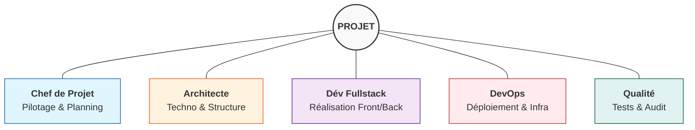
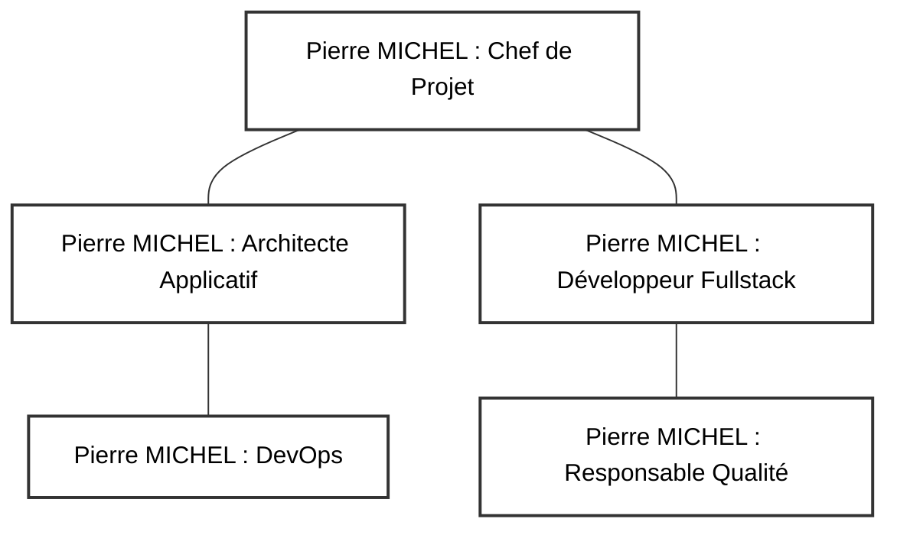

<!--
Logo établissement (placeholder)
Logo projet (placeholder)
-->

# Dossier Projet

**Version :** 1.2  
**Date :** 17/01/2026  
**Auteur(s) :** Pierre MICHEL

---

  

---

## Liens rapides

- [Dossier Projet](./Dossier_Projet.md)
- [CdCF – Cahier des Charges Fonctionnel](./02_CdCF.md)
- [CdCT – Cahier des Charges Technique](./03_CdCT.md)
- [Business & Analyse de marché](./04_Etude_Faisabilite.md)
- [Documentation GitHub](https://github.com/...) <!-- À compléter -->
- [Repository GitHub](https://github.com/...)

---

**Tags :** `#gestion-de-projet` `#documentation` `#webapp` `#architecture` `#erp` `#saas`

---

## 1. Contexte et vision du projet

Ce document présente une synthèse du contexte et de la vision du projet. Pour une description fonctionnelle détaillée, se référer au [CdCF - Cahier des Charges Fonctionnel](./02_CdCF.md).

### Contexte général

Le projet **Taskforce** vise la conception et le développement d'une plateforme de gestion de projet professionnelle, positionnée comme un ERP modulaire et extensible. Au cœur de cette plateforme se trouve un système de répartition dynamique et automatisée des tâches au sein d'équipes de travail. L'objectif principal est d'optimiser l'allocation des missions en prenant en compte les compétences, la charge de travail, les disponibilités, les priorités et d'autres critères, afin d'améliorer la performance collective et de réduire les situations de surcharge individuelle.

**Vision produit** : Une plateforme modulaire composée d'un **Core applicatif** (infrastructure technique : authentification, multi-tenant, sécurité) et d'un **module de gestion de projet** (fonctionnalités métier complètes : projets, tâches, compétences, assignation automatique, reporting). Cette architecture permet une extensibilité future vers des modules optionnels pour des usages réglementés (ex : LIMS, qualité), ou de pouvoir s'adapter aux besoins de structure plus importantes en développant de nouveaux modules. L'approche valide d'abord le socle technique (Core) et le module métier principal avant d'envisager l'ajout de modules spécialisés selon les besoins clients. Cela garantit une structure plus simple à développer et à maintenir, en isolant l'infrastructure des fonctionnalités métier.

### Problématique adressée

Dans un contexte professionnel moderne, les entreprises font face à une complexité croissante dans la gestion des ressources humaines et la coordination des équipes. La répartition manuelle des tâches devient très vite inefficace, source de déséquilibres de charge, de perte de productivité et de démotivation. Le projet répond à ce besoin en proposant un outil "intelligent" d’aide à la décision pour les managers, tout en offrant une visibilité partagée aux collaborateurs.

### Objectifs fonctionnels majeurs

L’application devra notamment permettre :

- L’assignation automatique des tâches en fonction des compétences, de la charge, des priorités et autre critères définis.
- Le suivi en temps réel de la charge de travail des collaborateurs.
- L’optimisation de l’utilisation des ressources humaines, en privilégiant les profils les plus adaptés tout en garantissant une répartition équitable.
- Une interface collaborative offrant une vue globale de l’état d’avancement des tâches.
- La détection et l’alerte en cas de surcharge, avec possibilité de réajustement.

### Démarche projet attendue

Le projet s’inscrit dans une approche structurée, comprenant :

- L’analyse des besoins et la définition des Users Stories, fil rouge du projet.
- La conception de l’architecture logicielle et du modèle de données.
- Une première itération sur le développement de la partie Core suivi des tests nécessaires, suivi d'une itération similaire pour le module métier principal (suivant un cycle agile dont on discutera plus dans les parties suivantes).
- Une phase de déploiement et d'ajustement.
- Une phase de tests auprès d’un groupe pilote.
- Ajustement de la plateforme et accompagnement des utilisateurs.

### Livrables et évaluation

Les livrables attendus incluent :

- Une documentation technique complète.
- Le code source de l’application.
- Un manuel utilisateur (collaborateurs et managers).
- Un support post-déploiement.

Le projet sera évalué sur sa capacité à automatiser et simplifier la gestion des tâches, prévenir les surcharges de travail et améliorer durablement la productivité des équipes, avec une logique d’amélioration continue basée sur les retours utilisateurs.

## 2. Présentation de l’équipe projet

### Composition et profil

Le projet est porté par un seul membre, assumant l’ensemble des fonctions stratégiques et opérationnelles :

- **Chef de projet** : pilotage global, gestion des plannings, arbitrage des priorités, suivi des livrables.
- **Architecte applicatif** : définition de l’architecture logicielle, choix des technologies, veille technique.
- **Développeur fullstack** : conception et réalisation des modules front-end et back-end, intégration continue.
- **DevOps** : gestion des environnements, automatisation des déploiements, supervision et observabilité.
- **Responsable qualité** : mise en place des tests, contrôle qualité, documentation.

### Compétences mobilisées

- Expertise en développement web (Java, Spring Boot avec Gradle DSL Kotlin, React, TypeScript, Next.js, Astro)
- Maîtrise des architectures modulaires et des pratiques DevOps
- Connaissance des normes réglementaires (RGPD, WCAG 2.1, RGAA, ISO 27001, OWASP Top 10, CNIL et autres)
- Gestion de projet agile et outils collaboratifs (GitHub, GitHub Projects, CI/CD)

### Organisation du travail

- Création du GitHub project pour la gestion des tâches, des issues et des jalons pré définis.
- Répartition du temps selon les phases projet.
- Adaptation continue des priorités selon les jalons, les risques et le niveau de progression.

### Visualisation des rôles

## 3. Organisation de l’équipe projet

### Structure organisationnelle

L’organisation repose sur la gestion multi-rôles du porteur de projet, avec une formalisation claire des responsabilités :

- **Responsabilités** : chaque rôle est défini avec ses missions principales (pilotage, conception, développement, qualité, déploiement).
- **Gestion des conflits de rôle** : priorisation des tâches selon l’urgence et l’importance, arbitrage par le porteur.
- **Suivi des responsabilités** : utilisation d’une matrice RACI pour clarifier les responsabilités et les livrables associés.

### Outils et méthodes

- Matrice RACI détaillée (voir [Matrice RACI](../05_Suivi_Agile_Roadmap.md))
- Tableaux de suivi des tâches et des jalons (utilisation de la matrice d'Eisenhower pour la priorisation)
- Documentation centralisée sur GitHub

## 4. Méthodologie de projet employée

### Approche méthodologique

Le projet s’appuie sur une méthodologie agile adaptée au contexte mono-acteur :

- **Cycle de vie projet** : initialisation, conception, développement, tests, déploiement, bilan.
- **Itérations courtes (sprints)** : chaque sprint vise un livrable fonctionnel ou technique, avec une durée adaptée à la charge.
- **Gestion des tâches** : utilisation de GitHub Projects pour le suivi des tâches, des jalons, des issues et des User Stories avec les Milestones.
- **Gestion documentaire** : documentation continue sur GitHub, versionnement des documents et du code.
- **Gestion des versions** : branches Git dédiées par fonctionnalité ou lot, intégration continue via GitHub Actions.
- **Gestion des priorités** : arbitrage hebdomadaire selon l’avancement, les risques et les retours éventuels.

### Outils utilisés

- GitHub Projects (Issues, Milestones)
- Outils de CI/CD (GitHub Actions)

Pour plus de détails, consulter la [documentation GitHub](https://github.com/...).

## 5. Veille technologique et moyens de veille

Synthèse :

- Veille active sur les technologies front-end (Next.js, Astro (React, TypeScript), Zustand, TanStack Query, Zod, ...) et back-end (Spring Boot, Gradle - Kotlin + dépendances, Java 25, PostgreSQL, Keycloak, Stripe API, Docker, ...)
- Suivi des évolutions réglementaires (RGPD, LIMS, SaaS)
- Utilisation de sources spécialisées, newsletters, et communautés open source

Pour la démarche complète, se référer au [CdCT](./03_CdCT.md) et à l’analyse de marché ([Business](./04_Etude_Faisabilite.md)).

## 6. Analyse fonctionnelle et objectifs (SMART)

Les objectifs du projet sont formalisés selon la méthode SMART (Spécifique, Mesurable, Atteignable, Réaliste, Temporellement défini) :

| Objectif                                        | Spécifique                                                                            | Mesurable                                                                                                                                                      | Atteignable                                                     | Réaliste                                                            | Temporel       |
| ----------------------------------------------- | ------------------------------------------------------------------------------------- | -------------------------------------------------------------------------------------------------------------------------------------------------------------- | --------------------------------------------------------------- | ------------------------------------------------------------------- | -------------- |
| **Développer le Core applicatif fonctionnel**   | Livrer un MVP avec gestion de projets, tâches, compétences et assignation automatique | - Authentification fonctionnelle (Keycloak) - CRUD projets/tâches - Algorithme d'assignation opérationnel - Tests unitaires > 70% couverture          | Porteur unique avec stack maîtrisée (Spring Boot, Next.js)      | Architecture modulaire limitant la complexité initiale              | **31/01/2026** |
| **Assurer la conformité réglementaire de base** | Mettre en place les mécanismes RGPD et accessibilité WCAG 2.1 niveau AA               | - Consentement cookies - Droit à l'oubli implémenté - Tests accessibilité automatisés (axe-core) - Score Lighthouse accessibility > 90                | Solutions éprouvées (design system accessible, librairies RGPD) | Obligation légale, frameworks supportant l'accessibilité            | **28/03/2026** |
| **Déployer l'application en production**        | Mettre en ligne l'application avec CI/CD et observabilité                             | - Pipeline GitHub Actions opérationnel - Environnements dev/prod séparés - Monitoring Grafana configuré - Déploiement automatisé via Docker           | Infrastructure Docker maîtrisée, hébergement simple             | Pas de contraintes haute disponibilité initiales                    | **26/04/2026** |
| **Implémenter le modèle SaaS multi-tenant**     | Proposer un plan gratuit et un plan payant avec limitation de fonctionnalités         | - Intégration Stripe fonctionnelle - 2 plans tarifaires actifs - Limitations par plan appliquées - Workflow de souscription testé                     | API Stripe bien documentée, nombreux exemples                   | Modèle économique SaaS standard                                     | **28/02/2026** |
| **Garantir la qualité et la maintenabilité**    | Obtenir une base de code propre, testée et documentée                                 | - Couverture tests > 70% - 0 vulnérabilité critique (scan sécurité) - Documentation API (OpenAPI/Swagger) - Dette technique < 5% (SonarQube)          | Pratiques DevOps intégrées dès le départ                        | Tests et documentation continus évitent l'accumulation de dette     | **20/06/2026** |
| **Préparer l'extensibilité modulaire**          | Architecturer le Core pour permettre l'ajout futur de modules optionnels              | - Séparation Core / Module métier claire - Interface d'extension définie - Documentation architecture modulaire - POC activation/désactivation module | Architecture modulaire planifiée dès la conception              | Anticipation uniquement, implémentation modules optionnels hors MVP | **28/03/2026** |

Pour l'analyse fonctionnelle détaillée (cas d'usage, exigences, règles métier), se référer au [CdCF](./02_CdCF.md).

## 7. Choix technologiques – vue d’ensemble

Le choix des technologies s'appuie sur des critères stratégiques :

- **Évolutivité** : Support de l'architecture modulaire et de la scalabilité horizontale
- **Modularité** : Faciliter l'ajout de modules optionnels sans refonte majeure
- **Conformité** : Technologies compatibles avec les exigences réglementaires (RGPD, accessibilité, anticipation 21 CFR Part 11)
- **Écosystème** : Solutions open source éprouvées, communauté active, documentation abondante
- **Maîtrise** : Stack compatible avec l'expertise du porteur de projet (Java, TypeScript)
- **Performance** : Capacité à gérer une charge croissante avec des temps de réponse optimaux

### Tableau comparatif des technologies

| Catégorie      | Technologie retenue     | Alternatives évaluées      | Justification du choix                                                                                 |
| -------------- | ----------------------- | -------------------------- | ------------------------------------------------------------------------------------------------------ |
| **Back-end**   | Spring Boot (Java 21)   | NestJS, Django, Laravel    | Écosystème mature, architecture modulaire native, support enterprise, sécurité éprouvée, maîtrise Java |
| **Build**      | Gradle (DSL Kotlin)     | Maven                      | Configuration plus concise, performance supérieure, flexibilité                                        |
| **Front-end**  | Next.js 15 (React)      | Vue.js/Nuxt, Angular       | Server Components, SSR/SSG hybride, performance optimale, écosystème React mature                      |
| **Landing**    | Astro                   | Next.js, Hugo              | Performance optimale (islands architecture), SEO natif, flexibilité composants (React/Vue)             |
| **BDD**        | PostgreSQL              | MySQL, MongoDB             | Robustesse, ACID, support JSON, extensibilité, conformité réglementaire                                |
| **Auth**       | Keycloak                | Auth0, Okta, Firebase Auth | Open source, SSO, RBAC avancé, conformité RGPD, maîtrise totale des données                            |
| **Paiement**   | Stripe                  | PayPal, Braintree          | API moderne, documentation excellente, support SaaS natif, webhooks fiables                            |
| **Container**  | Docker + Docker Compose | Podman, Kubernetes         | Standard industriel, simplicité pour mono-acteur, portabilité, écosystème mature                       |
| **CI/CD**      | GitHub Actions          | GitLab CI, Jenkins         | Intégration native GitHub, configuration simple, runners gratuits, marketplace d'actions               |
| **Monitoring** | Grafana + Prometheus    | Datadog, New Relic         | Open source, visualisation puissante, alerting configurable, coût maîtrisé                             |

**Stack retenue** : Spring Boot (Java 21) + Gradle + Next.js + PostgreSQL + Keycloak + Docker + GitHub Actions.

Pour la justification détaillée des choix techniques, l'architecture complète et les alternatives évaluées, consulter le [CdCT](./03_CdCT.md).

## 8. Modélisation du projet (PBS / WBS)

### Product Breakdown Structure (PBS)

Le PBS décompose le produit final en composants structurels :

- **Core Applicatif** : Socle technique réutilisable
  - Authentification et gestion des accès (Keycloak)
  - Gestion multi-tenant (isolation données)
  - Sécurité et autorisations (RBAC)
  - API REST générique (Spring Boot)
  - Interface utilisateur de base (Next.js)
  - Base de données (PostgreSQL)
  - Intégration Stripe (abonnements SaaS)
- **Module Gestion de Projet** : Module métier principal
  - Gestion de projets et tâches
  - Gestion des compétences et profils utilisateurs
  - Algorithme d'assignation automatique des tâches
  - Tableau de bord et reporting
  - Gestion de la charge de travail
  - Notifications et alertes
- **Modules Optionnels Futurs** (anticipation)
  - Module LIMS (gestion laboratoire)
  - Module Qualité (processus qualité)
  - Module Gestion documentaire
  - Autres modules métier sectoriels
- **Infrastructure & DevOps**
  - Conteneurisation (Docker)
  - CI/CD (GitHub Actions)
  - Monitoring et observabilité (Grafana)
  - Déploiement cloud

### Work Breakdown Structure (WBS)

Le WBS organise le travail en lots et tâches :

1. **Cadrage et initialisation**
   - Analyse des besoins
   - Définition du périmètre
   - Documentation projet (Dossier, CdCF, CdCT)
2. **Conception**
   - Architecture technique
   - Modélisation des données
   - Design UX/UI
3. **Développement**
   - Setup infrastructure
   - Développement Core
   - Développement modules métier
   - Intégration services tiers
4. **Tests et validation**
   - Tests unitaires et d'intégration
   - Tests accessibilité
   - Tests sécurité
5. **Déploiement**
   - Configuration environnements
   - Migration données
   - Mise en production
6. **Documentation et bilan**
   - Documentation technique
   - Manuel utilisateur
   - Bilan projet

Pour les diagrammes détaillés et la modélisation complète, se référer au [CdCF](./02_CdCF.md) et aux diagrammes dans [assets/diagrammes](./assets/diagrammes/).

## 9. Modélisation UML – vue synthétique

La modélisation UML structure l'analyse fonctionnelle et technique du projet :

### Diagrammes fonctionnels

**Diagramme de cas d'utilisation**

- **Acteurs** : Manager, Collaborateur, Administrateur, Système
- **Cas d'utilisation principaux** :
  - Gérer les projets (créer, modifier, archiver)
  - Gérer les tâches (créer, assigner, suivre)
  - Gérer les compétences (référentiel, niveaux)
  - Consulter la charge de travail
  - Déclencher l'assignation automatique
  - Gérer les abonnements et la facturation
  - Activer/désactiver des modules optionnels

**Diagramme d'activité**

- Processus d'assignation automatique des tâches
- Workflow de souscription à un plan
- Processus de création et validation de projet

### Diagrammes structurels

**Diagramme de classes**

- **Classes principales** : Organisation, Utilisateur, Projet, Tâche, Compétence, Équipe, Abonnement, Module
- **Relations** : Associations, compositions, héritages
- **Attributs et méthodes** : Propriétés métier, opérations CRUD, règles de gestion

**Diagramme de packages**

- Package Core (authentification, sécurité, multi-tenant)
- Package Métier (projets, tâches, compétences, assignation)
- Package Infrastructure (persistance, API, services)
- Package Modules (LIMS, Qualité, extensions)

### Diagrammes dynamiques

**Diagramme de séquence**

- Séquence d'authentification (Keycloak)
- Séquence de création de tâche et assignation automatique
- Séquence de paiement (Stripe webhook)
- Séquence d'activation de module optionnel

**Diagramme d'états-transitions**

- États d'une tâche : Brouillon → En attente → En cours → Terminée → Archivée
- États d'un projet : Planification → Actif → Suspendu → Clôturé
- États d'un abonnement : Essai → Actif → Suspendu → Résilié

Les diagrammes détaillés et leur implémentation sont disponibles dans le [CdCF - Section 7](./02_CdCF.md) pour l'analyse fonctionnelle et le [CdCT - Section 4](./03_CdCT.md) pour la conception technique.

## 10. Modélisation des données

**Entités principales du modèle de données** :

- **Organisation** : structure multi-tenant, contient équipes et utilisateurs
- **Utilisateur** : collaborateurs, managers, administrateurs avec rôles et permissions
- **Projet** : entité centrale de gestion, contient tâches et jalons
- **Tâche** : unité de travail, assignée à un utilisateur, liée à des compétences requises
- **Compétence** : référentiel de compétences avec niveaux de maîtrise
- **Équipe** : regroupement d'utilisateurs, rattachée à une organisation
- **Abonnement** : gestion des plans tarifaires (gratuit/payant) via Stripe
- **Module** : modules optionnels activables par organisation

**Relations principales** : Organisation 1-N Équipes 1-N Utilisateurs 1-N Tâches, Tâches N-N Compétences.

Pour la modélisation complète (MCD, MLD, MPD, diagrammes de classes), consulter le [CdCT](./03_CdCT.md).

## 11. Identification des parties prenantes

### Maîtrise d'Ouvrage (MOA)

**Porteur de projet** : Pierre MICHEL

- **Rôle** : Définition des besoins, validation des livrables, décisions stratégiques
- **Responsabilités** :
  - Expression des besoins fonctionnels
  - Validation de la conformité du produit
  - Priorisation des fonctionnalités
  - Arbitrage des choix fonctionnels
- **Engagement** : Disponibilité continue, validation des jalons, suivi qualité

### Maîtrise d'Œuvre (MOE)

**Chef de projet / Architecte / Développeur** : Pierre MICHEL

- **Rôle** : Conception, réalisation, déploiement de la solution
- **Responsabilités** :
  - Analyse technique et conception
  - Développement et intégration
  - Tests et validation technique
  - Documentation technique
  - Déploiement et mise en production
- **Engagement** : Respect des délais, qualité du code, conformité aux normes

### Parties prenantes académiques

**Jury d'évaluation**

- **Rôle** : Évaluation du projet, validation des compétences
- **Attentes** :
  - Documentation complète et structurée
  - Démonstration fonctionnelle
  - Respect des exigences académiques
  - Qualité technique et méthodologique

**Tuteur académique** (si applicable)

- **Rôle** : Accompagnement méthodologique, conseil
- **Responsabilités** : Suivi de l'avancement, validation des choix pédagogiques

### Utilisateurs finaux (cibles)

**Managers / Chefs de projet**

- **Profil** : Responsables d'équipes, gestionnaires de projets
- **Besoins** :
  - Visibilité sur la charge de travail des équipes
  - Outils d'aide à la décision pour l'assignation
  - Tableaux de bord et reporting
- **Attentes** : Interface intuitive, gain de temps, fiabilité

**Collaborateurs**

- **Profil** : Membres d'équipes projet, contributeurs
- **Besoins** :
  - Visibilité sur leurs tâches assignées
  - Suivi de leur charge de travail
  - Transparence sur l'assignation
- **Attentes** : Répartition équitable, clarté des priorités

**Administrateurs système**

- **Profil** : Responsables infrastructure, DevOps
- **Besoins** :
  - Gestion des organisations et utilisateurs
  - Configuration des modules
  - Monitoring et supervision
- **Attentes** : Outils d'administration efficaces, observabilité

### Partenaires techniques

**Fournisseurs de services tiers**

- **Keycloak** : Authentification et gestion des identités
- **Stripe** : Gestion des paiements et abonnements
- **Hébergeur cloud** : Infrastructure de production
- **GitHub** : Hébergement code, CI/CD, gestion projet

### Matrice de communication

| Partie prenante       | Fréquence    | Canal                  | Type d'information                      |
| --------------------- | ------------ | ---------------------- | --------------------------------------- |
| Jury académique       | Jalons clés  | Présentation + docs    | Avancement, livrables, démonstrations   |
| Tuteur académique     | Hebdomadaire | Email, réunion         | Difficultés, choix, validation          |
| Utilisateurs pilotes  | Bi-mensuel   | Feedback, tests        | Retours fonctionnels, bugs, suggestions |
| Fournisseurs services | Au besoin    | Documentation, support | Incidents, questions techniques         |

La matrice RACI détaillée par user story et livrable est disponible dans [Matrice RACI](./assets/diagrammes/IC-ITIL-RACI-Template-with-Gantt-Chart-17734_FR.xlsx).

## 12. Planification du projet

### Roadmap et calendrier prévisionnel

La planification du projet s’articule autour de jalons majeurs, chacun associé à des livrables et des critères de réussite :

| Phase                                 | Objectifs principaux                             | Livrables clés                       | Début    | Fin      |
| ------------------------------------- | ------------------------------------------------ | ------------------------------------ | -------- | -------- |
| Initialisation & cadrage              | Définir le périmètre, les besoins, les risques   | Dossier projet, CdCF, CdCT           | 04/11/25 | 15/11/25 |
| Conception fonctionnelle              | Formaliser les fonctionnalités, les modules      | CdCF, wireframes, PBS/WBS            | 18/11/25 | 29/11/25 |
| Conception technique                  | Définir l’architecture, les choix technologiques | CdCT, diagrammes UML, modèles        | 02/12/25 | 20/12/25 |
| Développement incrémental – Module 1  | Réaliser les modules, intégrer les services      | Code source, tests, documentation    | 02/01/26 | 31/01/26 |
| Développement incrémental – Module 2  | Réaliser les modules, intégrer les services      | Code source, tests, documentation    | 03/02/26 | 28/02/26 |
| Développement incrémental – Module 3  | Réaliser les modules, intégrer les services      | Code source, tests, documentation    | 03/03/26 | 28/03/26 |
| Tests et validation                   | Vérifier la conformité, la qualité               | Rapports de tests, documentation     | 31/03/26 | 26/04/26 |
| Déploiement & bilan                   | Mise en production, retour d’expérience          | Images Docker, bilan projet          | 28/04/26 | 23/05/26 |
| Itérations / Améliorations            | Optimisation, retours utilisateurs, UX           | Code amélioré, tests supplémentaires | 26/05/26 | 20/06/26 |
| Clôture projet / Documentation finale | Bilan complet, livrables consolidés              | Dossier final, CdCF/CdCT mis à jour  | 23/06/26 | 28/06/26 |

Module 1 : Partie Core de l'application
Module 2 : Outil de gestion de projet
Module 3 : Amélioration générale

- **Outils de suivi** : GitHub Projects pour la gestion des tâches, des jalons et du reporting.
- **Gestion des retards** : réévaluation des priorités et adaptation du calendrier en cas d’aléas.
- **Livrables intermédiaires** : validation à chaque étape avant passage au jalon suivant.

_Image ici (diagramme de Gantt ou roadmap)_

## 13. Analyse des risques

### Identification et gestion des risques

| Risque principal                                                             | Probabilité | Impact | Plan d’atténuation                                |
| ---------------------------------------------------------------------------- | ----------- | ------ | ------------------------------------------------- |
| Surcharge liée à la gestion multi-rôles                                      | Élevée      | Fort   | Planification rigoureuse, priorisation stricte    |
| Complexité technique (architecture modulaire, intégration de services tiers) | Moyenne     | Fort   | Prototypage, documentation, recours à la veille   |
| Contraintes réglementaires (RGPD et autre)                                   | Moyenne     | Fort   | Veille réglementaire, documentation, tests dédiés |
| Dépendance à des technologies open source                                    | Faible      | Moyen  | Sélection de solutions éprouvées, veille continue |
| Risques liés à la sécurité et à la conformité                                | Moyenne     | Fort   | Mise en place de tests, audits, documentation     |
| Retard sur les livrables                                                     | Moyenne     | Moyen  | Suivi hebdomadaire, adaptation du planning        |
| Perte de motivation / isolement                                              | Faible      | Moyen  | Suivi personnel, valorisation des jalons atteints |

- **Suivi des risques** : revue régulière à chaque étape du projet, adaptation des plans d’atténuation.
- **Documentation** : traçabilité des risques et des actions dans la documentation projet.

_Image ici (matrice des risques)_

## 14. Architecture logicielle – vue conceptuelle

### Approche architecturale

**Monolithe modulaire pour le Core + Architecture modulaire pour les extensions**

L'architecture adopte une approche hybride optimisant la simplicité de développement et la scalabilité future :

**Core applicatif (Infrastructure technique)**

- Socle technique réutilisable fournissant les services de base
- **Composants** :
  - Authentification & Sécurité (Keycloak, Spring Security)
  - Multi-tenant (isolation données par organisation)
  - API REST générique
  - Gestion des utilisateurs et permissions (RBAC)
  - Intégration paiements (Stripe)
- **Avantages** :
  - Base technique solide et validée
  - Réutilisable pour tous les modules métier
  - Conformité réglementaire centralisée (RGPD, sécurité)

**Module Gestion de Projet (Monolithe applicatif)**

- Module métier principal contenant toutes les fonctionnalités de gestion de projet
- **Composants fonctionnels** :
  - Gestion de projets et tâches
  - Gestion des compétences et profils
  - Algorithme d'assignation automatique
  - Reporting et tableaux de bord
  - Gestion de la charge de travail
- **Architecture** :
  - Monolithe modulaire pour simplicité et performance
  - Structuré en couches (Présentation, Métier, Persistance)
  - Transactions ACID natives
  - Debugging et observabilité simplifiés

**Modules optionnels futurs (Anticipation)**

- Extensions métier activables dynamiquement par organisation
- **Caractéristiques** :
  - Interface de module standardisée
  - Isolation des fonctionnalités métier
  - Gestion des versions indépendante
- **Exemples** :
  - Module LIMS (gestion laboratoire réglementé)
  - Module Qualité (ISO, processus qualité)
  - Module Gestion documentaire
  - Modules métier sectoriels spécifiques

### Patterns architecturaux

- **Layered Architecture** : Présentation → Métier → Persistance
- **Repository Pattern** : Abstraction de l'accès aux données
- **Service Layer** : Logique métier encapsulée
- **API First** : Conception orientée API REST
- **Domain-Driven Design** : Modélisation orientée domaine métier

### Communication et intégration

- **API REST** : Communication synchrone (JSON)
- **Events** : Communication asynchrone pour modules optionnels (Spring Events)
- **Webhooks** : Intégration services tiers (Stripe)

Pour la description détaillée de l'architecture, les diagrammes de composants et la stratégie de migration vers microservices (si nécessaire à terme), se référer au [CdCT - Section 5](./03_CdCT.md).

## 15. Infrastructure logicielle

Vue d’ensemble de l’infrastructure (Docker, CI/CD, environnements dev/prod, observabilité). Les détails sont disponibles dans le [CdCT](./03_CdCT.md).

## 16. Budgétisation du projet (vue synthétique)

### Modèle économique SaaS

**Plans tarifaires proposés** :

| Plan           | Prix          | Utilisateurs | Projets          | Modules                     | Support           | Cible                                     |
| -------------- | ------------- | ------------ | ---------------- | --------------------------- | ----------------- | ----------------------------------------- |
| **Gratuit**    | 0€/mois       | Jusqu'à 5    | 3 projets actifs | Core uniquement             | Community (email) | TPE, essai produit                        |
| **Pro**        | 29€/mois/user | Illimité     | Illimité         | Core + 2 modules optionnels | Email + chat      | PME, équipes projet                       |
| **Enterprise** | Sur devis     | Illimité     | Illimité         | Tous modules + custom       | Dédié + SLA       | Grandes entreprises, secteurs réglementés |

**Coûts d'infrastructure estimés (production)** :

- Hébergement : ~100-200€/mois (cloud, évolutif selon charge)
- Services tiers (Stripe, monitoring) : ~50€/mois
- Nom de domaine / SSL : ~50€/an
- **Total mensuel estimé** : ~150-250€

Pour la budgétisation détaillée (coûts de développement, ROI prévisionnel, analyse de rentabilité), consulter l'analyse [Business](./04_Etude_Faisabilite.md).

## 17. Wireframes, maquettage et accessibilité

**Approche de conception UX/UI** :

- **Wireframes basse fidélité** : Définition des parcours utilisateurs et arborescence de navigation
- **Design system** : Utilisation de shadcn-ui + Tailwind CSS pour cohérence visuelle
- **Accessibilité** : Conformité WCAG 2.1 niveau AA, tests automatisés et manuels
- **Responsive design** : Support mobile, tablette, desktop

**Parcours utilisateurs clés** :

1. Inscription et souscription à un plan
2. Création de projet et ajout de tâches
3. Consultation de la charge de travail
4. Activation de modules optionnels

Pour les wireframes détaillés et les maquettes fonctionnelles, consulter le [CdCF - Section 11](./02_CdCF.md#11-parcours-utilisateurs-et-maquettes-fonctionnelles).

Pour l'implémentation technique du design system, l'optimisation des performances front-end et les tests d'accessibilité, consulter le [CdCT](./03_CdCT.md).

## 18. Normes et conformité

**Normes et référentiels applicables au MVP** :

- **RGPD** (protection des données personnelles) : consentement, droit à l'oubli, portabilité, privacy by design
- **WCAG 2.1 niveau AA** (accessibilité web) : interfaces accessibles, navigation clavier, lecteurs d'écran
- **RGAA** (référentiel français d'accessibilité) : conformité avec les obligations légales françaises
- **CNIL** : conformité avec les recommandations de la Commission Nationale Informatique et Libertés
- **OWASP Top 10** : protection contre les vulnérabilités web critiques
- **ISO 27001** (sécurité de l'information) : bonnes pratiques de sécurité applicative

**Anticipation réglementaire (environnements réglementés)** :

- **21 CFR Part 11** (FDA - Electronic Records) : réglementation pour signatures électroniques et intégrité des données
- **GAMP 5** (Good Automated Manufacturing Practice) : validation des systèmes informatisés en pharma

**Approche** : L'architecture modulaire de type ERP permet d'**anticiper** ces contraintes réglementaires sans les implémenter au MVP. La séparation Core / Modules optionnels facilite l'ajout futur de modules conformes (ex : LIMS) avec traçabilité renforcée, audit trails et validation selon ces référentiels. Cette approche garantit une **scalabilité maximale** vers des secteurs réglementés.

Pour la conformité technique détaillée, l'implémentation des mécanismes de sécurité et la stratégie d'anticipation réglementaire complète, se référer au [CdCT - Section 12 et 13](./03_CdCT.md).

## 19. Bilan et perspectives du projet

Le projet pose les bases d’une plateforme ERP modulaire, adaptée à des contextes professionnels exigeants. Les perspectives incluent l’extension fonctionnelle, l’ouverture à de nouveaux marchés et l’intégration de modules réglementés.

---

_Fin du Dossier Projet – Phase de documentation_
