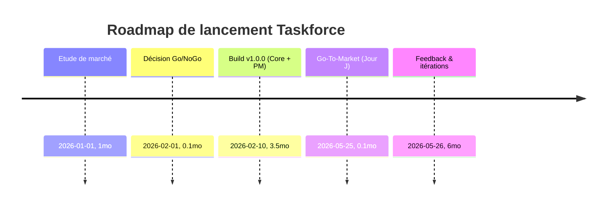

<!--
Logo établissement (placeholder)
Logo projet (placeholder)
-->

# Cahier d'Étude Business

**Version :** 1.3  
**Date :** 17/01/2026  
**Auteur(s) :** Pierre MICHEL

---

# **Étude de Marché & Modèle Economique — Taskforce**

---

## 1. **Analyse de Marché : Contexte et Opportunités**

### 1.1. **Marché des logiciels de gestion de projet & allocation intelligente**

- Le marché mondial des logiciels de gestion de projet est estimé à **9,85 milliards USD en 2023**, avec une croissance annuelle prévue (CAGR) de **10,67 %** pour atteindre **17,69 milliards USD en 2028**. [MarketsandMarkets (2023)](https://www.marketsandmarkets.com/Market-Reports/project-management-software-market-225285515.html), [Statista](https://www.statista.com/outlook/tmo/enterprise-software/collaboration-management/project-collaboration-software/worldwide)
- Les solutions SaaS dominent désormais le secteur : selon [Gartner](https://www.gartner.com/en/newsroom/press-releases/2022-11-08-gartner-forecasts-worldwide-public-cloud-end-user-spending-to-reach-nearly-600-billion-in-2023), plus de **70 %** des nouveaux outils PM sont “cloud native”.
- **Attentes clés** du marché en 2024 :
  - Automatisation des process de gestion (éliminer les tâches manuelles - McKinsey, 2023)
  - Prise en compte de la surcharge et du bien-être collaborateurs ([Gallup 2023: State of the Global Workplace](https://www.gallup.com/workplace/349484/state-of-the-global-workplace.aspx))
  - Besoin de personnalisation, d’outils API-first et d’intégrations nombreuses ([Forrester SaaS Trends 2024](https://www.forrester.com/report/the-top-10-emerging-technologies-in-2024/RES183311))

---

### 1.2. **Segmentation : Types d’utilisateurs et besoins**

- **PME (50-500 employés)** : automatiser l’attribution des tâches, maîtriser la charge et la rentabilité par client/projet.
- **Grandes organisations** : architecture multi-tenant, sécurité, modules spécialisés (industrie, labo, qualité, SI, etc.)
- **Agences, ESN/SSII, cabinets conseils** : mode projet, capacité à staffer rapidement, reporting RH précis par mission.

---

### 1.3. **Analyse concurrentielle approfondie**

#### **Tableau comparatif des leaders et de leurs fonctionnalités clés (2024)**

| Solution      | Prix (€)¹                         | Auto-Assignation Avancée              | Gestion charge/capacités | Compétences/Skill Matrice | Extensibilité / API | Multi-tenant  | Ciblage secteur | Principaux plus                                    |
| ------------- | --------------------------------- | ------------------------------------- | ------------------------ | ------------------------- | ------------------- | ------------- | --------------- | -------------------------------------------------- |
| Monday.com    | Basic: 9 Pro: 19               | Non (règles simples)                  | Oui                      | Limité                    | Oui                 | Oui           | Polyvalent      | UI, intégrations, automatisations                  |
| Jira          | Std: 8 Premium: 15             | Oui (règles complexes, scripting)     | Oui                      | Oui (basique)             | Fort                | Oui           | IT/dév          | Personnalisable, puissant Workflows                |
| ClickUp       | Free Unlimited: 7              | Non (auto minor)                      | Oui                      | Non                       | Oui                 | Non           | Universel       | UX, adoption rapide                                |
| Asana         | Premium: 10.99 Business: 24.99 | Limité (automatisations, pas d'AI)    | Oui                      | Limité                    | Oui                 | Oui           | Polyvalent      | Facile, kanban, reporting                          |
| Notion        | Plus: 8 Business: 15           | Non (souple mais sans logique assign) | Non                      | Non                       | Oui                 | Oui           | Documentation   | Polyvalent, notes/process                          |
| **Taskforce** | Freemium, Pro: 13²                | **Oui (IA vraie)**                    | **Oui live/prévision**   | **Oui — skill fine**      | **Très fort**       | **Oui natif** | ERP/process     | Répartition intelligente, extensibilité, surcharge |

¹ Prix/utilisateur/mois, hors promos déc. 2025, voir liens :

- [Monday](https://monday.com/pricing/)
- [Jira](https://www.atlassian.com/software/jira/pricing)
- [ClickUp](https://clickup.com/pricing)
- [Asana](https://asana.com/fr/pricing)
- [Notion](https://www.notion.so/pricing)
  ² Estimation indicative, voir infra.

---

#### **Outils plus spécialisés**

- [Parabol](https://www.parabol.co/) : rituels agiles, non axé charge/ressources
- [Resource Guru](https://resourceguruapp.com/) : planification sans IA pousser
- [Gtmhub](https://gtmhub.com/) : OKR/objectif, pas axé staffing
- **CRM/ERP** (Odoo, Dynamics, SAP ByDesign) : puissants mais complexes/coûteux, logique équipe intégrée parfois faible

---

#### **Pain points marché**

- Quasi **aucune solution** n’offre **auto-assignation intelligente** multi-critères (skills + charge + surcharge + priorités)
- Forte orientation IT, faible adéquation mode agence/labo/indus
- **Extensibilité limitée** : modules sectoriels rarement natifs
- **Multi-tenant et privacy RGPD** non centraux dans la conception

---

## 2. **Synthèse des Opportunités Business pour Taskforce**

**Différenciation** :

- **Assignation automatique avancée** (compétences, charge, surcharge, IA explicable)
- **Extensible & multi-tenant natif** : PME → grand compte
- **Verticalisation métier rapide** : core + modules “plug & play” (LIMS, qualité…)
- **Freemium ultra-ciblé IA** : test direct “cerveau” plateforme

---

## 3. **Déroulé Stratégique et Roadmap**

### **Timeline Décisionnelle**

---

## 4. **Modèle Économique Taskforce**

### **Positionnement des offres & pricing**

- **Freemium** :
  - Jusqu’à 5 utilisateurs
  - Fonctions de base + **Assignation automatique IA**
  - Objectif : démonstration “valeur ajoutée” immédiate

- **Pro** :
  - 13€/utilisateur/mois (cible)
  - Freemium + gestion fine compétences, export/partage avancé, intégrations, API illimité, SSO, alertes surcharge, reporting avancé

- **Entreprise** :
  - Sur devis (50+ utilisateurs)
  - Pro + modules sectoriels (LIMS, Qualité…), hébergement dédié/EU, SSO company, support VIP

- **Modules sectoriels :** 3 à 9€/utilisateur/mois/module (industrie, labo…)

---

## 5. **Business Model & Chiffres Prévisionnels**

> **Nota : Chiffres cohérent pour solo**

#### **Court Terme (Années 1–2) : Build + premiers clients**

| Poste                          | Année 1     | Année 2     | Justification                                   |
| ------------------------------ | ----------- | ----------- | ----------------------------------------------- |
| 🔴 Infra cloud (SaaS)          | 2 500€      | 7 000€      | Hébergement, domaines, backups, monitoring      |
| 🔴 Marketing (pub + SEO)       | 2 000€      | 4 000€      | Lancement, réseaux, contenu                     |
| 🔴 Support/Legal/RGPD          | 1 500€      | 2 000€      | Mentions légales, conseils, privacy, assistance |
| 🔴 Autres outils/SaaS          | 750€        | 1 000€      | Mail, analytics, devtools                       |
| **Total Dépenses**             | **6 750€**  | **14 000€** | -                                               |
| 🟢 CA - abonnements (objectif) | 3 500€      | 21 000€     | Hyp. 60 users fin Y1, 135 users fin Y2          |
| 🟢 CA - modules optionnels     | 0€          | 2 000€      | Upsell sur Y2 modules                           |
| **Total "Gains" (CA)**         | **3 500€**  | **23 000€** | -                                               |
|✅ **Résult. brut**             | **-3 250€** | **+9 000€** | Pas de salaire fondateur                        |

---

#### **Long Terme (3–5 ans) : Croissance vs Sole Founder ("Lean scaling")**

| Poste                       | Année 3      | Année 5       | Justification                         |
| --------------------------- | ------------ | ------------- | ------------------------------------- |
| 🔴 Infra/support/Upgrade    | 14 000€      | 28 000€       | Scaling infra, premium providers      |
| 🔴 Marketing/Acqu.          | 7 000€       | 16 000€       | Acquisition plus forte                |
| 🔴 Legal/Sec/Support        | 3 000€       | 5 000€        | Conformité, privacy, hotline external |
| **Total Dépenses**          | **24 000€**  | **49 000€**   |                                       |
| 🟢 CA récurrent abonnements | 60 000€      | 160 000€      | Hyp. 460 users Y3, 1 200 users Y5     |
| 🟢 CA modules/options       | 7 000€       | 22 000€       | Modules secteurs/entreprise           |
| **Total CA**                | **67 000€**  | **182 000€**  |                                       |
|✅ **Résult. brut**          | **+43 000€** | **+133 000€** | SANS salaire fondateur (ajuster si >) |

---

### **ZONES COULEURS — Légende**

- 🔴 **Dépenses / Investissements**
- 🟢 **Recettes / Gains**

---

### **Exploitation : rentabilité & cashflow**

- **Break-even** : ~90–100 users Pro pour couvrir dépenses fixes (~110 €/mois / user)
- **Point mort atteint Y2** (ambition solo founder)
- **ROI SaaS** : marges >70 % dès scaling, ultra-lean avant embauche

---

## 6. **Résumé différenciation marché**

| Critère             | Monday | Jira    | ClickUp | Asana  | Taskforce (nous)               |
| ------------------- | ------ | ------- | ------- | ------ | ------------------------------ |
| Prix (de base)      | 9-19€  | 8-15€   | 0-7€    | 10-25€ | **Freemium/13€/Ent sur devis** |
| Assign Intelligente | Non    | Limité  | Non     | Limité | **Oui IA avancée**             |
| Charge/surcharge    | Limité | Oui     | Non     | Limité | **Live, Surcharge prédite**    |
| Compétences         | Limité | Oui     | Non     | Limité | **Matrice complète**           |
| Modules sectoriels  | Non    | Plugins | Non     | Non    | **Option plug’n’play**         |
| Multi-tenant natif  | Oui    | Oui     | Non     | Oui    | **Oui dès le Core**            |
| RGPD/Sécu EU        | Oui    | Oui     | Non     | Oui    | **Oui**                        |

---

### **Sources et liens complémentaires**

- [MarketsandMarkets 2024](https://www.marketsandmarkets.com/Market-Reports/project-management-software-market-225285515.html)
- [Statista Project Software](https://www.statista.com/outlook/tmo/enterprise-software/collaboration-management/project-collaboration-software/worldwide)
- [Monday](https://monday.com/pricing/)
- [Jira](https://www.atlassian.com/software/jira/pricing)
- [ClickUp](https://clickup.com/pricing)
- [Asana](https://asana.com/fr/pricing)
- [Notion](https://www.notion.so/pricing)
- [Forrester SaaS 2024](https://www.forrester.com/report/the-top-10-emerging-technologies-in-2024/RES183311)
- [Gallup Global Workplace](https://www.gallup.com/workplace/349484/state-of-the-global-workplace.aspx)

---

## **Conclusion**

Taskforce cible un marché en explosion, tire parti du “no-people-cost” fondateur, avec différenciation IA et ultra extensible.  
**Stratégie gagnante : freemium à impact, core solide, scaling lean.**
