# 🔗 Diagramme de PERT — tâches critiques & dépendances

> Représentation des dépendances entre tâches majeures et identification du chemin critique.
> Complément du [[Gantt_Planning]] (vue temporelle) et du [[Plan_Projet]] (vue phases).

---

## Diagramme PERT

```mermaid
flowchart LR
    A([🟢 Démarrage<br/>04/11/2025])

    subgraph C0["Phase 0 — Cadrage"]
        B(Dossier projet<br/>CdCF v1 · CdCT v1)
        C(Conception fonctionnelle<br/>Wireframes · WBS)
        D(Conception technique<br/>MCD/MLD · UML · Archi)
    end

    subgraph DEV["Développement"]
        E(M1 — Core<br/>Auth · Multi-tenant · Stripe)
        F(M2 — Métier<br/>Projets · Issues · Smart-assign)
        G(M3 — Enrichissement<br/>Chat · Brain OS · RGPD · Intégrations)
    end

    subgraph TQ["Tests & Qualité"]
        H(Tests unitaires + intégration<br/>JaCoCo · Vitest)
        I(Tests E2E + Sécurité<br/>Playwright · ZAP · Semgrep)
        J(Correctifs QF · Optimisations)
    end

    subgraph FIN["Finalisation"]
        K(Déploiement<br/>Docker prod · VM école)
        L(Documentation finale<br/>~97 docs · Bundle PDF)
    end

    Z([🏁 Soutenance<br/>Juil. 2026])

    A --> B --> C --> D
    D --> E
    E --> F
    F --> G
    G --> H
    H --> I
    I --> J
    J --> K
    J --> L
    K --> Z
    L --> Z

    style A fill:#4ade80,stroke:#16a34a
    style Z fill:#f87171,stroke:#dc2626
    style E fill:#fbbf24,stroke:#d97706
    style F fill:#fbbf24,stroke:#d97706
```

> **Chemin critique** : Démarrage → Cadrage → Conception → M1 → M2 → M3 → Tests → Docs → Soutenance
>
> Toute tâche sur ce chemin en retard = retard de la soutenance (0 marge).

---

## Dépendances critiques identifiées

| Tâche | Prédécesseurs obligatoires | Raison |
|---|---|---|
| **Dev M1 (Core)** | Conception technique (D) | Stack + archi définis avant tout dev |
| **Smart-assign (M2)** | Migrations V33, V44, V47 (member_skill_profiles + worklogs) | Données réelles nécessaires au scoring |
| **Brain OS (M3)** | pgvector activé (V51) + M1 workspace | Embeddings requièrent extension PG + workspace |
| **Tests intégration** | Schéma DB stable (V56) | Testcontainers tourne sur schéma complet |
| **Documentation** | Feature freeze + tests OK | Docs décrivent l'état final, pas un intermédiaire |
| **Déploiement** | Docker images stables + VM école disponibles | Infrastructure externe |

---

## Marge des tâches non critiques

| Tâche | Marge | Commentaire |
|---|---|---|
| Veille technologique | Flottante | Parallèle à tout moment |
| Intégrations GitHub/Slack | ~2 semaines | Fonctionnalité M3, non bloquante pour les tests |
| Correctifs UX frontend | ~1 semaine | Après tests E2E, avant docs |
| Alertes Prometheus | ~1 semaine | Observabilité, non bloquant pour soutenance |

> 🔗 Voir aussi : [[Gantt_Planning]] · [[Plan_Projet]] · [[Budget_Previsionnel]].
