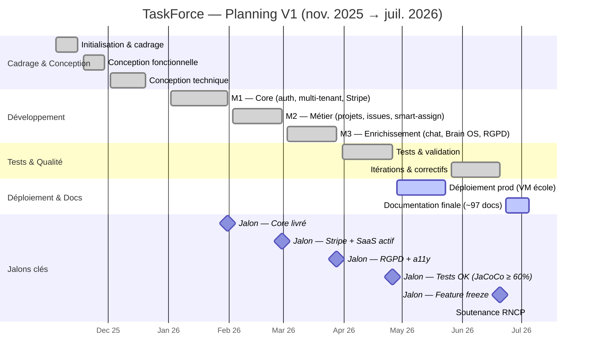

# 📊 Planning prévisionnel — Gantt & jalons

> Représentation temporelle du projet (format Gantt Mermaid + tableau jalons).
> Source : [[Plan_Projet]] + dates réelles observées.
> Pour les dépendances entre tâches → [[Diagramme_PERT]].

---

## Diagramme de Gantt

---

## Jalons clés

| Jalon | Date | Critère de réussite | Statut |
|---|---|---|---|
| **J1 — Core livré** | 31/01/2026 | Auth Keycloak + multi-tenant + CRUD projets/issues | ✅ |
| **J2 — SaaS actif** | 28/02/2026 | Stripe FREE/PRO opérationnel + webhooks | ✅ |
| **J3 — RGPD + a11y** | 28/03/2026 | Export portabilité + axe-core < 10 violations | ✅ |
| **J4 — Tests OK** | 26/04/2026 | JaCoCo ≥ 60 %, Vitest ≥ 70 %, ZAP 0 HIGH | ✅ |
| **J5 — Feature freeze** | 20/06/2026 | Plus de nouvelles features — doc uniquement | ✅ |
| **J6 — Soutenance RNCP** | Juillet 2026 | Bundle PDF + démo + mémoire complet | 🔄 |

---

## Durées et charge estimée

| Phase | Durée calendaire | Charge estimée |
|---|---|---|
| Cadrage & Conception | 7 semaines | 3–4 h/jour |
| Développement (M1–M3) | 12 semaines | 5–7 h/jour |
| Tests & Validation | 4 semaines | 4–5 h/jour |
| Déploiement | 4 semaines | 2–3 h/jour |
| Documentation finale | 2 semaines | 6–8 h/jour |

> **Total estimé** : ~9 mois (nov. 2025 – juil. 2026) · ~1 600 h équivalent temps plein
> (projet en parallèle de la formation).

> 🔗 Voir aussi : [[Plan_Projet]] · [[Diagramme_PERT]] · [[Budget_Previsionnel]] ·
> [[Note_Methode_Agile]].
