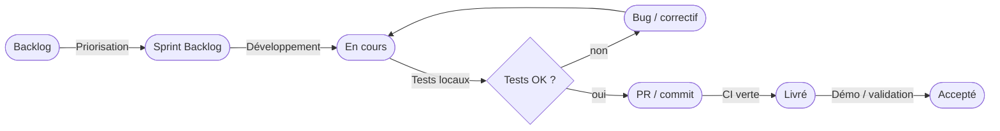

# 🔄 Note de méthode agile — organisation & pratiques

> Description de la méthode de gestion de projet adoptée pour TaskForce.
> Approche agile **adaptée au contexte mono-acteur** (pas d'équipe, cérémonies simplifiées).

---

## 1. Méthodologie retenue

**Scrum allégé + Kanban** — hybride adapté au projet solo :

| Pratique Scrum standard | Adaptation projet solo |
|---|---|
| Sprint 2 semaines | Cycles 2–4 semaines selon la phase |
| Daily standup (équipe) | Auto-revue quotidienne (carnet de bord) |
| Sprint planning | Priorisation hebdomadaire (matrice Eisenhower) |
| Sprint review | Validation de jalon (demo locale) |
| Rétrospective | Bilan en fin de phase (lessons learned) |
| Product Owner | Pierre MICHEL (même personne) |
| Scrum Master | Pierre MICHEL (même personne) |

---

## 2. Outillage

| Outil | Usage |
|---|---|
| **GitHub Projects** | Kanban board, Issues, Milestones, labels |
| **GitHub Issues** | User Stories, bugs, tâches techniques |
| **GitHub Milestones** | Jalons de phase (J1–J6) |
| **Branches Git** | Une branche par feature/fix (`feature/`, `fix/`) |
| **GitHub Actions** | CI automatique (tests, build) sur chaque push |
| **TaskForce lui-même** | Dogfooding : suivi des issues du projet dans l'outil |

---

## 3. Cycle de vie d'une user story

---

## 4. Définition of Done (DoD)

Une tâche est **terminée** quand :
- [ ] Code implémenté et compilant
- [ ] Tests unitaires/intégration écrits et passants (JUnit ou Vitest)
- [ ] CI GitHub Actions verte
- [ ] Aucune régression sur les tests existants
- [ ] Code mergé sur `main`
- [ ] Doc Brain OS mise à jour si impact sur l'architecture

---

## 5. Gestion des priorités (matrice Eisenhower)

| | Urgent | Non urgent |
|---|---|---|
| **Important** | ⚡ Faire immédiatement (bugs critiques, jalons) | 📅 Planifier (nouvelles features, tests) |
| **Non important** | 🤝 Déléguer / automatiser (CI, scripts) | 🗑️ Éliminer (nice-to-have hors V1) |

---

## 6. Feature freeze & priorisation finale

**Décision** : feature freeze acté le **20/06/2026** pour basculer sur la phase documentation.
Critère : tous les items « Must Have » et « Should Have » du MoSCoW (cf. [[Plan_Projet]] §3)
livrés et testés.

> 🔗 Voir aussi : [[Plan_Projet]] · [[Gantt_Planning]] · [[Registre_Risques]].
