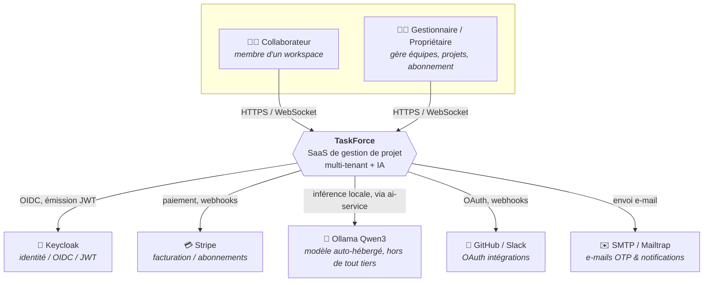
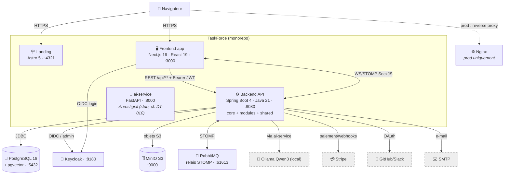
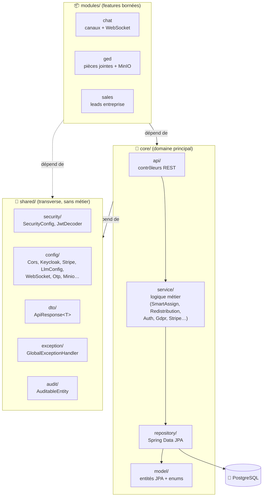

# 🏛️ Architecture logicielle — modèle C4

> **But** : formaliser l'architecture de TaskForce selon le **modèle C4** (Simon Brown) — trois niveaux
> de zoom : **Contexte** → **Conteneurs** → **Composants**. Complète [[Architecture]] (vue détaillée
> textuelle) en offrant la lecture normalisée attendue au jury.
>
> **Source de vérité** : [[Architecture]] (topologie, ports, stack vérifiés), `backend/tf-api/ARCHITECTURE.md`
> (règle de dépendance), fichiers Compose. **Rien n'est inventé** ; les éléments non déployés/vestigiaux
> sont annotés comme tels.

---

## Niveau 1 — Contexte système

Qui utilise TaskForce et avec quels systèmes externes il dialogue.

---

## Niveau 2 — Conteneurs

Les applications déployables et briques d'infrastructure (ports **dev**).

> ⚠️ **Cette note affirmait l'inverse de la réalité. Corrigée le 23/07/2026.**
>
> Elle décrivait `ai-service` comme « vestigial, non utilisé en production », l'IA tournant « en Java
> via `GroqService` appelant directement Groq ». **Les deux propositions sont fausses aujourd'hui**,
> et la seconde l'est doublement : `GroqService` **n'existe plus dans le code**.
>
> Le chemin réel est l'inverse : `SmartAssignService` appelle l'interface `LlmClient`, dont l'unique
> implémentation `AiGatewayClient` s'adresse à la **passerelle Python `ai-service`**, elle-même
> devant un modèle **Qwen3 exécuté localement par Ollama**. `ai-service` est un service déclaré de
> la composition, dont le backend dépend explicitement (`AI_SERVICE_URL`).
>
> Groq a été retiré le 16/07 (`TF-AI-GROQ-CLEANUP`) : il était bloqué par le réseau de l'école (403),
> et son implémentation n'enregistrait pas la consommation de jetons, ce qui désarmait silencieusement
> la facturation de l'IA. Conséquence pour la conformité, et c'est l'argument le plus fort du
> registre des traitements : **aucun contenu de travail ne quitte l'infrastructure**.

---

## Niveau 3 — Composants du backend

Zoom dans le conteneur **Backend API**. Règle de dépendance **stricte** : `shared ← core ← modules`
(preuve : `backend/tf-api/ARCHITECTURE.md`).

**Cycle d'une requête** (preuve [[Architecture]] §4) :
`SecurityConfig` (chaîne publique + chaîne JWT) → contrôleur `@RequestMapping` → service
(autorisation : appelant = `WorkspaceMember`/`ProjectMember`, rôle via `WorkspaceRole`/`ProjectRole`)
→ repository → PostgreSQL. Erreurs normalisées par `GlobalExceptionHandler` ; réponse encapsulée dans
`ApiResponse<T> = { success, data, message, statusCode }`.

---

## Traçabilité

| Niveau | Éléments | Preuve |
|---|---|---|
| Contexte | 2 acteurs + 5 systèmes externes | [[Architecture]] §5, [[Diagramme_Cas_Usage_UML]] |
| Conteneurs | 4 apps + 5 infra + Nginx prod | [[Architecture]] §1–2, fichiers Compose |
| Composants | `core`/`modules`/`shared` + règle de dépendance | `backend/tf-api/ARCHITECTURE.md` |
| ai-service vestigial | stub SHA256, IA en Java | [[Architecture]] §5, DT-010 |

> 🔗 Voir aussi : [[Architecture]] (détail textuel) · [[Diagramme_Classes_UML]] ·
> [[Diagrammes_Sequence_UML]] · [[Roadmap_Documentation|plan de production doc]].
