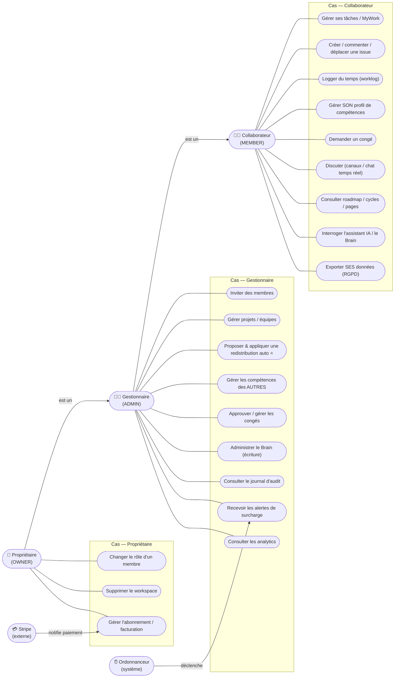

# 🎭 Diagramme de cas d'usage (UML) — acteurs & fonctionnalités

> **But** : formaliser **qui** (acteurs) peut faire **quoi** (cas d'usage) dans TaskForce, tel que
> réellement implémenté et **gardé par le code** (`AuthorizationService`, gates de rôle). Sert de preuve
> de conception (analyse du besoin) et de base à la [[Matrice_Habilitations|matrice d'habilitations]].
>
> **Source de vérité** : l'enum `WorkspaceRole` (`OWNER`/`ADMIN`/`MEMBER`), `AuthorizationService`
> (`requireMember`/`requireManager`), et les gardes de rôle dans les services
> (`WorkspaceService`, `RedistributionService`, `WorkspaceInvitationService`, `MemberLeaveService`,
> `MemberSkillProfileService`, `BrainAccessGuard`). **Chaque cas listé correspond à un endpoint existant.**

---

## 1. Acteurs

Le contrôle d'accès est **basé sur le rôle dans le workspace** (RBAC multi-tenant). Les rôles sont
**hiérarchiques** : chaque niveau hérite des droits du précédent.

| Acteur | Rôle (`WorkspaceRole`) | Correspondance métier CDC | Preuve gate |
|---|---|---|---|
| **Collaborateur** | `MEMBER` | Membre d'équipe qui exécute les tâches | `requireMember` |
| **Gestionnaire** | `ADMIN` | Manager d'équipe / chef de projet | `requireManager` (OWNER∪ADMIN) |
| **Propriétaire** | `OWNER` | Responsable / titulaire du workspace | `assertIsOwner` |
| **Stripe** *(externe)* | — | Prestataire de paiement | `StripeWebhookController` (signature) |
| **Ordonnanceur** *(système)* | — | Tâche planifiée (détection surcharge) | `OverloadAlertScheduler` |

> ⚠️ **Précision** : `OWNER` et `ADMIN` sont tous deux « gestionnaires » pour `requireManager`
> (preuve : `AuthorizationService.requireManager` → `requireRole(OWNER, ADMIN)`). Seules **2 actions**
> sont strictement réservées à l'`OWNER` (voir §3.3).

---

## 2. Diagramme

> Convention : Mermaid ne propose pas de *use-case diagram* natif ; on utilise un flowchart
> (rendu natif Obsidian/GitHub). Les flèches **`est un`** entre acteurs = généralisation UML
> (héritage des droits). Les paquets regroupent les cas par domaine.

> **Cas préalable (hors rôle workspace)** : *S'authentifier* (login e-mail/mot de passe + **OTP**,
> rafraîchissement de session) est ouvert à tout utilisateur inscrit, **avant** toute appartenance à un
> workspace — preuve `AuthController` / `OtpVerification`. Non rattaché à un rôle, il n'est pas dans le
> diagramme par acteur.

---

## 3. Détail des habilitations (preuves)

### 3.1 Cas ouverts à tout membre (`requireMember`)
Consultation et action sur ses propres objets : `MyWorkController`, `IssueController`,
`IssueWorklog`, `MemberSkillController` (profil **self**), `MemberLeaveController` (demande **self**),
`DiscussionController`/`ChannelController`/`ChatWebSocketController`, `RoadmapController`/
`CycleController`/`PageController`, `AssistantController`/`KnowledgeController` (lecture),
`GdprController` (export **self**).

### 3.2 Cas réservés au gestionnaire (`requireManager` = OWNER ∪ ADMIN)
| Cas | Garde (preuve) |
|---|---|
| Inviter des membres | `WorkspaceInvitationService` → `requireManager` |
| **Redistribution auto (proposer + appliquer)** ⭐ | `RedistributionService` → `requireManager` |
| Gérer le profil de compétences **d'un autre** | `MemberSkillProfileService` (`isManager`, sinon 403) |
| Approuver / gérer un congé **d'un autre** | `MemberLeaveService` (`isManager`, sinon 403) |
| Administrer le Brain (écriture) | `BrainAccessGuard` (403 si ≠ OWNER/ADMIN) |
| Consulter le journal d'audit | `WorkspaceService` (403 si ≠ OWNER/ADMIN) |
| Recevoir les alertes de surcharge | `OverloadAlertScheduler` (destinataires OWNER/ADMIN) |

### 3.3 Cas strictement réservés au propriétaire (`assertIsOwner`)
| Cas | Garde (preuve) |
|---|---|
| Changer le rôle d'un membre | `WorkspaceService.updateMemberRole` → `assertIsOwner` |
| Supprimer le workspace | `WorkspaceService.deleteWorkspace` → `assertIsOwner` |

> 💳 **Facturation** : `BillingController`/`StripeController` (portail d'abonnement) sont pilotés côté
> workspace ; les **webhooks** entrants sont traités par `StripeWebhookController` (acteur externe
> **Stripe**, authentifié par **signature**, pas par rôle).

---

## 4. Couverture du CDC

Le cœur du CDC — **répartition automatique des tâches par compétences / charge / disponibilité** — est
couvert par le cas ⭐ **« Proposer & appliquer une redistribution auto »** (gestionnaire), qui s'appuie
sur `SmartAssignService.rankForRedistribution()` (scoring compétences + charge via `IssueWorklog` +
disponibilité via `MemberLeave`). Le gestionnaire **valide ou non** la proposition — conforme à
l'exigence « proposition auto puis validation manager ».

> Écarts éventuels entre CDC et implémentation → tracés dans le [[Roadmap_Backlog]] / [[Problemes_Connus]],
> **jamais inventés ici**.

---

## 5. Traçabilité

| Affirmation | Preuve |
|---|---|
| 3 rôles hiérarchiques | enum `WorkspaceRole` + `AuthorizationService` |
| Redistribution = manager only | `RedistributionService.requireManager` |
| 2 actions OWNER-only | `WorkspaceService.assertIsOwner` (updateMemberRole, deleteWorkspace) |
| Stripe = acteur externe par signature | `StripeWebhookController` |
| Alertes surcharge = système | `OverloadAlertScheduler` |

> 🔗 Voir aussi : [[Diagramme_Classes_UML]] · [[Modele_Donnees_MCD_MLD]] · [[Sécurité]] (RBAC/OWASP) ·
> [[Roadmap_Documentation|plan de production doc]].
