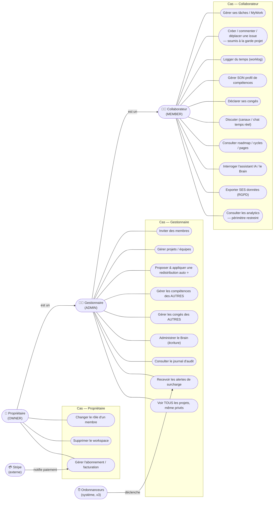
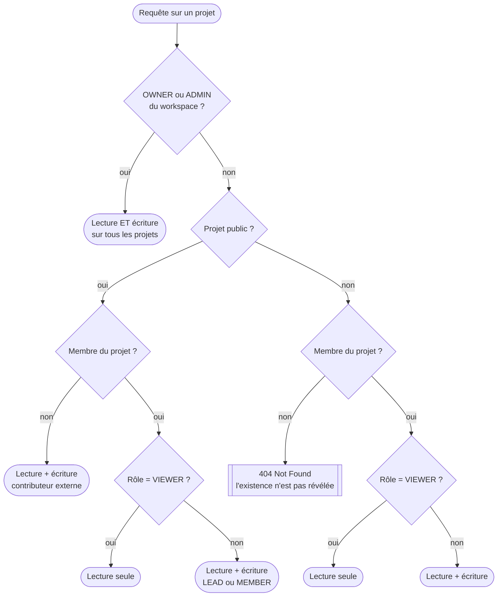

# 🎭 Diagramme de cas d'usage (UML) — acteurs & fonctionnalités

> **But** : formaliser **qui** (acteurs) peut faire **quoi** (cas d'usage) dans TaskForce, tel que
> réellement implémenté et **gardé par le code**. Sert de preuve de conception (analyse du besoin) et de
> base à la matrice d'habilitations de [[Auth_Autorisation]] §5.
>
> **Sources de vérité — il y en a deux, pas une** :
> 1. **`WorkspaceRole`** (`OWNER`/`ADMIN`/`MEMBER`) + `AuthorizationService`
>    (`requireMember`/`requireRole`/`requireManager`/`isMember`) → §1 et §3.
> 2. **`ProjectVisibilityGuard`** — visibilité du projet (public/privé) croisée avec `ProjectRole`
>    (`LEAD`/`MEMBER`/`VIEWER`) → §2 et §4. **C'est cette garde, et non le rôle workspace, qui décide
>    de l'accès aux issues.**

> **▶ Révision 2.0 du 24/07/2026.** La version 1.0 présentait `WorkspaceRole` comme **la** source de
> vérité et décrivait un modèle à trois acteurs hiérarchiques. Quatre corrections factuelles ont été
> apportées après relecture du code :
>
> | Affirmation de la v1.0 | Constat vérifié le 24/07 |
> |---|---|
> | Le contrôle d'accès repose sur `WorkspaceRole` | Un **second axe** existe : `ProjectVisibilityGuard`, avec un rôle **`VIEWER` en lecture seule** |
> | `IssueController` est ouvert à tout membre (`requireMember`) | Les issues passent par `assertCanView` / `assertCanWrite`, **jamais** par `requireMember` |
> | « Consulter les analytics » = cas gestionnaire | `AnalyticsService:76` → **`requireMember`**, périmètre restreint par `viewableProjectIds` |
> | « Approuver / gérer les congés » = cas gestionnaire | **Aucune approbation n'existe** : `MemberLeave` n'a pas de champ statut |
>
> Un cinquième point, mineur : la v1.0 ne citait qu'un seul ordonnanceur, il y en a **trois**.

---

## 1. Acteurs

### 1.1 Acteurs humains — rôle dans le workspace

Le premier axe de contrôle d'accès est **le rôle dans le workspace** (RBAC multi-tenant). Les rôles
sont **hiérarchiques** : chaque niveau hérite des droits du précédent.

| Acteur | Rôle (`WorkspaceRole`) | Correspondance métier CDC | Preuve garde |
|---|---|---|---|
| **Collaborateur** | `MEMBER` | Membre d'équipe qui exécute les tâches | `requireMember` |
| **Gestionnaire** | `ADMIN` | Manager d'équipe / chef de projet | `requireManager` (OWNER ∪ ADMIN) |
| **Propriétaire** | `OWNER` | Responsable / titulaire du workspace | `assertIsOwner` |

> ⚠️ **Précision** : `OWNER` et `ADMIN` sont tous deux « gestionnaires » pour `requireManager`
> (preuve : `AuthorizationService:45` → `requireRole(OWNER, ADMIN)`). Seules **2 actions** sont
> strictement réservées à l'`OWNER` (voir §3.3) — vérifié par recensement des appels à `assertIsOwner` :
> `WorkspaceService:362` et `:394`, et nulle part ailleurs.

### 1.2 Acteurs humains — rôle dans le projet

Le second axe s'applique **à l'intérieur d'un projet**. Il est indépendant du premier : un
`MEMBER` du workspace peut être `LEAD` sur un projet et `VIEWER` sur un autre.

| Acteur | Rôle (`ProjectRole`) | Ce qu'il peut faire | Preuve garde |
|---|---|---|---|
| **Responsable de projet** | `LEAD` | Contribuer **et** administrer le projet (archivage) | `assertCanManageProject` |
| **Contributeur** | `MEMBER` | Contribuer (issues, commentaires, statuts) | `canWrite` → vrai |
| **Observateur** | `VIEWER` | **Lecture seule, même sur un projet public** | `canWrite` → faux |

### 1.3 Acteurs non humains

| Acteur | Nature | Rôle | Preuve |
|---|---|---|---|
| **Stripe** | externe | Prestataire de paiement, notifie par webhook | `StripeWebhookController` (authentifié par **signature**, pas par rôle) |
| **Ordonnanceur — surcharge** | système | Détecte les surcharges, notifie les OWNER/ADMIN | `OverloadAlertScheduler:47` (quotidien 08:30) |
| **Ordonnanceur — échéances** | système | Notifie l'**assigné** d'une issue due ou en retard | `DueDateAlertScheduler:37` (quotidien 08:00) |
| **Ordonnanceur — rétention** | système | Purge les données arrivées à échéance (RGPD) | `RetentionScheduler` (quotidien 03:30) |

> Les trois ordonnanceurs n'ont **pas d'identité utilisateur** : ils ne traversent aucune garde de rôle,
> puisqu'ils s'exécutent hors requête HTTP. C'est précisément pourquoi leurs destinataires sont
> déterminés en dur dans le code plutôt que déduits d'une session.

---

## 2. Diagramme — axe workspace

> Convention : Mermaid ne propose pas de *use-case diagram* natif ; on utilise un flowchart
> (rendu natif Obsidian/GitHub). Les flèches **`est un`** entre acteurs = généralisation UML
> (héritage des droits). Les paquets regroupent les cas par domaine.

> **Cas préalable (hors rôle workspace)** : *S'authentifier* (e-mail + mot de passe, rafraîchissement de
> session) est ouvert à tout utilisateur inscrit, **avant** toute appartenance à un workspace — preuve
> `AuthController`. Non rattaché à un rôle, il n'est pas dans le diagramme par acteur.
>
> ⚠️ **L'OTP n'intervient pas au login**, contrairement à ce que laissait entendre la v1.0 de ce
> document. Il sert à l'**inscription** (vérification de l'adresse, d'où le double opt-in RGPD) et à la
> **réinitialisation de mot de passe** — jamais à l'ouverture de session. Voir [[Auth_Autorisation]] §6
> et [[Diagramme_Etats_UML]] §7 pour le cycle de vie du code.

---

## 3. Diagramme — axe projet (garde de visibilité)

Ce second axe est **celui qui décide réellement de l'accès aux issues**. Il se lit comme un arbre de
décision, parce que c'est exactement ce qu'implémente `ProjectVisibilityGuard`.

**Trois décisions de conception à retenir**, toutes vérifiables dans `ProjectVisibilityGuard` :

1. **Un projet privé invisible renvoie `404`, pas `403`.** Répondre « interdit » confirmerait
   l'existence du projet. `assertCanWrite` appelle d'ailleurs `assertCanView` **en premier** : on ne
   parle jamais de droits d'écriture sur un objet qu'on n'a pas le droit de savoir existant.
2. **`VIEWER` reste en lecture seule même sur un projet public.** Un rôle explicite l'emporte sur
   l'ouverture du projet ; c'est le comportement de GitHub et de Linear.
3. **Un non-membre contribue à un projet public.** L'absence de rôle n'est pas un refus : c'est le
   modèle « dépôt public » du CDC, où l'ouverture est le défaut et la restriction un choix.

---

## 4. Détail des habilitations (preuves)

### 4.1 Cas ouverts à tout membre du workspace (`requireMember`)

`MyWorkController`, `IssueWorklog`, `MemberSkillController` (profil **self**), `MemberLeaveController`
(congés **self**), `DiscussionController`/`ChannelController`/`ChatWebSocketController`,
`RoadmapController`/`CycleController`/`PageController`, `AssistantController`/`KnowledgeController`
(lecture), `GdprController` (export **self**), **`AnalyticsController`**.

> ⚠️ **Correction v2.0** : `IssueController` figurait dans cette liste. C'est faux — les issues relèvent
> du §4.2. Et **les analytiques y manquaient** alors qu'elles y appartiennent : `AnalyticsService:76`
> appelle `requireMember`, puis restreint le périmètre aux projets visibles par l'appelant
> (`AnalyticsService:486` → `viewableProjectIds`). Deux collaborateurs voient donc **la même page avec
> des chiffres différents** — la page n'est jamais masquée, seul son contenu est réduit
> (`TF-RBAC-INTEL`).

### 4.2 Cas gardés par la visibilité du projet (`ProjectVisibilityGuard`)

| Cas | Garde (preuve) |
|---|---|
| Lire les issues d'un projet | `IssueService:230`, `:246`, `:292` → `assertCanView` (**404** si projet privé non visible) |
| Créer / modifier / supprimer une issue | `IssueService:999`, `:1007` → `assertCanWrite` (**refus si `VIEWER`**) |
| Lister les issues inter-projets | `IssueService:262-263` → périmètre restreint par `memberProjectIds` |
| Archiver un projet | `ProjectService` → `assertCanManageProject` (**LEAD** du projet, ou OWNER/ADMIN) |

### 4.3 Cas réservés au gestionnaire (`requireManager` = OWNER ∪ ADMIN)

| Cas | Garde (preuve) |
|---|---|
| Inviter des membres | `WorkspaceInvitationService` → `requireManager` |
| **Redistribution auto (proposer + appliquer)** ⭐ | `RedistributionService:79` et `:180` → `requireManager` |
| Gérer le profil de compétences **d'un autre** | `MemberSkillProfileService` (`isManager`, sinon 403) |
| Gérer un congé **d'un autre** | `MemberLeaveService:113-116` (`isManager`, sinon 403) |
| Administrer le Brain (écriture) | `brain/BrainAccessGuard.resolveAndAuthorizeOwner` (403 si ≠ OWNER/ADMIN) |
| Consulter le journal d'audit | `WorkspaceService:246-253` (403 : « réservé aux administrateurs ») |
| Recevoir les alertes de surcharge | `OverloadAlertScheduler:60` (destinataires filtrés OWNER/ADMIN) |
| Voir tous les projets, même privés | `ProjectVisibilityGuard.isWorkspaceAdmin` |

### 4.4 Cas strictement réservés au propriétaire (`assertIsOwner`)

| Cas | Garde (preuve) |
|---|---|
| Changer le rôle d'un membre | `WorkspaceService:362` → `assertIsOwner` |
| Supprimer le workspace | `WorkspaceService:394` → `assertIsOwner` |

> 💳 **Facturation** : `BillingController`/`StripeController` (portail d'abonnement) sont pilotés côté
> workspace ; les **webhooks** entrants sont traités par `StripeWebhookController` (acteur externe
> **Stripe**, authentifié par **signature**, pas par rôle).

---

## 5. ⚠️ Ce que ce diagramme ne promet pas

**Il n'existe pas de circuit d'approbation des congés.** La v1.0 listait un cas gestionnaire
« Approuver / gérer les congés » ; l'approbation n'existe pas. `MemberLeave` n'a **aucun champ statut**
et `MemberLeaveService` n'expose que `listLeaves`, `createLeave`, `deleteLeave`.

Ce qui existe est un contrôle d'accès : chacun gère ses propres congés, un OWNER/ADMIN gère aussi ceux
des autres. Le cas a été renommé « **Gérer** les congés des autres », et côté collaborateur
« **Déclarer** ses congés » plutôt que « demander ».

La fonction réelle du congé dans le produit est ailleurs, et elle est bien plus intéressante : il
alimente le calcul de **disponibilité** du smart-assign. Voir [[Diagramme_Etats_UML]] §10.

---

## 6. Couverture du CDC

Le cœur du CDC — **répartition automatique des tâches par compétences / charge / disponibilité** — est
couvert par le cas ⭐ **« Proposer & appliquer une redistribution auto »** (gestionnaire), qui s'appuie
sur `SmartAssignService.rankForRedistribution()` (scoring compétences + charge via `IssueWorklog` +
disponibilité via `MemberLeave`). Le gestionnaire **valide ou non** la proposition — conforme à
l'exigence « proposition auto puis validation manager ».

Les **trois acteurs du CDC** (collaborateur, manager, responsable de projet) se projettent sur le modèle
implémenté de la façon suivante — la correspondance n'est pas de un pour un, et c'est un choix :

| Acteur CDC | Implémentation | Commentaire |
|---|---|---|
| Collaborateur | `MEMBER` du workspace | Correspondance directe |
| Manager | `ADMIN` (ou `OWNER`) du workspace | `requireManager` couvre les deux |
| Responsable de projet | `LEAD` du projet | **Axe projet**, indépendant du rôle workspace |

> Écarts éventuels entre CDC et implémentation → tracés dans le [[Roadmap_Backlog]] / [[Problemes_Connus]],
> **jamais inventés ici**.

---

## 7. Traçabilité

| Affirmation | Preuve |
|---|---|
| 3 rôles workspace hiérarchiques | enum `WorkspaceRole` + `AuthorizationService` |
| 3 rôles projet, dont `VIEWER` en lecture seule | enum `ProjectRole` + `ProjectVisibilityGuard.canWrite` |
| Accès aux issues gardé par la visibilité, pas par le rôle workspace | `IssueService:230/246/292/999/1007` |
| Projet privé → 404, jamais 403 | `ProjectVisibilityGuard.assertCanView` |
| Analytiques ouvertes à tout membre, périmètre restreint | `AnalyticsService:76` et `:486` |
| Redistribution = manager uniquement | `RedistributionService:79`, `:180` |
| 2 actions OWNER-only | `WorkspaceService:362`, `:394` (recensement exhaustif des appels) |
| Aucune approbation de congé | `MemberLeave` sans champ statut ; `MemberLeaveService` = list/create/delete |
| Stripe = acteur externe par signature | `StripeWebhookController` |
| 3 ordonnanceurs système | `OverloadAlertScheduler`, `DueDateAlertScheduler`, `RetentionScheduler` |

> 🔗 Voir aussi : [[Diagramme_Etats_UML]] · [[Diagramme_Classes_UML]] · [[Modele_Donnees_MCD_MLD]] ·
> [[Sécurité]] (RBAC/OWASP) · [[Roadmap_Documentation|plan de production doc]].
