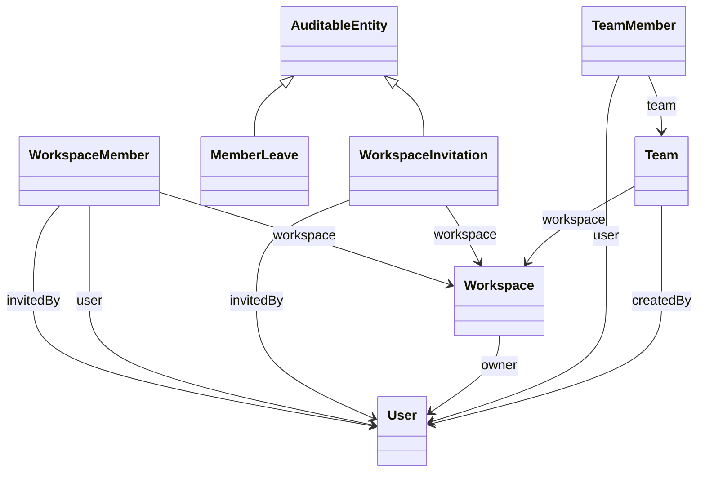
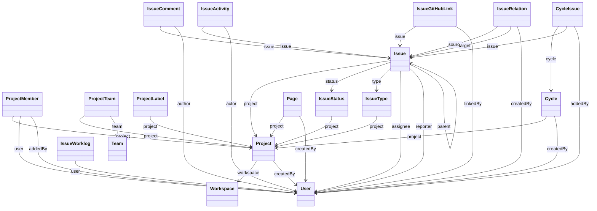
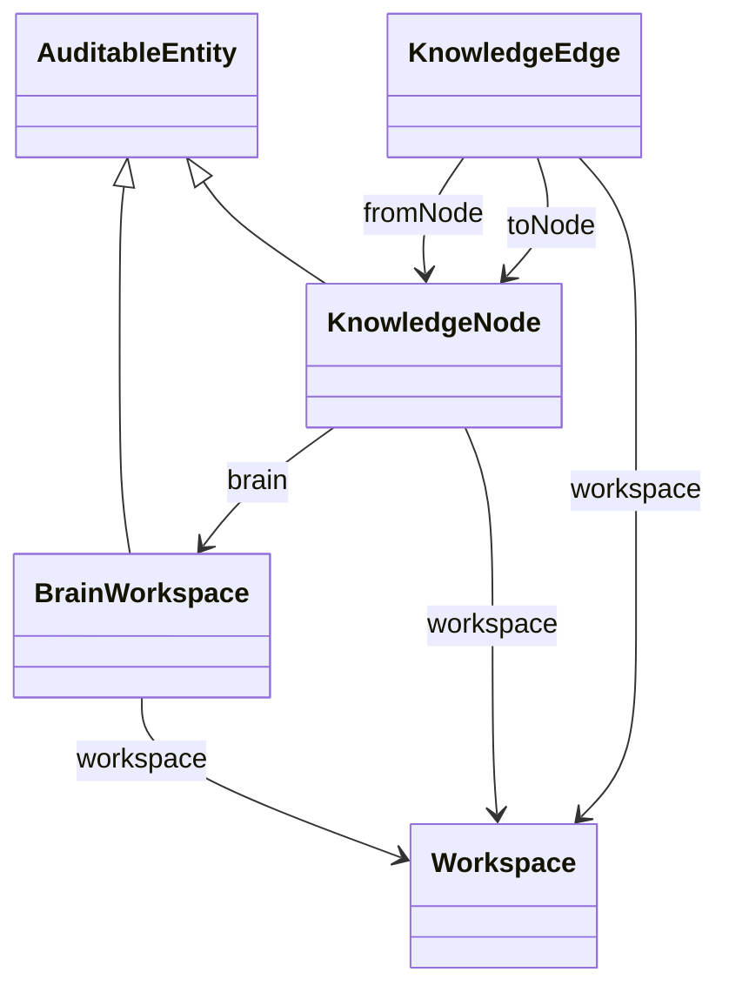
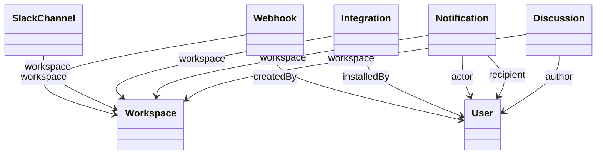
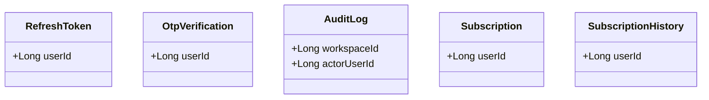
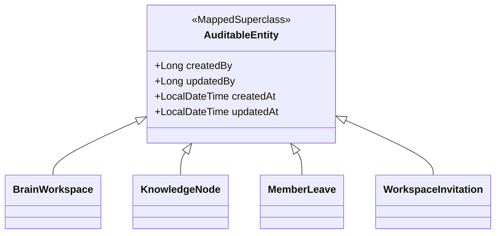

# 🧩 Diagramme de classes (UML) — modèle objet du domaine

> **But** : décrire le **modèle objet** de TaskForce tel qu'il existe réellement dans le code
> (entités JPA persistées), en complément du [[Modele_Donnees_MCD_MLD|MCD/MLD MERISE]] qui décrit
> le modèle **relationnel**. Ce document sert de preuve de conception (E8) et de support de soutenance.
>
> **Source de vérité** : les 38 fichiers `@Entity` de
> `backend/tf-api/src/main/java/com/taskforce/tf_api/core/model/`.
> Les associations tracées ci-dessous sont **uniquement** celles réellement déclarées dans le code
> (`@ManyToOne` / `@OneToMany` / héritage `extends`). Aucune association n'est inventée.

---

## 1. Méthode & périmètre

| Élément | Valeur | Preuve |
|---|---|---|
| **Entités JPA** | 38 classes `@Entity` | `core/model/*.java` |
| **Héritages** (`extends AuditableEntity`) | **4** | voir §3 |
| **Associations JPA** (`@ManyToOne`) | 60 | extraites par parsing des annotations |
| **Non-entité notable** | `MemberSkillProfile` | accès **SQL brut** (`JdbcTemplate`), pas de mapping JPA → **absente** du diagramme |

> ⚠️ **Distinction importante** : TaskForce utilise un **modèle hybride** de références. Certaines FK
> sont des **associations JPA** (`@ManyToOne User assignee`), d'autres de **simples `Long` id**
> (`Long userId`) — voir §4. Le diagramme de classes ne montre que les **associations JPA** ; les
> références par id sont documentées en §4 et figurent toutes comme FK dans le [[Modele_Donnees_MCD_MLD|MLD]].

Le modèle est présenté **par domaine fonctionnel** (comme le MCD/MLD) pour rester lisible. `User` et
`Workspace` (domaine IAM) sont des **cibles partagées** : elles apparaissent dans plusieurs diagrammes
en tant que classes référencées.

---

## 2. Vue par domaine

### 2.1 IAM & Workspace (identité, tenants, équipes)

`Workspace` est la racine du **multi-tenant** : toute donnée métier porte (directement ou via son
agrégat) un `workspace_id`. `WorkspaceMember` matérialise l'appartenance **N–N** User↔Workspace avec
le rôle (`OWNER`/`ADMIN`/`MEMBER`). `MemberLeave` et `WorkspaceInvitation` étendent `AuditableEntity`
(traçabilité création/modification — voir §3).

### 2.2 Projets & Issues (cœur métier — gestion de tâches)

`Issue` est l'entité centrale : rattachée à un `Project`, un `IssueStatus` et un `IssueType`
(tous deux **scopés par projet**), avec `assignee`/`reporter` (deux liens vers `User`) et une
**auto-référence** `parent` (sous-tâches). `Cycle` (sprint) regroupe des issues via l'association
**N–N** `CycleIssue`. `IssueRelation` relie deux issues (`source`/`target`, ex. *blocks*, *relates*).
`IssueWorklog` porte le temps passé (base de la charge réelle pour la répartition intelligente).

### 2.3 IA / Brain OS (knowledge graph natif)

Un `Workspace` possède **un** `BrainWorkspace` (1 workspace = 1 brain). Le graphe de connaissances est
composé de `KnowledgeNode` (nœuds, portant l'embedding `vector(384)` pgvector) et de `KnowledgeEdge`
(arêtes orientées `fromNode`→`toNode`). `BrainWorkspace` et `KnowledgeNode` étendent `AuditableEntity`.

### 2.4 Comms & Intégrations (notifications, discussions, connecteurs)

`Notification` porte deux liens vers `User` : `recipient` (destinataire) et `actor` (auteur de
l'événement). `Integration`/`SlackChannel`/`Webhook` matérialisent les connecteurs externes,
tous scopés par `Workspace`.

### 2.5 Auth & Facturation (sécurité, tokens, abonnements) — **modèle découplé par id**

> Ce domaine **ne comporte aucune association JPA** : c'est un **choix de conception assumé**, pas un
> oubli. Les entités de sécurité, d'audit et de facturation référencent `User`/`Workspace` par un
> **simple `Long` id**, sans `@ManyToOne`.

**Pourquoi par id et pas par association ?** (preuve : Javadoc d'`AuditLog.java`)
- **Survie à la suppression** : le journal d'audit et l'historique d'abonnement doivent **persister
  même si l'utilisateur est supprimé** (FK `ON DELETE SET NULL`). Une association JPA `@ManyToOne`
  imposerait un couplage de cycle de vie (cascade / contrainte) contraire à cet objectif légal/RGPD.
- **Découplage & performance** : tokens (`RefreshToken`, `OtpVerification`) et facturation sont des
  agrégats **indépendants** du graphe métier ; l'accès se fait par id, sans chargement d'entité liée.

Ces références restent des **vraies FK en base** (visibles dans le [[Modele_Donnees_MCD_MLD|MLD]]) —
seul le **mapping objet** diffère.

---

## 3. Héritage — `AuditableEntity`

Seules **4** entités étendent la super-classe `@MappedSuperclass AuditableEntity`
(champs `createdBy`/`updatedBy`/`createdAt`/`updatedAt` renseignés automatiquement) :

> ⚠️ **Fait vérifié** (et corrigé dans le [[Modele_Donnees_MCD_MLD|MCD/MLD]]) : **la majorité des
> entités NE l'étendent PAS**. 27 entités déclarent leur propre `createdAt` directement, et les tables
> de jonction n'ont pas d'horodatage. Toute affirmation « toutes les entités sont auditées » serait
> **fausse** — l'audit applicatif global passe par `AuditService`/`AuditLog` (§2.5), pas par cet héritage.

---

## 4. Le modèle hybride de références (synthèse)

| Type de référence | Mapping | Exemples | Justification |
|---|---|---|---|
| **Association JPA** `@ManyToOne` | objet chargé (LAZY) | `Issue.assignee`, `Notification.recipient`, `KnowledgeEdge.fromNode` | navigation objet, cohérence d'agrégat métier |
| **Référence par `Long` id** | scalaire | `RefreshToken.userId`, `AuditLog.actorUserId`, `Subscription.userId` | survie à la suppression, découplage, perf (§2.5) |

Ce choix explique pourquoi le diagramme de classes (associations objet) est **plus « creux »** que le
MLD (toutes les FK) sur les domaines sécurité/facturation/audit : c'est **normal et voulu**.

---

## 5. Traçabilité

| Affirmation | Preuve |
|---|---|
| 38 entités, 4 héritages, 60 associations | parsing de `core/model/*.java` (annotations `@Entity`/`@ManyToOne`/`extends`) |
| `MemberSkillProfile` non-JPA | accès `JdbcTemplate` (raw SQL) — voir `SmartAssignService` |
| Découplage audit par id | Javadoc `AuditLog.java` (« le journal doit survivre à la suppression ») |
| FK réelles en base | [[Modele_Donnees_MCD_MLD]] (94 FK, `information_schema`) |

> 🔗 Voir aussi : [[Modele_Donnees_MCD_MLD]] (relationnel) · [[Architecture]] (C4/conteneurs) ·
> le [[Roadmap_Documentation|plan de production doc]].
