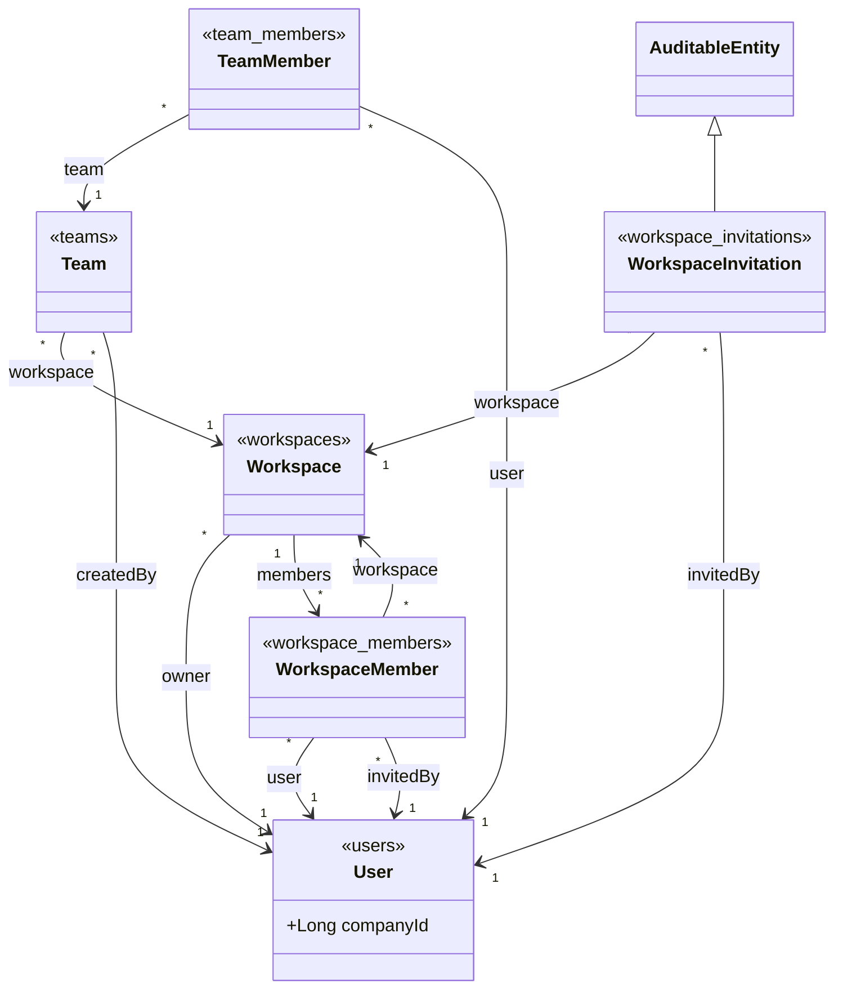
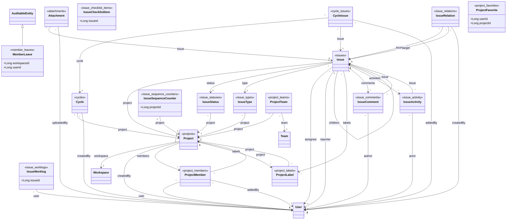
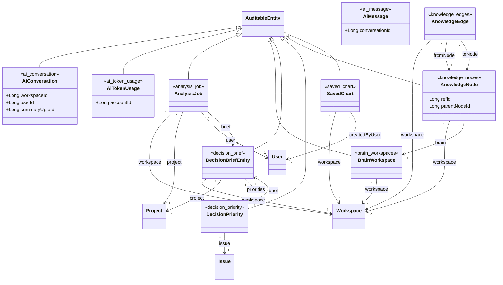
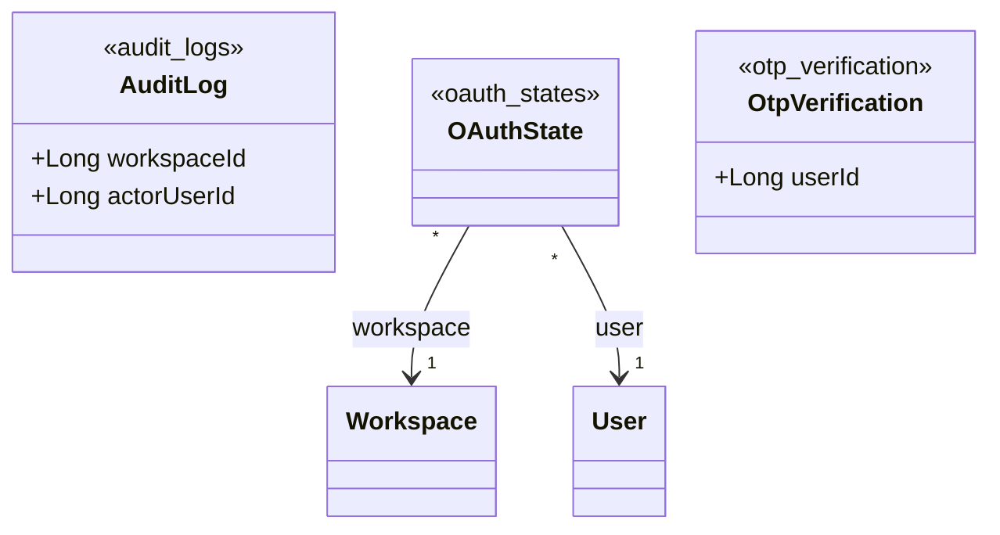
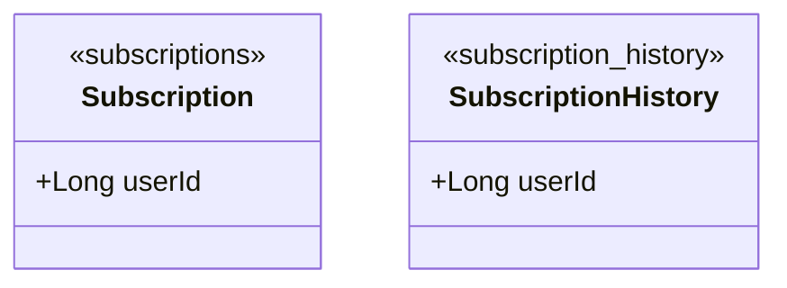
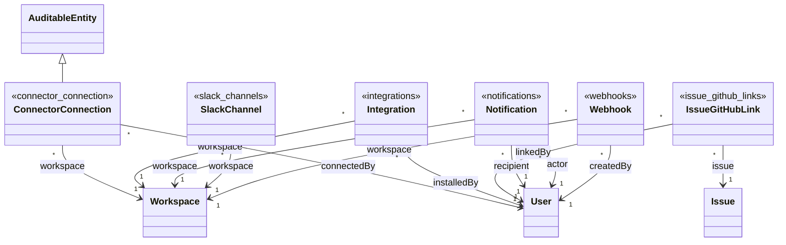
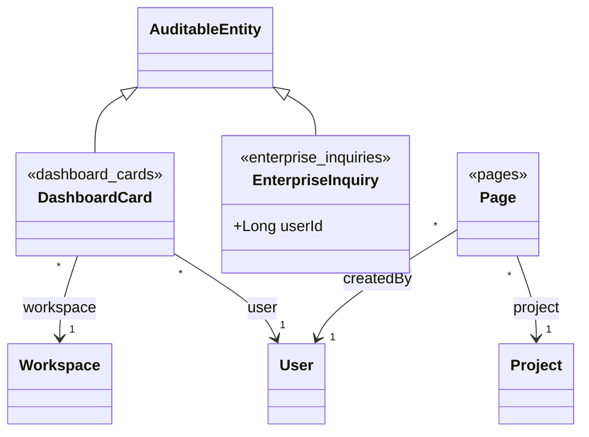

# Diagramme de classes UML

> **Livrable E8** (dossier de conception, compétence C8).
>
> **Ce document est GÉNÉRÉ**, il ne se modifie pas à la main. Source de vérité : les classes
> annotées `@Entity` du code réel. Aucune classe ni association n'est inventée.
>
> Régénération : `node scripts/generate-class-diagram.mjs` (voir §5).

## 1. Méthode et périmètre

- **48 entités JPA**, **13 héritant** de `AuditableEntity`, **84 associations** entre entités.
- **21 références par identifiant nu** (voir §4), qui ne sont pas des associations JPA.
- Extraction par analyse des annotations, commentaires et chaînes retirés au préalable.
- Les entités vivent majoritairement dans `core/model`, mais **pas exclusivement** : les modules
  métier portent les leurs. Restreindre l'extraction à `core/model` en oublierait.

> **Piège de comptage à connaître.** `@EntityListeners` contient la chaîne `@Entity` : un
> décompte par recherche textuelle simple inclut donc `AuditableEntity`, qui est un
> `@MappedSuperclass` et non une entité. Le compte exact est **48**, pas 49.

## 2. Vue par domaine

Le stéréotype `<<table>>` sous chaque classe donne sa table de rattachement, ce qui permet de
recouper ce diagramme avec le [modèle de données](./Modele_Donnees_MCD_MLD.md), généré depuis la
base par un script frère et partageant le même classement par domaine.

### 4.1 IAM et Workspace

Le socle multi-tenant. Toute donnée métier est rattachée à un workspace, et l'appartenance à un workspace conditionne l'accès.

**6 entités** : `Team`, `TeamMember`, `User`, `Workspace`, `WorkspaceInvitation`, `WorkspaceMember`.



### 4.2 Projets et Issues (coeur métier)

Le domaine que le cahier des charges décrit : les tâches, leur affectation, la charge et les compétences qui la conditionnent.

**18 entités** : `Attachment`, `Cycle`, `CycleIssue`, `Issue`, `IssueActivity`, `IssueChecklistItem`, `IssueComment`, `IssueRelation`, `IssueSequenceCounter`, `IssueStatus`, `IssueType`, `IssueWorklog`, `MemberLeave`, `Project`, `ProjectFavorite`, `ProjectLabel`, `ProjectMember`, `ProjectTeam`.



### 4.3 IA, affectation intelligente et graphe de connaissances

Le moteur d'affectation et sa mémoire. `knowledge_nodes` porte les vecteurs d'embedding utilisés par la recherche sémantique.

**10 entités** : `AiConversation`, `AiMessage`, `AiTokenUsage`, `AnalysisJob`, `BrainWorkspace`, `DecisionBriefEntity`, `DecisionPriority`, `KnowledgeEdge`, `KnowledgeNode`, `SavedChart`.



### 4.4 Authentification et sécurité

L'identité est déléguée à Keycloak. Ne subsistent ici que les données propres à l'application : codes à usage unique, jetons anti-CSRF, journal d'audit.

**3 entités** : `AuditLog`, `OAuthState`, `OtpVerification`.



### 4.5 Facturation

Abonnements et historique. Aucune donnée de carte n'est stockée : la facturation est déléguée au prestataire de paiement.

**2 entités** : `Subscription`, `SubscriptionHistory`.



### 4.6 Intégrations et communications

Connecteurs externes et notifications. Les identifiants de connecteurs sont chiffrés en base (AES-256-GCM).

**6 entités** : `ConnectorConnection`, `Integration`, `IssueGitHubLink`, `Notification`, `SlackChannel`, `Webhook`.



### 4.7 Documentation, tableaux de bord et prospects

Pages de documentation collaborative, composition du tableau de bord par utilisateur, et demandes commerciales.

**3 entités** : `DashboardCard`, `EnterpriseInquiry`, `Page`.



## 3. Héritage

`AuditableEntity` est un **`@MappedSuperclass`**, pas une entité : elle n'a pas de table propre,
ses colonnes sont recopiées dans chaque table fille. C'est ce qui explique qu'on retrouve
`created_at` et `updated_at` répétés au dictionnaire de données plutôt que dans une table commune.

**13 entités sur 48** en héritent :

- `AiConversation` (`ai_conversation`)
- `AiTokenUsage` (`ai_token_usage`)
- `AnalysisJob` (`analysis_job`)
- `BrainWorkspace` (`brain_workspaces`)
- `ConnectorConnection` (`connector_connection`)
- `DashboardCard` (`dashboard_cards`)
- `DecisionBriefEntity` (`decision_brief`)
- `DecisionPriority` (`decision_priority`)
- `EnterpriseInquiry` (`enterprise_inquiries`)
- `KnowledgeNode` (`knowledge_nodes`)
- `MemberLeave` (`member_leaves`)
- `SavedChart` (`saved_chart`)
- `WorkspaceInvitation` (`workspace_invitations`)

Les 35 autres portent leur horodatage elles-mêmes, ou n'en ont pas besoin
(tables de liaison, compteurs de séquence, jetons éphémères).

## 4. Le modèle hybride de références

Certaines clés étrangères sont portées par une **association JPA** (`@ManyToOne` vers l'entité
cible), d'autres par un **identifiant nu** (`Long xxxId`). Ce n'est pas une incohérence mais un
arbitrage : l'association donne la navigation et le chargement paresseux, l'identifiant nu évite
un couplage de cycle de vie là où il serait nuisible.

Le cas emblématique est le journal d'audit : conserver un identifiant nu permet à la trace de
**survivre à l'anonymisation** du compte qu'elle référence, ce qu'une association avec cascade
aurait empêché. Une contrainte `ON DELETE SET NULL` complète le dispositif côté base.

**21 références de ce type** sont recensées :

| Entité | Références par identifiant |
|---|---|
| `AiConversation` | `workspaceId`, `userId`, `summaryUptoId` |
| `AiMessage` | `conversationId` |
| `AiTokenUsage` | `accountId` |
| `AuditLog` | `workspaceId`, `actorUserId` |
| `EnterpriseInquiry` | `userId` |
| `IssueChecklistItem` | `issueId` |
| `IssueSequenceCounter` | `projectId` |
| `IssueWorklog` | `issueId` |
| `KnowledgeNode` | `refId`, `parentNodeId` |
| `MemberLeave` | `workspaceId`, `userId` |
| `OtpVerification` | `userId` |
| `ProjectFavorite` | `userId`, `projectId` |
| `Subscription` | `userId` |
| `SubscriptionHistory` | `userId` |
| `User` | `companyId` |

## 5. Régénération

```bash
node scripts/generate-class-diagram.mjs
```

Le script **échoue volontairement** si une entité n'a pas de `@Table` explicite, ou si sa table
n'est classée dans aucun domaine de `scripts/lib/domaines.mjs`. Ce classement est partagé avec le
générateur du modèle de données : deux classifications séparées auraient divergé, ce qui est
exactement le défaut que ces scripts corrigent.

Variante non destructive, utilisable en intégration continue :

```bash
node scripts/generate-class-diagram.mjs --check
```

> Voir aussi : [[Modele_Donnees_MCD_MLD]] · [[Dictionnaire_Donnees]] · [[Architecture_C4]].
