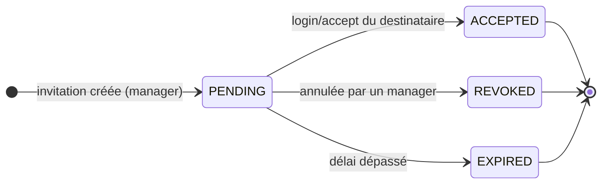
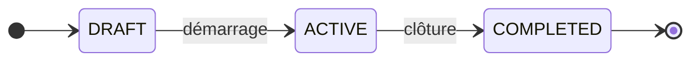
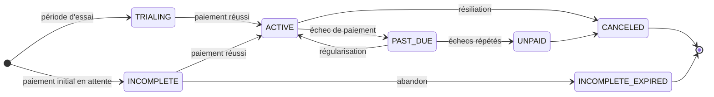

# 🔄 Diagrammes d'états / d'activité (UML) — cycles de vie

> **But** : formaliser les **cycles de vie** des objets à états de TaskForce. **Seules les machines à
> états réellement présentes** (enums Java `@Enumerated`) sont modélisées.
>
> ⚠️ **Deux faits vérifiés qui cadrent ce document** :
> 1. **Les transitions d'issue ne sont PAS contraintes** par le code (`IssueService` ne valide aucune
>    transition) → mouvement **libre** sur le board. Les *catégories* de statut portent la **sémantique**
>    (quel statut compte comme « terminé »), **pas** une FSM stricte. On ne dessine donc **aucune
>    transition interdite** (ce serait inventé).
> 2. **`Workspace` n'a pas de champ statut** → pas de machine à états de workspace ; son cycle se résume
>    à *créé → (actif) → supprimé* (hard-delete `deleteWorkspace`, OWNER only).
>
> **Sources** : `core/enums/*.java` (`IssueStatusCategory`, `InvitationStatus`, `CycleStatus`,
> `PlanStatus`), `core/service/*`.

---

## 1. Cycle de vie d'une **issue** (sémantique de catégorie)

Chaque `IssueStatus` (défini **par projet**, personnalisable) porte une **catégorie**
(`IssueStatusCategory`) parmi 5 valeurs. C'est la catégorie — pas le nom du statut — qui donne le sens.

> **Preuve** : enum `IssueStatusCategory { BACKLOG, UNSTARTED, STARTED, COMPLETED, CANCELLED }` ;
> `IssueStatus.category` (`@Enumerated(STRING)`). Absence de garde de transition dans `IssueService`.
> `COMPLETED`/`CANCELLED` = catégories terminales **sémantiquement** (ex. exclues de la charge active
> du smart-assign), pas verrouillées techniquement.

---

## 2. Cycle de vie d'une **invitation** (FSM réelle)

Contrairement à l'issue, l'invitation **a** une machine à états dirigée (`InvitationStatus`).

> **Preuve** : enum `InvitationStatus { PENDING, ACCEPTED, REVOKED, EXPIRED }` ;
> `WorkspaceInvitationService` (création manager, `acceptPendingInvitations` au login).

---

## 3. Cycle de vie d'un **cycle** (sprint)

> **Preuve** : enum `CycleStatus { DRAFT, ACTIVE, COMPLETED }` (`core/enums/CycleStatus.java`).

---

## 4. Cycle de vie d'un **abonnement** (piloté par Stripe)

L'état d'abonnement (`PlanStatus`) est la **projection des événements Stripe** (webhooks) — voir
[[Diagrammes_Sequence_UML]] §5. TaskForce ne décide pas seul de ces transitions : elles reflètent Stripe.

> **Preuve** : enum `PlanStatus { ACTIVE, CANCELED, PAST_DUE, TRIALING, INCOMPLETE, INCOMPLETE_EXPIRED,
> UNPAID }` (miroir des statuts Stripe) ; `StripeWebhookService.handleSubscription*`.
> ⚠️ Les flèches reflètent la **sémantique Stripe** ; TaskForce **applique** ces états, il n'impose pas
> ses propres règles de transition dessus.

---

## 5. Diagramme d'activité — **redistribution automatique** (⭐)

Vue « processus » du parcours manager (complète la séquence [[Diagrammes_Sequence_UML]] §4).

> **Preuve** : `RedistributionService.preview` (lecture seule, aucun effet) puis `apply` (écriture +
> audit). Conforme au CDC : **proposition auto → validation manager**.

---

## 6. Traçabilité

| Machine à états | Enum (preuve) | Contrainte de transition |
|---|---|---|
| Issue (catégorie) | `IssueStatusCategory` | **Aucune** (board libre) |
| Invitation | `InvitationStatus` | FSM dirigée (`WorkspaceInvitationService`) |
| Cycle | `CycleStatus` | linéaire |
| Abonnement | `PlanStatus` | dictée par Stripe (webhooks) |
| Workspace | — *(pas de champ statut)* | créé → supprimé (hard-delete OWNER) |

> 🔗 Voir aussi : [[Diagrammes_Sequence_UML]] · [[Diagramme_Classes_UML]] · [[Modele_Donnees_MCD_MLD]] ·
> [[Roadmap_Documentation|plan de production doc]].
