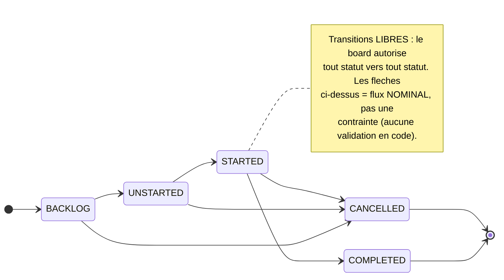
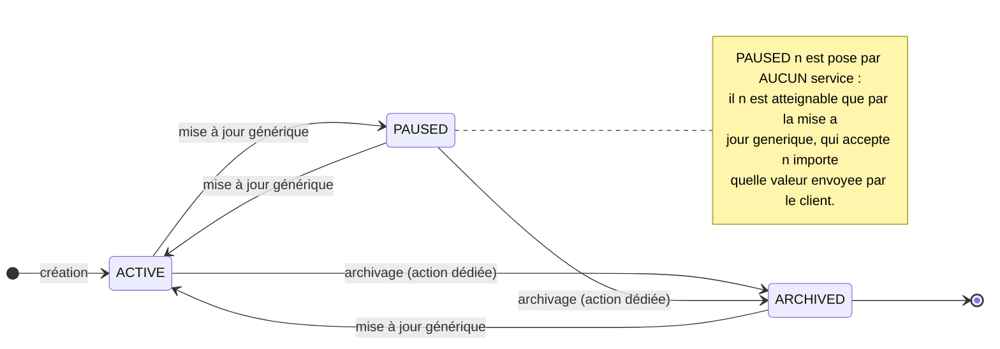
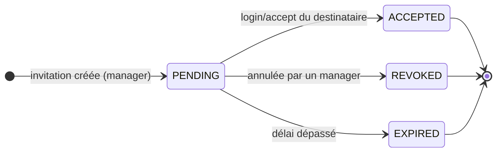
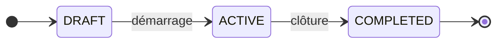
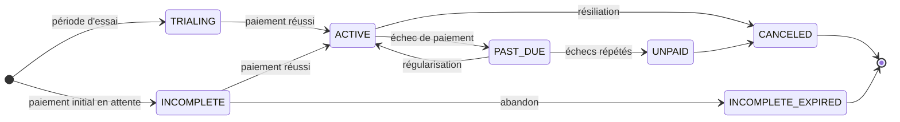
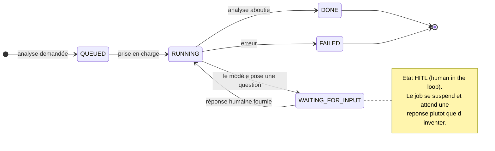
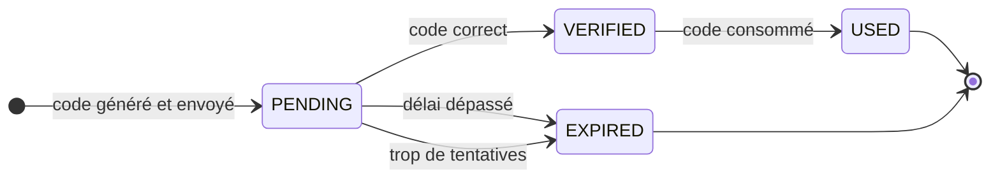
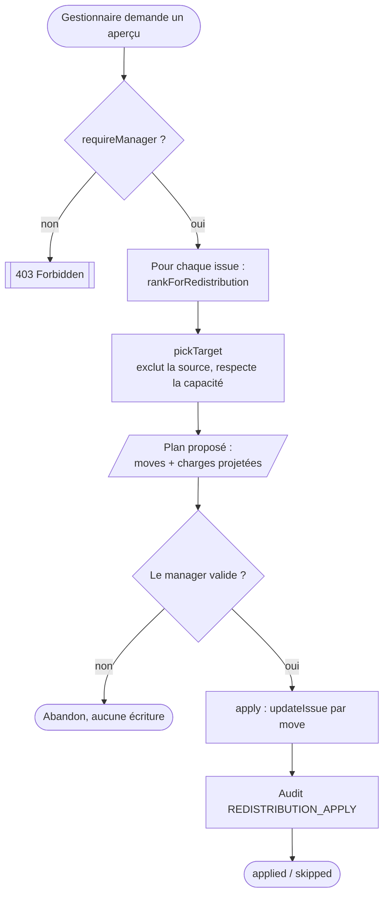

# 🔄 Diagrammes d'états / d'activité (UML) — cycles de vie

> **But** : formaliser les **cycles de vie** des objets à états de TaskForce. **Seules les machines à
> états réellement présentes** (enums Java `@Enumerated`, câblées à un champ d'entité) sont modélisées.
>
> ⚠️ **Trois faits vérifiés qui cadrent ce document** :
> 1. **Les transitions d'issue ne sont PAS contraintes** par le code (`IssueService` ne valide aucune
>    transition) → mouvement **libre** sur le board. Les *catégories* de statut portent la **sémantique**
>    (quel statut compte comme « terminé »), **pas** une FSM stricte. On ne dessine donc **aucune
>    transition interdite** (ce serait inventé).
> 2. **`Workspace` n'a pas de champ statut** (vérifié le 24/07 : `Workspace.java` ne déclare aucun
>    `status`) → pas de machine à états de workspace ; son cycle se résume à *créé → (actif) → supprimé*
>    (hard-delete `deleteWorkspace`, OWNER uniquement).
> 3. **`MemberLeave` n'a pas de champ statut non plus** → **il n'existe aucun circuit d'approbation
>    des congés**. Un congé est créé puis supprimé, sans état intermédiaire. Voir §10.
>
> **Sources** : `core/enums/*.java`, `core/model/*.java`, `core/service/*`.

> **▶ Révision 2.0 du 24/07/2026.** La version 1.0 modélisait 4 machines à états et se présentait comme
> exhaustive. Le dépôt en comptait **7 câblées à une entité**. Les trois manquantes — **projet**,
> **analyse IA** et **code OTP** — sont ajoutées ici, et le tableau de traçabilité (§11) recense
> désormais **tous** les enums de statut, y compris ceux volontairement non modélisés.

---

## 1. Cycle de vie d'une **issue** (sémantique de catégorie)

Chaque `IssueStatus` (défini **par projet**, personnalisable) porte une **catégorie**
(`IssueStatusCategory`) parmi 5 valeurs. C'est la catégorie — pas le nom du statut — qui donne le sens.

> **Preuve** : enum `IssueStatusCategory { BACKLOG, UNSTARTED, STARTED, COMPLETED, CANCELLED }` ;
> `IssueStatus.category` (`@Enumerated(STRING)`). Absence de garde de transition dans `IssueService`.
> `COMPLETED`/`CANCELLED` = catégories terminales **sémantiquement** (ex. exclues de la charge active
> du smart-assign), pas verrouillées techniquement.

---

## 2. Cycle de vie d'un **projet**

`ProjectStatus` porte trois valeurs, câblées à `Project.status` (`Project.java:82`, valeur par défaut
`ACTIVE`).

> **Preuve** : `ProjectService:254` pose `ACTIVE` à la création · `ProjectService:351` pose `ARCHIVED`
> (archivage = **soft-delete**, réservé au LEAD du projet ou aux OWNER/ADMIN du workspace via
> `assertCanManageProject`) · `ProjectService:321` — `project.setStatus(request.getStatus())` — accepte
> **toute** valeur transmise par le client.

**Deux asymétries à connaître, parce qu'elles se voient à l'usage :**

- **Il n'existe pas d'action de désarchivage.** L'archivage a un point d'entrée dédié et gardé ; le
  retour en arrière passe par la mise à jour générique. Ce n'est pas un oubli fonctionnel bloquant,
  mais c'est une asymétrie assumée qu'il vaut mieux énoncer que laisser découvrir.
- **`PAUSED` et `ARCHIVED` ont le même effet sur les vues filtrées.** Au moins une lecture agrégée
  (`ProjectService:204`, séries temporelles d'analytique) restreint explicitement le périmètre aux
  projets `ACTIVE`. Un projet mis en pause disparaît donc de ces vues exactement comme un projet
  archivé.

---

## 3. Cycle de vie d'une **invitation** (FSM réelle)

Contrairement à l'issue, l'invitation **a** une machine à états dirigée (`InvitationStatus`).

> **Preuve** : enum `InvitationStatus { PENDING, ACCEPTED, REVOKED, EXPIRED }`. **Les trois transitions
> sortantes sont réellement posées en code** (vérifié le 24/07) : `WorkspaceInvitationService:130`
> (`REVOKED`), `:175` et `:194` (`EXPIRED`), `:220` (`ACCEPTED`), cette dernière déclenchée depuis
> `AuthService` par `acceptPendingInvitations` au login.

---

## 4. Cycle de vie d'un **cycle** (sprint)

> **Preuve** : enum `CycleStatus { DRAFT, ACTIVE, COMPLETED }` (`core/enums/CycleStatus.java`).

---

## 5. Cycle de vie d'un **abonnement** (piloté par Stripe)

L'état d'abonnement (`PlanStatus`) est la **projection des événements Stripe** (webhooks) — voir
[[Diagrammes_Sequence_UML]] §5. TaskForce ne décide pas seul de ces transitions : elles reflètent Stripe.

> **Preuve** : enum `PlanStatus { ACTIVE, CANCELED, PAST_DUE, TRIALING, INCOMPLETE, INCOMPLETE_EXPIRED,
> UNPAID }` (miroir des statuts Stripe) ; `StripeWebhookService.handleSubscription*`.
> ⚠️ Les flèches reflètent la **sémantique Stripe** ; TaskForce **applique** ces états, il n'impose pas
> ses propres règles de transition dessus.

---

## 6. Cycle de vie d'une **analyse IA** (⭐ humain dans la boucle)

C'est la machine à états la plus riche du dépôt, et la seule qui comporte un **état d'attente d'une
intervention humaine**. Elle mérite d'être connue : c'est le mécanisme qui empêche l'agent de deviner
quand il lui manque une information.

> **Preuve** : enum `AnalysisJobStatus { QUEUED, RUNNING, WAITING_FOR_INPUT, DONE, FAILED }`, câblé à
> `AnalysisJob.status` (`AnalysisJob.java:77`, défaut `QUEUED`). Toutes les transitions sont posées dans
> `agent/AnalysisJobService` : `:99` (`QUEUED`), `:134` et `:157` (`RUNNING`), `:181`
> (`WAITING_FOR_INPUT`), `:196` (`DONE`), `:204` (`FAILED`). La reprise est **gardée** : `:129` refuse
> de traiter une réponse si le job n'est pas en `WAITING_FOR_INPUT`.
>
> L'enum porte en outre une méthode `isActive()` qui regroupe `QUEUED`, `RUNNING` et
> `WAITING_FOR_INPUT` — c'est elle qui alimente le badge « analyses en cours » de l'interface.

> ⚠️ **Honnêteté de couverture** : `AnalysisJobService` est l'un des services **non couverts par les
> tests** (cf. `roadmap.md` §4.B, report assumé). La machine à états décrite ci-dessus est lue dans le
> code, elle n'est pas garantie par une suite de tests.

---

## 7. Cycle de vie d'un **code OTP**

Cette machine à états est la **preuve technique du double opt-in** invoqué au titre du RGPD (C11) :
tant que le code n'est pas passé en `VERIFIED`, la connexion est refusée.

> **Preuve** : enum `OtpStatus { PENDING, VERIFIED, EXPIRED, USED }`, câblé à
> `OtpVerification.otpStatus` (`OtpVerification.java:87`, défaut `PENDING`). Les quatre états sont
> réellement posés : `markAsVerified()`, `markAsExpired()`, `markAsUsed()`, et `incrementAttempts()`
> qui bascule en `EXPIRED` **dès que le plafond de tentatives est atteint**.
>
> `canBeValidated()` exige simultanément `PENDING`, non expiré et sous le plafond de tentatives : les
> trois conditions sont vérifiées ensemble, un code ne peut donc pas être rejoué.

> 🔗 La purge des OTP expirés est automatisée quotidiennement par `RetentionScheduler` — voir
> [[Registre_Traitements_RGPD]].

---

## 8. Diagramme d'activité — **redistribution automatique** (⭐)

Vue « processus » du parcours manager (complète la séquence [[Diagrammes_Sequence_UML]] §4).

> **Preuve** : `RedistributionService:76` (`preview`, lecture seule) et `:177` (`apply`, écriture), tous
> deux précédés de `authorizationService.requireManager` (`:79` et `:180`) ; audit posé en `:202` sous
> `AuditService.REDISTRIBUTION_APPLY`. Conforme au CDC : **proposition auto → validation manager**.

---

## 9. Ce qui n'est PAS une machine à états

Trois objets qu'on s'attendrait à trouver ici n'ont **aucun champ statut**. Le dire explicitement évite
qu'on cherche un cycle de vie qui n'existe pas.

| Objet | Constat vérifié | Cycle réel |
|---|---|---|
| **Workspace** | `Workspace.java` ne déclare aucun `status` | créé → supprimé (**hard-delete**, OWNER uniquement) |
| **Congé** (`MemberLeave`) | Aucun champ statut ; le service expose `listLeaves`, `createLeave`, `deleteLeave` | créé → supprimé. **Aucune approbation** — voir §10 |
| **Équipe** (`Team`) | Aucun champ statut | créée → supprimée |

---

## 10. ⚠️ L'absence de circuit d'approbation des congés

**Il n'existe pas de workflow « demande → approbation → refus ».** `MemberLeave` n'a pas de champ
statut, et `MemberLeaveService` n'expose que trois opérations : lister, créer, supprimer.

Ce qui existe réellement est un **contrôle d'accès**, pas un circuit de validation
(`MemberLeaveService:113-116`) : un utilisateur agit librement sur **ses propres** congés ; un
OWNER/ADMIN peut agir sur ceux **des autres**. Un manager peut donc créer ou supprimer un congé à la
place d'un collaborateur, mais il n'« approuve » rien, puisqu'il n'y a aucun état à faire évoluer.

La distinction compte pour la soutenance : le congé alimente le calcul de **disponibilité** du
smart-assign, ce qui est sa vraie fonction dans le produit. Le présenter comme un module de gestion des
absences avec validation hiérarchique serait une surpromesse démentie par le premier clic.

---

## 11. Traçabilité — recensement exhaustif des enums de statut

Tous les enums de statut du dépôt figurent ci-dessous, modélisés ou non, avec la raison.

| Machine à états | Enum (preuve) | Contrainte de transition | Modélisée |
|---|---|---|:--:|
| Issue (catégorie) | `IssueStatusCategory` | **Aucune** (board libre) | §1 |
| Projet | `ProjectStatus` | archivage gardé, reste libre | §2 |
| Invitation | `InvitationStatus` | FSM dirigée (`WorkspaceInvitationService`) | §3 |
| Cycle | `CycleStatus` | linéaire | §4 |
| Abonnement | `PlanStatus` | dictée par Stripe (webhooks) | §5 |
| Analyse IA | `AnalysisJobStatus` | FSM dirigée + garde de reprise | §6 |
| Code OTP | `OtpStatus` | FSM dirigée (sécurité) | §7 |
| Workspace | — *(pas de champ statut)* | créé → supprimé (hard-delete OWNER) | §9 |
| Congé | — *(pas de champ statut)* | créé → supprimé, **sans approbation** | §10 |

**Enums de statut périphériques, volontairement non modélisés** — ils qualifient des objets secondaires
dont le cycle de vie n'éclaire aucune exigence du cahier des charges :

| Enum | Objet qualifié | Pourquoi il n'est pas modélisé |
|---|---|---|
| `NodeStatus` | Nœud du graphe de connaissance | `DRAFT / ACTIVE / ARCHIVED`, calqué sur le projet |
| `DecisionPriorityStatus` | Suggestion de priorisation IA | `NEW / ACCEPTED / PINNED / DISMISSED`, cycle d'accusé de réception |
| `GitHubLinkStatus` | Lien vers une PR GitHub | `OPEN / MERGED / CLOSED` — **miroir de l'état GitHub**, TaskForce ne le pilote pas |
| `ConnectorStatus` | Fiche de connecteur du catalogue | `AVAILABLE / PLANNED` — état de catalogue, pas cycle de vie |

> 🔗 Voir aussi : [[Diagrammes_Sequence_UML]] · [[Diagramme_Classes_UML]] · [[Diagramme_Cas_Usage_UML]] ·
> [[Modele_Donnees_MCD_MLD]] · [[Roadmap_Documentation|plan de production doc]].
