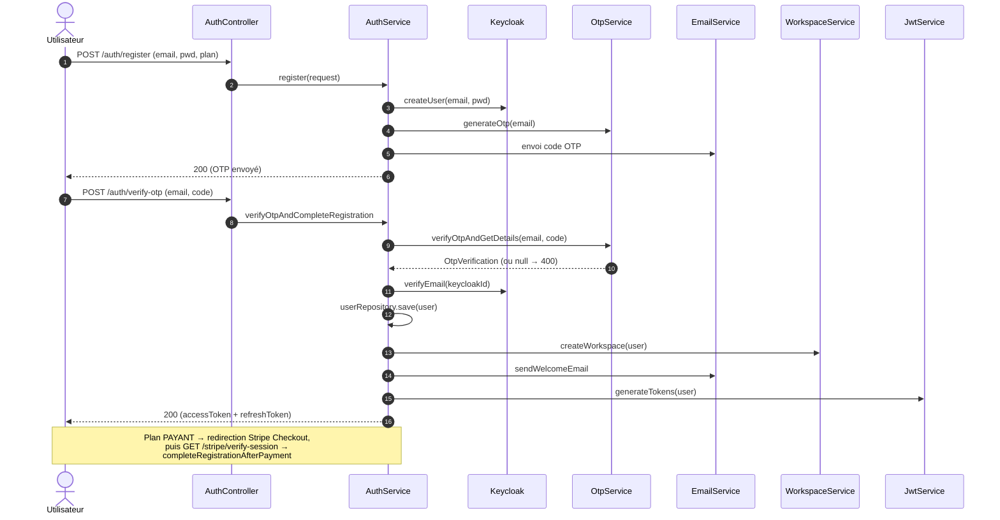
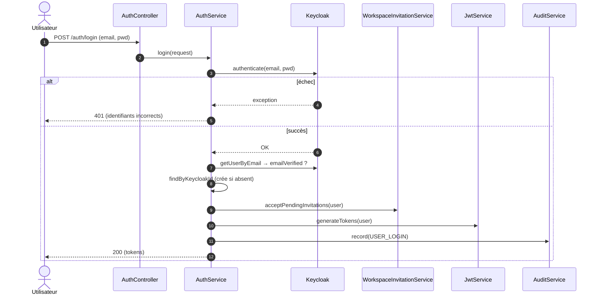
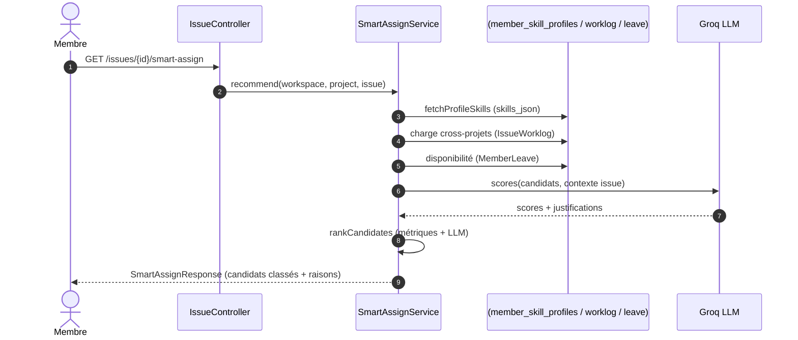
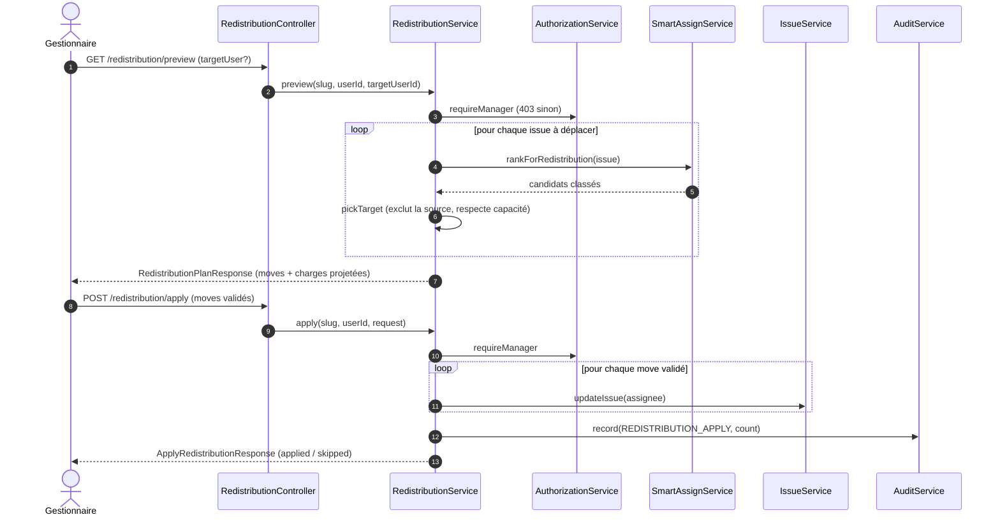
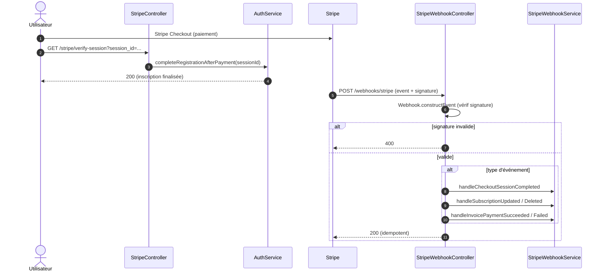
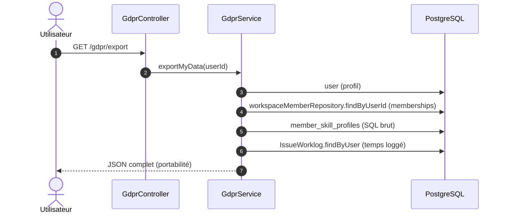

# 🔀 Diagrammes de séquence (UML) — parcours clés

> **But** : décrire les **enchaînements d'appels réels** des parcours critiques, du contrôleur aux
> services et systèmes externes. Chaque flèche correspond à un appel **présent dans le code**
> (`AuthService`, `SmartAssignService`, `RedistributionService`, `GdprService`, `Stripe*`).
> Aucune étape n'est inventée ; les points non implémentés sont notés, pas dessinés.
>
> **Sources** : `core/api/*Controller.java`, `core/service/*Service.java` (backend `tf-api`).

---

## 1. Inscription + OTP + paiement (onboarding)

> ⚠️ **Fait vérifié** : l'**OTP est utilisé à l'INSCRIPTION** (pas au login). L'utilisateur est créé
> dans **Keycloak** dès `register`, l'e-mail est vérifié par OTP, puis (plan payant) via **Stripe
> Checkout**. Preuve : `AuthService.register` / `verifyOtpAndCompleteRegistration` /
> `completeRegistrationAfterPayment`.

---

## 2. Connexion (login)

> ⚠️ Le login **délègue l'authentification à Keycloak** (`keycloakAuthService.authenticate`), pas à un
> hash local. Auto-provisionnement du `User` en DB si absent de Keycloak. Journalisé (`USER_LOGIN`).

---

## 3. Affectation intelligente (smart-assign) — ⭐ cœur CDC

> Scoring d'un candidat = **compétences** (`member_skill_profiles`, SQL brut) × **charge réelle
> cross-projets** (`IssueWorklog`) × **disponibilité** (`MemberLeave`), affiné par un **LLM Groq**
> (`groq.scores()` / `groq.reasons()`). Preuve : `SmartAssignService.recommend` / `rankForRedistribution`.

---

## 4. Redistribution automatique (proposer → valider) — ⭐ cœur CDC

> **Manager only** (`requireManager`). `preview` calcule un **plan** sans rien modifier ; `apply`
> exécute les déplacements validés via `IssueService.updateIssue` (réutilise activité, temps réel,
> notifications) puis **journalise** (`REDISTRIBUTION_APPLY`). Preuve : `RedistributionService`.

---

## 5. Paiement Stripe (abonnement)

> Deux chemins : **Checkout** (souscription → `verify-session` → finalisation) et **Webhooks**
> entrants (source de vérité de l'état d'abonnement), authentifiés par **signature**
> (`Webhook.constructEvent`). Idempotents via `stripe_event_id` unique. Preuve :
> `StripeController` / `StripeWebhookController` / `StripeWebhookService`.

---

## 6. Export RGPD (portabilité — Art. 20)

> `@Transactional` **en écriture** (et non `readOnly`) car l'export **écrit un log d'audit** — un
> `readOnly` provoquait une `SQLSTATE 25006` (corrigé, cf. [[Problemes_Connus]] PC / QF-5). Agrège
> profil + memberships + compétences (SQL brut) + worklogs. Preuve : `GdprService.exportMyData`.

---

## 7. Traçabilité

| Diagramme | Preuve principale |
|---|---|
| Inscription + OTP | `AuthService.register` / `verifyOtpAndCompleteRegistration` |
| Login Keycloak | `AuthService.login` (`keycloakAuthService.authenticate`) |
| Smart-assign | `SmartAssignService.recommend` / `rankForRedistribution` (Groq + SQL) |
| Redistribution | `RedistributionService.preview` / `apply` (`requireManager`, audit) |
| Stripe | `StripeController.verifySession` + `StripeWebhookController` (5 événements) |
| Export RGPD | `GdprService.exportMyData` (`@Transactional`) |

> 🔗 Voir aussi : [[Diagramme_Cas_Usage_UML]] · [[Diagramme_Classes_UML]] · [[Sécurité]] ·
> [[Roadmap_Documentation|plan de production doc]].
