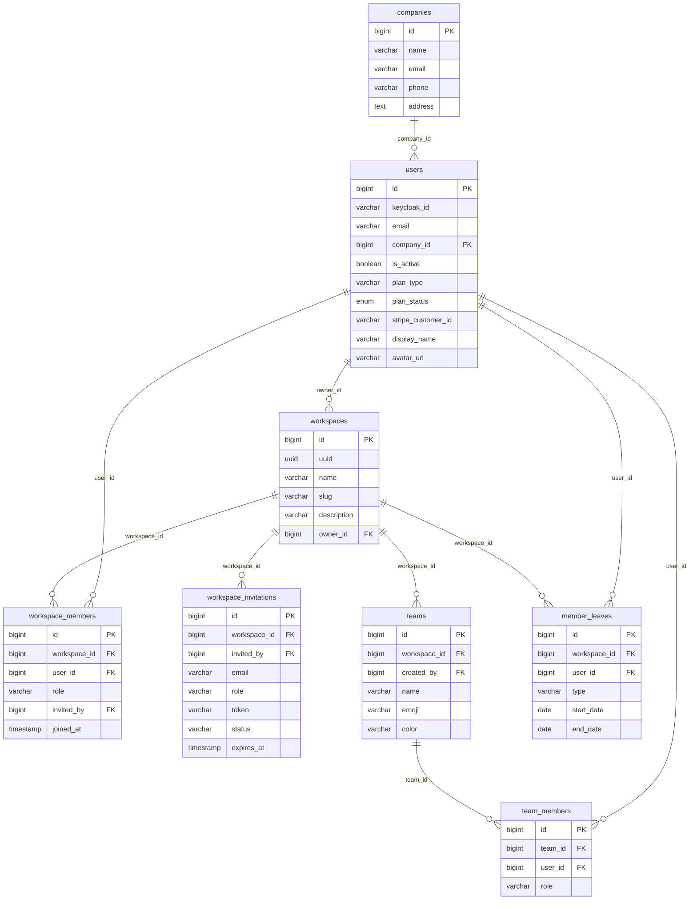
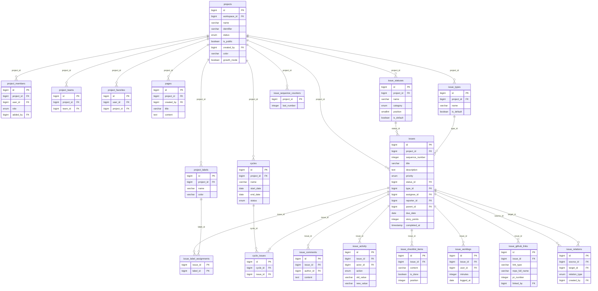
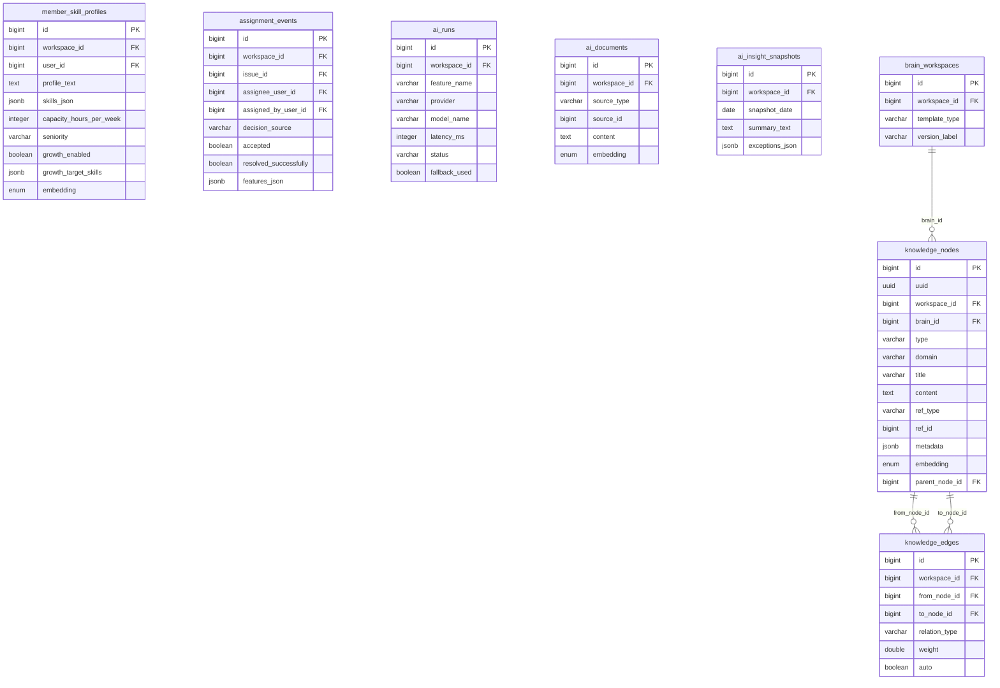
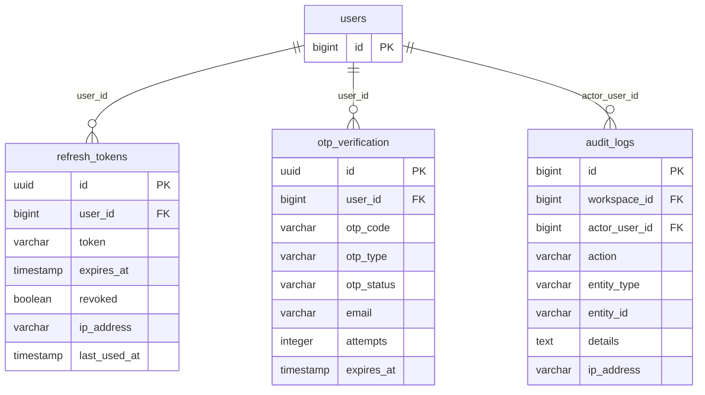
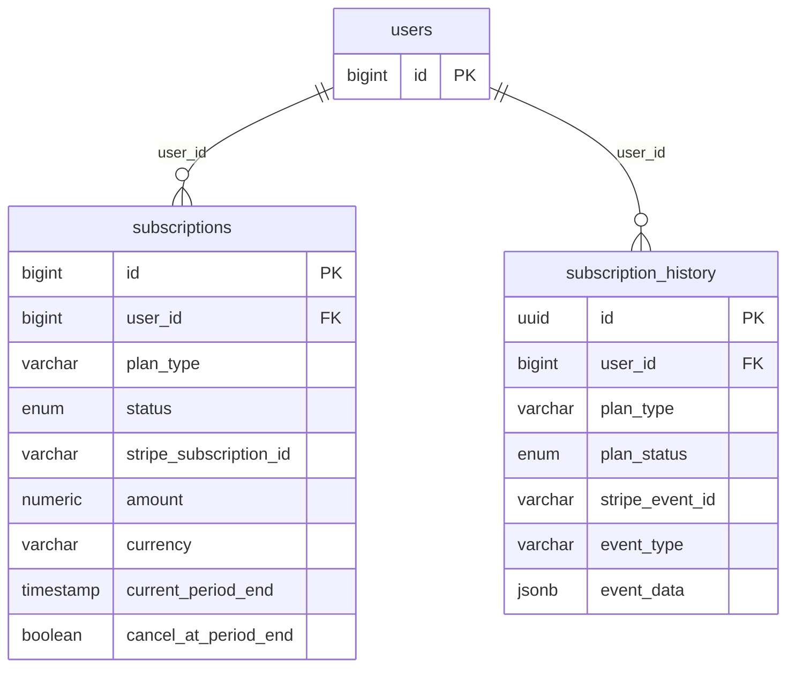
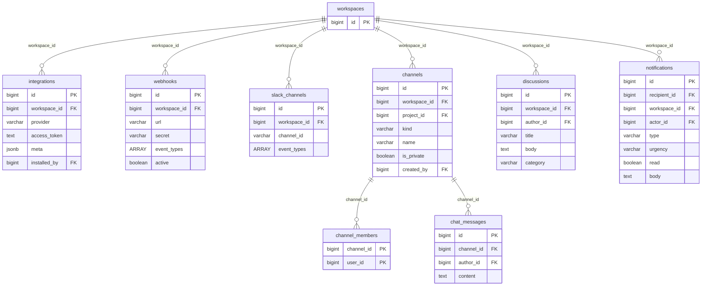
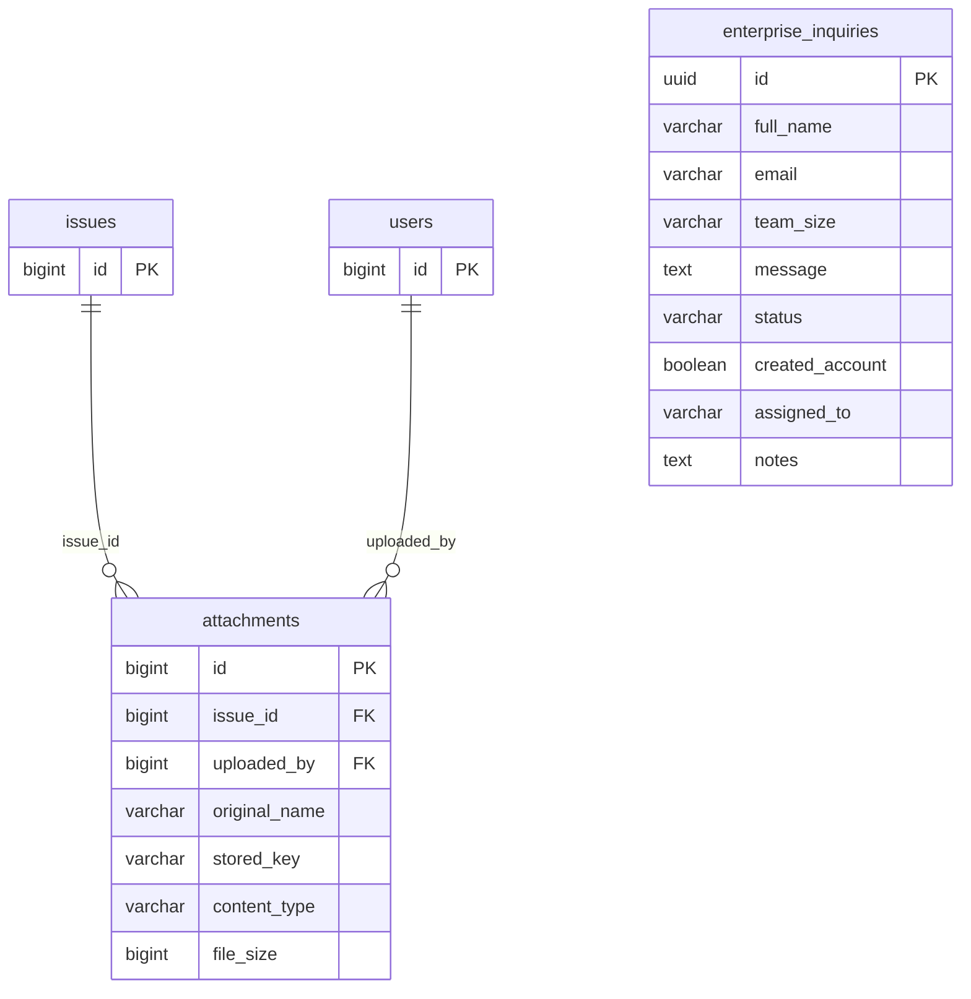

# 🗄️ Modèle de données — MCD / MLD (MERISE)

> **Livrable E8** (dossier de conception, compétences **C8/C9**). Modèle **entité-association** de la base
> TaskForce. **Source de vérité** : le schéma **réel** de PostgreSQL, obtenu par introspection de
> `information_schema` sur la base après application des **migrations Flyway V1→V55** (`ddl-auto=validate`
> confirme l'alignement entités JPA ↔ schéma). **Aucune table/relation inventée** : tout provient du schéma exécuté.

## 1. Périmètre & méthode

- **50 tables** métier (hors `flyway_schema_history`), **483 colonnes**, **94 clés étrangères**.
- **MERISE** : le **MCD** (conceptuel, §3) décrit les entités et associations ; le **MLD** (logique, §4)
  est le schéma relationnel réel (tables, colonnes, PK/FK). Le **MPD** (physique) = PostgreSQL 18 + pgvector.
- Diagrammes en **Mermaid** (rendus nativement dans Obsidian/GitHub) générés depuis le schéma réel.

### Légende
| Notation | Sens |
| --- | --- |
| `PK` | Clé primaire |
| `FK` | Clé étrangère |
| `X ||--o{ Y : "col"` | **1–N** : une ligne de `X` référencée par N lignes de `Y` via `Y.col` |
| `enum` (dans les diagrammes) | Type PostgreSQL `USER-DEFINED` = soit un **enum** métier (`status`, `priority`, `role`, `category`, `action`, `relation_type`, `plan_status`), soit le type **`vector(384)`** (pgvector) pour les colonnes **`embedding`** |
| `jsonb` | Données semi-structurées (métadonnées, skills, features IA) |

> **Choix de présentation** : pour la lisibilité, chaque diagramme n'affiche que les relations **internes
> au domaine**. Deux clés étrangères sont **transversales et omniprésentes** (non redessinées partout) :
> `workspace_id → workspaces.id` (isolation **multi-tenant**) et `*_id → users.id` (auteur/acteur/assigné).

## 2. Conventions transverses (toutes tables)

- **Isolation multi-tenant** : la quasi-totalité des tables porte `workspace_id` → chaque donnée appartient
  à un workspace (frontière de sécurité, cf. `WorkspaceAccessInterceptor`).
- **Audit applicatif** : horodatage `created_at`/`updated_at` (et parfois `created_by`/`updated_by`)
  sur la majorité des entités — **déclaré directement dans l'entité (27 entités)** ou via la superclasse
  `AuditableEntity` (**4 entités** : `BrainWorkspace`, `KnowledgeNode`, `MemberLeave`, `WorkspaceInvitation`).
  **7 tables de jointure/compteurs n'en ont pas** (`workspace_members`, `team_members`, `project_members`,
  `cycle_issues`, `integrations`, `issue_github_links`, `issue_sequence_counters`). Traçabilité des actions
  sensibles = table dédiée `audit_logs` (cf. `07-securite/Sécurité.md` A09).
- **Identité** : `bigint id` auto-incrément en PK ; `uuid` en plus sur certaines entités exposées
  (`workspaces`, `knowledge_nodes`) ou en PK pour les jetons/événements (`refresh_tokens`, `otp_verification`,
  `subscription_history`, `enterprise_inquiries`).
- **RGPD** : le droit à l'effacement est une **anonymisation** (pas de hard-delete) ; `audit_logs.actor_user_id`
  est `ON DELETE SET NULL` pour survivre à l'anonymisation (cf. `GdprService`).
- **IA / sémantique** : colonnes `embedding vector(384)` (pgvector, index HNSW) sur `knowledge_nodes`,
  `ai_documents`, `member_skill_profiles` → recherche de similarité (Smart Assign / Brain OS).

## 3. MCD — vue conceptuelle (domaines)

Le modèle s'organise en **7 domaines** alignés sur les modules du code (`shared ← core ← modules`) :

| Domaine | Entités clés | Rôle |
| --- | --- | --- |
| **IAM & Workspace** | `users`, `workspaces`, `workspace_members`, `teams`, `companies` | Identité, tenants, appartenance, équipes |
| **Projets & Issues** | `projects`, `issues`, `issue_statuses/types/labels`, `cycles`, `pages` | Cœur gestion de projet |
| **IA / Smart Assign / Brain OS** | `member_skill_profiles`, `assignment_events`, `ai_runs`, `knowledge_nodes/edges` | Répartition intelligente + graphe de connaissance |
| **Auth & Sécurité** | `refresh_tokens`, `otp_verification`, `audit_logs` | Sessions, OTP, journal d'audit |
| **Facturation** | `subscriptions`, `subscription_history` | Stripe, plans, historique |
| **Intégrations & Comms** | `integrations`, `webhooks`, `channels`, `notifications` | GitHub/Slack, chat, notifications |
| **GED & Sales** | `attachments`, `enterprise_inquiries` | Pièces jointes (MinIO), leads |

**Entités-pivots** : `workspaces` (racine du tenant) et `users` (acteur universel) — quasiment toutes les
associations pointent vers l'une ou l'autre.

## 4. MLD — schéma relationnel réel (par domaine)
<!-- Diagrammes générés par introspection du schéma réel (information_schema) — ne pas éditer à la main :
     régénérer si le schéma change (nouvelle migration Flyway). -->

### 4.1 IAM & Workspace

**Règles de gestion** : `workspaces.slug` unique (routing) ; `workspace_members(workspace_id,user_id)`
unique (un membre = un rôle OWNER/ADMIN/MEMBER) ; invitations par **token** avec expiration ; les `teams`
regroupent des membres et se relient aux projets (`project_teams`, §4.2).

### 4.2 Projets & Issues (cœur)

**Règles de gestion** :
- **Numérotation par projet** : `issues.sequence_number` + table `issue_sequence_counters(project_id → last_number)`
  → identifiants stables type `WEB-1`, `API-2` (incrément atomique par projet).
- **Statuts/types propres au projet** : `issue_statuses`/`issue_types` sont **par projet** (colonnes/board
  configurables) ; `issue_statuses.category` (enum : BACKLOG/UNSTARTED/STARTED/COMPLETED/CANCELLED) sert aux
  filtres et à la logique (charge ouverte, redistribution).
- **Hiérarchie & liens** : `issues.parent_id` (auto-référence = sous-tâches) ; `issue_relations`
  (`source_id`/`target_id` + `relation_type` : BLOCKS/RELATES_TO…) = graphe entre issues.
- **Labels** : association N-N `issue_label_assignments(issue_id, label_id)` (PK composite).
- **Cycles** (sprints) : N-N `cycle_issues` ; **worklogs** = temps saisi (alimente le suivi + Smart Assign).

### 4.3 IA / Smart Assign / Brain OS

**Règles de gestion** :
- **Smart Assign** : `member_skill_profiles` (compétences JSONB, capacité, séniorité, mode montée en
  compétence) + `assignment_events` (features JSONB + `accepted`/`resolved_successfully`) = signaux du
  scoring ; `ai_runs` = journal des appels IA (latence, provider, fallback) pour observabilité/coût.
- **Brain OS** : `brain_workspaces` (1 brain par workspace) → `knowledge_nodes` (graphe, `embedding`
  vecteur pgvector, `ref_type/ref_id` pointant optionnellement vers issues/projets) reliés par
  `knowledge_edges` (`relation_type`, `auto` = arête dérivée des `[[wikilinks]]`/`#tags`).

### 4.4 Auth & Sécurité

**Règles de gestion** : `refresh_tokens` avec rotation + révocation (`revoked`, purge planifiée) ;
`otp_verification` (code + tentatives + expiration) pour la vérification email/actions sensibles ;
`audit_logs` = journal des actions sensibles (`action` : USER_LOGIN, ROLE_CHANGED, GDPR_EXPORT…),
`actor_user_id` **nullable** (survit à l'anonymisation RGPD).

### 4.5 Facturation

**Règles de gestion** : une `subscriptions` courante par user (état Stripe synchronisé par webhooks) ;
`subscription_history` = trace **idempotente** des événements Stripe (`stripe_event_id` unique →
anti-rejeu, cf. `StripeWebhookService`).

### 4.6 Intégrations & Communications

**Règles de gestion** : `integrations` (OAuth GitHub/Slack, token stocké) ; `webhooks`/`slack_channels`
avec `event_types` (tableau) et `secret` (signature) ; `channels`/`chat_messages`/`discussions` =
socle Comms (⚠️ certaines features **coming-soon**, cf. roadmap) ; `notifications` = inbox temps réel
(STOMP), `read`/`acknowledged`.

### 4.7 GED & Sales

**Règles de gestion** : `attachments` = métadonnées des fichiers (le binaire est dans **MinIO** via
`stored_key`) ; `enterprise_inquiries` = leads commerciaux (les PII libres `message`/`notes` sont
**chiffrées au repos** AES-256-GCM, cf. `07-securite/Sécurité.md`).

## 5. Régénération

Ce document est **dérivé du schéma réel**. En cas de nouvelle migration Flyway, régénérer les diagrammes
depuis `information_schema` (script d'introspection) plutôt que d'éditer à la main — garantit l'absence de
dérive doc ↔ base.

> **Voir aussi** : [[Architecture]] (§persistance), [[Modules]], et le [dossier de conception](../16-memoire-rncp/Bloc1_Conception_Modelisation.md).
