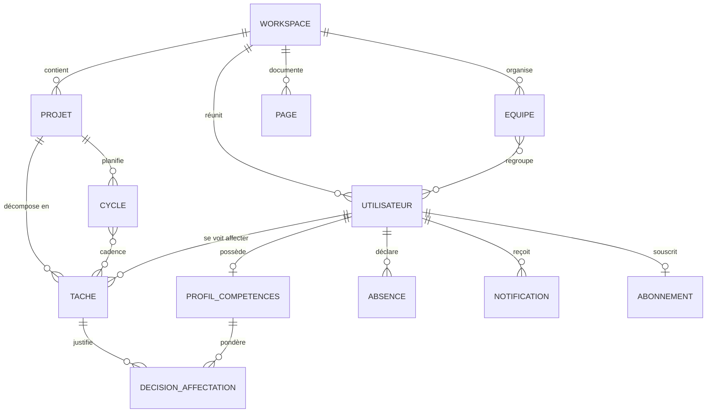
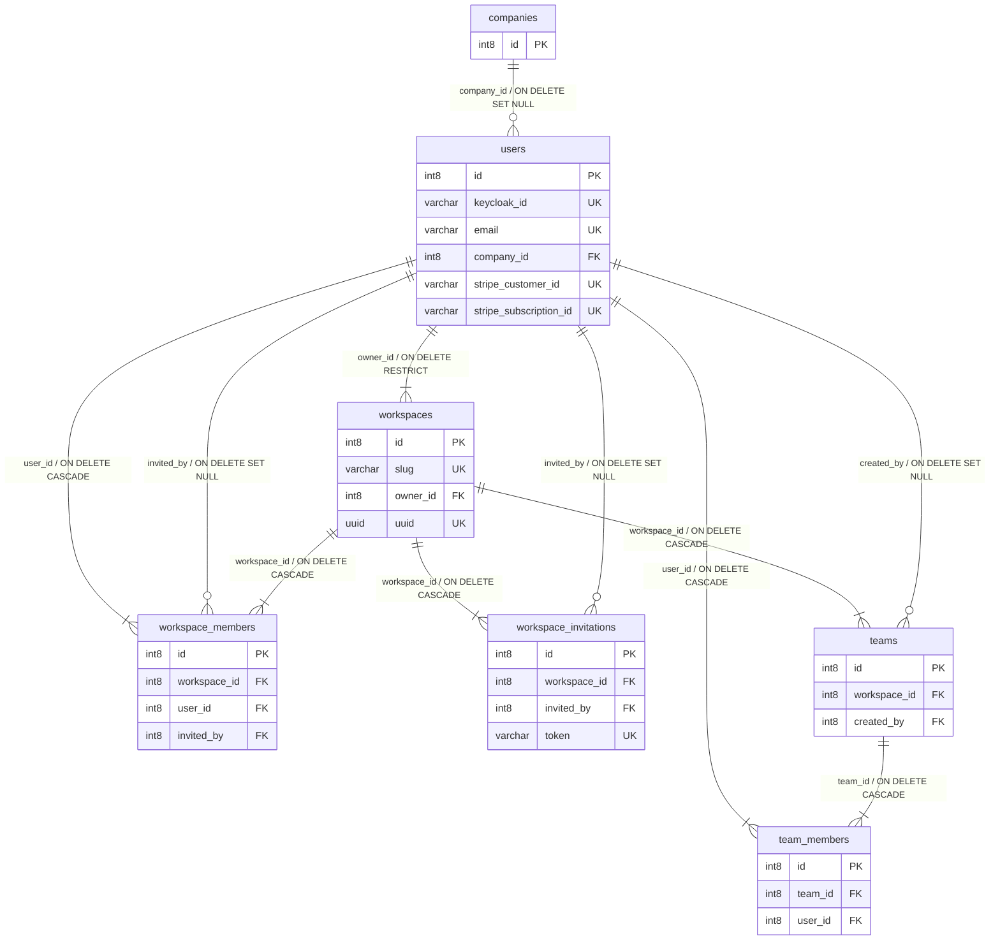
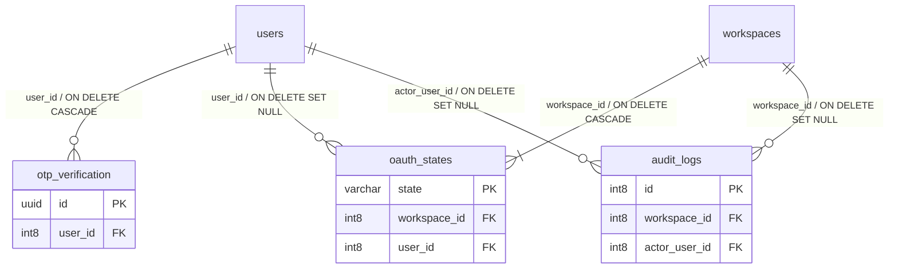
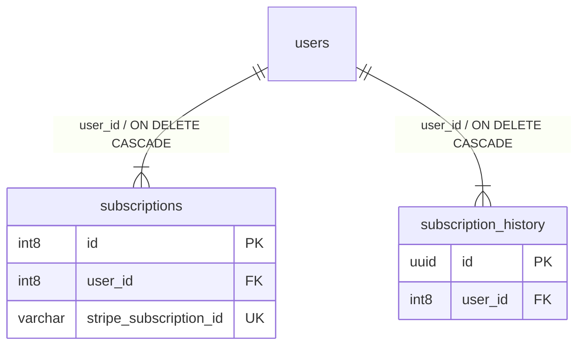
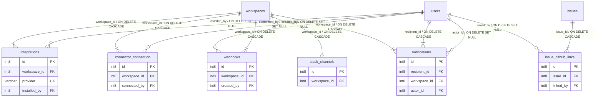
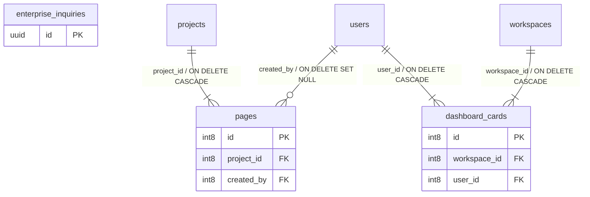

# Modèle de données — MCD / MLD (MERISE)

> **Livrable E8** (dossier de conception, compétences C8 et C9). Modèle entité-association de la
> base TaskForce.
>
> **Ce document est GÉNÉRÉ**, il ne se modifie pas à la main. Source de vérité : le schéma réel de
> PostgreSQL, obtenu par introspection d'`information_schema` après application des migrations
> Flyway. Aucune table ni relation n'est inventée : tout provient du schéma exécuté.
>
> Régénération : `node scripts/generate-schema-docs.mjs` (voir §5).

## 1. Périmètre et méthode

- **55 tables** métier (hors `flyway_schema_history`), **545 colonnes**, **104 clés étrangères**.
- **72 migrations Flyway** appliquées avec succès.
- **MERISE** : le MCD (§3) décrit les domaines et leur poids ; le MLD (§4) est le schéma relationnel
  réel, table par table. Le MPD (physique) est PostgreSQL 18 avec l'extension pgvector.
- Diagrammes en **Mermaid**, rendus nativement par GitHub et Obsidian.

### Légende

| Marque | Signification |
|---|---|
| `PK` | Clé primaire |
| `FK` | Clé étrangère |
| `UK` | Contrainte d'unicité |
| `||--||` | Association obligatoire (colonne non nulle) |
| `||--o{` | Association facultative (colonne nullable) |

Chaque relation porte le nom de sa colonne porteuse et, le cas échéant, son comportement
`ON DELETE`. Ce comportement n'est pas cosmétique : c'est lui qui détermine si la suppression
d'un workspace emporte ses données ou si un journal d'audit survit à l'anonymisation d'un compte.

## 2. Conventions transverses

- Clés primaires techniques (`id`), auto-incrémentées ou UUID selon la table.
- Horodatage `created_at` et `updated_at` sur les entités auditables.
- Isolation multi-tenant : les tables métier portent un rattachement direct ou transitif au workspace.
- Les colonnes portant un secret sont chiffrées applicativement en AES-256-GCM avant persistance.

## 3. MCD — modèle conceptuel

Niveau **conceptuel** : les entités et leurs associations, sans détail technique. Le vocabulaire
est celui du cahier des charges, pas celui des tables, afin que le modèle reste lisible par le
demandeur. Les associations sont nommées par un verbe, conformément à MERISE.



| Entité conceptuelle | Table support | Rôle |
|---|---|---|
| **UTILISATEUR** | `users` | Le collaborateur du cahier des charges |
| **WORKSPACE** | `workspaces` | Espace de travail d'une organisation |
| **EQUIPE** | `teams` | Regroupement de collaborateurs |
| **PROJET** | `projects` | Regroupement de tâches |
| **TACHE** | `issues` | L'unité de travail à répartir |
| **CYCLE** | `cycles` | Itération de travail bornée dans le temps |
| **PROFIL_COMPETENCES** | `member_skill_profiles` | Compétences, séniorité et capacité d'un collaborateur |
| **ABSENCE** | `member_leaves` | Indisponibilité déclarée, entrant dans le calcul de charge |
| **DECISION_AFFECTATION** | `assignment_events` | Trace d'une affectation et de son motif |
| **NOTIFICATION** | `notifications` | Alerte de surcharge ou d'échéance |
| **ABONNEMENT** | `subscriptions` | Plan souscrit par un utilisateur |
| **PAGE** | `pages` | Documentation collaborative |

Chaque entité conceptuelle est adossée à une table réelle, et ce rattachement est **vérifié à la
génération** : un concept sans support en base serait une invention, et le script refuserait de
produire le document.

### Répartition du schéma par domaine

Le passage au logique fait apparaître des tables de liaison, d'historisation et de configuration
qui n'ont pas d'existence conceptuelle. D'où l'écart entre 12 entités et
55 tables. Leur poids relatif dit où se concentre la complexité, et il correspond à
ce qu'on attend : le coeur métier des projets et des tâches est de loin le plus lourd.

| Domaine | Tables |
|---|:--:|
| 4.1 IAM et Workspace | 7 |
| 4.2 Projets et Issues (coeur métier) | 21 |
| 4.3 IA, affectation intelligente et graphe de connaissances | 13 |
| 4.4 Authentification et sécurité | 3 |
| 4.5 Facturation | 2 |
| 4.6 Intégrations et communications | 6 |
| 4.7 Documentation, tableaux de bord et prospects | 3 |
| **Total métier** | **55** |

## 4. MLD — schéma relationnel réel, par domaine

Chaque diagramme ne montre que les **colonnes porteuses de clés** (primaire, étrangère, unicité) :
au-delà, le rendu devient illisible. Le détail exhaustif des colonnes vit dans le
[dictionnaire de données](./Dictionnaire_Donnees.md), généré par le même script.

### 4.1 IAM et Workspace

Le socle multi-tenant. Toute donnée métier est rattachée à un workspace, et l'appartenance à un workspace conditionne l'accès.

**7 tables** : `users`, `workspaces`, `workspace_members`, `workspace_invitations`, `teams`, `team_members`, `companies`.



### 4.2 Projets et Issues (coeur métier)

Le domaine que le cahier des charges décrit : les tâches, leur affectation, la charge et les compétences qui la conditionnent.

**21 tables** : `projects`, `project_members`, `project_teams`, `project_labels`, `project_favorites`, `issues`, `issue_statuses`, `issue_types`, `issue_comments`, `issue_activity`, `issue_checklist_items`, `issue_relations`, `issue_label_assignments`, `issue_worklogs`, `issue_sequence_counters`, `cycles`, `cycle_issues`, `attachments`, `member_leaves`, `member_skill_profiles`, `assignment_events`.

```mermaid
erDiagram
  projects {
    int8 id PK
    int8 workspace_id FK
    varchar identifier UK
    int8 created_by FK
  }
  project_members {
    int8 id PK
    int8 project_id FK
    int8 user_id FK
    int8 added_by FK
  }
  project_teams {
    int8 id PK
    int8 project_id FK
    int8 team_id FK
  }
  project_labels {
    int8 id PK
    int8 project_id FK
    varchar name UK
  }
  project_favorites {
    int8 id PK
    int8 user_id FK
    int8 project_id FK
  }
  issues {
    int8 id PK
    int8 project_id FK
    int4 sequence_number UK
    int8 status_id FK
    int8 type_id FK
    int8 assignee_id FK
    int8 reporter_id FK
    int8 parent_id FK
  }
  issue_statuses {
    int8 id PK
    int8 project_id FK
    varchar name UK
  }
  issue_types {
    int8 id PK
    int8 project_id FK
    varchar name UK
  }
  issue_comments {
    int8 id PK
    int8 issue_id FK
    int8 author_id FK
  }
  issue_activity {
    int8 id PK
    int8 issue_id FK
    int8 actor_id FK
  }
  issue_checklist_items {
    int8 id PK
    int8 issue_id FK
  }
  issue_relations {
    int8 id PK
    int8 source_id FK
    int8 target_id FK
    vector relation_type UK
    int8 created_by FK
  }
  issue_label_assignments {
    int8 issue_id PK
    int8 label_id PK
  }
  issue_worklogs {
    int8 id PK
    int8 issue_id FK
    int8 user_id FK
  }
  issue_sequence_counters {
    int8 project_id PK
  }
  cycles {
    int8 id PK
    int8 project_id FK
    varchar name UK
    int8 created_by FK
  }
  cycle_issues {
    int8 id PK
    int8 cycle_id FK
    int8 issue_id FK
    int8 added_by FK
  }
  attachments {
    int8 id PK
    int8 issue_id FK
    int8 uploaded_by FK
    varchar stored_key UK
  }
  member_leaves {
    int8 id PK
    int8 workspace_id FK
    int8 user_id FK
  }
  member_skill_profiles {
    int8 id PK
    int8 workspace_id FK
    int8 user_id FK
  }
  assignment_events {
    int8 id PK
    int8 workspace_id FK
    int8 issue_id FK
    int8 assignee_user_id FK
    int8 assigned_by_user_id FK
  }
  workspaces ||--|{ projects : "workspace_id / ON DELETE CASCADE"
  users ||--|{ projects : "created_by / ON DELETE RESTRICT"
  projects ||--|{ project_members : "project_id / ON DELETE CASCADE"
  users ||--|{ project_members : "user_id / ON DELETE CASCADE"
  users ||--o{ project_members : "added_by / ON DELETE SET NULL"
  projects ||--|{ project_teams : "project_id / ON DELETE CASCADE"
  teams ||--|{ project_teams : "team_id / ON DELETE CASCADE"
  projects ||--|{ project_labels : "project_id / ON DELETE CASCADE"
  projects ||--|{ project_favorites : "project_id / ON DELETE CASCADE"
  users ||--|{ project_favorites : "user_id / ON DELETE CASCADE"
  issues ||--o{ issues : "parent_id / ON DELETE SET NULL"
  users ||--|{ issues : "reporter_id / ON DELETE RESTRICT"
  projects ||--|{ issues : "project_id / ON DELETE CASCADE"
  issue_statuses ||--|{ issues : "status_id / ON DELETE RESTRICT"
  issue_types ||--o{ issues : "type_id / ON DELETE SET NULL"
  users ||--o{ issues : "assignee_id / ON DELETE SET NULL"
  projects ||--|{ issue_statuses : "project_id / ON DELETE CASCADE"
  projects ||--|{ issue_types : "project_id / ON DELETE CASCADE"
  users ||--|{ issue_comments : "author_id / ON DELETE RESTRICT"
  issues ||--|{ issue_comments : "issue_id / ON DELETE CASCADE"
  issues ||--|{ issue_activity : "issue_id / ON DELETE CASCADE"
  users ||--o{ issue_activity : "actor_id / ON DELETE SET NULL"
  issues ||--|{ issue_checklist_items : "issue_id / ON DELETE CASCADE"
  users ||--|{ issue_relations : "created_by / ON DELETE RESTRICT"
  issues ||--|{ issue_relations : "source_id / ON DELETE CASCADE"
  issues ||--|{ issue_relations : "target_id / ON DELETE CASCADE"
  issues ||--|{ issue_label_assignments : "issue_id / ON DELETE CASCADE"
  project_labels ||--|{ issue_label_assignments : "label_id / ON DELETE CASCADE"
  users ||--|{ issue_worklogs : "user_id / ON DELETE CASCADE"
  issues ||--|{ issue_worklogs : "issue_id / ON DELETE CASCADE"
  projects ||--|{ issue_sequence_counters : "project_id / ON DELETE CASCADE"
  projects ||--|{ cycles : "project_id / ON DELETE CASCADE"
  users ||--|{ cycles : "created_by / ON DELETE RESTRICT"
  users ||--|{ cycle_issues : "added_by / ON DELETE RESTRICT"
  issues ||--|{ cycle_issues : "issue_id / ON DELETE CASCADE"
  cycles ||--|{ cycle_issues : "cycle_id / ON DELETE CASCADE"
  users ||--o{ attachments : "uploaded_by / ON DELETE SET NULL"
  issues ||--|{ attachments : "issue_id / ON DELETE CASCADE"
  workspaces ||--|{ member_leaves : "workspace_id / ON DELETE CASCADE"
  users ||--|{ member_leaves : "user_id / ON DELETE CASCADE"
  workspaces ||--|{ member_skill_profiles : "workspace_id / ON DELETE CASCADE"
  users ||--|{ member_skill_profiles : "user_id / ON DELETE CASCADE"
  workspaces ||--|{ assignment_events : "workspace_id / ON DELETE CASCADE"
  issues ||--o{ assignment_events : "issue_id / ON DELETE SET NULL"
  users ||--o{ assignment_events : "assigned_by_user_id / ON DELETE SET NULL"
  users ||--|{ assignment_events : "assignee_user_id / ON DELETE RESTRICT"
```



### 4.3 IA, affectation intelligente et graphe de connaissances

Le moteur d'affectation et sa mémoire. `knowledge_nodes` porte les vecteurs d'embedding utilisés par la recherche sémantique.

**13 tables** : `ai_conversation`, `ai_message`, `ai_documents`, `ai_runs`, `ai_token_usage`, `ai_insight_snapshots`, `brain_workspaces`, `knowledge_nodes`, `knowledge_edges`, `analysis_job`, `decision_brief`, `decision_priority`, `saved_chart`.

```mermaid
erDiagram
  ai_conversation {
    int8 id PK
    int8 workspace_id FK
    int8 user_id FK
  }
  ai_message {
    int8 id PK
    int8 conversation_id FK
  }
  ai_documents {
    int8 id PK
    int8 workspace_id FK
    varchar source_type UK
    int8 source_id UK
    int4 chunk_index UK
  }
  ai_runs {
    int8 id PK
    int8 workspace_id FK
  }
  ai_token_usage {
    int8 id PK
    int8 account_id FK
  }
  ai_insight_snapshots {
    int8 id PK
    int8 workspace_id FK
    date snapshot_date UK
  }
  brain_workspaces {
    int8 id PK
    int8 workspace_id FK
  }
  knowledge_nodes {
    int8 id PK
    uuid uuid UK
    int8 workspace_id FK
    int8 brain_id FK
    int8 parent_node_id FK
  }
  knowledge_edges {
    int8 id PK
    int8 workspace_id FK
    int8 from_node_id FK
    int8 to_node_id FK
    varchar relation_type UK
  }
  analysis_job {
    int8 id PK
    int8 workspace_id FK
    int8 project_id FK
    int8 user_id FK
    int8 brief_id FK
  }
  decision_brief {
    int8 id PK
    int8 workspace_id FK
    int8 project_id FK
  }
  decision_priority {
    int8 id PK
    int8 brief_id FK
    int8 issue_id FK
  }
  saved_chart {
    int8 id PK
    int8 workspace_id FK
    int8 created_by_id FK
  }
  workspaces ||--|{ ai_conversation : "workspace_id / ON DELETE CASCADE"
  users ||--|{ ai_conversation : "user_id / ON DELETE CASCADE"
  ai_conversation ||--|{ ai_message : "conversation_id / ON DELETE CASCADE"
  workspaces ||--|{ ai_documents : "workspace_id / ON DELETE CASCADE"
  workspaces ||--|{ ai_runs : "workspace_id / ON DELETE CASCADE"
  users ||--|{ ai_token_usage : "account_id / ON DELETE CASCADE"
  workspaces ||--|{ ai_insight_snapshots : "workspace_id / ON DELETE CASCADE"
  workspaces ||--|{ brain_workspaces : "workspace_id / ON DELETE CASCADE"
  workspaces ||--|{ knowledge_nodes : "workspace_id / ON DELETE CASCADE"
  knowledge_nodes ||--o{ knowledge_nodes : "parent_node_id / ON DELETE SET NULL"
  brain_workspaces ||--o{ knowledge_nodes : "brain_id / ON DELETE CASCADE"
  workspaces ||--|{ knowledge_edges : "workspace_id / ON DELETE CASCADE"
  knowledge_nodes ||--|{ knowledge_edges : "to_node_id / ON DELETE CASCADE"
  knowledge_nodes ||--|{ knowledge_edges : "from_node_id / ON DELETE CASCADE"
  workspaces ||--|{ analysis_job : "workspace_id / ON DELETE CASCADE"
  projects ||--|{ analysis_job : "project_id / ON DELETE CASCADE"
  users ||--o{ analysis_job : "user_id / ON DELETE SET NULL"
  decision_brief ||--o{ analysis_job : "brief_id / ON DELETE SET NULL"
  projects ||--|{ decision_brief : "project_id / ON DELETE CASCADE"
  workspaces ||--|{ decision_brief : "workspace_id / ON DELETE CASCADE"
  decision_brief ||--|{ decision_priority : "brief_id / ON DELETE CASCADE"
  issues ||--o{ decision_priority : "issue_id / ON DELETE SET NULL"
  users ||--o{ saved_chart : "created_by_id / ON DELETE SET NULL"
  workspaces ||--|{ saved_chart : "workspace_id / ON DELETE CASCADE"
```



### 4.4 Authentification et sécurité

L'identité est déléguée à Keycloak. Ne subsistent ici que les données propres à l'application : codes à usage unique, jetons anti-CSRF, journal d'audit.

**3 tables** : `otp_verification`, `oauth_states`, `audit_logs`.



### 4.5 Facturation

Abonnements et historique. Aucune donnée de carte n'est stockée : la facturation est déléguée au prestataire de paiement.

**2 tables** : `subscriptions`, `subscription_history`.



### 4.6 Intégrations et communications

Connecteurs externes et notifications. Les identifiants de connecteurs sont chiffrés en base (AES-256-GCM).

**6 tables** : `integrations`, `connector_connection`, `webhooks`, `slack_channels`, `issue_github_links`, `notifications`.



### 4.7 Documentation, tableaux de bord et prospects

Pages de documentation collaborative, composition du tableau de bord par utilisateur, et demandes commerciales.

**3 tables** : `pages`, `dashboard_cards`, `enterprise_inquiries`.



## 5. Régénération

```bash
node scripts/generate-schema-docs.mjs
```

Le script interroge la base de développement en cours d'exécution et réécrit ce document ainsi que
le dictionnaire de données. Il **échoue volontairement** si une table de la base n'est classée dans
aucun domaine, ou si un domaine référence une table disparue.

Ce blocage est la leçon du 23/07/2026 : la consigne « régénérer plutôt qu'éditer à la main »
figurait déjà ici, mais **aucun script ne l'accompagnait**. Entre le 05/07 et le 23/07,
10 tables ont été ajoutées sans jamais apparaître dans ces documents, une table supprimée y est
restée, et tous les totaux étaient faux. Une consigne sans outil dérive.

Variante non destructive, utilisable en intégration continue :

```bash
node scripts/generate-schema-docs.mjs --check
```

> Voir aussi : [[Dictionnaire_Donnees]] · [[Architecture]] · [[Modules]] · [[Diagramme_Classes_UML]].
