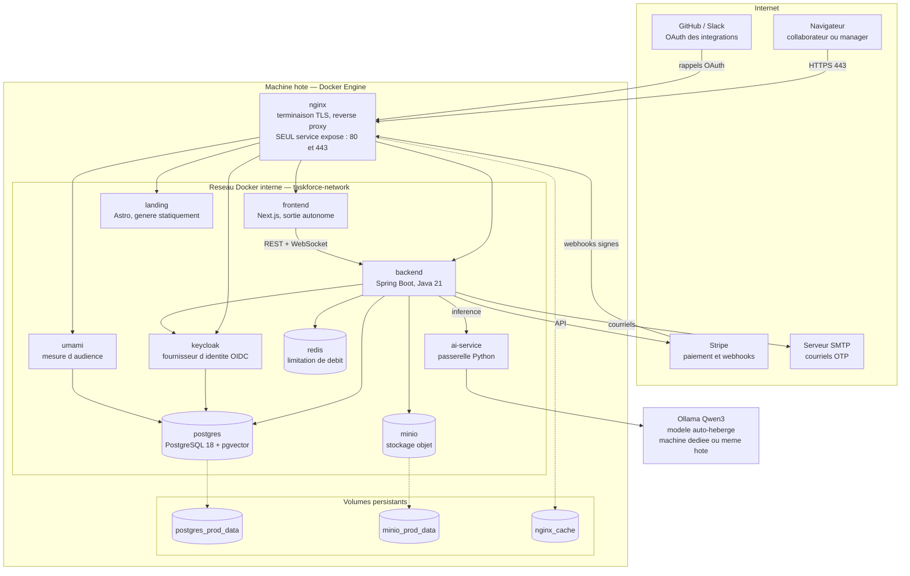

# Diagramme de déploiement

> Ce document décrit la **topologie de déploiement** de TaskForce : les nœuds, les artefacts qu'ils
> exécutent, les canaux de communication et la surface d'exposition.
>
> **Il n'existait pas** avant le 23/07/2026, alors que le critère « diagramme de déploiement
> formalisé » était coché dans la grille d'évaluation. Le critère a été décoché, puis ce document
> produit.

> ⚠️ **Ce document n'est PAS le livrable E21 — étiquette corrigée le 24/07/2026.**
>
> Vérifié à la source (note pédagogique, pages 7 et 8) : **E21 à E29 sont produits pendant la mise en
> situation professionnelle du 5 octobre 2026**, épreuve de 5 heures conduite **sur une application
> web fournie par l'école**, pas sur le projet fil rouge. E21 y désigne précisément « le choix d'une
> solution d'hébergement de type cloud adaptée à l'application, formalisée dans un livrable écrit et
> argumenté ». Ce livrable sera donc rédigé le jour de l'épreuve, sur une autre application.
>
> S'ajoute une seconde raison, indépendante : « **le dossier de validation porte sur les 3 premiers
> blocs de compétences** » (page 2). Le bloc 4 est hors du dossier.
>
> **Ce document garde deux usages réels**, et ce sont eux qu'il faut invoquer :
> 1. **Pièce du dossier pour les blocs 1 à 3** — il démontre la compréhension de l'architecture
>    déployée, ce qui relève de la conception et de la maîtrise technique, pas du bloc 4.
> 2. **Répétition de l'épreuve du 5 octobre** — raisonner une topologie, une surface d'exposition et
>    un choix d'hébergement argumenté est exactement ce qui sera demandé, en temps limité.
>
> Le corpus entier présentait ce document comme « livrable E21 » (`Roadmap_Backlog`,
> `Strategie_Documentation`, `Catalogue_Documentation`, `Bloc4_Deploiement_Production`). Ces mentions
> restent valables **comme repères de préparation** au bloc 4, à condition de ne pas les lire comme
> des livrables du dossier.

## 1. Ce que ce diagramme dit, et ce qu'il ne dit pas

La topologie est **entièrement déterminée** par `docker-compose.prod.yml` : dix services, un réseau
interne, trois volumes persistants. Elle ne dépend pas de l'hébergeur retenu.

Le choix d'hébergement, lui, n'est **pas tranché** (voir §4). Cette distinction est volontaire : le
fournisseur change la machine hôte, il ne change ni le nombre de conteneurs, ni les flux, ni la
surface d'exposition. Documenter la topologie n'exigeait donc pas d'attendre la décision, et c'est
ce qui a été fait ici.

> ⚠️ **Aucun déploiement n'est en service à ce jour.** Ce document décrit une cible **prête et
> vérifiable dans le dépôt**, pas une installation en fonctionnement. La configuration nginx a été
> validée par un binaire nginx réel, mais aucun domaine n'est réservé et aucun certificat n'est émis.

## 2. Topologie

## 3. Lecture du diagramme

**Un seul point d'entrée.** `nginx` est le **seul service publiant des ports sur l'hôte** (80 et
443). Tous les autres ne sont joignables que par le réseau Docker interne, par nom de service. Cela
signifie qu'un attaquant ne peut atteindre ni la base, ni Keycloak, ni le stockage objet, ni la
console de mesure d'audience directement : il n'existe pas de route réseau vers eux.

**Trois volumes seulement.** Ce sont les seuls états à sauvegarder : la base, le stockage objet, et
le cache du proxy. Tout le reste est reconstructible depuis les images. Cela simplifie la
sauvegarde autant que la restauration.

**Le modèle de langage est le seul nœud potentiellement séparé.** Les modèles pèsent environ 15 Go
et réclament de la mémoire vive en quantité ; ils peuvent donc vivre sur une machine dédiée. Le
diagramme le place volontairement hors du groupe pour cette raison. Mais il reste **dans le
périmètre maîtrisé** : aucun contenu de travail n'est envoyé à un fournisseur tiers, ce qui est
l'argument central du registre des traitements.

**Les flux sortants sont limités et nommés** : Stripe pour la facturation, GitHub et Slack pour les
intégrations, un serveur SMTP pour les courriels. Aucun autre appel ne quitte l'hôte.

## 4. Choix d'hébergement, non tranché

Deux options sont documentées dans [[Strategie_Hebergement]]. Le choix est **en attente**.

| Critère | Option A, machine virtuelle de l'école | Option B, hébergeur infogéré |
|---|---|---|
| Coût | nul pour le projet | de l'ordre de la centaine d'euros par an |
| Contrôle | total, administration par SSH | limité au modèle du fournisseur |
| Adresse publique | ⚠️ **aucune** | oui |
| Certificat TLS | impossible sans adresse publique | automatique |
| Convient à la démonstration | oui, en local ou par tunnel | oui |

> ⚠️ **Le point bloquant de l'option A.** La machine virtuelle de l'école est derrière une
> traduction d'adresses, **sans entrée possible depuis l'extérieur**. Une application qui y serait
> déployée n'aurait ni adresse publique ni certificat valide, ce qui rendrait la compétence C28
> (domaine, DNS, certificats) **non démontrable**. C'est le critère décisif du choix, et il doit
> être posé comme tel plutôt que découvert au déploiement.

## 5. Dimensionnement

Le détail par service figure dans [[Strategie_Hebergement]]. En synthèse, hors modèle de langage,
l'ensemble tient sur une machine modeste : les postes dominants sont PostgreSQL et la machine
virtuelle Java du backend. Le modèle de langage, lui, change d'ordre de grandeur et justifie à lui
seul l'éventuelle machine dédiée évoquée au §3.

## 6. Ce qui reste à faire au déploiement

1. Réserver le domaine et déclarer la zone (enregistrements A, et MX avec SPF, DKIM et DMARC pour les courriels OTP émis par Keycloak).
2. Émettre les certificats TLS et automatiser leur renouvellement.
3. Enregistrer les URL de rappel OAuth de production dans les consoles GitHub et Slack.
4. Renseigner les variables de `.env.prod` à partir de `.env.prod.example`.
5. Créer la base de la mesure d'audience si le volume PostgreSQL préexiste (les scripts d'initialisation ne s'exécutent qu'à la première création du volume).

---

> Voir aussi : [[Strategie_Hebergement]] · [[Architecture_C4]] · [[Observabilite]] ·
> [[PS_PCA_PRA]] (sauvegarde et restauration des trois volumes).
