<!--
  GOUVERNANCE : ce document obéit à [[_REGLES_Dossier_Projet]]. Le relire avant chaque session.
  STATUT : squelette. Les blocs de commentaire HTML sont des consignes de rédaction, non exportées
  dans le PDF. Convention figures : [FIGURE N : description | source].
  RÉCIT (Duarte) : les 4 PARTIES sont les mouvements du récit (problème, choix, construction, recul).
  Chaque section ouvre sur la tension traitée et ferme sur ce que le choix a changé.
  SOMMAIRE : 3 niveaux numérotés max (chapitre.section.sous-section), regroupés sous parties (bannières).
  Sous-sections seulement là où une section se scinde vraiment (ex. 3.5, 5.5, 6.5).
-->

# Dossier de validation — TaskForce

Certification **Développeur Full Stack**, RNCP38606, niveau 6. Metz Numeric School, 2025-2026.
Projet fil rouge : **TaskForce**, outil de répartition dynamique des tâches.

---

## Sommaire

<!-- Version de travail, à régénérer. Parties = bannières de récit, non numérotées. -->

**Introduction**

**Partie I — Comprendre le problème et cadrer le projet**
- 1. Contexte, demande et cadrage
  - 1.1 Le problème métier et la reformulation de la demande
  - 1.2 Préconisations et parti pris technique
  - 1.3 Caractéristiques du projet : public, sécurité, SEO, délais, budget
  - 1.4 Périmètre livré, acteurs et rôles
  - 1.5 Enjeu économique, valeur et modèle d'affaires
- 2. Conduite de projet
  - 2.1 Méthode agile et rituels
  - 2.2 Environnement de développement collaboratif
  - 2.3 Planification, budget prévisionnel et risques
  - 2.4 Documentation vivante et suivi de projet (Brain OS)
  - 2.5 Veille technologique et influence sur les décisions

**Partie II — Concevoir : des choix aux modèles**
- 3. Choix technologiques et arbitrages
  - 3.1 Démarche de choix et contraintes
  - 3.2 Étude comparative back-end et choix retenu
  - 3.3 Étude comparative front-end et choix retenu
  - 3.4 Base de données et choix retenu
  - 3.5 L'écart au cahier des charges : un choix assumé
    - 3.5.1 Ce que le cahier des charges demande
    - 3.5.2 Ce que j'ai choisi et pourquoi
    - 3.5.3 Conformité réelle et écart maîtrisé
- 4. Conception et modélisation
  - 4.1 Wireframes et parcours
  - 4.2 Du besoin au dossier de conception et cas d'usage
  - 4.3 Modélisation UML : classes, séquences, états
  - 4.4 Modèle de données MCD/MLD et persistance
  - 4.5 Architecture logicielle : C4, modules, multi-tenant

**Partie III — Construire le produit**
- 5. Développement du front-end
  - 5.1 Interface et charte graphique
  - 5.2 UX, parcours et accessibilité
  - 5.3 Qualité, sécurité et écoconception du code front
  - 5.4 Consommation sécurisée de l'API
  - 5.5 Tests du front-end
    - 5.5.1 Périmètre et méthode
    - 5.5.2 Résultats et couverture
    - 5.5.3 Réserve assumée sur le périmètre
  - 5.6 Industrialisation du front
  - 5.7 Performances et SEO
- 6. Développement du back-end
  - 6.1 Persistance et sécurité en profondeur
  - 6.2 Qualité, sécurité et écoconception du code back
  - 6.3 Paiement et monétisation
  - 6.4 API REST sécurisée
  - 6.5 Le moteur IA et le smart-assign
    - 6.5.1 Le problème d'affectation
    - 6.5.2 Le pré-filtre et le scoring
    - 6.5.3 Repli et garde-fous
    - 6.5.4 Vers une architecture cible
  - 6.6 Tests du back-end
  - 6.7 Industrialisation du back

**Partie IV — Sécuriser, industrialiser et prendre du recul**
- 7. Sécurité et conformité RGPD
  - 7.1 Posture de sécurité
  - 7.2 RGPD de TaskForce
  - 7.3 Le cas RGPD externe
- 8. Industrialisation, déploiement et supervision
  - 8.1 Documentation technique, API et base de connaissances
  - 8.2 Intégration continue et déploiement automatisé
  - 8.3 Hébergement et production
  - 8.4 Supervision, journalisation, observabilité
- 9. Distance critique et perspectives
  - 9.1 Innovations
  - 9.2 Périmètre maîtrisé et axes de consolidation
  - 9.3 Préconisations et évolutions

**Conclusion**

**Annexes**

---

<!--
  PLAN DES FIGURES ET TABLEAUX (document de travail, deviendra la "Liste des figures et tableaux").
  Le corpus fournit déjà l'essentiel ; le dossier doit être dense en schémas. Cible : au moins une
  figure ou un tableau par chapitre lourd. Réserve disponible et affectation :
    1.3 / 2.3  : Gantt (Gantt_Planning), PERT (Diagramme_PERT), matrice des risques + organigramme +
                 RACI + SMART (assets/diagrammes/*.drawio.png, RACI xlsx/pdf)
    3.2-3.4    : 3 TABLEAUX comparatifs (back / front / BDD) avec colonne "choix retenu"
    4.1        : wireframes TaskForce (Wireframes_Annotes ; NE PAS prendre les PNG TaskFlow AI)
    4.2        : diagramme de cas d'usage (Diagramme_Cas_Usage_UML)
    4.3        : diagramme de classes (38 entités) + séquence smart-assign (Diagramme_Classes/Sequence_UML)
    4.4        : MCD/MLD MERISE (Modele_Donnees_MCD_MLD) + extrait dictionnaire (Dictionnaire_Donnees)
    4.5        : C4 contexte/conteneurs/composants + carte des modules (Architecture_C4, Modules)
    5.1-5.2    : palette + tokens du design system, captures d'écran, résultat axe-core
    5.7        : scores Lighthouse SEO (accueil + 4 pages)
    6.4        : capture Swagger / OpenAPI ; 6.5 : schéma pré-filtre + scoring smart-assign ; 6.6 : JaCoCo
    7.1        : DFD STRIDE (Threat_Model_STRIDE) ; 7.2 : parcours droits RGPD
    8.2        : chaîne CI/CD (Pipeline_CICD) ; 8.3 : diagramme de déploiement ; 8.4 : SigNoz + alertes
  Convention : numérotation continue [FIGURE N] / [TABLEAU N], légende + source sous chaque visuel.
  Les diagrammes Mermaid seront exportés en image nette pour le PDF ; les captures seront prises par Pierre.
-->

## Avant-propos

Ce dossier porte sur TaskForce, le projet fil rouge de ma formation de développeur full-stack. Il a été conduit avec une intention simple à énoncer, plus exigeante à tenir : traiter le sujet comme un produit, et non comme un exercice.

La distinction n'est pas qu'une posture. Un exercice se termine quand il est rendu ; un produit commence quand il est utilisé. Un exercice cherche à satisfaire un correcteur ; un produit cherche à trouver sa place dans un usage réel. Résoudre un problème n'en est que la brique technique : le produit est tout ce qui l'entoure et le rend adoptable, une réponse cohérente avec un marché et des besoins concrets. De cette différence découlent des arbitrages qu'un devoir permet d'éviter : choisir ce que l'on ne fera pas, sécuriser au lieu de se contenter de fonctionner, tenir un délai qui ne se négocie pas, préférer une base que l'on pourra reprendre à une démonstration jetable. Un produit ne se mesure pas au nombre de ses fonctionnalités, mais à la valeur qu'il rend et à la confiance qu'il inspire.

Si j'ai retenu ce parti, c'est d'abord parce que le problème est réel : je l'ai rencontré sur le terrain, au fil de mes expériences professionnelles. C'est ensuite qu'une fonctionnalité isolée ne fait pas un produit : prise seule, la répartition des tâches tiendrait dans un script. Ce qui fait le produit, ce sont les utilisateurs qu'il sert, les objectifs qu'il poursuit et la cohérence qui les tient ensemble. C'est cette cohérence que le cahier des charges appelait, et sur laquelle s'est construite une vision plus large, appelée à se prolonger au-delà de cette première version.

Le dossier suit cette même ligne : il expose le problème avant la solution, la raison avant la décision, et laisse au lecteur le soin d'apprécier ce que ces choix ont produit.

## Remerciements

Je tiens tout d'abord à remercier Metz Numeric School et son équipe pédagogique, dont l'accompagnement et le cadre offert par le projet fil rouge m'ont permis de mener un travail complet, de sa conception à sa soutenance, dans des conditions proches de celles d'un produit réel. Mes remerciements vont plus particulièrement aux formateurs qui ont suivi ce projet et dont les retours exigeants en ont élevé le niveau.

J'adresse aussi ma reconnaissance à Jonathan Naal, de l'EPF Paris, avec qui j'ai travaillé chez TechGuys, à Montréal, et dont les échanges autour de ce projet et de sa vision m'ont beaucoup apporté. Ils m'ont offert une prise de recul et un angle d'approche résolument tournés vers le produit, dont plusieurs des idées présentées dans ce dossier sont directement issues.

Je pense enfin à celles et ceux qui ont testé TaskForce au fil de son développement : la diversité de leurs profils et de leurs approches m'a aidé à prendre de la hauteur, à mieux mesurer les manques du produit du point de vue de la valeur qu'il rend, et à repérer des frictions que je ne voyais plus, en particulier sur l'expérience utilisateur et le design.

Mes derniers remerciements s'adressent aux membres du jury, pour le temps qu'ils consacrent à la lecture de ce dossier et à sa soutenance, et pour les retours que leur expérience saura m'apporter, que j'attends avec intérêt.

## Résumé du projet

TaskForce est un logiciel de gestion de projet multi-locataire conçu pour outiller une décision que les outils du marché laissent à la charge des responsables : l'affectation des tâches. Là où les gestionnaires de tickets se contentent de suivre l'état du travail, TaskForce propose au responsable la personne la mieux placée pour une tâche, à partir de ses compétences, de sa charge et de ses disponibilités, puis le laisse valider ou ajuster.

Le produit a été développé de bout en bout : une interface Next.js et React, accessible et testée ; un back-end Java et Spring Boot exposant une API REST sécurisée par Keycloak ; une base de données PostgreSQL. L'isolation stricte des données entre organisations, la monétisation par abonnement et un moteur de recommandation affiné par un modèle de langage complètent ce socle.

La démarche a été celle d'un produit, non d'un exercice : des choix techniques argumentés et pleinement assumés, une sécurité pensée dès la conception, et une qualité mesurée plutôt qu'affirmée, avec une couverture de tests significative sur le front comme sur le back.

Ce dossier retrace ce cheminement, du problème métier au produit livré, et en assume les limites autant que les résultats.

### Abstract

TaskForce is a multi-tenant project management application designed to support a decision that existing tools leave to managers: task assignment. Where issue trackers merely follow the state of work, TaskForce suggests to the manager the person best suited to a task, based on their skills, current workload and availability, then leaves the manager to confirm or adjust.

The product was built end to end: a Next.js and React interface, accessible and tested; a Java and Spring Boot back-end exposing a REST API secured with Keycloak; a PostgreSQL database. Strict data isolation between organisations, subscription-based monetisation and a recommendation engine refined by a language model complete this foundation.

The approach was that of a product, not an exercise: reasoned technical choices, including a deliberate departure from the specification, security considered from the design stage, and quality that is measured rather than asserted, with significant test coverage on both the front-end and the back-end.

This report retraces that path, from the business problem to the delivered product, and owns its limitations as much as its results.

**Mots-clés :** répartition des tâches, gestion de projet, SaaS multi-locataire, aide à la décision, intelligence artificielle, développement full-stack.

**Keywords:** task assignment, project management, multi-tenant SaaS, decision support, artificial intelligence, full-stack development.

## Liste des abréviations

| Sigle | Signification |
|---|---|
| ADR | Architecture Decision Record, enregistrement de décision d'architecture |
| AES | Advanced Encryption Standard, chiffrement symétrique |
| API | Application Programming Interface, interface de programmation applicative |
| CDC | Cahier des charges |
| CI/CD | Continuous Integration / Continuous Delivery, intégration et livraison continues |
| CNIL | Commission Nationale de l'Informatique et des Libertés |
| CRUD | Create, Read, Update, Delete |
| CSP | Content Security Policy, politique de sécurité du contenu || CSS | Cascading Style Sheets, feuilles de style |
| DAST | Dynamic Application Security Testing |
| DFS | Développeur Full Stack |
| DNS | Domain Name System |
| DPIA | Data Protection Impact Assessment, analyse d'impact (AIPD) |
| DTO | Data Transfer Object, objet de transfert de données |
| E2E | End-to-End, de bout en bout |
| FK | Foreign Key, clé étrangère |
| GAMP | Good Automated Manufacturing Practice, référentiel qualité des secteurs réglementés |
| GHCR | GitHub Container Registry, registre de conteneurs de GitHub |
| HNSW | Hierarchical Navigable Small World, index de recherche vectorielle |
| HSTS | HTTP Strict Transport Security |
| HTML | HyperText Markup Language |
| HTTP(S) | HyperText Transfer Protocol (Secure) |
| IA | Intelligence Artificielle |
| IQ / OQ / PQ | Installation / Operational / Performance Qualification, qualification des systèmes |
| JSON | JavaScript Object Notation, format d'échange de données |
| JWT | JSON Web Token, jeton web signé |
| LLM | Large Language Model, grand modèle de langage |
| MCD / MLD | Modèle Conceptuel / Modèle Logique de Données |
| MCP | Model Context Protocol, contrat d'outils exposant une API aux agents |
| MoSCoW | Must, Should, Could, Won't, méthode de priorisation |
| OAuth | Open Authorization, délégation d'autorisation |
| OIDC | OpenID Connect, couche d'identité au-dessus d'OAuth 2.0 |
| OWASP | Open Worldwide Application Security Project |
| PBS | Product Breakdown Structure |
| PCA / PRA | Plan de Continuité / de Reprise d'Activité |
| PERT | Program Evaluation and Review Technique |
| PME | Petite et Moyenne Entreprise |
| RACI | Responsible, Accountable, Consulted, Informed |
| RBAC | Role-Based Access Control, contrôle d'accès fondé sur les rôles |
| REST | Representational State Transfer |
| RGAA | Référentiel Général d'Amélioration de l'Accessibilité |
| RGPD | Règlement Général sur la Protection des Données |
| RNCP | Répertoire National des Certifications Professionnelles |
| SaaS | Software as a Service, logiciel en tant que service |
| SAST | Static Application Security Testing |
| SCA | Software Composition Analysis |
| SEO | Search Engine Optimization, référencement naturel |
| SMART | Spécifique, Mesurable, Atteignable, Réaliste, Temporel (objectifs) |
| SQL | Structured Query Language |
| SSR | Server-Side Rendering, rendu côté serveur |
| STOMP | Simple Text Oriented Messaging Protocol, messagerie temps réel sur WebSocket |
| STRIDE | Modèle de menaces : Spoofing, Tampering, Repudiation, Information disclosure, Denial of service, Elevation of privilege |
| TLS | Transport Layer Security |
| TOTP | Time-based One-Time Password, code à usage unique fondé sur le temps (double authentification) |
| UI / UX | User Interface / User Experience |
| VM | Virtual Machine, machine virtuelle |
| WBS | Work Breakdown Structure |
| WCAG | Web Content Accessibility Guidelines |
| XSS | Cross-Site Scripting |

## Glossaire

| Terme | Définition |
|---|---|
| API REST | Style d'architecture exposant les ressources d'une application via des requêtes HTTP standard. |
| Brain OS | Base de connaissances interne du projet : une documentation vivante maintenue avec le code, servant de source unique de vérité. |
| Conteneur (Docker) | Unité logicielle isolée embarquant une application et ses dépendances, exécutable de façon identique d'un environnement à l'autre. |
| Cortex | Assistant d'intelligence artificielle de TaskForce, qui répond aux questions et alimente les fonctions assistées à partir de la base de connaissances et des données de l'espace de travail. || Cycle | Itération de travail bornée dans le temps, équivalent d'un sprint, regroupant un ensemble d'issues. |
| Embedding (vecteur) | Représentation numérique d'un texte sous forme de vecteur, qui rapproche dans l'espace les contenus de sens voisin ; TaskForce en produit pour les profils de compétences. |
| Espace de travail (workspace) | Conteneur d'une organisation dans TaskForce : ses membres, ses projets et ses données, isolés des autres organisations. |
| Fern | Outil de génération de documentation qui publie les guides produit et la référence d'API de TaskForce, cette dernière engendrée depuis le contrat OpenAPI. |
| Groq | Fournisseur d'inférence hébergée, sollicité par la passerelle du service d'IA lorsqu'aucun modèle local n'est disponible, par exemple sur une machine sans carte graphique. |
| Idempotence | Propriété d'une opération dont le résultat est le même qu'elle soit exécutée une ou plusieurs fois ; essentielle au traitement des webhooks de paiement. |
| Issue | Unité de travail élémentaire (tâche, anomalie ou demande) assignable à un membre. |
| Jeton de rafraichissement (refresh token) | Jeton permettant d'obtenir un nouveau jeton d'accès sans que l'utilisateur ait à se reconnecter. |
| Keycloak | Serveur d'identité open source assurant l'authentification (OIDC) et la gestion des comptes. |
| MCP (Model Context Protocol) | Contrat qui expose les opérations d'une API comme des outils qu'un agent d'IA peut appeler ; TaskForce fournit un tel serveur pour sa propre API et sait en consommer pour se brancher à des outils externes. |
| Migration | Script versionné décrivant une évolution du schéma de base de données, rejouable de façon ordonnée. |
| Monolithe modulaire | Application déployée d'un seul bloc mais organisée en modules internes cloisonnés. |
| Moteur de répartition (smart-assign) | Composant qui recommande le membre le mieux placé pour une issue, à partir des compétences, de la charge et des disponibilités ; la décision finale revient au responsable. |
| Multi-locataire (multi-tenant) | Architecture où plusieurs organisations partagent une même instance applicative tout en gardant leurs données strictement isolées. |
| Observabilité | Capacité à comprendre l'état interne d'un système à partir de ses traces, de ses métriques et de ses journaux. |
| Ollama | Moteur d'inférence local qui exécute les modèles de langage et produit les vecteurs d'embedding sur l'infrastructure du projet, sans dépendance externe. |
| pgvector | Extension de PostgreSQL ajoutant un type vectoriel et un index de similarité pour la recherche sémantique. |
| Redistribution | Rééquilibrage de la charge d'une équipe, proposé par l'application puis validé par le responsable, par exemple lors d'une absence. |
| Rôle (OWNER, ADMIN, MEMBER) | Niveau de droits hiérarchique d'un membre dans un espace de travail, du simple contributeur au propriétaire. |
| Test d'intrusion (pentest) | Évaluation de sécurité simulant une attaque réelle afin de révéler des vulnérabilités. |
| Webhook | Appel HTTP entrant émis par un service tiers, ici Stripe, pour notifier un évènement à l'application. |

## Liste des figures

@@FIGLIST@@

## Introduction

Les équipes qui conçoivent des produits numériques partagent une contrainte discrète mais coûteuse : répartir le travail. Décider qui prend quelle tâche, au bon moment, en tenant compte des compétences de chacun, de sa charge et de ses disponibilités, occupe une part importante du temps d'encadrement. Les chiffres le confirment : une personne passe près de 60 % de son temps à coordonner le travail, communiquer autour des tâches et chercher l'information, plutôt qu'à produire [1]. Loin de résorber ce poids, l'accélération portée par l'IA le déplace : 68 % des salariés peinent à suivre le rythme et le volume de travail, et près de la moitié décrivent un travail devenu chaotique et fragmenté [2]. Le travail va plus vite ; le coordonner, non, et le stress qui en résulte reste élevé, autour de 40 % des salariés déclarant beaucoup de stress au quotidien [3].

Le marché de la gestion de projet a répondu à ce besoin par des outils qui excellent à suivre l'état des tâches : ce qui est à faire, en cours, terminé. Jira, Linear ou Asana rendent le travail visible, mais ils n'assistent pas la décision qui précède l'exécution : à qui confier cette tâche ? Cette décision reste manuelle, répétitive, et dépendante de quelques personnes qui connaissent l'équipe. C'est précisément cette zone, l'aide à la décision d'affectation, que le projet fil rouge cherchait à outiller.

De ce constat découle la question qui structure ce dossier : comment concevoir et réaliser une application web full-stack qui n'outille plus seulement le suivi des tâches, mais la décision de leur affectation, tout en gardant l'humain décisionnaire ? Y répondre engageait l'ensemble des compétences du métier de développeur full-stack : analyser un besoin et le modéliser, concevoir une interface accessible et performante, bâtir un back-end sécurisé et testé, industrialiser l'ensemble, et assumer des choix techniques argumentés.

Le produit livré, TaskForce, est un logiciel de gestion de projet multi-locataire dont le cœur est un moteur de répartition intelligente des tâches : il calcule une recommandation à partir des compétences, de la charge et des disponibilités, l'explique, et laisse la validation au responsable.

Ce dossier suit le chemin de cette transformation, du problème au produit. J'y cadre d'abord le besoin et la conduite du projet, avant d'exposer les choix techniques et la conception qui en découlent ; vient ensuite la construction elle-même, du front-end au back-end, puis la sécurité, l'industrialisation et le recul critique qu'appelle un travail de fin de parcours. D'un bout à l'autre, ce n'est pas la liste de ce que j'ai fait qui tient le fil, mais ce que ces choix ont changé.

---

## Partie I — Comprendre le problème et cadrer le projet

<!-- Mouvement 1 : le problème et pourquoi il compte. Ouvre l'arc. -->

### 1. Contexte, demande et cadrage

#### 1.1 Le problème métier et la reformulation de la demande
<!-- Critères : C1 [E1]. Sources : Dossier_Projet, 01_CdCF, CDC école. Rédigé v0.3. -->

Le cahier des charges nommait la demande dans son intitulé : concevoir TaskForce, un outil de répartition dynamique des tâches. Ma première décision de conception a été de ne pas la prendre au pied de la lettre, car distribuer des tâches n'est qu'un mécanisme dont le besoin véritable se situe en amont.

Les outils installés, de Jira à Asana en passant par Linear, suivent déjà l'état des tâches, du « à faire » au « terminé », mais aucun n'outille la décision qui précède ce suivi, l'affectation elle-même. Or affecter revient à résoudre un problème d'appariement sous contraintes multiples, puisqu'il faut faire correspondre des tâches à des personnes selon leurs compétences, leur charge du moment et leurs disponibilités, un calcul qu'un responsable mène aujourd'hui de tête, sans trace ni méthode reproductible.

C'est de ce constat qu'est née la reformulation qui commande tout le dossier : plutôt qu'un traceur de tâches supplémentaire, j'ai conçu TaskForce comme un système d'aide à la décision d'affectation, qui calcule une proposition, la justifie et en laisse l'arbitrage au responsable. Le produit déplace ainsi l'attention de l'output, la tâche distribuée, vers l'outcome, la bonne personne sur la bonne tâche.

Cette reformulation engage le produit bien au-delà du vocabulaire, dans la mesure où assister une décision d'appariement suppose d'en réunir les entrées : un profil de compétences par personne, une charge courante mesurable et des disponibilités déclarées. Chacune ouvre un chantier à part entière, de la modélisation des données au moteur qui les combine, jusqu'à l'interface qui rend la proposition lisible et révisable, de sorte que le problème métier ne se réduit pas à une fonctionnalité du produit : il en forme l'ossature.

Cette analyse du besoin se résume par la « bête à cornes » ci-dessous, qui relie le service rendu, l'objet sur lequel le produit agit et le but poursuivi.

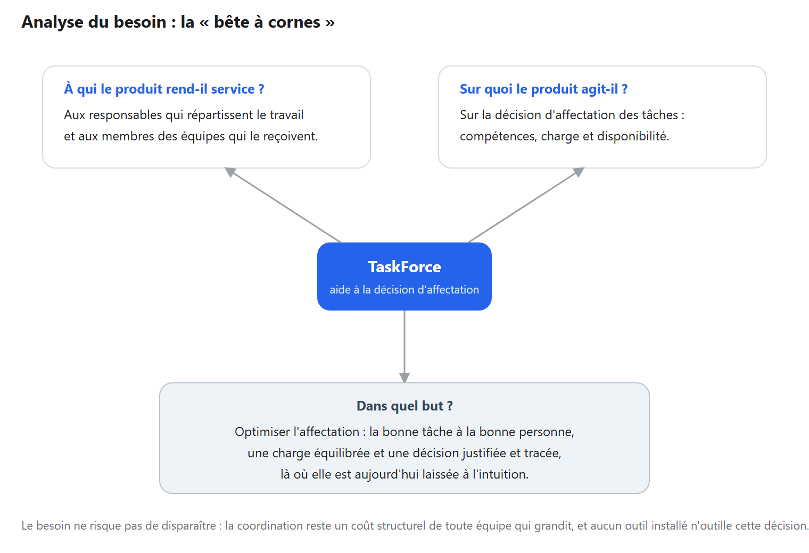

#### 1.2 Préconisations et parti pris technique
<!-- Critères : C2 [E1, E3]. Sources : Note_Innovation_Distance_Critique, Journal_Decisions_ADR. -->

Une fois le besoin reformulé, il me fallait orienter les choix techniques plutôt que dérouler un cahier des charges, et trois préconisations ont structuré le produit.

La première touche au cœur du système, puisqu'elle traite l'affectation comme une aide à la décision et non comme une règle automatique. Le classement des candidats se fait en deux temps : un pré-filtre déterministe, écrit en Java, note chacun sur une somme pondérée de ses compétences, de sa charge réelle sur l'ensemble des projets et de sa disponibilité, puis n'en retient qu'une liste courte, qu'un modèle de langage rerange au regard de la sémantique de la tâche avant d'en rédiger la justification. Le modèle affine le classement sans jamais trancher, car les poids restent explicites, l'appel passe par une passerelle qui masque le fournisseur, et un repli purement heuristique prend le relais dès qu'il devient indisponible, si bien que le responsable garde sous les yeux le détail du score et le dernier mot.

La deuxième préconisation est architecturale et retient un monolithe modulaire plutôt qu'une constellation de microservices. Pour un produit porté par une seule personne, le coût de coordination des microservices ne se justifie pas, alors qu'un socle unique, découpé en modules internes cloisonnés autour d'un noyau d'infrastructure, procure la même isolation sans le surcoût de la distribution et prépare l'extension sans réécriture.

La troisième fixe le modèle de distribution, celui d'un SaaS multi-locataire à isolation stricte où chaque requête reste cantonnée à l'organisation courante, ce que je regarde d'abord comme une exigence de sécurité avant d'y voir un choix économique.

Ces trois préconisations engageaient une pile technique et un ensemble de contraintes, des publics visés à la sécurité, aux délais et aux coûts, dont je détaille les caractéristiques dans la section suivante.

#### 1.3 Caractéristiques du projet : public, sécurité, SEO, délais, budget
<!-- Critères : C3 [E2]. Sources : Note_Cadrage, Gantt_Planning, Budget_Previsionnel, Registre_Risques. -->

Les caractéristiques du projet tiennent dans une même chaîne : viser une valeur, la rendre atteignable, la rendre digne de confiance, la produire vite et en mesurer le coût. Je les présente dans cet ordre parce que chacune commande la suivante.

Tout part de la cible, et donc de la valeur visée. Cette cible est d'abord la PME de 50 à 250 collaborateurs, où la répartition du travail est déjà une source de friction sans que les lourds outils de gouvernance y trouvent leur place. Mon ambition va toutefois plus loin, et ce choix engage l'architecture, que je n'ai pas dimensionnée pour cette seule cible mais pensée pour s'étendre sans réécriture vers des secteurs où la contrainte change de nature, à commencer par les industries réglementées comme la pharmacie, qui imposent la traçabilité intégrale des actions, la qualification des systèmes (IQ, OQ, PQ) et la conformité réglementaire au 21 CFR Part 11 [9], dont le référentiel GAMP 5 [10] balise l'application. Rien de cela n'est livré en version 1, et le dossier ne le prétend pas, mais les fondations qui le rendraient possible, du journal d'audit à l'isolation stricte des données jusqu'au découpage en modules, sont posées dès maintenant, car fixer d'emblée ce plafond d'exigence coûte peu et épargne la dette d'une reprise.

Une cible ne sert toutefois à rien si elle ne trouve pas le produit, et la valeur doit donc être atteignable. Un logiciel en libre-service ne se vend pas par une force commerciale, il se trouve, ce qui fait du référencement un enjeu autant marketing que technique. J'ai donc adossé au produit un site vitrine en rendu statique avec Astro, rapide et indexable par construction, pensé pour le référencement naturel plutôt que corrigé après coup, et confié à l'intelligence artificielle le même rôle d'acquisition, puisque, proposée comme une aide à la décision explicable et incluse sans supplément, elle place le produit là où plusieurs concurrents facturent l'IA en option.

Être trouvé ne suffit pas davantage, car un produit ne s'adopte que s'il inspire confiance, et cette confiance n'était pas négociable, une non-conformité valant blocage. Le RGPD [5], l'accessibilité WCAG 2.1 AA [6] déclinée en France par le RGAA [7] et le référentiel OWASP [8] ont encadré le développement, avec une réponse outillée plutôt que déclarative : analyse statique du code par Semgrep (SAST), analyse des dépendances par Trivy (SCA), test d'intrusion automatisé par ZAP (DAST), chiffrement au repos des données sensibles en AES-256-GCM [11], limitation de débit par jetons avec Bucket4j, en-têtes HTTP durcis et journal d'audit des actions sensibles. Ces mesures ne sont pas des garde-fous isolés, ce sont exactement les briques qu'exigerait l'évolution vers les secteurs réglementés visés plus haut, si bien que la sécurité livrée et l'ambition de conformité procèdent du même socle.

Restait à produire tout cela dans le temps imparti, et c'est là, plus que dans le délai lui-même, que s'est joué le vrai défi. Les dix mois qui séparent novembre 2025 de fin août 2026 n'imposent pas une contrainte passive, ils obligent à arbitrer sans cesse entre l'étendue du périmètre et la valeur réellement livrable. J'y ai répondu par une exécution rapide et itérative, que le choix de mener le projet seul a précisément rendue possible en supprimant tout coût de coordination, en resserrant la boucle décision-implémentation-mesure et en me laissant réorienter sans négociation ; l'isolement, souvent perçu comme une faiblesse, a joué ici comme un levier de vitesse au service de la valeur.

Cette exécution a un coût, que le budget met en regard de la valeur produite. Il ne mesure pas une dépense, presque nulle, mais un effort : la charge, exprimée en jours-homme puis valorisée à un tarif journalier moyen, représente environ 71 jours-homme, soit de l'ordre de 38 000 €. La dépense réelle se limite à une infrastructure de développement conteneurisée en local, à coût nul, et à une mise en production, aujourd'hui réalisée sur l'infrastructure fournie par l'école, dont le coût se limite au nom de domaine ; un hébergement indépendant équivalent est estimé entre 500 et 900 € par an. Le détail de cette valorisation et du plan qui l'a rythmée figure au chapitre 2.

#### 1.4 Périmètre livré, acteurs et rôles
<!-- Sources : CdCF_v2 (12 UC, hors-périmètre), Diagramme_Cas_Usage_UML. RBAC réel OWNER/ADMIN/MEMBER. Rédigé v0.3. -->

Le périmètre livré est la trace de ces arbitrages : il ne recense pas tout ce que j'ai imaginé, mais ce que j'ai retenu, et dans quel ordre. Je ne l'ai pas dessiné autour d'une liste de fonctionnalités, mais autour du problème posé plus haut, l'aide à la décision d'affectation, de sorte que tout ce qui la sert directement est livré tandis que ce qui s'en éloigne a été différé et assumé comme tel. Des douze cas d'usage arrêtés au cahier des charges fonctionnel, onze sont livrés.

Au centre se tient la fonction qui justifie le produit. Pour une tâche donnée, le système classe les membres candidats sur un score pondéré qui croise trois grandeurs mesurées plutôt que déclarées : les compétences, appariées aux étiquettes de la tâche à partir des profils ; la charge courante, mesurée par les points des tâches encore ouvertes sur l'ensemble des projets ; et la disponibilité, qui écarte d'emblée les membres en congé. Un modèle de langage rerange ensuite les meilleurs candidats et rédige la justification sans trancher, puisque les poids restent déterministes et que chaque recommandation est journalisée pour nourrir un historique qui pondère les suivantes. À l'échelle d'une équipe, cette recommandation devient une redistribution en deux temps stricts, un plan proposé sans aucun effet puis une application validée par le responsable et inscrite au journal d'audit, aucune réaffectation ne s'écrivant sans cette validation. On retrouve là, tenue jusque dans l'implémentation, la reformulation initiale d'une décision assistée et jamais imposée.

Cette fonction ne tient pas seule, car elle repose sur un substrat qui l'alimente et qui appartient au périmètre par nécessité. Assister l'affectation supposait en effet de modéliser ce qui est affecté et ce sur quoi porte la décision, d'un côté les projets, les tâches et leurs cycles, de l'autre les trois entrées du score, soit un profil de compétences par personne, un relevé de temps qui rend la charge mesurable et un registre de congés qui rend la disponibilité opposable. Ce dernier point mérite une précision qui éclaire toute la logique : le congé n'ouvre aucun circuit d'approbation, et ce vide est délibéré, car sa fonction n'est pas administrative mais calculatoire, puisqu'il pèse sur la disponibilité qui entre dans le score.

Autour de ce cœur et de son substrat, une enveloppe fait d'une mécanique un produit. Elle porte d'abord l'accès et l'isolation, avec l'authentification et surtout un contrôle d'accès multi-locataire qui cantonne chaque requête à l'organisation courante, puis tout ce qui rend le produit exploitable et digne de confiance, une facturation à deux plans, la portabilité et l'anonymisation des données personnelles qu'exige le règlement, un journal d'audit des actions sensibles et une observabilité de bout en bout. Aucune de ces briques n'est ornementale, ce sont les exigences de confiance posées plus haut, ici rendues effectives, et une base de connaissance accompagnée de son assistant, Cortex, complète l'ensemble en servant accessoirement de documentation vivante au projet lui-même.

Un périmètre se définit tout autant par ce qu'il exclut, et ces exclusions relèvent du séquencement plutôt que de la lacune subie. La messagerie temps réel, un moment prévue, a été retirée en cours de développement parce qu'elle s'écartait du problème d'affectation sans le servir. D'autres fonctions demeurent hors périmètre et rejoignent la feuille de route, des modules optionnels de laboratoire, de qualité et de gestion documentaire jusqu'au rôle d'invité en lecture externe, à l'export de rapports et à l'authentification déléguée d'entreprise ; or ces premiers modules sont justement ceux qu'appellent les secteurs réglementés visés plus haut, de sorte que les différer revient moins à y renoncer qu'à en ordonner la venue.

Reste à dire qui agit dans ce périmètre. Le cahier des charges nommait trois acteurs sur une seule échelle, du collaborateur au responsable, tandis que le modèle que j'ai livré répartit l'autorité sur deux axes indépendants plutôt que sur une hiérarchie unique. Le premier gouverne l'organisation en trois rôles emboîtés, du membre au propriétaire, et le second gouverne la contribution à l'intérieur d'un projet, du responsable de projet au simple observateur. Leur indépendance est le trait décisif, puisqu'une même personne peut administrer l'organisation tout en n'étant qu'observatrice sur tel projet, ou n'y être qu'un membre ordinaire tout en pilotant tel autre. J'ai emprunté cette orthogonalité aux plateformes de développement collaboratif parce qu'elle exprime ce que la hiérarchie linéaire du cahier des charges ne pouvait pas dire, à savoir que gouverner et contribuer relèvent de deux autorités distinctes.

Ces rôles ne sont pas de simples étiquettes, mais des décisions tenues par des gardes, dont trois prolongent l'exigence de confiance déjà rencontrée. Un projet privé qu'on n'a pas le droit de voir répond « introuvable » et non « interdit », car le refus lui-même confirmerait son existence ; un observateur reste en lecture seule même sur un projet ouvert, parce qu'un rôle explicite l'emporte sur l'ouverture ; un non-membre, à l'inverse, peut contribuer à un projet public, l'ouverture étant ici le défaut assumé. Les acteurs, enfin, ne sont pas tous humains, puisque le prestataire de paiement agit par signature plutôt que par rôle et que trois ordonnanceurs système opèrent sans identité d'utilisateur, leurs destinataires fixés dans le code. Ce périmètre et ces acteurs disent ce que le produit fait et pour qui ; reste à établir ce qu'il vaut et comment il subsiste, objet de la section suivante.

#### 1.5 Enjeu économique, valeur et modèle d'affaires
<!-- Appuie C3. Sources : Etude_business, Business_Model_Pricing. Rédigé v0.3. TAM/SAM/SOM donnés en ordres de grandeur avec hypothèses explicites (demande jury) ; chiffres ARR précis toujours écartés car non validables sur un produit non lancé. -->

La valeur d'un produit se lit sur deux plans qu'on confond volontiers, celle qu'il crée pour qui l'emploie et celle qu'il capte pour subsister. La première n'a rien d'hypothétique et a même déjà été chiffrée, puisque près de 60 % d'une journée de travail sont absorbés par la coordination et l'organisation plutôt que par la production elle-même [1]. C'est précisément cette part que TaskForce cherche à reconvertir en valeur produite, et son unité n'est pas une fonctionnalité de plus mais une décision d'affectation rendue plus juste, plus rapide et traçable. Le besoin s'inscrit dans un marché réel et croissant, celui des logiciels de gestion de projet, de l'ordre de dix milliards de dollars en 2025 et en progression annuelle à deux chiffres [4], dont le segment applicatif de l'intelligence artificielle est le plus dynamique. Ce chiffre est le marché total adressable, le TAM ; rapporté au segment que le produit peut réellement viser, les PME et ce sous-marché de l'IA appliquée, sur une entrée d'abord francophone, le marché servi, ou SAM, se compte en centaines de millions plutôt qu'en milliards.

Encore faut-il que cette valeur soit défendable, c'est-à-dire différenciée. Les outils installés enregistrent l'état du travail ou empilent les fonctions, mais aucun ne prend la décision qui les précède, l'affectation, et c'est sur ce point étroit et profond que se loge le positionnement de TaskForce, non comme un traceur de plus mais comme la couche de décision qui vient se poser au-dessus des traceurs. Le déplacement de l'output vers l'outcome, énoncé en ouverture du chapitre, devient ici une position de marché avant d'être un parti pris de conception.

La façon dont le produit subsiste tient d'abord à ce qu'il coûte, et sa structure de coûts lui est favorable par construction. Le coût marginal d'un utilisateur supplémentaire est quasi nul, comme pour tout logiciel en service, l'infrastructure de développement conteneurisée en local ne coûte rien, et la mise en production, déployée sur l'infrastructure de l'école, ne coûte que le nom de domaine, un hébergement indépendant équivalent étant estimé entre 500 et 900 euros par an. Le seul investissement réel est l'effort, cette charge d'environ 71 jours-homme déjà évoquée, que la conduite en solo comprime au lieu de la diluer, de sorte qu'on retrouve la forme économique classique du logiciel en service, un coût fixe faible, des charges d'exploitation (OPEX) minimes, un coût marginal négligeable et une valeur qui se répète dans le temps.

Sur cette base, j'ai bâti un modèle d'affaires accordé au mode de découverte du produit, car puisqu'il se trouve par le référencement et l'IA plutôt qu'il ne se vend par une force commerciale, il s'adopte en libre-service. La grille compte quatre paliers facturés par siège, au membre et par mois : une offre gratuite permanente, deux paliers payants à dix et seize euros et une offre entreprise sur devis. L'offre gratuite n'est pas une démonstration bridée mais un produit complet à petite échelle, recommandation d'affectation comprise, qui ne bute que sur des plafonds d'usage, à savoir deux cent cinquante tâches, cinq collaborateurs par projet privé et cent mille jetons d'intelligence artificielle par mois. Le nombre de membres, en revanche, n'est jamais plafonné, et c'est là le ressort du modèle : l'équipe entière s'installe et éprouve la valeur sans payer, puis, dès qu'un usage franchit un plafond, la facturation au siège porte d'un coup sur tous les membres déjà présents. Cette mécanique d'entrée gratuite et d'expansion tarifée est celle qu'ont imposée les outils de gestion de nouvelle génération.

Un parti pris sépare cette grille de la concurrence, et il découle du produit plutôt que d'un calcul commercial, puisque l'intelligence artificielle n'y est pas une option payante mais une capacité incluse dans chaque palier et seulement mesurée à l'usage. Là où plusieurs éditeurs facturent leur assistant en supplément, de l'ordre de neuf à vingt-huit dollars par utilisateur et par mois, je l'intègre au prix du forfait, pour une raison qui est logique avant d'être tarifaire : la recommandation d'affectation est le moment précis qui emporte l'adhésion, et la vendre à part reviendrait à faire payer l'argument même qui donne envie du produit. Ce qui se facture aux paliers supérieurs, ce sont les capacités de passage à l'échelle, analyses avancées, intégrations et historique sans limite, non la valeur centrale.

Cette différenciation est d'autant plus solide qu'elle serait coûteuse à copier. Les traceurs installés, Linear au premier chef, greffent aujourd'hui l'intelligence artificielle par-dessus un modèle de tarification où elle reste une option, et en faire le cœur de la décision d'affectation supposerait, chez eux, un véritable pivot de produit et de prix, quand TaskForce est bâti dans ce sens dès l'origine. Sur un autre front, un acteur comme Plane mise sur l'ouverture du code et l'auto-hébergement plutôt que sur l'intelligence artificielle, un axe de différenciation réel mais qui laisse lui aussi la décision d'affectation de côté, et que rien, dans l'architecture de TaskForce (code source public, déploiement conteneurisé), n'interdit de lui disputer. À cet avantage de position s'ajoute une conviction d'architecture dont la portée est directement économique, empruntée à la thèse du « modèle du monde » de Yann LeCun [19] : dans un système bien conçu, le modèle de langage ne porte qu'une part infime de la performance, celle de formuler correctement une sortie, tandis que le calcul qui compte vit dans l'architecture, la modélisation de l'état et le scoring. Il en découle que la valeur ne dépend pas de la puissance d'un grand modèle, qu'un petit modèle suffit à en exprimer le résultat, et que le coût marginal de l'intelligence artificielle tend vers zéro, là où un concurrent qui délègue son raisonnement à un grand modèle propriétaire le paie au jeton. Le chapitre 6 détaille l'implémentation qui en découle.

Le plafond de ce modèle est enfin relevé par l'expansion pour laquelle j'ai dessiné le produit, des modules verticaux destinés aux secteurs réglementés, du laboratoire à la gestion documentaire conforme au 21 CFR Part 11 [9], qui visent des organisations pour lesquelles la traçabilité n'est pas une option mais une obligation, et qui la valorisent en conséquence. C'est là que les choix d'architecture arrêtés plus haut, le monolithe modulaire au premier chef, et l'ambition de conformité déjà posée cessent d'être une posture d'ingénieur pour devenir un levier économique. Rien de cela n'est livré, et le dossier ne le prétend pas, mais l'essentiel est que le modèle de valeur possède un chemin d'expansion documenté plutôt qu'improvisé.

Reste à border ce que ces chiffres autorisent à dire. La grille, ses prix et ses plafonds sont réels, implémentés et facturés au siège par un prestataire de paiement, mais les projections qui en dérivent ne le sont pas. Une étude construit bien un marché atteignable, le SOM, de quelques millions d'euros de revenu annuel récurrent à trois ans, sur des hypothèses de conversion et de rétention qu'un produit non encore lancé ne peut pas valider, et je les mobilise pour leur méthode, non comme des faits établis. Ce qui est solide tient en une forme simple : un marché en croissance, une différenciation nette sur la décision d'affectation, une structure de coûts de logiciel en service et un modèle d'essai gratuit puis de facturation au siège doté d'un chemin vers les secteurs réglementés. Le cadrage du projet est ainsi posé, de son intention à son économie ; il reste à en formuler les objectifs de façon mesurable, ce que fait la section suivante.

#### 1.6 Objectifs et analyse SMART
<!-- Appuie C3. Objectifs SMART du projet. -->

Pour rendre ces ambitions vérifiables, je les ai formulées en objectifs SMART, c'est-à-dire spécifiques, mesurables, atteignables, réalistes et inscrits dans le temps.

| Critère | Objectif |
|---|---|
| **Spécifique** | Livrer une application web multi-locataire d'aide à la décision d'affectation, dotée d'un moteur de recommandation explicable et supervisé. |
| **Mesurable** | Des cibles chiffrées, arrêtées au lancement : livrer les cas d'usage prioritaires du cahier des charges fonctionnel, verrouiller dès le départ en intégration continue un seuil de couverture de tests de 70 % des lignes au front comme au back, et n'admettre à la livraison aucune violation d'accessibilité critique ou sérieuse ni aucune vulnérabilité critique. |
| **Atteignable** | Ces cibles sont à ma portée : une pile que je maîtrise (Java et Spring, Next.js, PostgreSQL), un seuil de couverture verrouillé par l'intégration continue dès la première ligne plutôt que rattrapé en fin de course, et des exigences de sécurité rendues mesurables par l'outillage (Semgrep, CodeQL, Trivy, OWASP ZAP), qui transforme chaque cible en un contrôle automatique. |
| **Réaliste** | Réponse à un besoin réel et récurrent des équipes, sur des technologies éprouvées et un budget quasi nul, le périmètre étant gouverné par une priorisation qui protège ces cibles au lieu de les diluer. |
| **Temporel** | Dix mois, de novembre 2025 à fin août 2026, jalonnés par six étapes du noyau à la soutenance. |

Fixées avant la première ligne de code, ces cibles décrivent la barre à tenir, non le bilan : les résultats réellement atteints à leur regard, du nombre de cas d'usage livrés aux taux de couverture mesurés, sont rapportés aux chapitres 5 à 8. Elles ont servi de fil conducteur, chaque arbitrage de périmètre se mesurant à sa contribution à l'une d'elles, et la conduite qui les a rendues atteignables fait l'objet du chapitre suivant.

### 2. Conduite de projet

#### 2.1 Méthode agile et rituels
<!-- Critères : C4 [E5, E6]. Sources : Note_Methode_Agile, Trame_Compte_Rendu_Activite, CR_2026-S30. Cycles dans l'app = preuve vivante. -->

Mener seul un projet agile a d'abord tout l'air d'un contresens, puisque les rituels de Scrum servent avant tout à synchroniser une équipe [15] et qu'un développeur unique n'a personne à synchroniser. Le paradoxe se dissipe dès qu'on distingue les deux fonctions que remplit chaque rituel, coordonner les personnes et cadencer le travail sur le réel, car la conduite en solo supprime la première sans toucher à la seconde. J'ai donc retenu un Scrum allégé croisé de Kanban, en conservant chaque cérémonie pour sa fonction de rétroaction et en la débarrassant de sa fonction de coordination.

Concrètement, j'ai transposé chaque cérémonie plutôt que de l'abandonner. La mêlée quotidienne, qui expose d'ordinaire à l'équipe l'avancement et les obstacles, est devenue une auto-revue écrite dans un carnet de bord, ce qui préserve la boucle réflexive sans l'auditoire ; la planification de sprint s'est faite priorisation hebdomadaire selon une matrice d'Eisenhower ; la revue de sprint est devenue une démonstration de jalon qui valide l'incrément au regard de l'objectif ; et la rétrospective a subsisté en bilan de fin de phase. Les rôles de responsable de produit et de facilitateur, tenus par la même personne que le développeur, ont cessé d'être des sièges distincts pour devenir des postures que j'adoptais tour à tour.

J'ai aussi ajusté la cadence, avec des cycles de deux à quatre semaines plutôt qu'une quinzaine figée, parce que la nature du travail variait selon la phase, et gardé un outillage délibérément standard, un tableau Kanban et des jalons sur GitHub Projects, une branche par fonctionnalité et une intégration continue qui exécutait la suite de tests à chaque poussée. Le suivi de l'avancement, lui, n'a pas reposé sur l'application en construction mais sur ce couple de GitHub Projects pour le flux de travail et du corpus documentaire pour la mémoire du projet, décrit plus loin.

La discipline s'est tenue aux deux bouts. À l'échelle de la tâche, une définition de terminé fixait la barre, code compilant, tests écrits et passants, intégration verte, aucune régression et documentation vivante mise à jour dès que l'architecture bougeait. À l'échelle de l'ensemble, j'ai gouverné le périmètre par une priorisation MoSCoW avant de l'arrêter par un gel des fonctionnalités le 20 juin 2026, qui a réorienté l'effort restant vers la documentation ; geler ainsi le périmètre relève du même arbitrage qu'au premier chapitre, refuser la fonction qui ne tiendrait pas pour livrer celle qui compte.

C'est ici que la condition solitaire, présentée plus haut comme un levier de vitesse, montre son mécanisme, car les cérémonies réduites à leur seule fonction de rétroaction laissent une boucle resserrée, décider, construire, vérifier, ajuster, sans aucun coût de coordination entre les étapes. La vitesse ne se gagne donc pas contre la méthode, mais en ramenant celle-ci à ce dont un acteur unique a réellement besoin. Conduire le projet de la sorte supposait néanmoins un environnement capable de soutenir cette boucle, reproductible et automatisé, que décrit la section suivante.

#### 2.2 Environnement de développement collaboratif
<!-- Critères : C5 [E4]. Sources : quickstart/README, GHCR_USAGE, docker-compose.dev, git-workflow/. -->

Cette boucle supposait un environnement à sa hauteur, que j'ai bâti aux standards du travail collaboratif alors même que l'équipe se réduisait à moi seul. Ce n'est pas un excès de zèle, car un environnement isolé et reproductible est ce qui permet à un développeur seul d'aller vite sans rien casser, et c'est aussi ce qui ferait d'un futur collaborateur une affaire d'accueil plutôt que de réarchitecture. Le socle en est la conteneurisation, puisque toute la pile, soit neuf services, de l'arrière-plan applicatif à l'interface web jusqu'à la base de données, au fournisseur d'identité et au stockage d'objets, est décrite et démarrée par Docker Compose, si bien que la machine de développement devient reproductible par construction et que le classique « cela fonctionne sur mon poste » se trouve écarté par conception.

Sur ce socle s'exécute un flux de travail emprunté intégralement aux pratiques d'équipe. Chaque changement vit sur sa propre branche, tirée d'une branche d'intégration, et rejoint le tronc par une demande de fusion ; les messages de commit suivent la grammaire des Conventional Commits [18], qui rend l'historique lisible ; et une intégration continue exécute la suite de tests à chaque poussée avant de publier les images dans le registre de conteneurs de GitHub (GHCR). La chaîne complète, du flux de branches au déploiement, est détaillée au chapitre 8. Rien de tout cela n'est indispensable pour travailler seul, mais je l'ai conservé pour ce que cela garantit, l'application mécanique de la définition de terminé rencontrée plus haut, un historique qu'on peut défaire plutôt que regretter, et une surface d'intégration déjà ouverte à un second contributeur.

Deux détails d'ingénierie disent le soin porté à cette reproductibilité : les services s'adressent l'un à l'autre par leur nom logique et non par une adresse locale, de sorte que la même description vaut sur n'importe quel poste, et la configuration est tenue hors du code, les secrets étant injectés par l'environnement plutôt qu'inscrits au dépôt. La même mécanique de conteneurs décrit d'ailleurs une variante de production, dont le déploiement et le durcissement relèvent d'un chapitre ultérieur ; ici, c'est l'environnement de développement qui importe, et il est entièrement opérationnel.

Un dernier élément complète ce décor, sa mémoire en quelque sorte, une documentation tenue comme du code, versionnée à côté de lui et mise à jour dans le même geste. Elle fait l'objet d'une section dédiée, mais elle appartient déjà à cet environnement puisqu'elle participe de ce qui le rend collaboratif d'intention. La méthode posée et l'environnement décrit, il me reste à montrer comment j'ai ordonné le travail dans le temps, borné son coût et anticipé ses risques, ce qu'expose la section suivante.

#### 2.3 Planification, budget prévisionnel et risques
<!-- Appuie C3. Sources : Gantt_Planning, Diagramme_PERT, Budget_Previsionnel (CAPEX/OPEX), Registre_Risques. [FIGURE : Gantt] [FIGURE : matrice des risques]. -->

Le projet s'est déroulé sur dix mois, de novembre 2025 à fin août 2026, en cinq phases qui vont du cadrage et de la conception au développement en trois incréments, puis aux tests, au déploiement et à la documentation. Six jalons les ponctuent, du noyau livré fin janvier au gel des fonctionnalités le 20 juin, sur un chemin critique linéaire et sans marge où tout retard sur la chaîne cadrage-conception-développement-tests-documentation décale la soutenance.

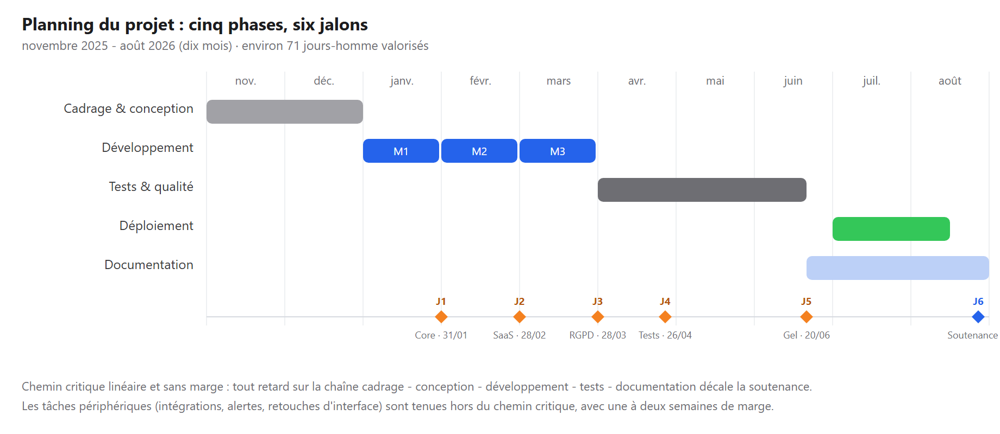

Une dépendance a commandé l'ordre du développement, car le smart-assign, cœur du produit, ne pouvait être écrit avant que ses données existent : les profils de compétences et les relevés de temps devaient être en base pour que le score ait quelque chose à calculer. Le noyau et le module métier ont donc précédé la fonction qui les justifie, tandis que je tenais les tâches périphériques, intégrations externes, alertes et retouches d'interface, hors du chemin critique, avec une à deux semaines de marge.

En amont de ce séquencement, j'ai décomposé le projet sur deux axes complémentaires, le produit et le travail, résumés ci-dessous. La décomposition du produit énumère les grands ensembles de livrables, du socle de sécurité au moteur d'affectation ; celle du travail découpe le projet en phases et en lots, qui recoupent les cinq phases du planning.

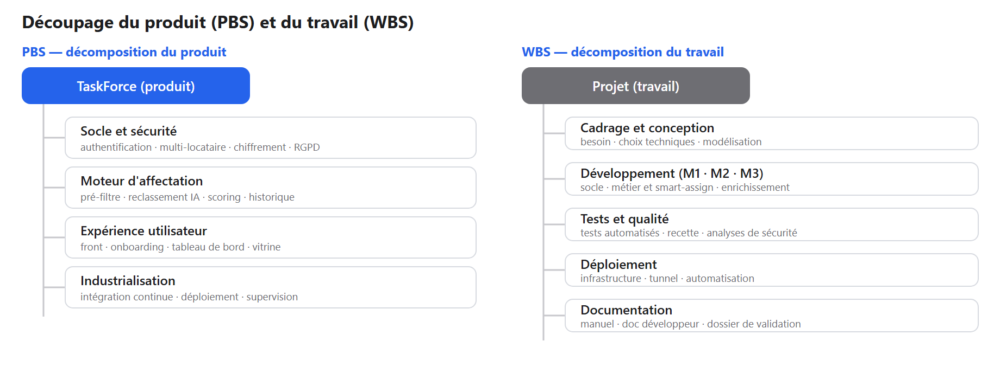

Cette vue est resserrée pour la lecture ; les deux décompositions complètes, celle du produit avec ses composants et celle du travail avec ses lots numérotés, sont reportées en annexe C.

Le budget se lit sur deux plans opposés. Le premier valorise l'effort : rapportée à un tarif journalier moyen du marché, la charge représente environ 71 jours-homme, de l'ordre de 38 000 euros, répartis entre conception, développement, tests, déploiement et documentation. Ce montant ne mesure aucune dépense, il estime ce que le même travail coûterait à une entreprise.

Le second plan est le décaissement réel, presque nul, car l'environnement de développement, conteneurisé en local et adossé à des paliers gratuits, n'a rien coûté. Mes seules dépenses effectives ont été un abonnement à un assistant de développement et un nom de domaine, soit quelques centaines d'euros, le temps n'ayant pas été rémunéré. La mise en production, déployée sur les machines de l'école, n'a engagé aucun coût supplémentaire, un hébergement indépendant équivalent étant estimé entre 500 et 900 euros par an. L'écart entre une valeur de 38 000 euros et un décaissement quasi nul est l'effet direct de la conduite en solo sur une infrastructure gratuite.

J'ai suivi douze risques dans un registre croisant probabilité et impact, dont la matrice ci-dessous donne la vue d'ensemble.

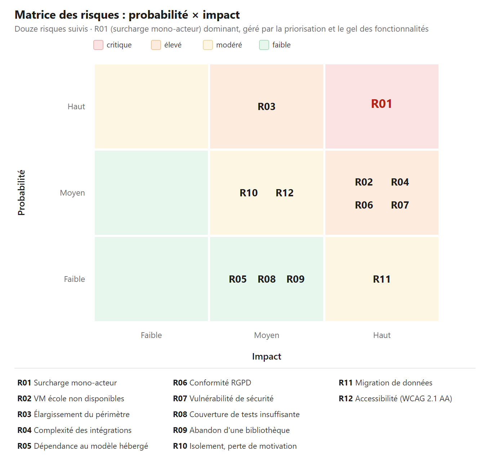

Le plus élevé tient à la structure même du projet, la concentration de tous les rôles sur une personne et l'isolement qu'elle induit sur dix mois, auquel j'ai répondu par des dispositifs concrets déjà décrits, priorisation par l'urgence et l'importance, gel des fonctionnalités contre l'élargissement sans fin du périmètre, documentation vivante comme mémoire externe et usage quotidien du produit pour garder des jalons visibles.

Les risques techniques et réglementaires ont reçu des réponses outillées : j'ai éprouvé la complexité des intégrations par un prototypage précoce et des tests d'intégration sur une base de données réelle, et couvert les risques de sécurité et de conformité par l'analyse statique, l'analyse des dépendances, le test d'intrusion et les fonctions RGPD déjà livrées. Le dernier risque technique, la disponibilité d'une infrastructure de production, a finalement été levé par le déploiement effectif sur les machines de l'école, préparé de longue date par une démonstration locale documentée et une pile de production prête à démarrer. Un dernier instrument a soutenu cette conduite d'un bout à l'autre, la documentation tenue comme du code, que décrit la section suivante.

#### 2.4 Documentation vivante et suivi de projet (Brain OS)
<!-- Appuie C5, C27, C4. DEMI-PAGE. Cadrer STRICTEMENT méthode/outillage : le corpus taskforce-docs
comme source unique de vérité, tenue à jour en temps réel avec le code (docs-as-code), qui a servi de
base de connaissances et de suivi de projet. NE PAS déborder vers la vision produit "AI Delivery OS".
C'est le "comment j'ai gardé la maîtrise" du récit. Preuve : le corpus lui-même. -->

J'ai tenu la documentation comme du code, sous forme de fichiers Markdown versionnés dans le dépôt, rédigés et maintenus avec l'assistance d'un assistant IA et mis à jour dans le même geste que le code. L'ensemble forme un système de connaissance de type Obsidian, que j'appelle Brain OS [20], où les notes sont indexées et reliées par une classification à plusieurs entrées, tags, mots-clés et vectorisation, ce qui autorise une recherche par proximité sémantique autant que par arborescence, et où la documentation reflète l'état réel du système plutôt qu'une intention passée.

Cet outil n'a pas été improvisé pour l'occasion. Je l'ai conçu et éprouvé avec Jonathan Naal lors d'une expérience commune en agence de développement à Montréal, d'abord sur des projets internes, avant de le retenir pour TaskForce après en avoir mesuré la valeur sur deux usages précis, la rédaction de la documentation et le suivi de l'avancement, si bien que son adoption s'appuyait déjà sur un véritable banc d'essai.

Sur TaskForce, ce corpus remplit deux fonctions. Comme base de connaissance, il me permet de raisonner sur un système trop vaste pour tenir en tête, de l'architecture aux contrats d'API en passant par les décisions et les problèmes connus ; comme journal de bord, il porte le backlog, les comptes rendus et l'avancement. Pour un développeur seul sur dix mois, il joue le rôle de mémoire externe qu'une équipe détiendrait collectivement.

Sa tenue à jour n'a pas reposé sur la seule discipline, car la définition de terminé en imposait la mise à jour et un contrôle au moment du commit refuse de clore une tâche dont le code est plus récent que sa dernière trace écrite, de sorte que la synchronisation devient une condition de sortie. Ce corpus est du reste la matière première du présent dossier. La conduite du projet se complète enfin d'une veille technologique, dont la section suivante montre l'effet sur les décisions.

#### 2.5 Veille technologique et influence sur les décisions
<!-- Critères : C12 [E10]. Sources : Veille_Technologique (VT-001 à 006 avec ADR + preuves). Relier chaque veille à une décision réelle. -->

J'ai mené la veille technologique comme une démarche structurée plutôt que comme une consultation au fil de l'eau. Elle couvre trois axes, la stabilité de la pile avec ses montées de version et ses ruptures de compatibilité, les opportunités de qualité, de performance et de sécurité, et l'évolution rapide des modèles de langage et de l'outillage agentique. Chaque signal suit le même circuit, de la découverte à l'évaluation du couple pertinence-effort, puis à l'expérimentation sur une branche et, s'il se révèle structurant, à une décision consignée, implémentée et documentée.

J'ai tracé et hiérarchisé les sources par axe, sans viser l'exhaustivité. Pour la pile, les canaux officiels priment, notes de version et abonnements aux dépôts de Spring Boot, Next.js, Keycloak et pgvector, complétés d'un suivi automatisé des vulnérabilités par Dependabot et la base NVD. La sécurité et la conformité s'appuient sur des référentiels d'autorité, l'OWASP, l'ANSSI et la CNIL, tandis que la veille produit et acquisition suit les publications de grands comptes et d'agrégateurs professionnels, par fils LinkedIn et infolettres, d'Oracle, IBM, Microsoft et Apple à Ollama pour l'inférence locale en passant par l'agrégateur Daily Dev, et, pour le référencement, les analyses de Seven Gold Agency, spécialisée dans le domaine. La veille de fond, enfin, passe par la littérature technique, notamment l'ouvrage de Sam Bhagwat, cofondateur de Mastra, sur les principes de construction des agents d'IA [12].

L'exploitation de ces signaux suit une même mécanique, résumée dans la figure ci-après. Je confronte chaque information retenue, en discussion avec un assistant IA adossé au corpus Brain OS, sous plusieurs angles, faisabilité technique, sécurité, conformité, passage à l'échelle et valeur, avant de consigner toute décision structurante dans un enregistrement de décision d'architecture (ADR), au format popularisé par Michael Nygard [16], avec son raisonnement, les options écartées et les conséquences ; j'en ai ainsi enregistré onze. Lorsqu'une contrainte de temps ou de moyens me pousse à une solution courte, l'ADR est doublé d'une entrée dans un registre de dette technique dédié, qui consigne l'écart à combler pour y revenir plus tard, et c'est ce couplage d'une décision tracée et d'une dette assumée qui rend la veille exploitable dans la durée.


Quatre décisions illustrent cette chaîne.

Dès octobre 2025, le suivi des jalons de Spring Boot 4 signale l'arrivée de Java 21 en support long et des threads virtuels du projet Loom, soit une montée en charge par requête sans pool de threads. La même veille repère deux ruptures à anticiper, le renommage des paquets de `javax` vers `jakarta`, qui touche toutes les annotations de persistance, et l'abandon de l'adaptateur Keycloak officiel pour cette version, qui impose de basculer sur la configuration native de Spring Security en serveur de ressources. J'ai intégré ces contraintes dans la décision de pile (ADR-001) avant qu'elles ne deviennent des régressions.

Sur l'axe des modèles, la veille retient d'abord l'API Groq pour la latence de son unité de traitement dédiée, que j'appelle directement depuis le backend Java plutôt que de la router par un microservice Python (ADR-004). J'ai surtout placé cet appel derrière une passerelle d'IA, une indirection qui masque le fournisseur, si bien que le jour où Groq est devenu inaccessible, le basculement vers un modèle local a été absorbé sans toucher au code appelant, un repli heuristique garantissant par ailleurs une réponse même sans modèle. La dépendance à un fournisseur externe, identifiée comme risque, s'est ainsi trouvée neutralisée par l'architecture.

Deux décisions montrent la veille à l'œuvre sous contrainte réglementaire et sécuritaire. Une recommandation de l'ANSSI, déconseillant l'algorithme symétrique HS512 pour la signature des jetons, m'a conduit à abandonner les jetons émis par le backend au profit de jetons RS256 délivrés par Keycloak, l'ADR d'origine n'étant pas effacé mais marqué comme remplacé, ce qui garde la trace du raisonnement et de son évolution. Pour le stockage vectoriel du moteur d'affectation, j'ai écarté une base hébergée hors de l'Union européenne pour non-conformité au règlement et une base dédiée pour son surcoût d'exploitation, la sortie de l'index HNSW dans pgvector tranchant en faveur d'une extension de PostgreSQL déjà en place (ADR-005).

La même rigueur s'applique à ce qui reste ouvert, puisqu'une recommandation de la CNIL sur les bannières de consentement a révélé un écart que j'ai enregistré au registre de dette technique et porté au backlog plutôt que passé sous silence. Consigner tous les périmètres, décisions comme manques, a un effet décisif pour un projet solo, car la même source alimente trois documentations distinctes, le manuel utilisateur, la documentation développeur et le présent dossier, sans qu'aucune soit rédigée à part. Reste à formaliser qui, dans ce projet mené seul, a porté chacune de ces responsabilités, ce que précise la dernière section de ce chapitre.

#### 2.6 Organisation, rôles et responsabilités
<!-- Appuie C4, C3. Projet solo : rôles cumulés + matrice RACI. -->

Le développement de TaskForce a été mené seul : j'ai porté toutes les casquettes techniques, de la conception à la réalisation, au déploiement et à la qualité. Le projet s'est toutefois inscrit dans une gouvernance à trois acteurs, que formalise une matrice des responsabilités : moi-même pour la réalisation, Cédric BRASSEUR comme Product Owner, garant du produit et de ses priorités, et Metz Numeric School comme client, à l'origine du besoin et destinataire des livrables.

La matrice ci-dessous en donne une lecture resserrée, organisée selon les grandes étapes du projet, celles-là mêmes que découpe le référentiel de compétences ; R désigne celui qui réalise, A celui qui approuve et rend compte, C celui qui est consulté et I celui qui est informé, et sa version complète, détaillée bloc par bloc, figure en annexe F.

| Étape (compétences clés) | Pierre MICHEL (réalisation) | Cédric BRASSEUR (PO) | MNS (client) |
|---|:---:|:---:|:---:|
| Analyse du besoin et cahier des charges (C1-C2) | R | C | A |
| Planification et conduite agile (C3-C5) | R | A | I |
| Conception et modélisation (C6-C10) | R | A | I |
| Développement front et back (C13-C24) | R | A | I |
| Conformité RGPD (C11) | R | C | A |
| Déploiement et supervision (C27-C32) | R | C | C |

Cette répartition m'a servi de garde-fou : elle distingue ce que je décide et réalise de ce que le Product Owner arbitre et de ce que le client valide, et elle m'a évité de me dispenser de faire valider ce qui devait l'être. Le cadre du projet est désormais complet, de son intention à sa conduite, et la partie suivante entre dans la conception, des choix d'architecture aux modèles qui en découlent.

---

## Partie II — Concevoir : des choix aux modèles

<!-- Mouvement 2 : ce qui existait, pourquoi ces choix, de l'idée au modèle. -->

### 3. Choix technologiques et arbitrages

#### 3.1 Démarche de choix et contraintes
<!-- Contexte : contraintes CDC, délais, compétences, cible. Sources : Journal_Decisions_ADR, CdCT_v2. -->

J'ai appliqué la même ligne à chaque couche de la pile, en retenant la brique la plus adaptée au problème plutôt que la plus répandue et en me donnant les moyens d'en rendre raison. Quatre exigences ont guidé ces arbitrages. La première est de servir d'abord le cœur métier, un moteur d'affectation doublé d'une recherche vectorielle, ce qui favorise les écosystèmes taillés pour un domaine riche et pour l'intelligence artificielle. La deuxième, non négociable, tient à la sécurité et à la traçabilité. La troisième est la maturité et la soutenabilité par un développeur seul sur dix mois, qui m'ont fait écarter les technologies trop jeunes ou mal outillées. La quatrième, enfin, est la souveraineté et le coût, un budget nul m'imposant l'open source et l'auto-hébergement partout où c'était possible. La performance brute, en revanche, n'a guère pesé, puisque le coût dominant d'un tel service tient à l'attente d'entrées-sorties bien plus qu'au calcul. J'ai tranché chaque décision contre des alternatives nommées avant de la consigner en ADR [16], et les sections qui suivent les déroulent, couche par couche puis service par service.

#### 3.2 Étude comparative back-end et choix retenu
<!-- [TABLEAU : back-end] Java/Spring vs Node vs Symfony. Argument : robustesse, typage, écosystème, moteur métier. Source : ADR-001. -->

C'est le back-end qui portait le plus d'enjeux, puisqu'il exécute le moteur métier et concentre les contraintes de sécurité, et j'ai donc comparé trois écosystèmes, dont les deux que propose le cahier des charges.

| Critère | PHP / Symfony | Node.js | Java / Spring Boot |
|---|---|---|---|
| Typage sur un domaine riche | dynamique | dynamique | **statique, fort** |
| Sécurité et traçabilité intégrées | à compléter | à assembler | **Spring Security OIDC, Flyway `validate`, JaCoCo** |
| Cœur d'affectation (lots, vecteurs) | orienté CRUD | possible | **adapté, écosystème mature** |
| Exécution liée aux entrées-sorties | classique | boucle événementielle | **threads virtuels (Java 21)** |
| Exercice full-stack (deux écosystèmes) | oui | non, mono-langage avec le front | **oui** |

Java et Spring Boot l'emportent moins par la performance que par l'intégration native de la sécurité, un serveur de ressources OIDC assuré par Spring Security, et par l'adéquation au cœur métier. Ce qui rend l'argument solide, c'est qu'il ne départage pas les trois écosystèmes sur une préférence, mais sur les deux exigences non négociables posées au cadrage, la sécurité intégrée et l'adéquation au moteur d'affectation : le choix est commandé par le besoin et non par le goût. Le raisonnement complet, et les alternatives Java écartées (Quarkus, Micronaut), sont consignés en ADR-001.

#### 3.3 Étude comparative front-end et choix retenu
<!-- [TABLEAU : front-end] Next.js/React vs Vue. SSR, App Router, écosystème. -->

Le front-end de l'application ne vise pas le référencement : celui-ci est porté par le site vitrine, traité juste après. La webapp cherche donc avant tout une expérience fluide, des composants accessibles et un typage strict ; son référencement propre reste au minimum utile, même s'il demeure correct. Trois cadres ont été comparés.

| Critère | Vue / Nuxt | Angular | Next.js / React |
|---|---|---|---|
| Communauté et écosystème | moyenne | large, orienté entreprise | **la plus large** |
| Maturité à l'échelle | plus jeune, tient moins la charge | robuste mais lourd | **éprouvé** |
| Agilité, pivot rapide | bonne | limitée, structurant | **bonne** |
| Déploiement | — | écosystème Google | **natif Vercel, gratuit** |
| Point de vigilance | — | poids et courbe d'entrée | **suivi actif des CVE** |

Les trois écrivent du TypeScript ; ce n'est donc pas là que se joue le choix. Next se place entre un Nuxt plus jeune, à la communauté plus étroite et qui tient moins la charge, et un Angular puissant mais surdimensionné, plus rigide à faire pivoter et adossé à l'écosystème Google. Next offre l'écosystème le plus large et un déploiement natif sur Vercel, gratuit ; sa contrepartie, un rythme d'évolution rapide qui impose un suivi actif des vulnérabilités, a été acceptée en connaissance de cause. L'accessibilité, elle, s'appuie sur les primitives de Radix via shadcn/ui.

Le référencement relève d'un autre outil. La vitrine n'est pas une application mais un site de contenu dont le seul objet est d'être trouvé ; la confier à Next serait surdimensionné.

| Critère | Next.js | Astro |
|---|---|---|
| Nature | application (rendu serveur, composants serveur) | **site statique, orienté contenu** |
| Charge envoyée au navigateur | plus élevée | **minimale (îlots)** |
| Adéquation au référencement | bonne | **excellente** |
| Déploiement | Vercel | **Vercel, gratuit** |

J'ai donc retenu Astro pour la vitrine et Next pour l'application, chacun sur le terrain où il excelle. La force de cette comparaison tient à ce qu'elle sépare deux besoins que l'on confond volontiers, l'application derrière authentification et le site de contenu à indexer, puis attribue à chacun l'outil taillé pour lui plutôt qu'un cadre unique étiré au-delà de son emploi ; et elle se juge sur des critères vérifiables, l'accessibilité des primitives Radix, le poids de JavaScript envoyé au navigateur et le coût de déploiement, non sur une impression.

#### 3.4 Base de données et choix retenu
<!-- [TABLEAU : BDD] PostgreSQL (+ pgvector) vs MySQL. Intégrité, extensions, vecteurs pour le Brain OS. -->

La base devait garantir l'intégrité d'un domaine multi-locataire et porter les vecteurs du Brain OS.

| Critère | MySQL | PostgreSQL (+ pgvector) |
|---|---|---|
| Intégrité, types riches, migrations Flyway | équivalents | équivalents |
| Recherche vectorielle native (IA) | extension tierce | **pgvector, index HNSW** |
| Store natif du fournisseur d'identité | possible | **celui de Keycloak** |

Sur l'essentiel, intégrité relationnelle, types riches, migrations, les deux moteurs se valent, et il ne s'agit pas de disqualifier MySQL. Deux points, propres à ce projet, ont tranché pour PostgreSQL : sa recherche vectorielle native, avec l'index HNSW, qui évite d'ajouter une base dédiée pour l'IA (ADR-005), et le fait qu'il soit le store natif de Keycloak, ce qui réunit l'application et l'identité sur un même moteur et facilite un futur pivot. L'argument est d'autant plus fort qu'il ne se paie d'aucun compromis sur le reste : puisque les deux moteurs s'égalent sur l'intégrité et la maturité, le choix se joue sur deux gains nets et sans contrepartie, la recherche vectorielle intégrée qui épargne un second entrepôt de données et l'unité du stockage avec l'identité.

#### 3.5 Identité et sécurité applicative : Keycloak
<!-- Vérifié 25/08 : Argon2 défaut KC25, PBKDF2 210k KC24, PostgreSQL store natif, projet CNCF. RBAC métier = applicatif (pas KC). Ne pas dire "réduit la surface d'attaque". -->

L'authentification et la gestion des identités reposent sur Keycloak, un serveur d'identité open source auto-hébergé, plutôt que sur un service d'identité en ligne. Le choix se justifie sur quatre plans.

D'abord la souveraineté : Keycloak s'installe sur l'infrastructure du projet et n'introduit aucune dépendance à un prestataire d'identité tiers ; identifiants et données d'identité restent sur site. C'est déterminant pour la cible réglementée évoquée au premier chapitre, où l'hébergement sur site et l'auditabilité de la brique d'identité sont des prérequis, dans la pharmacie comme dans la finance.

Ensuite la sécurité effective : Keycloak implémente les standards du domaine, OpenID Connect et OAuth 2.0, avec un contrôle fin des flux d'autorisation et un hachage des mots de passe à l'état de l'art, délégué à Keycloak et conforme aux recommandations de l'OWASP. Déléguer l'identité à un serveur dédié évite de réimplémenter dans le back-end la partie la plus sensible et la plus facile à manquer d'une application, la gestion des secrets d'authentification. Le contrôle d'accès métier, en revanche, ne passe pas par Keycloak : les rôles de TaskForce dépendent du workspace et du projet, un même utilisateur pouvant être propriétaire d'une organisation et simple observateur d'un projet dans une autre. Propres à chaque ressource, ils ne peuvent tenir dans des rôles statiques du jeton d'identité ; ils sont donc portés par le modèle de données et vérifiés dans la couche service, ce que confirme l'absence de tout rôle Keycloak dans le code d'autorisation.

Ensuite la maturité : le projet est ancien, largement documenté, activement maintenu et passé sous l'égide de la CNCF, ce qui écarte le risque d'abandon d'une brique aussi structurante.

Enfin l'intégration : Keycloak s'interface nativement avec Spring Security, retenu au back-end, comme serveur de ressources OIDC, et persiste ses données dans PostgreSQL, déjà la base du projet. Une seule technologie de stockage sert ainsi l'application et son fournisseur d'identité, ce qui allège l'exploitation.

Le contrepoint d'un serveur auto-hébergé est un service d'identité géré, comme Clerk. La comparaison éclaire le choix.

| Critère | Clerk (SaaS géré) | Keycloak (auto-hébergé) |
|---|---|---|
| Rapidité d'intégration | **immédiate** | mise en place à faire |
| Hébergement des identités | chez le prestataire | **sur site** |
| Dépendance, réversibilité | forte | **nulle, open source** |
| Déploiement sur site (réglementé) | limité | **direct** |
| Coût à l'échelle | par utilisateur actif | **fixe, auto-hébergé** |

Clerk aurait fait gagner du temps à l'amorçage ; Keycloak l'emporte sur ce qui compte ici, la souveraineté des identités, l'absence de dépendance et l'aptitude au déploiement sur site, au prix d'une mise en place assumée.

#### 3.6 Service d'intelligence artificielle : Python, Ollama et passerelle de modèles
<!-- Python/FastAPI ai-service ; Ollama local (Qwen) par défaut ; Groq = repli hébergé pour VM sans compute ; embeddings toujours Ollama ; passerelle LlmClient → provider interchangeable ; provisoire local (machine perso) vs long terme via veille. Vérifié .env.example + ai-service/ollama_gateway.py. -->

L'intelligence artificielle aurait pu vivre dans le back-end Java ou dans le front Next, mais je l'ai placée dans un service distinct, en Python avec FastAPI, pour une double raison. D'une part, Python domine l'écosystème de l'intelligence artificielle et du traitement de données et porte l'intégration avec Ollama, là où Java et Node n'offrent que des ponts ; d'autre part, isoler l'IA sépare une préoccupation dont le cycle de vie et les besoins de calcul diffèrent du reste, de sorte qu'elle peut évoluer, tomber ou monter en charge sans toucher au cœur applicatif.

Le service expose les modèles derrière une passerelle interne : le back-end appelle une seule interface, `/v1/chat`, sans jamais savoir qui répond, et c'est cette passerelle, écrite dans le service Python, qui tranche entre l'inférence locale et l'inférence hébergée. Le conteneur reste d'ailleurs un proxy léger, à quelques dizaines de mégaoctets de mémoire, car le modèle ne s'exécute pas dedans mais sur un moteur Ollama voisin. Par défaut, tout tourne en local : le smart-assign interroge, par une voie « rapide », un petit modèle Qwen de sept à huit milliards de paramètres, `qwen2.5:7b` en développement et `qwen3:8b` en production, un modèle Qwen plus grand de quatorze milliards restant réservé aux tâches d'assistance plus lourdes, tandis que les vecteurs d'embedding sont produits localement par le modèle `bge-m3`. Aucune donnée ne quitte l'infrastructure et le coût est nul.

Ce montage local suppose néanmoins une machine capable de porter le modèle, ce que la production n'offre pas. Le poste de développement dispose de la mémoire et du calcul nécessaires, mais les machines de l'école n'ont ni carte graphique ni les quelque vingt-quatre gigaoctets qu'exigerait le chargement d'un grand modèle, de sorte que l'inférence locale y afficherait des temps de réponse de l'ordre de la minute. La passerelle bascule alors, sur simple présence d'une clé d'API, vers un fournisseur hébergé, Groq, dont les modèles ouverts `gpt-oss` répondent sans aucun calcul local et rendent l'IA déployable sur une petite machine. Seuls les embeddings restent produits par Ollama, Groq n'exposant pas ce service.

La solution est donc adaptative, un modèle local là où le calcul est disponible et un modèle hébergé ailleurs, et l'on retrouve ici le principe déjà exposé à propos de la veille : parce que la passerelle isole le fournisseur, le choix se tranche au fil de l'eau, sans réécriture du code appelant, et l'architecture absorbe un changement de modèle comme un changement de fournisseur. C'est cette même indirection qui, le jour où Groq s'est trouvé bloqué sur le réseau de l'école, a permis de revenir au modèle local sans toucher au métier.

#### 3.7 Infrastructure, intégration continue et exploitation
<!-- Docker, Linux, GitHub + Actions (CI/CD, GHCR), observabilité OpenTelemetry→SigNoz + Prometheus + Grafana, Vercel + Astro (landing/SEO). Cloudflare = CONFIRMÉ (Tunnel cloudflared : api/auth→VM1, app→VM2, proxied ; DNS). Grouper, pointu, peu de tableaux. -->

J'ai choisi l'infrastructure sous une double contrainte, un budget nul et des machines de production fournies par l'école, sans adresse publique, et chaque brique répond à l'une ou à l'autre.

La reproductibilité et la construction reposent sur Docker et GitHub. L'ensemble des services est décrit en conteneurs, ce qui garantit la parité entre le poste de développement et la production ; le code vit sur GitHub, où une intégration continue par GitHub Actions exécute les tests à chaque poussée et publie les images dans le registre associé. Rien de propriétaire, rien de payant.

L'hébergement suit la même logique. Les services applicatifs tournent sur deux machines Linux, standard de l'hébergement serveur : back-end et fournisseur d'identité sur la première, front-end sur la seconde. Elles sont placées derrière le réseau de l'établissement, sans adresse publique ni port ouvrable ; les exposer directement était impossible. La réponse est un tunnel Cloudflare : sur chaque machine, un agent léger ouvre une connexion sortante vers le réseau de Cloudflare, et c'est par ce canal que redescendent les requêtes. Les visiteurs atteignent ainsi des sous-domaines, l'interface, l'API et l'authentification, servis depuis le bord de Cloudflare, qui termine le chiffrement TLS, filtre le trafic et route chaque sous-domaine vers la bonne machine, la première pour l'API et l'authentification, la seconde pour l'interface. Aucun port entrant n'est ouvert : la surface réseau se réduit au seul tunnel sortant, ce qui vaut protection sans pare-feu à administrer. Cloudflare assure aussi la zone DNS du domaine. Le site vitrine, rendu statique Astro, est déployé sur Vercel pour sa rapidité de publication et son adéquation au référencement ; les courriels transactionnels passent par un service dédié, Brevo.

Ce partage a été dimensionné, et les mesures relevées en production le confirment. Les deux machines sont des instances virtuelles identiques, fournies par l'école, placées derrière son réseau et reliées entre elles par un maillage privé ; le tableau ci-dessous en donne les caractéristiques.

| Machine | Rôle | Distribution | vCPU | Mémoire | Disque | Carte graphique |
|---|---|---|:---:|:---:|:---:|:---:|
| **VM 1** | API, identité, base de données, service IA | Debian 13 | 2 | 3,8 Gio | 32 Go | aucune |
| **VM 2** | Interface, supervision | Debian 13 | 2 | 3,8 Gio | 32 Go | aucune |

L'absence de carte graphique éclaire le choix, exposé au chapitre 3, de déporter l'inférence d'un grand modèle vers un fournisseur hébergé plutôt que de la faire tourner sur place. Le tableau suivant donne, lui, l'empreinte mémoire réelle de chaque conteneur, relevée en fonctionnement.

| Machine | Conteneur | Rôle | Mémoire mesurée |
|---|---|---|---|
| **VM 1** | Back-end (Spring, JVM) | API métier | 858 Mio |
| | Keycloak | Identité, OIDC | 367 Mio |
| | MinIO | Stockage d'objets | 100 Mio |
| | PostgreSQL | Base de données | 65 Mio |
| | Service IA (FastAPI) | Passerelle de modèles | 40 Mio |
| | Redis | Cache | 8 Mio |
| | cloudflared | Tunnel Cloudflare | 28 Mio |
| | Sondes (node-exporter, cAdvisor) | Métriques | ~58 Mio |
| **VM 2** | Prometheus | Collecte de métriques | 170 Mio |
| | Grafana | Tableaux de bord, alertes | 133 Mio |
| | Front-end (Next, autonome) | Interface web | 130 Mio |
| | cloudflared | Tunnel Cloudflare | 127 Mio |
| | Sondes (node-exporter, cAdvisor) | Métriques | ~70 Mio |

En fonctionnement, la première machine occupe environ 2,3 gigaoctets de mémoire, soit 60 %, la seconde environ 1,9 ; leur charge processeur reste, au repos, sous les 5 %. Il subsiste donc de l'ordre d'un gigaoctet et demi de mémoire libre par machine et un processeur presque entier. Comme les requêtes sont dominées par l'attente d'entrées-sorties, et que l'inférence d'un grand modèle est déportée hors de ces machines faute de carte graphique, cette marge n'est pas consommée par le calcul. Le premier plafond n'est pas la mémoire mais le nombre de connexions à la base, fixé à vingt. À l'estime et avec une marge de sécurité, la configuration couvre sans peine l'usage simultané d'une équipe de PME, la cible du produit ; au-delà, les services sans état se répliquent horizontalement sans changer d'architecture. Côté disque, la seconde machine est à 38 %, la première à 71 %, dont une part récupérable de cache de construction ; les quatorze sauvegardes quotidiennes de la base, en rotation, y sont comprises.

L'exploitation, enfin, est instrumentée. Les métriques applicatives, exposées par le back-end, comme celles de l'hôte et des conteneurs relevées par node-exporter et cAdvisor, sont collectées par Prometheus et visualisées dans Grafana, où sont définies les alertes. Des briques open source et auto-hébergées, là encore préférées à un service facturé comme Datadog, hors de portée d'un budget nul.

#### 3.8 Choix de la pile et cahier des charges
<!-- Critères : C2 [E3]. Reformulé 26/08 : PAS de récit d'"écart"/"divergence" (le user refuse cette mise en scène) ; framer en choix libres + pertinence. ADR-001 : ne PAS défendre par "à titre indicatif" (le CDC ne l'écrit pas) → s'appuyer sur la liberté confirmée par l'école + le mérite technique. -->

Le cahier des charges technique proposait, par couche, un jeu de technologies : PHP avec Symfony ou Node.js au back-end, React ou Vue au front, MySQL ou PostgreSQL pour la base. Le cadre de la formation confirme que ces propositions n'enferment pas le choix : la pile est libre dès lors qu'elle est argumentée, et le référentiel demande des technologies « adaptées », jugées sur leur pertinence. Il n'y a donc pas de conformité à prouver, mais des choix à justifier, ce que les sections précédentes ont fait couche par couche.

React via Next.js et PostgreSQL figurent parmi les technologies citées ; le back-end retient Java et Spring Boot, pour les raisons déjà exposées, l'adéquation au moteur métier et la valeur d'un développement à deux écosystèmes. Le document en proposait d'autres, mais la liberté confirmée rend ce choix aussi recevable, dès lors qu'il est justifié et documenté, comme il l'est en ADR-001. Une pile se juge, au fond, à sa capacité à satisfaire les exigences, fonctionnelles comme non fonctionnelles, que celle-ci couvre intégralement, et non à sa coïncidence avec une liste.

### 4. Conception et modélisation

#### 4.1 Wireframes et parcours
<!-- Critères : C6 [E7]. Sources : Wireframes_Annotes (48 routes). Captures réelles (fournies par le user 26/08). -->

L'interface n'est pas restée à l'état de maquette, puisque l'application est déployée et utilisée, et je présente donc le parcours sur l'interface réelle, plus probante qu'un wireframe de basse fidélité, ainsi que les principes qui la gouvernent, un rendu clair et sobre, des composants accessibles et une cohérence maintenue d'un écran à l'autre.

Un mot d'abord sur la méthode, car elle a été délibérément pragmatique. Je me suis servi de Figma non pour redessiner l'application écran par écran, mais comme espace d'exploration, en partant de gabarits éprouvés dont je retenais ce qui fonctionnait. Ce parti découle d'un choix d'ingénierie posé plus tôt : en adoptant shadcn/ui, ses primitives accessibles Radix et l'outil de thème tweakcn, je n'avais pas un système de design à inventer de zéro, mais un socle de composants cohérents à paramétrer. Concevoir l'interface a donc consisté à sélectionner, composer et régler des éléments qui tiennent la charge d'un usage quotidien, plutôt qu'à produire une maquette de basse fidélité que le code aurait aussitôt périmée. Pour un logiciel que l'on garde ouvert toute la journée, cette économie de moyens est un mérite et non un raccourci, car elle porte l'effort là où il se voit, sur la cohérence et l'accessibilité réelles ; le seul écran qui aurait justifié un vrai travail de maquette est le site vitrine, dont le design ne relevait pas du périmètre demandé.

Le parcours s'ouvre sur l'authentification. L'accès passe par un fournisseur externe, GitHub ou Google, ou par courriel et mot de passe, l'ensemble étant délégué à Keycloak.

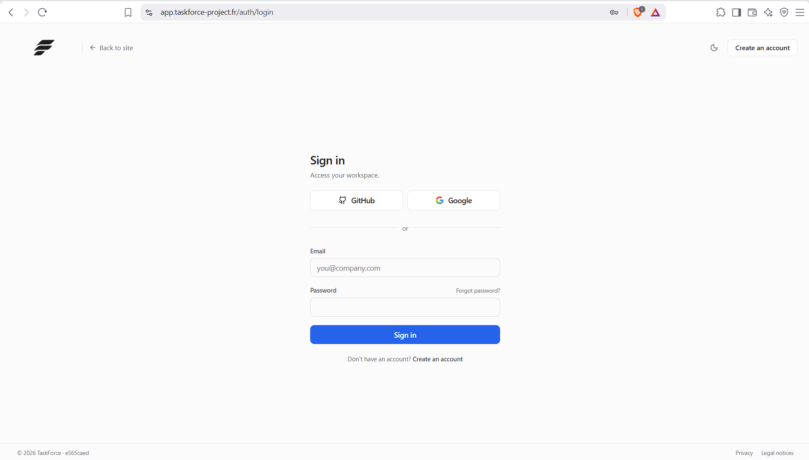

Vient ensuite un onboarding court et non sautable, car il alimente le moteur d'affectation. À l'étape des compétences, l'utilisateur déclare son rôle, ses savoir-faire, que l'assistant propose à partir de l'intitulé de poste, et sa capacité hebdomadaire. Ces trois entrées, compétences, disponibilité et charge, sont précisément celles que le smart-assign combinera.

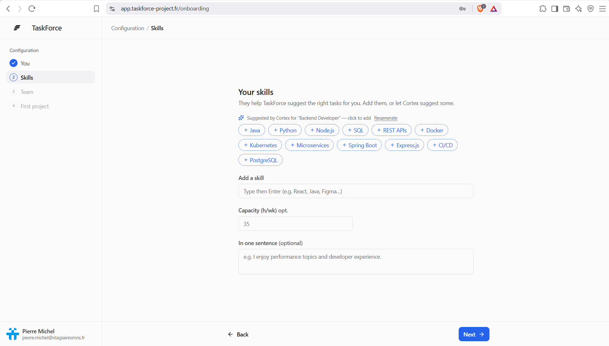

Le tableau de bord donne la vue d'ensemble : les projets, la file de travail personnelle, quelques indicateurs, et la consommation d'intelligence artificielle mesurée en jetons, rendue visible plutôt que masquée.

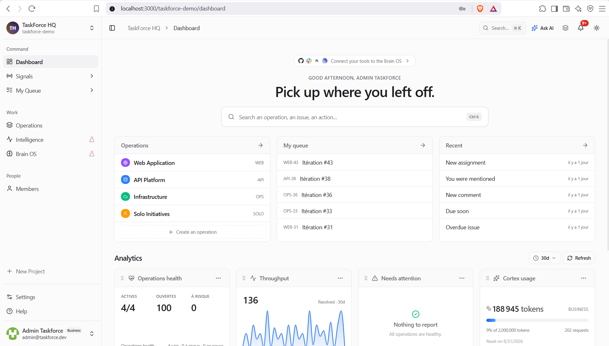

Le cœur du produit se déclenche sur les tâches non affectées. À l'échelle d'un lot, l'outil propose une affectation par tâche, assortie d'un score, que le responsable coche ou décoche avant de l'appliquer en une fois.

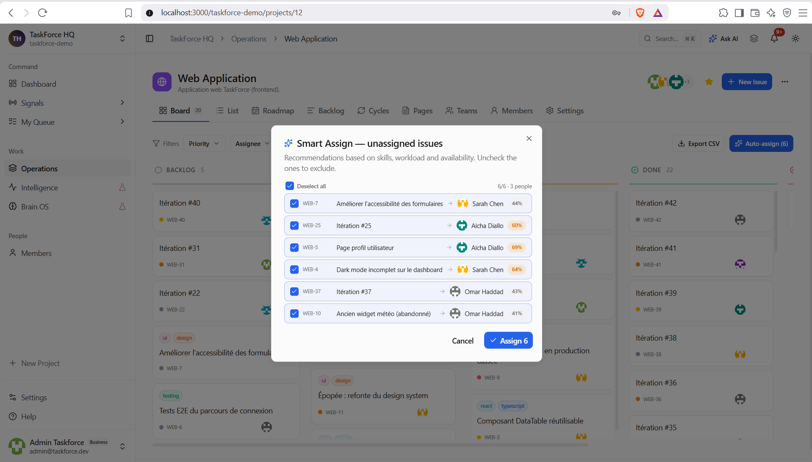

Sur une tâche donnée, la recommandation se détaille : un meilleur candidat, un score décomposé en ses facteurs, correspondance sémantique, charge, disponibilité et historique, et une justification lisible. Le responsable garde la main : il peut affecter, examiner les autres candidats ou relancer l'analyse.

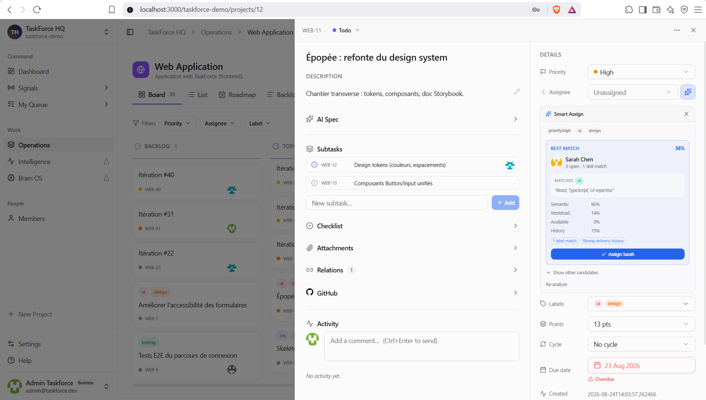

La gouvernance, enfin, se lit sur la page des membres : chacun porte un rôle, ses compétences et ses projets, et une action permet de rééquilibrer la charge de l'équipe.

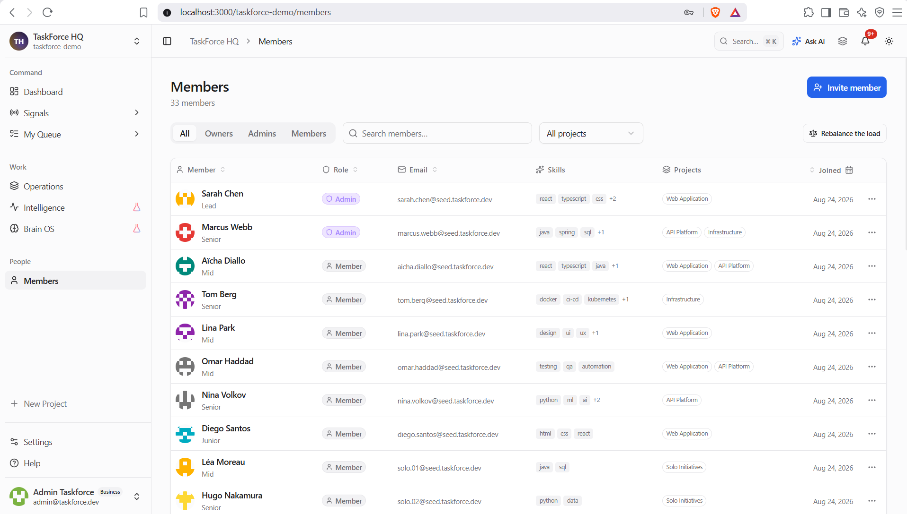

Cette continuité, d'un écran sobre au suivant, repose sur un système de composants accessibles et un parti pris de lisibilité, au service de l'usage plutôt que de la démonstration.

#### 4.2 Du besoin au dossier de conception et cas d'usage
<!-- Critères : C7 [E8]. Sources : Dossier_Conception, STB, Diagramme_Cas_Usage_UML (3 acteurs RBAC). Figure = mermaid réutilisé, chat retiré. -->

La conception commence par traduire un besoin en modèle. J'ai formalisé le besoin exprimé dans le dossier de spécifications en un modèle de cas d'usage, qui énonce pour chaque acteur ce que le système doit lui permettre. Trois acteurs humains, du collaborateur au propriétaire, et deux acteurs non humains, le prestataire de paiement et les ordonnanceurs système, en structurent la vue d'ensemble.

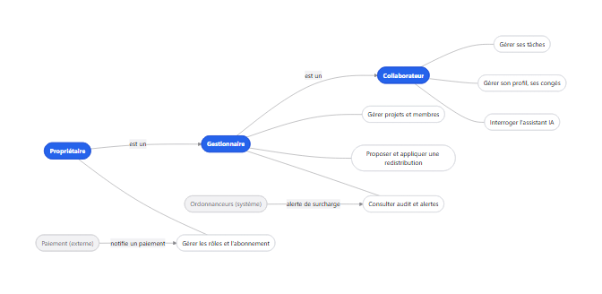

La valeur de ce modèle tient à sa fidélité, car chaque cas correspond à une garde d'autorisation réellement présente dans le code, ce qui en fait une spécification vérifiable plutôt qu'une déclaration d'intention. La hiérarchie des acteurs s'y lit comme un héritage, le gestionnaire disposant des cas du collaborateur augmentés des siens et le propriétaire de l'ensemble. Au centre, un cas concentre la valeur du produit, la redistribution assistée, qui propose une réaffectation puis l'applique après validation, et c'est ce modèle qui commande les artefacts de conception détaillés ensuite, du diagramme de classes au modèle de données.

#### 4.3 Modélisation UML : classes, séquences, états
<!-- Critères : C8 [E8]. Sources : Diagramme_Classes_UML (38 entités), Diagrammes_Sequence_UML (6 parcours), Diagramme_Etats_UML. [FIGURE : classes] [FIGURE : séquence smart-assign]. -->

La conception s'est appuyée sur trois vues complémentaires : les classes du domaine, les séquences d'exécution et les états des objets qui évoluent.

Le modèle de classes fixe le vocabulaire du domaine et ses relations. La figure suivante en donne une vue volontairement simplifiée, réduite aux entités principales sur la quarantaine que compte le projet. On y lit l'ossature multi-locataire : tout gravite autour de l'organisation, à laquelle appartiennent les membres et les projets ; le rôle y est un attribut, non une entité, conformément au choix d'un contrôle d'accès porté par les données. À chaque membre est associé un profil de compétences, qui porte les entrées nourrissant l'affectation, compétences et capacité, complétées ailleurs par les congés et l'historique.

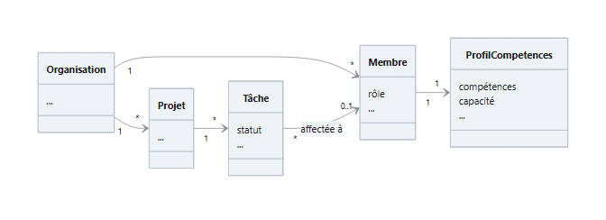

La vue dynamique la plus significative est celle du smart-assign, que la séquence ci-dessous retrace. Une demande de recommandation traverse le contrôleur puis le service, qui reconstitue les métriques de chaque candidat depuis la base, écarte les absents, retient une liste courte par un pré-filtre pondéré, la soumet au modèle via la passerelle, en tire un score final et journalise la décision avant de la renvoyer. Chaque étape est vérifiable dans le code, et la journalisation nourrit l'historique qui, en retour, pondère les recommandations suivantes.

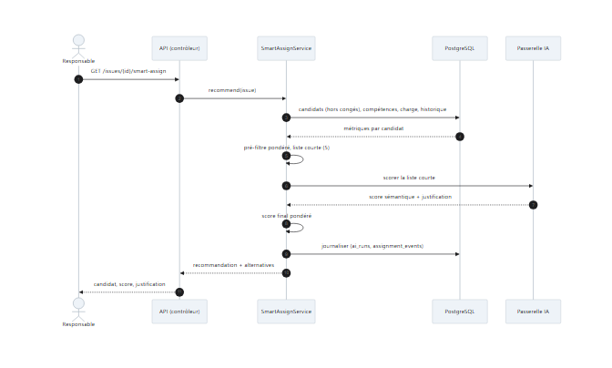

Enfin, je modélise par des états les objets à cycle de vie, au premier rang desquels l'issue, du backlog au terminé en passant par en cours, avec une sortie possible vers annulé. Ces états ne sont pas décoratifs, puisqu'ils conditionnent les calculs, la charge d'un membre ne comptant que ses tâches encore ouvertes.

#### 4.4 Modèle de données MCD/MLD et persistance
<!-- Critères : C8, C9 [E8]. Sources : Modele_Donnees_MCD_MLD (MERISE), Dictionnaire_Donnees (50 tables/94 FK), migrations Flyway. Illustratif : 3 principes + extrait SQL, pas les 50 tables. -->

Le passage du modèle de classes à la base relationnelle obéit à quelques principes, plus instructifs que le détail des cinquante tables et quatre-vingt-quatorze clés étrangères que compte le schéma.

Le premier est l'isolation multi-locataire : chaque table métier porte une clé `workspace_id`, le discriminant qui cantonne les données d'une organisation. Le deuxième est le contrôle du schéma par le code : soixante-quinze migrations Flyway, versionnées et rejouables, décrivent chaque évolution, et l'application refuse de démarrer si le schéma réel s'écarte de celui qu'elle attend. Le troisième est la persistance vectorielle native : plutôt qu'une base séparée, PostgreSQL stocke les vecteurs d'embedding via pgvector, indexés pour la recherche de similarité ; le profil de compétences en provisionne un, réservé à un futur matching sémantique, tandis que les champs souples sont stockés en JSON binaire.

La table du profil de compétences réunit ces trois traits :

```sql
CREATE TABLE member_skill_profiles (
  workspace_id   BIGINT  NOT NULL REFERENCES workspaces(id),
  user_id        BIGINT  NOT NULL REFERENCES users(id),
  skills_json    JSONB,
  capacity_hours INTEGER,
  embedding      vector(384)
);
CREATE INDEX ON member_skill_profiles USING hnsw (embedding vector_cosine_ops);
```

On y lit le discriminant d'organisation, le stockage flexible des compétences et la capacité qui pèse dans le score ; le vecteur d'embedding, lui, reste provisionné pour un futur matching sémantique, quand le smart-assign actuel se fonde sur les compétences déclarées et le score du modèle. Le tout tient dans une seule table d'une seule base.

#### 4.5 Architecture logicielle : C4, modules, multi-tenant
<!-- Critères : C10 [E8]. Sources : Architecture_C4, Modules (shared/core/modules), Journal_Decisions_ADR. Figure C4 conteneurs redessinée à la DA. -->

Je décris l'architecture selon le modèle C4 de Simon Brown [17], qui la donne à voir à plusieurs échelles emboîtées, et j'en retiens ici les deux plus parlantes, celle des conteneurs qui composent le système déployé et celle des modules qui structurent le code à l'intérieur.

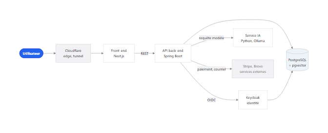

Au niveau des conteneurs, la figure donne la vue d'ensemble. L'utilisateur atteint le système par le bord de Cloudflare, qui sert le front-end Next.js ; celui-ci appelle une API Spring Boot, seul point d'entrée du métier. L'API délègue l'identité à Keycloak, persiste dans PostgreSQL étendu de pgvector, et confie l'inférence à un service d'intelligence artificielle distinct ; les services externes, paiement et courriel, restent en périphérie. Chaque conteneur porte une responsabilité unique.

Au niveau du code, le back-end forme un monolithe modulaire organisé en couches dont les dépendances pointent toutes vers l'intérieur, un socle partagé, un noyau métier qui s'appuie dessus, et des modules applicatifs qui s'appuient sur le noyau sans jamais l'inverse. Cette discipline procure l'isolation d'une architecture distribuée sans son coût de coordination, et prépare l'extraction d'un module en service autonome le jour où l'échelle l'exigerait.

À l'intérieur de ces couches, quelques patrons de conception reviennent, choisis pour leur sobriété. L'injection par constructeur et le patron « dépôt » isolent l'accès aux données ; un convertisseur d'attribut chiffre de façon transparente certains champs ; un intercepteur centralise le contrôle d'accès entre organisations ; un objet de transfert valide et découple les entrées de l'API ; et une passerelle masque le fournisseur du modèle d'inférence derrière une interface unique. Chacun résout un problème récurrent tout en gardant le code lisible.

L'isolation multi-locataire, enfin, traverse toute l'architecture : chaque requête est rattachée à une organisation, et aucune donnée ne franchit cette frontière, garantie au niveau du service plutôt que laissée à la vigilance de chaque appel. La conception ainsi posée, de l'intention aux modèles, laisse place à la réalisation, objet de la partie suivante.

---

## Partie III — Construire le produit

<!-- Mouvement 3 : ce que j'ai construit. Les deux blocs démontrés en soutenance. -->

### 5. Développement du front-end

#### 5.1 Interface et charte graphique
<!-- Critères : C13, C14 [E11]. Sources : Design_System (tokens light/dark, Inter/SF Pro, shadcn/Radix, Lucide), globals.css. -->

Toute l'identité visuelle de l'application repose sur un fichier unique de jetons, `globals.css`, où une centaine de variables décrivent les couleurs, les rayons, les ombres et la typographie que Tailwind reprend ensuite en utilitaires. J'ai posé ce principe pour ne jamais avoir à choisir une couleur au fil d'un composant, puisque chaque valeur se lit dans un jeton sémantique comme `--primary` ou `--border`, de sorte qu'une refonte de la charte se joue dans ce seul fichier sans qu'aucun écran ait à être retouché.

Le thème sombre n'ajoute pas une seconde feuille de style mais redéfinit ce même jeu de jetons, ce qui permet à chaque composant de s'écrire une fois et de suivre ensuite le thème courant. J'ai d'ailleurs préféré animer le basculement par une transition de vue, un cercle de lumière qui s'ouvre depuis le curseur, plutôt que de recharger la page.

Le parti graphique est volontairement plat, inspiré du tableau de bord de Cloudflare, avec des surfaces opaques et des ombres à peine perceptibles. Ce choix n'a rien de purement esthétique, car un outil que l'on garde ouvert toute la journée doit d'abord rester lisible, et le verre dépoli, séduisant sur une page d'accueil, finit par fatiguer l'oeil dès qu'il faut parcourir un tableau dense.

La couleur elle-même a été mise au travail. Un bleu de marque unique porte l'ensemble des actions engageantes, du bouton principal à la case cochée en passant par l'anneau de focus, là où ces éléments, auparavant noirs, se confondaient avec le texte. En réservant cette teinte aux seules actions, je suis le principe que défendent Wathan et Schoger dans *Refactoring UI*, pour qui la couleur doit d'abord guider l'action plutôt que décorer l'écran, de sorte qu'elle devient un repère que l'utilisateur n'a besoin d'apprendre qu'une fois [13].

Le même souci de cohérence gouverne la typographie et l'espacement. J'ai retenu Inter comme police de lecture, avec un repli sur SF Pro Text puis sur la pile système, et réservé JetBrains Mono au code, tandis qu'un rayon de référence de dix pixels, dont dérive toute l'échelle des arrondis, suffit à donner à l'interface son unité d'un écran à l'autre.

Je n'ai pas davantage cherché à réinventer les composants, préférant m'appuyer sur la bibliothèque shadcn/ui, posée sur les primitives accessibles de Radix, et sur les icônes de Lucide, en laissant les jetons porter tout le style. Seules les pages d'authentification conservent quelques classes sur mesure, afin d'offrir un passage volontairement épuré.

#### 5.2 UX, parcours et accessibilité
<!-- Critères : C15 [E11]. WCAG 2.1 AA : 0 violation axe-core sur 3 pages (22/07), test durci de "critical" à "serious". Sources : Accessibilite (à étoffer), Bloc2. -->

Plutôt que d'affirmer que l'application est accessible, j'ai choisi de le vérifier automatiquement. Un scénario Playwright charge trois pages représentatives, la connexion, le tableau de bord et la liste des membres, y injecte axe-core et applique les règles WCAG 2.1 de niveaux A et AA, la vérification échouant dès qu'une violation critique ou sérieuse y subsiste. Rattachée à la suite de bout en bout, elle s'exécute à la demande plutôt qu'à chaque poussée (cf. 5.6), car elle requiert la pile complète levée.

Ce seuil, je l'ai resserré en cours de route, et l'épisode est instructif. Tant que le test ne bloquait que sur les violations critiques, il affichait fièrement un score parfait ; en l'étendant aux violations sérieuses, j'ai vu remonter des défauts bien réels, quatre sur la seule page de connexion et six sur le tableau de bord, que le filtre précédent laissait passer sans les voir.

La cause tenait presque toujours au contraste. Quatre gris de libellé hérités d'une palette iOS se situaient entre 2:1 et 3,1:1 sur fond clair, quand le critère 1.4.3 des WCAG en réclame 4,5 pour du texte courant [6], et ils portaient un contenu que l'on ne pouvait pas négliger, du sous-titre de connexion jusqu'aux liens légaux. Je les ai assombris en conservant la hiérarchie entre les niveaux, ce qui a suffi à repasser sous le seuil.

L'accessibilité ne se réduit pas pour autant à ce test, puisque l'interface propose de véritables réglages qui vont de l'agrandissement du texte au mode de lecture destiné à la dyslexie, en passant par un thème à fort contraste et des filtres de correction pour le daltonisme. Ces options prolongent une règle que je me suis fixée dès le départ et qui consiste à ne jamais confier une information à la seule couleur, mais à toujours la doubler d'une icône ou d'un mot, comme l'exige d'ailleurs le critère 1.4.1 des mêmes recommandations [6].

Je reste néanmoins mesuré sur la portée de l'exercice, car un outil automatique ne couvre qu'une partie des critères. L'ordre de tabulation, l'absence de piège au clavier ou la cohérence des titres reposent surtout sur les primitives accessibles de Radix, que je n'ai pas encore auditées manuellement, et je préfère l'indiquer clairement plutôt que de le passer sous silence.

#### 5.3 Qualité, sécurité et écoconception du code front
<!-- Critères : C16 [E11]. ESLint, TypeScript strict, CSP/CORS/HSTS, validation Zod câblée (login+register). Renvoi sécu ch. 7. -->

La qualité du code front s'appuie d'abord sur deux garde-fous automatiques : TypeScript tourne en mode strict, ce qui m'interdit le type `any` implicite, tandis qu'ESLint applique les règles `core-web-vitals` et `typescript` de Next, l'un et l'autre s'exécutant en intégration continue sans que je tolère la moindre exception hors des fichiers de test.

La validation des entrées obéit à la même logique de schéma, cette fois confiée à Zod. Les schémas de connexion et d'inscription contrôlent les formulaires avant tout appel réseau, en imposant un nom valide, un mot de passe suffisamment robuste et sa confirmation, tout en écartant les adresses jetables ; et comme ce schéma sert également à typer le formulaire, la validation et le typage ne peuvent jamais se contredire.

Les en-têtes de sécurité sont déclarés une fois pour toutes les routes dans `next.config.ts`, autour d'une Content-Security-Policy qui n'autorise par défaut que l'origine du site et ne s'ouvre qu'au strict nécessaire, c'est-à-dire à l'API, au stockage objet, à la connexion temps réel et au captcha. Le reste de la politique referme les portes les plus courantes en interdisant l'inclusion de l'application dans une frame, en verrouillant l'envoi des formulaires sur sa propre origine et en forçant chaque requête en HTTPS, tandis qu'un HSTS d'un an et quelques en-têtes complémentaires achèvent de durcir les réponses.

L'écoconception, enfin, n'est pas une couche que j'aurais ajoutée à la fin, mais la conséquence des mêmes choix. La vitrine est rendue en statique par Astro, qui n'expédie de JavaScript que pour les îlots interactifs et fractionne finement le code, si bien que la page d'accueil de production ne transfère qu'environ 390 kilooctets pour trente et une requêtes ; l'application Next reprend ce fractionnement par route, avec chargement différé et images optimisées en WebP. S'y ajoutent un design plat qui n'impose ni dégradés ni flou à recalculer, des polices sous-ensemblées à la volée, et une centralisation des appels réseau qui déduplique les requêtes et tait celles d'arrière-plan, sans jamais recourir à des données fictives. Le durcissement le plus profond, du modèle de menaces au chiffrement au repos, relève quant à lui du chapitre 7, dont le front ne constitue que le premier maillon.

#### 5.4 Consommation sécurisée de l'API
<!-- Critères : C17 [E12]. client.ts (Axios + JWT + refresh), STOMP authentifié. Refresh token en cookie HttpOnly (durci avant bêta) ; access token court côté client. Détail chap. 7.2. -->

Le front n'interroge jamais l'API directement, car tous les appels passent par un client Axios unique, `lib/api/client.ts`, que j'importe partout sous le même nom et dont l'URL de base s'adapte selon qu'il s'exécute côté serveur ou dans le navigateur. Cette centralisation me donne un point d'entrée unique où brancher l'authentification, les délais d'attente et le traitement des erreurs, au lieu de les disséminer dans chaque composant.

À l'aller, un intercepteur ajoute le jeton d'accès en en-tête d'autorisation sur les appels protégés et le retire au contraire sur les points d'entrée publics, afin qu'un jeton expiré n'y provoque pas un refus inutile. Au retour, un second intercepteur prend en charge l'expiration sans que l'utilisateur s'en aperçoive, puisque, devant un refus d'authentification, il tente un rafraîchissement, enregistre le nouveau couple de jetons, rejoue une seule fois la requête d'origine et ne déconnecte la session qu'en dernier recours, silencieusement.

Le choix du stockage engage la sécurité, et je l'ai fait évoluer avant l'ouverture de la bêta. Le jeton de rafraîchissement, le plus sensible puisqu'il rouvre à lui seul une session, vit désormais dans un cookie `HttpOnly` que le JavaScript ne peut pas lire et ne transite plus en clair dans les réponses, de sorte qu'une injection réussie ne suffirait plus à le dérober. Le jeton d'accès, lui, reste de courte durée et manipulé côté client, le temps de porter l'en-tête d'autorisation. Cette voie d'entrée est par ailleurs fermée en amont, puisque React échappe systématiquement les valeurs affichées, que les entrées sensibles sont filtrées par DOMPurify et qu'aucun composant ne rend de HTML utilisateur brut. Ce durcissement, comme les autres correctifs menés avant la bêta, est détaillé au chapitre 7.

Le temps réel obéit à la même exigence d'authentification, dans la mesure où les notifications et les mises à jour de projet transitent par une connexion STOMP qui présente le même jeton, de sorte qu'aucun flux ne s'ouvre sans identité vérifiée.

J'ai enfin distingué deux familles d'erreurs selon leur origine. Les pannes systémiques, qu'il s'agisse d'une coupure réseau, d'une erreur serveur ou d'un excès de requêtes, déclenchent une notification globale parce qu'elles affectent tout l'onglet, tandis que les erreurs métier remontent à l'appelant, qui affiche le message adapté au formulaire concerné. J'évite ainsi les doublons et les fausses alertes, tout en respectant deux des heuristiques d'utilisabilité de Nielsen, la visibilité de l'état du système et la prévention des erreurs [14].

#### 5.5 Tests du front-end
<!-- Critères : C18 [E13] seuil ≥ 50 %. -->

##### 5.5.1 Périmètre et méthode
<!-- Vitest sur la logique (lib/hooks/components/auth), Playwright sur les routes/présentation. -->

Je teste le front avec deux outils dont les rôles se complètent. Vitest, exécuté dans un environnement de rendu léger, couvre la couche logique, c'est-à-dire la bibliothèque interne, les hooks et les composants d'authentification, là où un défaut coûte cher sans jamais se voir à l'oeil. Playwright, de son côté, pilote une pile réelle amorcée en base et rejoue les parcours qu'un test unitaire ne peut pas atteindre, de l'authentification complète à la redistribution de charge en passant par l'accessibilité. Ce partage est assumé jusque dans la configuration, qui écarte volontairement les routes et les composants de présentation de la couverture unitaire, dans la mesure où les tests de bout en bout les exercent déjà.

##### 5.5.2 Résultats et couverture
<!-- ~92 % lignes (périmètre logique), ~781 tests. Re-mesurer avant rendu, une seule valeur datée. -->

Sur cette couche logique, la suite réunit soixante-sept fichiers et plus de huit cents cas, et l'intégration continue en verrouille la couverture à 70 % des lignes au minimum, seuil porté à 90 % sur les modules les plus sensibles comme le service d'authentification et les stores et contextes d'état. Le dernier relevé, reproduit ci-dessous, se situe nettement au-dessus de ce plancher.

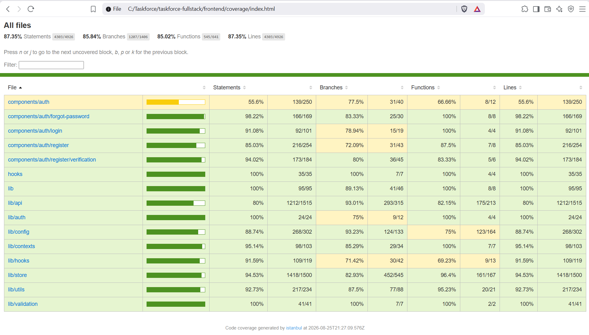

Mesuré le 25 août 2026, ce périmètre atteint 87 % de lignes couvertes et près de 86 % de branches, une marge suffisamment large au-dessus du seuil pour me laisser refondre un module sans faire aussitôt tomber la barrière.

##### 5.5.3 Réserve assumée sur le périmètre
<!-- Le chiffre EXCLUT 48 routes + composants de présentation (couverts par Playwright). Le dire soi-même. -->

Ce chiffre appelle une précision de méthode, que je préfère donner moi-même plutôt que de la laisser à l'interprétation d'un badge. J'ai testé en priorité ce qui casse le plus cher, la bibliothèque interne, les hooks, l'authentification et le client d'API, avant de chercher un pourcentage flatteur sur des fichiers qui ne le méritaient pas. Courir après les cent pour cent d'un composant de présentation, déjà exercé par les parcours de bout en bout, aurait consommé un temps rare sans retirer le moindre risque réel. Les 87 % portent donc sur la couche logique et laissent volontairement de côté les routes et l'affichage, non par négligence mais par arbitrage assumé : la couverture y suit le risque plutôt que la vanité du chiffre.

##### 5.5.4 Cahier de recette fonctionnelle
<!-- Recette manuelle : fonctionnalité, emplacement, statut (non testable / validé / erreur), commentaire. Artefact conservé. -->

Aux tests automatisés s'ajoute une recette fonctionnelle, tenue à la main pour valider chaque parcours du point de vue de l'utilisateur. Chaque entrée y nomme la fonctionnalité, l'emplacement où la vérifier dans l'application, un statut, non testable, validé ou en erreur, et un espace de commentaire pour consigner l'anomalie éventuelle. Le cahier complet est conservé comme artefact ; en voici un extrait représentatif.

| Fonctionnalité | Emplacement | Statut | Commentaire |
|---|---|---|---|
| Connexion par mot de passe | `/auth/login` | Validé | — |
| Connexion par fournisseur externe | `/auth/login` | Validé | GitHub et Google |
| Onboarding des compétences | `/onboarding` | Validé | Suggestions IA cohérentes |
| Recommandation d'affectation | Tableau d'un projet | Validé | Score et justification affichés |
| Redistribution de charge | Page des membres | Validé | Aperçu avant application |
| Export RGPD des données | Réglages du compte | Validé | Fichier structuré |
| Paiement et changement de plan | Facturation | Non testable | Événements Stripe réels à rejouer |

Cette recette a couvert l'ensemble des parcours livrés ; la seule entrée non validée, le paiement de bout en bout, correspond à la limite déjà signalée d'une campagne de test avec de vrais événements Stripe.

#### 5.6 Industrialisation du front
<!-- Critères : C19 [E14]. frontend-tests.yml, e2e-tests.yml, Dependabot. -->

Chaque poussée de code déclenche GitHub Actions, où le workflow `frontend-tests.yml` enchaîne trois étapes dont les exigences vont croissant. L'analyse ESLint ouvre la marche sans bloquer la construction, à simple visée d'information, avant que ne viennent les tests unitaires et leur couverture, complets sur les branches protégées et restreints aux fichiers modifiés ailleurs, dont le rapport remonte vers Codecov et s'affiche sur la demande de fusion ; le contrôle de types et la construction de production ferment enfin la marche et ne s'exécutent que si les étapes précédentes ont réussi.

Les tests de bout en bout disposent de leur propre chaîne, qui lève une pile Dockerisée complète, amorce la base et lance Playwright, et que j'active par une variable du dépôt afin qu'une dépendance externe momentanément indisponible ne vienne jamais bloquer une évolution purement fonctionnelle.

La vitrine suit pour sa part une chaîne distincte, qui la construit, contrôle son typage, mesure sa qualité avec Lighthouse et vérifie ses dépendances aussi bien par un audit de vulnérabilités que par la revue de dépendances de GitHub. Toutes ces barrières n'ont pas le même poids et je l'assume, puisque le style reste indicatif et les tests de bout en bout désactivés par défaut, de sorte que la mise en production dépend en dernier ressort du contrôle de types, de la construction et du seuil de couverture. La vue d'ensemble de ces chaînes, front et back réunis, figure au chapitre 8.

#### 5.7 Performances et SEO
<!-- Critères : C20 seuil ≥ 70 %. Audit Lighthouse 26/08/2026 (captures lighthouse-landing / lighthouse-app) : vitrine 81/100/100/100, app 67/96/96/100. -->

J'ai confié le référencement à la vitrine Astro plutôt qu'à l'application, et ce partage tient à la nature même des deux surfaces. Le site public, ouvert et destiné à être indexé, émet les URL canoniques, les cartes de partage social, la politique `robots` et un plan de site généré sur une soixantaine de pages, là où l'application, qui vit derrière l'authentification, n'a rien à exposer aux moteurs et se contente donc de métadonnées réduites au minimum.

Sur cette vitrine, Lighthouse mesure la qualité en continu, à chaque demande de fusion et sur trois exécutions, en ne retenant l'accessibilité que comme seule exigence réellement bloquante, à 0,95, tandis que la performance, les bonnes pratiques et le référencement restent contrôlés en simple avertissement. Un audit manuel des deux surfaces, mené au moteur Lighthouse en août 2026, en donne l'état réel.

| Surface | Performance | Accessibilité | Bonnes pratiques | SEO |
|---|:---:|:---:|:---:|:---:|
| Site vitrine (Astro, Vercel) | 81 | 100 | 100 | 100 |
| Application (Next.js) | 67 | 96 | 96 | 100 |


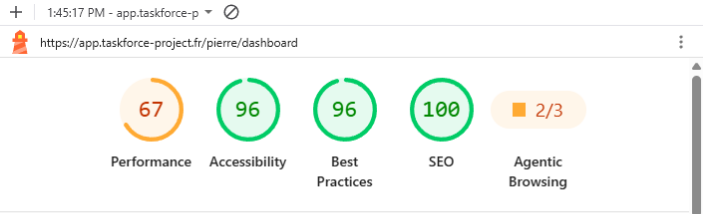

Je préfère présenter ces chiffres tels quels. Le référencement et l'accessibilité tiennent le haut du tableau, au maximum ou tout près sur les deux surfaces, ce qui valide le partage des rôles décrit plus haut, la surface publique étant faite pour être trouvée quand l'application, elle, n'a presque rien à exposer aux moteurs. Les bonnes pratiques sont elles aussi solides, parfaites sur la vitrine et à 96 sur l'application, les quelques points manquants tenant à des avertissements mineurs relevés par Lighthouse plutôt qu'à un défaut de fond. La performance, enfin, est l'axe qui garde le plus de marge, à 81 sur la vitrine et 67 sur l'application, et c'est là que se concentrent mes optimisations à venir, du poids des images de la page d'accueil au JavaScript d'hydratation de l'application.

Cette marge n'est pas une fatalité, car l'essentiel de la performance se joue dès l'architecture. L'App Router et les composants serveur réduisent la quantité de JavaScript envoyée au navigateur, les routes sont découpées et les polices sous-ensemblées, de sorte que le socle est sain ; ce qui reste à gagner relève du réglage fin, préchargement des ressources critiques, compression et report du non essentiel, plutôt que d'une refonte.

### 6. Développement du back-end

#### 6.1 Persistance et sécurité en profondeur
<!-- Critères : C21 [E15]. WorkspaceAccessInterceptor, AuditableEntity, EncryptedStringConverter (AES-256-GCM). -->

La sécurité du back-end ne repose pas sur une barrière unique, mais sur plusieurs lignes de défense superposées dont la première garantit l'isolation entre organisations. Plutôt que de confier cette vérification à chaque contrôleur, je l'ai centralisée dans un intercepteur qui capte toute requête visant une sous-ressource d'organisation et refuse l'accès à quiconque n'appartient pas à l'espace concerné.

```java
// Toute route /api/workspaces/{slug}/... est contrôlée avant d'atteindre le contrôleur
if (!workspaceMemberRepository.existsByWorkspaceIdAndUserId(workspaceId, userId)) {
    throw new ForbiddenException(
        "Accès refusé : vous n'êtes pas membre de cet espace de travail");
}
```

En regroupant ce contrôle en un seul point, je referme d'un coup toute une famille d'accès directs non autorisés, là où une vérification disséminée dans chaque méthode aurait tôt ou tard laissé passer un oubli. La traçabilité obéit à la même volonté d'uniformité, mais s'obtient cette fois par héritage : toute entité persistante étend une classe de base auditée, si bien que l'audit de Spring renseigne seul, à chaque écriture, l'auteur et la date de création comme ceux de la dernière modification, sans qu'aucun développeur ait à y songer.

Les données les plus sensibles franchissent enfin une dernière ligne, celle du chiffrement au repos. Un convertisseur applique AES-256 en mode GCM, un algorithme authentifié capable de détecter toute altération, avec un vecteur d'initialisation propre à chaque valeur, et j'ai choisi de le réserver aux véritables secrets, tels les jetons d'intégration ou les messages commerciaux, plutôt que de l'étendre à une base dont la confidentialité relève déjà du chiffrement de volume et du cloisonnement réseau.

#### 6.2 Qualité, sécurité et écoconception du code back
<!-- Critères : C22 [E16]. shared/core/modules, Virtual Threads Java 21. Scans Trivy/Semgrep en CI (security-scan.yml). -->

Le back-end s'organise en un monolithe modulaire de trois couches superposées, un socle partagé, un noyau métier et des modules applicatifs, dont les dépendances ne pointent jamais que vers l'intérieur. Cette discipline me procure l'isolation d'un découpage en services sans m'en imposer le coût d'exploitation, tout en gardant ouverte la possibilité d'extraire un module le jour où la charge l'exigerait. Je dois toutefois reconnaître qu'elle tient aujourd'hui à la revue et à la rigueur des imports, non à un test qui la ferait respecter à la compilation, et rendre cette contrainte exécutable au moyen d'une règle ArchUnit, capable de briser la construction dès qu'une dépendance remonte à contre-courant, figure à ce titre dans mon registre de dette, car il me paraît plus honnête de l'écrire que de la laisser entendre.

Le code tire par ailleurs parti de Java 21, avec une injection par constructeur qui garde les dépendances immuables et un recours ponctuel aux fils virtuels pour les traitements longs et sans retour, comme la génération de l'assistant, sans que j'aie pour autant basculé toute la plateforme sur ce modèle faute d'un besoin qui le justifie. La sécurité, elle, ne s'arrête pas à la relecture humaine, puisque le code et ses dépendances passent à chaque poussée sous l'analyse statique de Semgrep et de CodeQL et sous celle des dépendances par Trivy, qui interrompent la construction dès qu'ils rencontrent une vulnérabilité ou une configuration dangereuse de gravité critique, l'ensemble de cette posture étant détaillé au chapitre 7. La sobriété, enfin, procède du même effort d'architecture, car en évitant la multiplication des échanges réseau d'un système distribué, en paginant les requêtes et en n'interrogeant le modèle d'affectation que sur cinq candidats pré-filtrés, l'application consomme structurellement moins ; et l'inférence s'appuie sur un petit modèle local dimensionné pour la tâche plutôt qu'un grand modèle distant, un juste calcul qui évite le sur-dimensionnement.

#### 6.3 Paiement et monétisation
<!-- Critères : C23 [E17]. Stripe Checkout, 5 webhooks (signature, idempotence stripe_event_id UNIQUE), portail, anti-rétrogradation Business/Basic. Reste : test avec de vrais événements Stripe. -->

La monétisation suit le modèle en libre-service décrit au premier chapitre, que la mise en œuvre technique rend effectif. La grille compte quatre paliers, facturés au membre et par mois, le nombre de membres restant lui-même sans plafond.

| Palier | Prix (au membre / mois) | Pour qui | Ce qu'il ouvre |
|---|:---:|---|---|
| **Free** | 0 € | équipes qui démarrent | produit complet à petite échelle, IA comprise, sous plafonds d'usage |
| **Basic** | 10 € (8 € en annuel) | petites équipes | plafonds relevés, plus d'espaces, historique étendu |
| **Business** | 16 € (13 € en annuel) | équipes en croissance | analyses avancées, intégrations, flux IA, large quota de jetons |
| **Enterprise** | sur devis | grands comptes, secteurs réglementés | authentification unique, audit, déploiement dédié ou sur site |

Les montants affichés sont ceux de la grille de lancement, volontairement indicatifs : ils résultent d'un benchmark concurrentiel, un exercice utile mais qui reste rationnel là où la valeur perçue et le comportement d'achat, eux, ne le sont pas toujours. Ils sont donc appelés à évoluer, sans doute à la hausse au regard de la valeur délivrée, la facturation réelle étant de toute façon portée par Stripe et ajustable à tout moment. L'offre Entreprise sort du libre-service, car elle se traite au contact commercial et ouvre des capacités propres aux grands comptes, de l'authentification unique à l'audit et au déploiement sur site (*on-premise*), qu'exigent les organisations ne pouvant héberger leurs données chez un tiers.

Le paiement s'appuie sur Stripe Checkout, en mode abonnement facturé au siège, ce qui me permet d'ouvrir une session hébergée par Stripe sans que l'application manipule jamais un numéro de carte, la donnée bancaire sortant de fait de mon périmètre de conformité. L'état de l'abonnement me revient ensuite par cinq webhooks, de la session réglée aux factures payées ou échouées, chacun authentifié par sa signature avant tout traitement, de sorte que ce point d'entrée peut rester public sans exposer l'application, sa légitimité tenant à la signature et non à une session.

Restait à traiter le fait qu'un webhook peut être rejoué, au risque de compter deux fois le même événement. J'ai donc enregistré l'identifiant de chaque événement sous une contrainte d'unicité et fait s'interrompre tout traitement qui reconnaît un identifiant déjà vu, de manière à confier l'idempotence à la base elle-même plutôt qu'à une précaution applicative que l'on pourrait oublier d'écrire.

```sql
CREATE UNIQUE INDEX idx_subscription_history_stripe_event_id
    ON subscription_history (stripe_event_id) WHERE stripe_event_id IS NOT NULL;
```

Un dernier cas m'a demandé une vigilance particulière, celui d'une mise à jour d'abonnement qui viendrait rétrograder par erreur un compte Business en Basic : lorsqu'un identifiant de tarif peut correspondre à plusieurs plans, je préfère renvoyer une valeur indéterminée et ignorer le changement plutôt que d'appliquer une rétrogradation injustifiée. La gestion courante, du moyen de paiement à la résiliation, est quant à elle déléguée au portail client de Stripe ouvert depuis l'application, et il me reste à mener une campagne de test complète avec de vrais événements, que je présente comme la prochaine étape et non comme un acquis.

#### 6.4 API REST sécurisée
<!-- Critères : C24 [E18]. Keycloak OIDC RS256 (password grant, PAS Authorization Code), @Valid DTOs, OpenAPI/Swagger. Renvoi OWASP ch. 7. -->

L'API se comporte en serveur de ressources OAuth 2, où chaque requête protégée porte un jeton JWT signé en RS256 par Keycloak que le back-end valide contre le jeu de clés publiques du serveur d'identité en vérifiant l'émetteur, sans jamais conserver d'état de session et sans que la clé de signature ne quitte Keycloak.

Pour la connexion, j'ai retenu le flot « mot de passe », dans lequel le front remet les identifiants au back-end qui les échange contre un jeton auprès de Keycloak, sans exposer ce dernier au navigateur. Je n'ignore pas que ce flot est désormais déconseillé par les bonnes pratiques OAuth au profit du flot « code d'autorisation » (Authorization Code) avec PKCE, et je l'assume dans la mesure où le back-end demeure un client de confiance et l'unique intermédiaire, tout en inscrivant la migration parmi les évolutions à mener.

La validation des données entrantes intervient dès la frontière, chaque contrôleur annotant ses objets de transfert de contraintes que le serveur applique avant que la requête n'atteigne le métier, de sorte qu'une charge malformée est rejetée d'emblée avec une erreur normalisée. Le contrat, enfin, est décrit en OpenAPI et se consulte dans Swagger UI, et comme il est généré depuis le code lui-même, il ne risque pas de dériver d'une documentation entretenue à part.

#### 6.5 Le moteur IA et le smart-assign
<!-- Illustration du cas d'usage (demande explicite). Le "ce que ça change" du produit. Source : 02-produit/IA. -->

S'il fallait ne retenir qu'une fonctionnalité pour distinguer TaskForce d'un simple gestionnaire de tâches, ce serait le smart-assign, car là où un gestionnaire se contente de ranger le travail, celui-ci propose la personne qui devrait le prendre. C'est le coeur de ce que le produit change au quotidien, et c'est aussi le morceau d'ingénierie le plus dense que j'aie écrit.

##### 6.5.1 Le problème d'affectation
<!-- Affecter la bonne tâche à la bonne personne : surcharge, compétences, historique. -->

Affecter la bonne tâche à la bonne personne est un arbitrage permanent entre plusieurs variables qui tirent rarement dans le même sens, puisque la compétence désigne celui qui saura faire, la charge celui qui est déjà débordé, et l'équité dans la durée celui qui a déjà beaucoup pris. Laissé à l'intuition, cet arbitrage revient presque toujours aux mêmes profils, creuse les écarts de charge et devient vite ingérable à mesure que l'équipe grandit. Ce que fait le smart-assign, c'est ramener cette décision à un score comparable et explicable, calculé pour chaque candidat.

##### 6.5.2 Le pré-filtre et le scoring
<!-- Pré-filtre Java (charge, disponibilité) puis score sémantique via JSON du LLM Groq (PAS pgvector). Pondérations. -->


Le calcul se déroule en deux étages, une organisation qui répond à un objectif simple : ne payer le coût du modèle de langage que là où il change réellement le résultat.

Le premier étage est un pré-filtre entièrement déterministe, écrit en Java, qui commence par exclure les membres en congé avant de noter chaque candidat restant sur quatre facteurs pondérés.

```java
// Étage 1 : score heuristique, sans aucun appel au modèle
return Math.round(labelScore    * 0.40    // compétences
                + workloadScore * 0.25    // charge courante
                + availability  * 0.20    // disponibilité
                + historical    * 0.15);  // historique de résolution
```

Rapide, reproductible et sans la moindre consommation de jeton, cet étage ne conserve que les cinq meilleurs profils, qu'il transmet au second. Celui-ci confie ces cinq candidats à un modèle de langage local, servi par la passerelle d'inférence interne, qui évalue l'adéquation sémantique entre l'énoncé de la tâche et le profil ; le score final se recompose alors autour de cette mesure, la part sémantique pesant 0,40 aux côtés de la correspondance de libellés, de la charge, de l'historique et de la disponibilité. J'y ajoute enfin un bonus de montée en compétence, strictement encadré et plafonné à quinze points, qui permet de mettre en avant un profil en apprentissage lorsqu'une tâche reste à sa portée, de sorte que chaque recommandation parvient à l'utilisateur accompagnée de son score et du détail de ses composantes, non pour lui imposer un nom mais pour lui en justifier un.

Ce partage des poids mérite d'être explicité, car il fixe la place exacte du modèle et écarte l'idée d'une décision confiée à l'intelligence artificielle. Dans le score final, la part déterministe, calculée par mon code, pèse 0,60, quand le modèle de langage n'en porte que 0,40 ; il ne voit jamais que les cinq profils déjà retenus par l'architecture, il n'est donc à aucun moment seul à décider, et son rôle se borne à un reclassement sémantique assorti d'une justification. Ce plafond est un choix délibéré, appuyé sur l'observation : un petit modèle local tend à sur-noter des profils hors de leur domaine, par exemple un profil d'assurance qualité crédité d'une forte adéquation sur une tâche React. J'ai donc volontairement abaissé le poids du modèle et relevé celui de la correspondance de compétences, restée déterministe, de sorte que l'architecture corrige le modèle plutôt que l'inverse.

##### 6.5.3 Repli et garde-fous
<!-- Repli déterministe si le LLM échoue, quotas tokens, supervision humaine. -->

Un modèle de langage peut échouer, qu'il soit injoignable, trop lent ou qu'il renvoie une réponse illisible, et j'ai fait en sorte que le calcul ne s'interrompe jamais pour autant : il retombe alors sur le seul score heuristique du premier étage, signale ce basculement et rend malgré tout une recommandation, quitte à perdre en finesse. Deux garde-fous complètent ce filet. Un quota de jetons par organisation, décompté à chaque appel, fait repasser le calcul par l'heuristique dès qu'il est épuisé et sans plus rien consommer, tandis que la journalisation de chaque décision, écrite avec le détail de son score, nourrit l'historique qui repondère les affectations suivantes tout en laissant le dernier mot à l'utilisateur, libre de relire, de corriger ou d'écarter la proposition avant qu'elle ne s'applique.

##### 6.5.4 Vers une architecture cible : la décision dans l'architecture, le langage en sortie

Cette organisation en deux étages dessine déjà une direction que je veux nommer, car elle éclaire autant le produit que son économie. L'essentiel de la décision se prend dans le déterministe, puisque c'est le pré-filtre, nourri d'un état mesuré de l'équipe, qui fait le tri, le modèle de langage n'intervenant qu'en bout de chaîne, sur cinq candidats, pour affiner un classement et le mettre en mots. Je m'inspire ici de la thèse que défend Yann LeCun autour du « modèle du monde » [19], transposée à mon registre : la performance d'un système ne tient pas à la puissance brute du modèle de langage, mais à l'architecture qui modélise l'état du problème et raisonne dessus, le langage n'étant qu'une couche d'expression à la sortie.

Poussée à son terme, cette idée donne l'architecture cible que résume la figure suivante. Un modèle du monde de l'équipe, ses compétences vectorisées, sa charge, ses disponibilités et son historique, alimente un moteur de décision déterministe qui produit la recommandation et sa justification chiffrée ; le modèle de langage ne fait plus que la formuler, sans jamais trancher. La conséquence est décisive, à la fois technique et économique, car si le calcul qui compte vit dans l'architecture et non dans le modèle, alors n'importe quel petit modèle suffit à en formuler la sortie et le coût de l'intelligence artificielle tend vers zéro. C'est précisément ce que le smart-assign livré esquisse déjà, un modèle de sept à huit milliards de paramètres tournant en local pour un service que d'autres adosseraient à un grand modèle facturé au jeton.


Je présente cette cible pour ce qu'elle est, une direction cohérente plutôt qu'un état livré : aujourd'hui le modèle de langage porte encore le reclassement sémantique du second étage, ces 0,40 du score détaillés plus haut, et il n'est donc pas réduit à la seule mise en mots. Le chemin est toutefois tracé, et chaque pas qui déplace de l'intelligence du modèle vers l'architecture, vers la recherche vectorielle et le scoring explicite, rend le produit à la fois plus explicable, moins coûteux et moins dépendant d'un fournisseur.

#### 6.6 Tests du back-end
<!-- Critères : C25 [E19] seuil ≥ 50 %. 73,71 % JaCoCo (~75-78 % au 16/08), ~670-792 tests, vrai PostgreSQL voisin (PAS Testcontainers). Re-mesurer avant rendu. -->

Le back-end est couvert par plus de huit cents cas répartis sur environ quatre-vingts classes, qui vont du test unitaire de service au test de contrôleur jusqu'aux tests d'intégration, et dont une trentaine sont paramétrés afin de vérifier une même logique, comme la validation d'un code à usage unique, sur toute une table de cas plutôt que par recopie.

Ces tests d'intégration ne s'exécutent pas sur une base en mémoire, mais sur une véritable base PostgreSQL voisine, du même type qu'en production, sur laquelle les migrations Flyway sont réellement appliquées et le schéma validé. J'ai délibérément écarté Testcontainers, dont le démarrage d'un conteneur depuis un conteneur s'est révélé incompatible avec l'environnement Docker de la machine, au profit d'un script qui monte la base et lance la suite sur le même réseau.

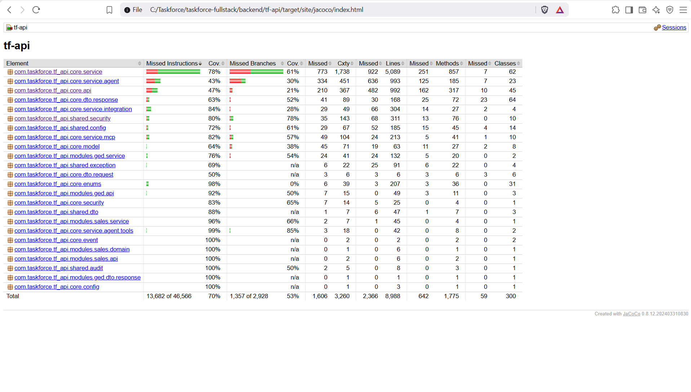

La couverture est mesurée par JaCoCo et bloquée à 70 % des lignes au niveau du module, seuil sous lequel `mvn verify` échoue, et le dernier relevé, reproduit ci-dessus, s'établit à 73,7 % des lignes, un peu au-dessus de la barre. Ce plancher ne porte toutefois que sur le code métier, l'amorçage applicatif et les modules encore exploratoires étant volontairement exclus du calcul. Comme au front, j'ai laissé la couverture suivre le risque plutôt que le pourcentage : les services qui portent la logique sensible, l'affectation, le paiement et l'autorisation, sont éprouvés en premier et le plus finement, quitte à laisser du code sans conséquence sous la barre, car chercher le chiffre parfait sur ce dernier aurait coûté du temps sans acheter de sécurité.

#### 6.7 Industrialisation du back
<!-- Critères : C26 [E20]. backend-tests.yml (Postgres pgvector en CI), release.yml, images GHCR. NUANCE : gate JaCoCo 0,70 (verify) ; scans sécu en CI (Semgrep/CodeQL/Trivy), ZAP hebdo opt-in. -->

À chaque poussée, le workflow `backend-tests.yml` lève un service PostgreSQL identique à celui de production, applique les migrations et lance `mvn verify`, de sorte que la suite complète et le contrôle de couverture s'exécutent sur le même moteur que celui qui servira les utilisateurs, à l'abri des mauvaises surprises d'une base différente. La publication relève d'un second workflow qui versionne chaque service indépendamment, construit son image Docker et la pousse vers le registre de conteneurs de GitHub, une image candidate sur la branche d'intégration devenant l'image de production une fois promue, si bien que ce que je déploie correspond exactement à ce que l'intégration continue a testé.

Les analyses de sécurité, enfin, vivent dans leurs propres chaînes, l'analyse statique de Semgrep et de CodeQL et le scan des dépendances de Trivy à chaque poussée comme chaque semaine, et OWASP ZAP en analyse dynamique sur planification hebdomadaire, déclenché à la demande car il exige la pile complète levée, de manière à ne pas alourdir le cycle quotidien tout en maintenant une barrière contre les régressions. Le déploiement de ces images sur l'infrastructure, la supervision et la reprise après incident dépassent en revanche le cadre de la construction et feront l'objet du chapitre 8.

---

## Partie IV — Sécuriser, industrialiser et prendre du recul

<!-- Mouvement 4 : la confiance, la mise en état de marche, et ce que ça change. Referme l'arc. -->

### 7. Sécurité et conformité RGPD

#### 7.1 Posture de sécurité
<!-- Appuie C16, C21, C24. Sources : Rapport_Securite, PSSI, Threat_Model_STRIDE, Chiffrement_Au_Repos. OWASP : vérifier la couverture réelle (corpus : partielle) avant d'affirmer "complet". -->

J'ai traité la sécurité comme une propriété transverse plutôt que comme une fonctionnalité, en superposant plusieurs lignes de défense et en outillant leur vérification. Le référentiel OWASP Top 10 [8] m'a servi de grille de lecture d'un bout à l'autre, sans que je prétende pour autant le couvrir intégralement.

L'authentification s'appuie sur Keycloak, qui délivre des jetons signés en RS256 et vérifiés sans état côté serveur, et à qui je délègue le hachage des mots de passe, la partie la plus sensible et la plus facile à manquer d'une application. L'utilisateur peut renforcer son compte d'une double authentification par code temporel à usage unique (TOTP), qu'il active depuis ses réglages en enrôlant une application d'authentification ; j'ai porté cette fonction dans l'application elle-même, au plus près du parcours, plutôt que de la confier à un écran du fournisseur d'identité. Les données les plus sensibles sont par ailleurs chiffrées au repos, colonne par colonne, en AES-256 GCM [11], qu'il s'agisse des secrets d'intégration, des jetons OAuth ou des messages commerciaux. J'assume que ce chiffrement reste sélectif, car les identifiants qui servent de clés de recherche, comme l'adresse de courriel, demeurent en clair et sont protégés par le contrôle d'accès applicatif et le chiffrement du disque hôte ; et pour écarter toute illusion de protection, le service refuse désormais de démarrer en production si la clé de chiffrement est absente.

L'isolation entre organisations forme la deuxième ligne. Elle est portée par la couche service, où un service d'autorisation vérifie l'appartenance et le rôle avant chaque opération, doublé de l'intercepteur déjà décrit et d'un garde de visibilité des projets, si bien que les tentatives d'accès inter-organisations que j'ai éprouvées répondent bien par un refus. Les rôles eux-mêmes, propres à chaque organisation et à chaque projet, vivent dans le modèle de données plutôt que dans le jeton, ce qui les rend aussi fins que le produit l'exige.

À la frontière HTTP, un jeu d'en-têtes durcit chaque réponse, de la politique de sécurité du contenu au HSTS d'un an en passant par l'interdiction du cadrage, et une limitation de débit par jetons protège les points sensibles, à raison par exemple de dix requêtes par minute sur la connexion, en renvoyant l'en-tête d'attente approprié. Les actions sensibles, enfin, sont consignées dans un journal d'audit en ajout seul, de la connexion au changement de rôle jusqu'à l'application d'une redistribution.

Cette posture a été pensée par la menace autant que par la mesure. Un modèle STRIDE recense une trentaine de menaces réparties en six catégories et associe chacune à une parade présente dans le code et à un test, sans laisser de risque élevé non traité. Surtout, la vérification est outillée et continue, puisqu'à chaque poussée l'analyse statique de Semgrep et de CodeQL, l'une par motifs et l'autre par flux de données, ainsi que l'analyse des dépendances, des secrets et de la configuration par Trivy, s'exécutent en intégration continue, complétées par un test d'intrusion dynamique OWASP ZAP, planifié chaque semaine mais aujourd'hui déclenché à la demande car il exige la pile complète en fonctionnement.

Je me garde toutefois d'annoncer une couverture OWASP complète : sur les dix catégories du référentiel, la majorité est réellement traitée, du contrôle d'accès à la cryptographie en passant par les injections, l'authentification et la falsification de requête côté serveur, tandis qu'une catégorie comme la conception sécurisée relève d'un travail par nature continu. Cette posture, je l'ai enfin soumise à un audit ciblé juste avant l'ouverture de la bêta fermée, dont la section suivante rend compte.

#### 7.2 Sécurisation avant la bêta fermée
<!-- Critères : C16, C24 [E9]. Audit OWASP Top 10 avant bêta fermée : A01 fuites inter-organisations, A07 refresh token -> cookie HttpOnly, A10 SSRF webhook, A03 sanitisation des schémas d'URL. Test par correctif + CI. -->

TaskForce est déployé en production sur une infrastructure partagée, et son ouverture prochaine à des testeurs externes, dans le cadre d'une bêta fermée, imposait une garantie précise : qu'aucun utilisateur ne puisse atteindre les données d'un autre ni l'infrastructure interne. Le dépôt étant public, chaque faille reste auditable de l'extérieur, ce qui a fait du durcissement une priorité avant toute ouverture.

J'ai conduit pour cela un audit méthodique, en confrontant chacune des dix catégories de l'OWASP Top 10 [8] au code réel, puis en corrigeant les vulnérabilités trouvées, en les couvrant chacune d'un test et en les validant avant remise en production. Quatre correctifs en sont ressortis.

| Réf. OWASP | Vulnérabilité | Correctif | Gravité |
|---|---|---|:--:|
| A01 Contrôle d'accès | Trois fuites entre organisations : les liens d'intégration d'une tâche restaient lisibles hors de leur espace, un flux temps réel exposait un autre compte, et certaines lectures de projets privés passaient | Autorisation vérifiée à chaque requête, au niveau du service | Critique |
| A07 Authentification | Le jeton de rafraîchissement de session, stocké dans le navigateur et accessible au JavaScript, était volable par une attaque XSS | Déplacé dans un cookie HttpOnly, invisible au JavaScript ; il ne circule plus en clair dans les réponses | Élevée |
| A10 SSRF | Un webhook sortant pouvait être pointé vers le réseau interne, base de données ou service d'authentification | Validation de l'URL, qui bloque les adresses internes et privées | Moyenne |
| A03 Injection | Aucune injection SQL, les requêtes étant paramétrées ; un lien piégé dans un contenu utilisateur pouvait toutefois exécuter du code au clic | Neutralisation des schémas d'URL dangereux au rendu | Moyenne |

Chaque correctif s'accompagne d'un test automatisé qui en verrouille la régression, le flux d'authentification complet a été rejoué en conditions réelles, de la connexion au rafraîchissement puis à la déconnexion, et les portes de la chaîne d'intégration continue, à savoir la batterie de tests, l'analyse statique de Semgrep et de CodeQL et le scan des dépendances de Trivy, doivent désormais passer avant toute fusion sur la branche de production, dont la mise en ligne découle. Plusieurs points, à l'inverse, se sont révélés déjà conformes à l'examen : les en-têtes de sécurité, du HSTS à l'interdiction du cadrage en passant par le blocage du reniflage de type, une politique d'origines stricte, une protection anti-robot à l'inscription et un chiffrement TLS moderne.

La posture est ainsi passée d'un produit présentant des fuites entre organisations exploitables à un produit durci et aligné sur les bonnes pratiques OWASP : les deux vulnérabilités nettes sont fermées et le risque le plus sensible, le vol de session, est neutralisé. Le test dynamique OWASP ZAP, mené à la demande contre la pile en fonctionnement, ne relève d'ailleurs aucune alerte haute, ni sur l'API ni sur le front, tandis que le suivi des dépendances a conduit en parallèle à corriger vingt-cinq vulnérabilités hautes, dont l'hygiène demeure un travail continu. La protection des données personnelles, qui prolonge cette posture, fait l'objet de la section suivante.

#### 7.3 RGPD de TaskForce
<!-- Critères : C11 (capacité) [E9]. Sources : Registre_Traitements_RGPD (Art.30), DPIA, Procedure_Violation_Donnees, Audit_RGPD_Conformite, Politique_Confidentialite_CGU. Gaps réels : bannière cookies interactive, mentions légales LEN, double opt-in à vérifier. -->

La conformité au RGPD [5] n'est pas restée théorique, puisque je l'ai instruite comme un chantier documenté et, pour partie, implémentée dans le produit. Un registre des traitements, au sens de l'article 30, recense neuf traitements, des comptes et de la facturation aux profils de compétences du smart-assign, jusqu'au journal d'audit et à l'assistance par modèle de langage. Une analyse d'impact conclut qu'un seul de ces traitements, le profil de compétences, atteint le seuil d'un examen renforcé, sans pour autant exiger une analyse complète, car l'affectation demeure une recommandation validée par un humain et non une décision automatisée au sens de l'article 22.

Les droits des personnes sont, pour l'essentiel, exerçables directement dans le produit. L'accès et la portabilité passent par un export structuré, la rectification par la modification du profil, et l'effacement par une route dédiée qui anonymise les données locales tout en supprimant l'identité correspondante dans Keycloak ; la ligne applicative est conservée sous forme anonymisée plutôt que détruite, afin de préserver l'intégrité référentielle. Un planificateur purge par ailleurs automatiquement les données éphémères, codes à usage unique et invitations expirées. Le droit d'opposition et celui à la limitation, en revanche, ne sont encore que partiellement outillés, ce que je préfère signaler plutôt que d'arrondir.

Une procédure de violation de données complète l'ensemble, avec la chaîne de notification à la CNIL sous soixante-douze heures et aux personnes concernées, une grille d'évaluation du risque et un registre des incidents. L'exercice de simulation en conditions réelles en constitue la prochaine étape de validation.

Deux écarts méritent enfin d'être nommés sans détour, car un jury les cherchera. La bannière de cookies existe bien à l'écran, mais sous la forme d'une information avec accusé de réception et non d'un gestionnaire de consentement au sens de la CNIL ; ce choix tient à ce que l'application ne pose que des cookies strictement nécessaires et que la vitrine mesure son audience sans cookie. Une page de mentions légales existe par ailleurs, sans être encore pleinement conforme à la loi pour la confiance dans l'économie numérique. En revanche, l'inscription repose bien sur un double opt-in : la création de compte impose la vérification de l'adresse par un code à usage unique, la connexion restant bloquée tant que l'adresse n'est pas confirmée. Au total, j'estime la conformité de ce prototype autour de 75 %, un chiffre que je préfère afficher tel quel.

#### 7.4 Le cas RGPD externe
<!-- Critères : C11 [E9]. Le référentiel exige l'audit d'un site marchand tiers FOURNI par l'école (non transmis). Capacité démontrée sur TaskForce, livrable externe en attente. Ne pas cocher les 4 sous-critères sur TaskForce. -->

Le référentiel rattache le critère C11 à une mise en situation particulière, l'audit RGPD d'un site marchand tiers fourni par l'école. Ce sujet ne m'a pas encore été transmis, si bien que ce livrable externe n'est pas commencé, et je ne le présente pas autrement.

Ce que le présent dossier démontre, c'est la capacité correspondante, exercée sur TaskForce : le registre des traitements, l'analyse d'impact, la procédure de violation et les droits des personnes décrits plus haut constituent un audit RGPD mené de bout en bout sur un système réel. Cette démonstration prépare le livrable externe sans s'y substituer, et je m'abstiens donc de cocher sur TaskForce les sous-critères propres à ce cas. Le présent dossier couvre les trois premiers blocs de compétences, tandis que cette mise en situation relève d'une évaluation distincte, prévue à l'automne 2026 sur l'application fournie par l'école.

### 8. Industrialisation, déploiement et supervision

#### 8.1 Documentation technique, API et base de connaissances
<!-- Critères : C27 [E29]. OpenAPI auto-généré (springdoc, 235 ops) -> Fern (docs.taskforce-project.fr) ; serveur taskforce-mcp (API-as-MCP) ; Release_Notes, versioning. Lien avec 2.4 (Brain OS). -->

La documentation technique n'a pas été écrite après coup, elle s'est produite avec le code. Le contrat de l'API est engendré par springdoc à partir des annotations des contrôleurs, soit plus de deux cents opérations décrites en OpenAPI, et ce contrat alimente directement une documentation publique construite avec Fern [21] et servie sur `docs.taskforce-project.fr`. Celle-ci réunit deux volets, des guides produit pour la prise en main et une référence d'API engendrée depuis ce même contrat, de sorte qu'aucune des deux ne peut dériver d'une description tenue à part. Les évolutions sont retracées dans des notes de version et sur une page de journal des changements de la vitrine, et chaque service porte son propre numéro de version sémantique, posé par l'étiquette de sa demande de fusion.

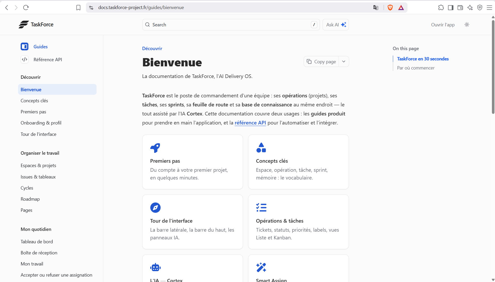

La même API se présente enfin sous une seconde forme, taillée pour les agents. Un serveur MCP dédié expose une partie des opérations, de la recherche dans la base de connaissances au smart-assign, comme autant d'outils qu'un assistant peut appeler directement, ce qui prolonge la vocation d'orchestrateur du produit évoquée au chapitre 9. Cette double exposition, une API REST pour les intégrations classiques et un contrat d'outils pour les agents, tient à une évidence que je fais mienne : un serveur MCP n'est au fond qu'une API décrite dans une grammaire que les modèles savent lire.

Au-dessus de cette documentation d'interface se tient la base de connaissances déjà présentée au chapitre 2, le corpus Brain OS. Tenue comme du code, versionnée et reliée par mots-clés et vectorisation, elle réunit l'architecture, les contrats, les décisions et les problèmes connus, et c'est d'elle que j'ai tiré, d'une seule source, le manuel utilisateur, la documentation développeur et le présent dossier. Il s'agit d'un outil de documentation et non d'une fonctionnalité du produit, et je le présente comme tel.

#### 8.2 Intégration continue et déploiement automatisé
<!-- Critères : C31 [E24]. 10 workflows GitHub Actions, images GHCR versionnées. Source : Pipeline_CICD. -->

L'industrialisation repose sur dix chaînes d'intégration continue portées par GitHub Actions, chacune dédiée à une responsabilité, des tests du back-end, du front et de la vitrine aux tests de bout en bout, à l'analyse de sécurité statique et dynamique, à la documentation, à la publication et à la gestion des versions. Huit s'exécutent à chaque poussée ou fusion ; les deux plus lourdes, les tests de bout en bout et le scan dynamique, sont outillées mais déclenchées à la demande, faute de pouvoir lever la pile complète à chaque exécution. La figure ci-dessous en donne la vue d'ensemble, du flux de branches aux portes de qualité, puis à la publication et au déploiement ; les sections consacrées au front et au back y renvoient plutôt que de la répéter.


Le flux de branches est celui d'une équipe. Chaque évolution vit sur une branche `feature/**` ou `fix/**` tirée de la branche d'intégration `dev`, et les messages de commit suivent la grammaire des Conventional Commits [18], que je tiens par discipline plutôt que par un outil de blocage, afin de garder un historique lisible. À l'ouverture d'une demande de fusion, les portes de qualité s'exécutent : la chaîne du back-end lève une base PostgreSQL identique à la production, joue la suite complète et bloque sous 70 % de couverture de lignes ; celle du front enchaîne l'analyse, les tests, le contrôle de types et la construction ; la chaîne de sécurité arrête tout dès qu'une vulnérabilité critique ou une règle d'analyse en erreur apparaît. Aucune fusion vers `dev` ne passe tant qu'une porte bloquante reste rouge.

La publication et le versionnement obéissent ensuite à une mécanique explicite. Chaque service, back-end, front et vitrine, porte sa propre version, et le pas de version n'est pas déduit des commits mais d'une étiquette de release posée sur la demande de fusion, ce qui rend le choix délibéré. Une fusion sur `dev` produit une version candidate, publiée comme image Docker dans le registre de conteneurs de GitHub (GHCR) et étiquetée `-rc` ; une fusion de `dev` vers `main` reprend cette candidate, en retire le suffixe et en fait la version stable. Une distinction mérite d'être faite en toute honnêteté : cette chaîne construit, teste et publie les images, mais elle ne les déploie pas elle-même, le déploiement étant déclenché côté machines, comme l'expose la section suivante.

#### 8.3 Hébergement et production
<!-- Critères : C28, C29, C30 [E21-E23]. Prod DÉPLOYÉE (2 VM école + tunnel Cloudflare + Vercel landing) ; IA servie via Groq hébergé sur VM sans GPU. Sources : Strategie_Hebergement, Diagramme_Deploiement, Plan_Deploiement_2VM. -->

Contrairement à ce que laissait entendre un état antérieur du projet, l'application est aujourd'hui déployée et en ligne. Elle tourne sur deux machines Linux fournies par l'école, placées derrière son réseau sans adresse publique et réunies par un maillage privé, la première portant l'API, l'identité, la base et le service d'inférence, la seconde l'interface et la supervision. Comme au chapitre 3, l'accès public emprunte un tunnel Cloudflare sortant, sans aucun port ouvert, qui termine le chiffrement au bord du réseau et distribue les sous-domaines de `taskforce-project.fr` vers la bonne machine, tandis que la vitrine est publiée séparément sur Vercel depuis la branche de production.

Le déploiement lui-même est automatisé sans pipeline distant. Sur chaque machine, une tâche planifiée surveille la branche de production et ne déploie que si l'état local peut la rejoindre en avance rapide, sans réécriture d'historique, puis reconstruit le seul service qui la concerne, le back-end sur la première machine, l'interface sur la seconde. Pousser sur la branche de production vaut donc mise en ligne, et désactiver la tâche vaut retour arrière. Je dois toutefois une précision d'honnêteté : ces scripts de déploiement vivent sur les machines et sont documentés dans le journal du projet, mais ils ne sont pas encore versionnés dans le dépôt au même titre que le reste, et les régulariser fait partie de la dette que j'assume au chapitre suivant.

Que tout cela soit réellement en ligne, et pas seulement démontrable, se lit dans les relevés de Cloudflare, qui voit passer l'ensemble du trafic. Sur une fenêtre d'observation de vingt-quatre heures en août 2026, son bord a traité de l'ordre de huit à neuf mille requêtes et servi une cinquantaine de mégaoctets, absorbant une partie de la charge par son cache et routant chaque sous-domaine de `taskforce-project.fr` vers la bonne machine. Une couche de contrôle d'accès de Cloudflare protège de surcroît l'entrée de l'application, si bien que la surface réellement publique se réduit au strict nécessaire.

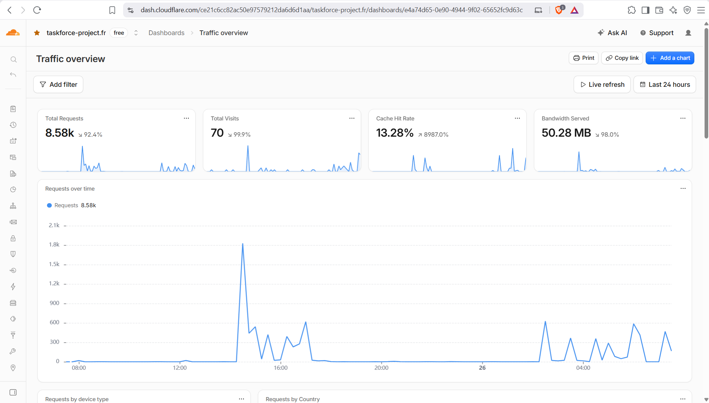

#### 8.4 Supervision, journalisation, observabilité
<!-- Critères : C32 [E25-E28]. OTel vers SigNoz, 9 alertes Prometheus, AuditLog (7 events), backup.ps1 (PCA/PRA testé). Sources : Observabilite, PS_PCA_PRA. -->

L'exploitation est instrumentée par une pile de supervision légère et entièrement libre. Prometheus collecte les métriques et Grafana les visualise, alimentés sur chaque machine par deux sondes, l'une pour l'hôte et l'autre pour les conteneurs, la seconde machine interrogeant la première par le maillage privé ; les métriques applicatives du back-end, exposées sur un point dédié, y sont relayées par un petit proxy. Un tableau de bord, « TaskForce — Overview », en réunit l'essentiel d'un coup d'œil, l'état du back-end, la mémoire disponible et la charge processeur de chaque machine, puis les conteneurs les plus gourmands, complété des tableaux communautaires éprouvés pour l'hôte et les conteneurs. Le dernier relevé y montre un back-end disponible et de l'ordre de quarante à cinquante pour cent de mémoire libre par machine, cohérent avec le dimensionnement du chapitre 3. J'écarte en revanche toute prétention à une observabilité distribuée par traces, un temps envisagée puis jugée trop lourde pour ces machines, et la production s'en tient donc aux métriques.

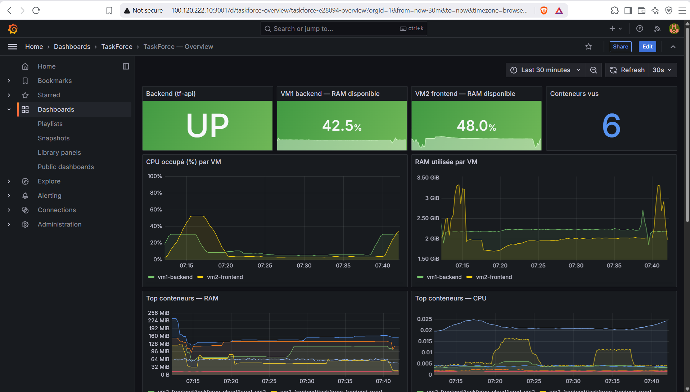

Neuf règles d'alerte sont définies, réparties en quatre familles, la disponibilité, les erreurs et la latence, la saturation des ressources et la sécurité, ces dernières guettant par exemple une rafale d'échecs d'authentification. Surtout, leur chaîne de notification est désormais complète et automatisée : le Prometheus déployé évalue ces règles en continu et transmet toute alerte active à un service Alertmanager, qui la route vers un canal Discord dédié où elle apparaît en temps réel, avant de se résoudre d'elle-même une fois la condition retombée. J'ai éprouvé ce circuit de bout en bout par une alerte de test effectivement reçue dans le canal, et sa configuration est versionnée au dépôt pour rester reproductible. La journalisation applicative, elle, inscrit sept types d'événements sensibles dans un journal d'audit en ajout seul, de la connexion et du changement de rôle à l'export et à l'effacement RGPD jusqu'à l'application d'une redistribution, alors que la centralisation des journaux techniques reste à mettre en place.

La continuité, enfin, repose sur une sauvegarde réelle et une reprise éprouvée. Une tâche planifiée quotidienne exporte l'intégralité du cluster PostgreSQL, application et identité comprises, compresse le résultat et en conserve quatorze jours par rotation, un script de restauration rétablissant l'ensemble et redémarrant les services concernés. J'ai éprouvé cette reprise sur l'environnement de développement, par une sauvegarde suivie d'une suppression de données puis d'une restauration à l'identique, mais je m'en tiens à ce qui existe : une reprise après incident plus ambitieuse, avec copie hors site et bascule multi-sites, appartient à la cible et non à l'état présent.

### 9. Distance critique et perspectives

#### 9.1 Innovations
<!-- Smart-assign, observabilité sécurité, Brain OS (DEMI-PAGE, cadré métier). Source : Note_Innovation_Distance_Critique. -->

Trois éléments de ce projet me paraissent sortir de l'ordinaire d'un logiciel de gestion, moins par leur technique que par ce qu'ils changent à l'usage.

Le premier est le smart-assign lui-même, dont l'originalité tient à son architecture en deux étages, un pré-filtre déterministe qui reste explicable et gratuit, suivi d'un reclassement sémantique par un modèle de langage, le tout placé sous supervision humaine et journalisé pour apprendre de ses propres décisions. Sa valeur n'est pas d'automatiser l'affectation, mais de la rendre comparable, justifiée et révisable.

Le deuxième est le traitement de la sécurité comme un objet observable. Au-delà des métriques classiques, j'ai défini des alertes proprement sécuritaires, sur les rafales d'échecs d'authentification ou de limitation de débit, qui font de la supervision un capteur d'attaque autant qu'un capteur de panne, désormais acheminées par Alertmanager vers une notification effective.

Le troisième est le Brain OS, cette base de connaissance tenue comme du code qui a permis à un développeur seul de conduire un système de cette taille sans en perdre le fil. Éprouvé avec Jonathan Naal avant ce projet, il fait de la documentation un instrument de pilotage plutôt qu'une corvée de fin de parcours.

#### 9.2 Périmètre maîtrisé et axes de consolidation
<!-- Distance critique en registre CONFIANT (feuille de route, pas aveux) : périmètre couverture, durcissement OWASP continu, exploitation à consolider, cas RGPD externe. Sources : Dette_Technique, Problemes_Connus. -->

Mener seul un produit complet en dix mois impose des choix de périmètre lucides. Je les réunis ici, non comme des aveux mais comme la feuille de route de consolidation qui prolonge naturellement ce qui est déjà livré.

Du côté du produit et des tests, la couverture élevée du front porte sur la couche logique et confie les routes aux tests de bout en bout, et le test d'intrusion dynamique s'exécute à la demande, avec pour prochain jalon son intégration à chaque construction. Du côté de la conformité, la couverture OWASP porte sur sept catégories, les autres relevant du durcissement continu ; le gestionnaire de consentement, une page de mentions légales pleinement conforme et le cas RGPD externe constituent les prochaines étapes déjà identifiées.

Du côté de l'exploitation, les chantiers de consolidation sont ceux que les sections précédentes ont nommés : centraliser les journaux techniques, porter la sauvegarde quotidienne vers une redondance hors-site, et verser les scripts de déploiement au dépôt. S'y ajoute un axe de fond, un test d'architecture qui ferait respecter le cloisonnement des modules dès la compilation.

Chacun de ces axes est consigné dans un registre technique qui en garde la trace et le chemin de résolution. C'est le choix lucide d'un projet mené seul en dix mois : livrer d'abord ce qui porte la valeur, et tracer précisément la suite.

#### 9.3 Préconisations et évolutions
<!-- Préconisations concrètes + cap v2 (une page). Source : road_to_v2 (sobre, hors périmètre référentiel). -->

De ces limites découlent des préconisations concrètes, que j'ordonne par ce qu'elles apportent. Les plus immédiates ferment les écarts d'exploitation : router vers une notification réelle les alertes déjà écrites, centraliser les journaux, verser les scripts de déploiement au dépôt et porter la sauvegarde à une copie hors site. Viennent ensuite les écarts de conformité, une page de mentions légales, un gestionnaire de consentement le jour où la vitrine mesurerait davantage, et la reprise du suivi des dépendances comme routine plutôt que comme campagne.

À plus longue échéance, le produit possède un cap déjà esquissé. Les fondations posées, isolation, audit et modularité, ouvrent la voie aux modules verticaux des secteurs réglementés, là où la traçabilité devient une obligation valorisée. Le moteur d'affectation, enfin, appelle une évolution naturelle vers un assistant de pilotage plus large, capable non seulement de recommander une affectation mais d'éclairer la charge d'une équipe dans la durée.

Cette évolution a une forme précise, que le produit prépare déjà. TaskForce n'a pas vocation à rester un gestionnaire de tâches de plus, avec son tableau Kanban, mais à devenir un orchestrateur de travail qui se branche sur les outils en place, Linear, Asana, Jira et d'autres, réunis dans un catalogue d'intégrations. Le mécanisme est en partie livré, puisque l'application sait déjà se connecter à des serveurs d'outils externes et en présenter les actions à son assistant sous validation humaine ; quelques connecteurs sont pleinement implémentés, l'élargissement du catalogue constituant la prochaine étape de l'orchestrateur. Ce branchement repose sur un contrat d'usage des outils, le protocole MCP, dont l'appellation me paraît d'ailleurs un peu surfaite, tant il s'agit au fond d'une simple API décrite dans une grammaire que les modèles savent lire ; c'est la question que pose lucidement l'ouvrage de Sam Bhagwat chez Mastra [12], celle d'une frontière entre un serveur MCP et une API désormais plus mince qu'on ne le dit.

Ces perspectives dépassent le périmètre du présent dossier, et je les mentionne pour ce qu'elles sont, une direction cohérente plutôt qu'un engagement.

---

## Conclusion

<!-- UNE PAGE MAX, ~400 à 450 mots. Registre PERSONNEL et réflexif (demande user) : ce que j'ai appris,
les échecs et prises de recul, un peu de hauteur ; pro mais pas centré produit. Ancré dans du vrai. -->

Dix mois après avoir ouvert un dépôt vide, ce que je retiens de TaskForce dépasse largement le développement du produit. Ce projet m’a surtout confronté à une réalité que l’on perçoit difficilement lorsque l’on reste uniquement dans un rôle technique : construire quelque chose n’est qu’une partie du problème.

Au début du projet, ma vision était principalement celle d’un ingénieur. J’avais une idée, une architecture à définir et un produit à construire. Avec le temps, j’ai compris que la question la plus importante n’était pas « comment construire cette fonctionnalité ? », mais « pourquoi la construit-on, pour qui, et est-ce réellement le bon problème à résoudre ? ». Ce changement de perspective a progressivement modifié ma manière de prendre des décisions.

J’ai également découvert que la technique ne peut pas être dissociée du reste. Une architecture peut être excellente et un produit peut malgré tout échouer s’il ne répond pas à un besoin suffisamment important, s’il est mal positionné ou si personne ne l’adopte. À l’inverse, certaines décisions qui semblent moins intéressantes techniquement peuvent avoir beaucoup plus d’impact lorsqu’elles rapprochent réellement le produit de ses utilisateurs. C’est probablement l’un des principaux enseignements que je retiens de cette expérience.

Porter TaskForce seul m’a aussi obligé à sortir de ma zone de confort. Il ne suffisait plus de savoir développer : il fallait réfléchir au positionnement, observer les utilisateurs, comprendre ce qui créait réellement de la valeur, prioriser, renoncer à certaines idées et accepter que toutes les bonnes idées ne méritent pas d’être développées. J’ai appris que la difficulté n’est finalement pas de trouver des choses à faire, mais de déterminer lesquelles méritent réellement du temps et des ressources.

Avec le recul, je pense donc que mon principal apprentissage n’est pas une technologie ou une méthode particulière. C’est d’avoir commencé à raisonner à l’échelle du système dans son ensemble : le produit, la technique, les utilisateurs, le marché et les contraintes qui les relient. C’est aussi comprendre qu’un bon ingénieur ne cherche pas uniquement à construire correctement, mais à construire ce qui doit réellement l’être.

TaskForce représente pour moi le passage entre deux façons de voir mon métier. Je reste profondément attaché à la technique, mais je ne la considère plus comme une finalité. Elle est un levier au service d’une vision, et la responsabilité d’un lead technique consiste justement à faire le lien entre cette vision et ce qu’il est réellement possible, pertinent et utile de construire.

---

## Annexes

<!-- Hors décompte des pages. Portent le volume. -->

Les annexes rassemblent les livrables techniques détaillés et les preuves, hors du décompte des pages du corps du dossier.

Une **archive jointe** au présent dossier réunit par ailleurs les preuves générées directement depuis le projet réel, que le lecteur est invité à consulter pour le détail : le dictionnaire des données complet (cinquante-huit tables, extrait de la base PostgreSQL avec ses types, ses clés et ses contraintes), les schémas d'ensemble (WBS, PBS, vue C4 des conteneurs, diagrammes UML de classes et de séquence, schéma de déploiement), le cahier de recettes, les rapports de couverture de tests du front-end et du back-end, les rapports de sécurité dynamique OWASP ZAP des deux surfaces, ainsi qu'une fiche de conformité réunissant la cartographie des données personnelles, le parcours des droits RGPD et les critères d'accessibilité WCAG, et enfin le design system et la bibliothèque de composants d'interface, consultables dans Figma.

#### Annexe A — Correspondance avec le référentiel

La table des matières suit le déroulé du projet plutôt que la structure du référentiel. Le tableau ci-dessous établit la correspondance entre chaque compétence du référentiel RNCP 38606 et la ou les sections qui la démontrent.

**Bloc 1 — Concevoir et modéliser une application (C1 à C12)**

| Compétence | Intitulé | Section(s) |
|---|---|---|
| C1 | Analyser la demande initiale du client | 1.1 |
| C2 | Apporter son expertise technique sur le cahier des charges | 1.2, 3.8 |
| C3 | Identifier les caractéristiques du projet (planification, budget) | 1.3, 1.5, 1.6, 2.3 |
| C4 | Travailler en mode agile | 2.1, 2.6 |
| C5 | Mettre en œuvre un environnement de développement collaboratif | 2.2 |
| C6 | Concevoir des maquettes (wireframes) | 4.1 |
| C7 | Traduire les besoins en spécifications techniques | 4.2 |
| C8 | Modéliser l'application (UML) | 4.3, 4.4 |
| C9 | Concevoir l'architecture des bases de données | 4.4 |
| C10 | Déterminer l'architecture logicielle | 4.5 |
| C11 | Assurer la conformité légale (CNIL / RGPD) | 7.2, 7.3 |
| C12 | Proposer des solutions alternatives et innovantes (veille) | 2.5 |

**Bloc 2 — Développer la partie front-end (C13 à C20)**

| Compétence | Intitulé | Section(s) |
|---|---|---|
| C13 | Concevoir l'interface utilisateur | 5.1 |
| C14 | Sélectionner les éléments graphiques (charte) | 5.1 |
| C15 | Mettre en œuvre l'expérience utilisateur et l'accessibilité | 5.2 |
| C16 | Développer le front-end (qualité, sécurité, écoconception) | 5.3 |
| C17 | Consommer une API de manière sécurisée | 5.4 |
| C18 | Tester le front-end | 5.5 |
| C19 | Industrialiser le front-end | 5.6 |
| C20 | Améliorer les performances et le référencement | 5.7 |

**Bloc 3 — Développer la partie back-end (C21 à C26)**

| Compétence | Intitulé | Section(s) |
|---|---|---|
| C21 | Développer la couche de persistance | 6.1 |
| C22 | Développer le back-end (qualité, sécurité, écoconception) | 6.2 |
| C23 | Implémenter un système de paiement et de monétisation | 6.3 |
| C24 | Développer une API sécurisée | 6.4 |
| C25 | Tester le back-end | 6.6 |
| C26 | Industrialiser le back-end | 6.7 |

**Bloc 4 — Préparer et assurer le déploiement en production (C27 à C32)**

| Compétence | Intitulé | Section(s) |
|---|---|---|
| C27 | Produire la documentation technique et la base de connaissances | 8.1 |
| C28 | Administrer le domaine, le DNS, les certificats et la sécurité | 8.3 |
| C29 | Sélectionner une plateforme d'hébergement | 8.3 |
| C30 | Administrer des services d'hébergement conteneurisés | 8.3 |
| C31 | Mettre en œuvre un déploiement automatisé | 8.2 |
| C32 | Superviser (sondes, alertes, journalisation, détection) | 8.4 |

#### Annexe B — Extraits de code commentés

Six extraits, tirés du code réel, illustrent les partis pris techniques défendus dans le corps du dossier.

**B.1 — Isolation multi-locataire.** Un intercepteur ferme, en un point unique, la classe des accès inter-organisations non autorisés.

```java
// Toute requête vers une sous-ressource d'organisation est captée en amont.
private static final Pattern WORKSPACE_SUBRESOURCE =
        Pattern.compile("^/api/workspaces/([^/]+)/.+$");

// Un non-membre est refusé (403) avant même d'atteindre le contrôleur.
if (!workspaceMemberRepository.existsByWorkspaceIdAndUserId(workspaceId, userId)) {
    throw new ForbiddenException(
        "Accès refusé : vous n'êtes pas membre de cet espace de travail");
}
```

**B.2 — Webhook Stripe : signature et idempotence.** La légitimité de l'appel vient de sa signature, et un événement rejoué n'est jamais traité deux fois.

```java
// La signature authentifie l'appel : ce point d'entrée peut rester public.
Event event = Webhook.constructEvent(payload, sigHeader, webhookSecret);

// Idempotence : un identifiant déjà vu interrompt le traitement.
if (subscriptionHistoryRepository.existsByStripeEventId(event.getId())) {
    return;
}
```

**B.3 — Scoring du smart-assign.** Le calcul se fait en deux étages, pour ne solliciter le modèle que sur une liste courte.

```java
// Étage 1 — pré-filtre déterministe (Java), sans appel au modèle.
int pre = Math.round(m.labelScore()    * 0.40    // compétences
                   + m.workloadScore() * 0.25    // charge courante
                   + m.availability()  * 0.20    // disponibilité
                   + historical        * 0.15);  // historique
// ... seuls les cinq meilleurs candidats passent à l'étage 2.

// Étage 2 — score final, après reclassement sémantique par le modèle.
int base = Math.round(semantic          * 0.40
                    + m.labelScore()    * 0.22
                    + m.workloadScore() * 0.16
                    + historical        * 0.14
                    + m.availability()  * 0.08);
int growthBonus = Math.min(15, Math.round(m.growthScore() * 0.15)); // montée en compétence, bornée
int finalScore  = clamp(base + growthBonus);
```

**B.4 — Validation des entrées.** Chaque contrôleur valide son objet de transfert à la frontière ; une charge malformée est rejetée avant le métier.

```java
@PostMapping("/checkout")
public ResponseEntity<ApiResponse<CheckoutSessionResponse>> createCheckout(
        @Valid @RequestBody CreateCheckoutSessionRequest body) {
    // Les contraintes jakarta.validation du DTO (@NotNull, @NotBlank, @Email...)
    // sont vérifiées automatiquement avant l'entrée dans cette méthode.
}
```

**B.5 — Migration versionnée (Flyway).** Toute évolution du schéma passe par une migration numérotée et rejouable, et l'application refuse de démarrer si le schéma réel s'en écarte.

```sql
-- V36__add_stripe_event_id_to_subscription_history.sql
ALTER TABLE subscription_history
    ADD COLUMN IF NOT EXISTS stripe_event_id VARCHAR(100);

-- L'unicité porte l'idempotence des webhooks au niveau de la base.
CREATE UNIQUE INDEX IF NOT EXISTS idx_subscription_history_stripe_event_id
    ON subscription_history (stripe_event_id)
    WHERE stripe_event_id IS NOT NULL;
```

**B.6 — En-têtes de sécurité.** Déclarés une fois pour toutes les routes, ils durcissent chaque réponse.

```javascript
// next.config.ts — politique de sécurité du contenu et en-têtes associés.
const cspHeader = [
  "default-src 'self'",
  "object-src 'none'",
  "base-uri 'self'",
  "form-action 'self'",
  "frame-ancestors 'none'",          // anti-détournement de clic
  "upgrade-insecure-requests",
].join("; ");

const securityHeaders = [
  { key: "Content-Security-Policy",   value: cspHeader },
  { key: "Strict-Transport-Security", value: "max-age=31536000; includeSubDomains; preload" },
  { key: "X-Content-Type-Options",    value: "nosniff" },
  { key: "X-Frame-Options",           value: "DENY" },
];
```

#### Annexe C — Schémas

Les schémas d'architecture et de conception sont présentés dans le corps du dossier : la vue C4 des conteneurs et le diagramme de séquence du smart-assign au chapitre 4, l'extrait du modèle de données au même chapitre, et le diagramme de Gantt au chapitre 2. Le schéma de déploiement, qui n'apparaît pas ailleurs, est donné ci-dessous.

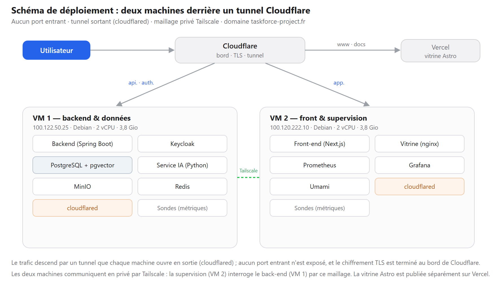

Les décompositions complètes du produit et du travail, dont le corps du dossier ne donne qu'une vue resserrée au chapitre 2, sont reproduites ci-dessous ; la chaîne d'intégration et de livraison continues, elle, figure au chapitre 8.

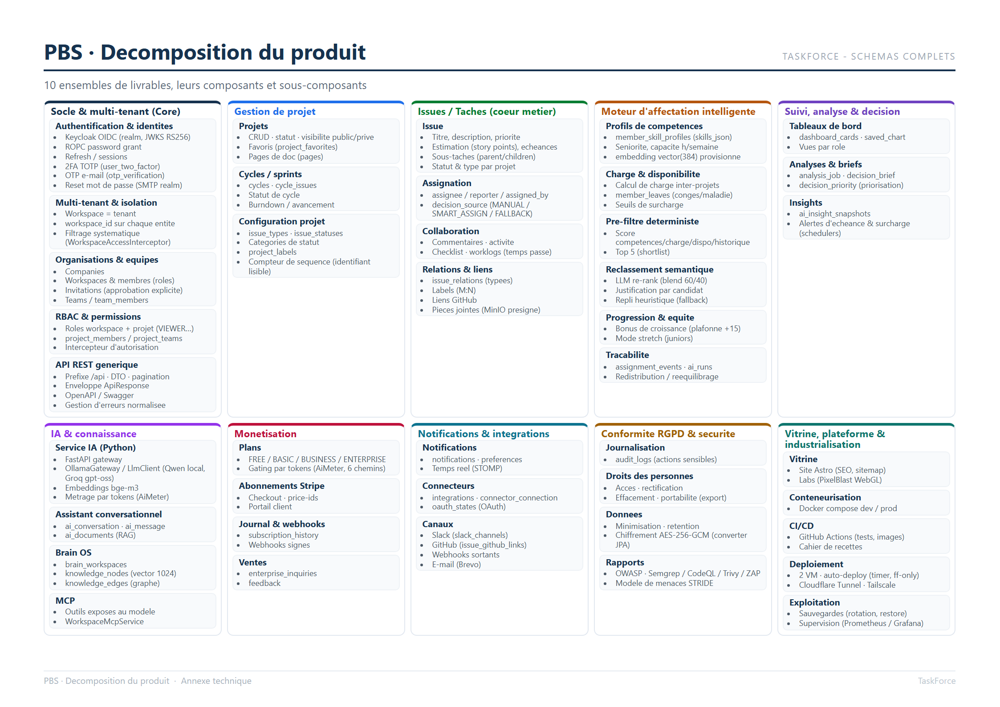

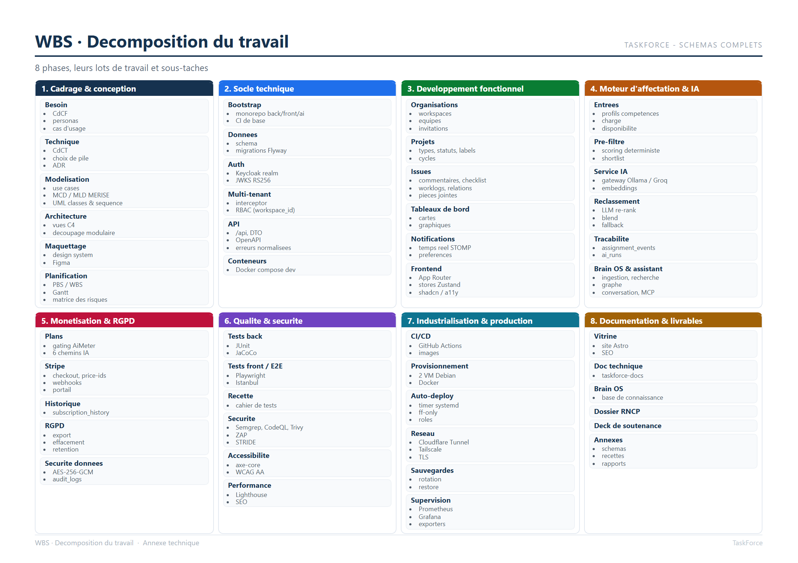

#### Annexe D — Captures d'écran

Les captures de l'application déployée illustrent le parcours au chapitre 4 : l'authentification, l'onboarding, le tableau de bord, la recommandation d'affectation en lot puis détaillée, et la page des membres. Les rapports de couverture du front-end et du back-end figurent aux chapitres 5 et 6, et les captures de production, la documentation Fern, le trafic Cloudflare et le tableau de bord de supervision Grafana, accompagnent le chapitre 8.

#### Annexe E — Présentation de synthèse

La présentation de synthèse utilisée en soutenance, un jeu de diapositives au format PDF, accompagne ce dossier en pièce jointe.

#### Annexe F — Matrice des responsabilités (RACI)

La gouvernance du projet réunit trois acteurs : Pierre MICHEL pour la réalisation, Cédric BRASSEUR comme Product Owner et Metz Numeric School comme client. La matrice ci-dessous répartit les responsabilités **étape par étape**, ces étapes reprenant le découpage en compétences du référentiel afin que la lecture se rapproche de la grille d'évaluation, selon la convention R (réalise), A (approuve et rend compte), C (consulté) et I (informé).

| Étape du projet (compétences) | Pierre MICHEL (réalisation) | Cédric BRASSEUR (Product Owner) | Metz Numeric School (client) |
|---|:---:|:---:|:---:|
| Analyse de la demande et cahier des charges (C1-C2) | R | C | A |
| Planification, budget et conduite agile (C3-C5) | R | A | I |
| Spécifications, conception et modélisation (C6-C10) | R | A | I |
| Conformité légale et RGPD (C11) | R | C | A |
| Veille et solutions innovantes (C12) | R | C | I |
| Développement front-end (C13-C17) | R | A | I |
| Tests du front-end (C18) | R | A | I |
| Industrialisation et référencement du front (C19-C20) | R | C | I |
| Développement back-end (C21-C24) | R | A | I |
| Tests du back-end (C25) | R | A | I |
| Industrialisation du back-end (C26) | R | C | I |
| Déploiement, hébergement et supervision (C27-C32) | R | C | C |

## Bibliographie

Les sources externes citées dans le dossier sont référencées par un numéro entre crochets, cliquable. Elles rassemblent les études et données de marché, les références normatives et réglementaires qui ont encadré la conception, les ouvrages et ressources techniques, les références de design et d'expérience utilisateur qui justifient les partis pris d'interface, la méthode et l'ingénierie logicielle, et enfin les ressources d'intelligence artificielle ainsi que les ressources en ligne du projet.

**Études et données de marché**

<ol class="biblio">
<li id="ref-1">Asana, <em>Anatomy of Work Global Index</em>, 2023. <a href="https://asana.com/resources/anatomy-of-work">asana.com/resources/anatomy-of-work</a></li>
<li id="ref-2">Microsoft, <em>Work Trend Index 2025</em>, 2025. <a href="https://www.microsoft.com/en-us/worklab/work-trend-index">microsoft.com/worklab/work-trend-index</a></li>
<li id="ref-3">Gallup, <em>State of the Global Workplace: 2025 Report</em>, 2025. <a href="https://www.gallup.com/workplace/349484/state-of-the-global-workplace.aspx">gallup.com/workplace/state-of-the-global-workplace</a></li>
<li id="ref-4">MarketsandMarkets, <em>Project Management Software Market - Global Forecast to 2028</em>, 2023. <a href="https://www.marketsandmarkets.com/Market-Reports/project-management-software-market-225285515.html">marketsandmarkets.com/project-management-software-market</a></li>
</ol>

**Références normatives et réglementaires**

<ol class="biblio" start="5">
<li id="ref-5">Parlement européen et Conseil de l'Union européenne, <em>Règlement (UE) 2016/679 du 27 avril 2016 relatif à la protection des personnes physiques à l'égard du traitement des données à caractère personnel (RGPD)</em>, 2016. <a href="https://eur-lex.europa.eu/legal-content/FR/TXT/?uri=CELEX:32016R0679">eur-lex.europa.eu (CELEX 32016R0679)</a></li>
<li id="ref-6">World Wide Web Consortium (W3C), <em>Web Content Accessibility Guidelines (WCAG) 2.1</em>, 2018. <a href="https://www.w3.org/TR/WCAG21/">w3.org/TR/WCAG21</a></li>
<li id="ref-7">Direction interministérielle du numérique (DINUM), <em>Référentiel général d'amélioration de l'accessibilité (RGAA), version 4</em>. <a href="https://accessibilite.numerique.gouv.fr/">accessibilite.numerique.gouv.fr</a></li>
<li id="ref-8">OWASP Foundation, <em>OWASP Top 10 - 2021</em>, 2021. <a href="https://owasp.org/www-project-top-ten/">owasp.org/www-project-top-ten</a></li>
<li id="ref-9">U.S. Food and Drug Administration, <em>Title 21 CFR Part 11 - Electronic Records; Electronic Signatures</em>. <a href="https://www.ecfr.gov/current/title-21/chapter-I/subchapter-A/part-11">ecfr.gov (21 CFR Part 11)</a></li>
<li id="ref-10">ISPE, <em>GAMP 5: A Risk-Based Approach to Compliant GxP Computerized Systems (2nd Edition)</em>, 2022. <a href="https://ispe.org/publications/guidance-documents/gamp-5-guide-2nd-edition">ispe.org (GAMP 5)</a></li>
<li id="ref-11">National Institute of Standards and Technology (NIST), <em>FIPS 197: Advanced Encryption Standard (AES)</em>, 2001. <a href="https://csrc.nist.gov/pubs/fips/197/final">csrc.nist.gov (FIPS 197)</a></li>
</ol>

**Ouvrages et ressources techniques**

<ol class="biblio" start="12">
<li id="ref-12">Sam Bhagwat, <em>Principles of Building AI Agents</em>, Mastra, 2<sup>e</sup> édition, 2025. <a href="https://mastra.ai/books/principles-of-building-ai-agents">mastra.ai/books/principles-of-building-ai-agents</a></li>
</ol>

**Design et expérience utilisateur**

<ol class="biblio" start="13">
<li id="ref-13">Adam Wathan, Steve Schoger, <em>Refactoring UI</em>, édition indépendante, 2018. <a href="https://refactoringui.com">refactoringui.com</a></li>
<li id="ref-14">Jakob Nielsen, « 10 Usability Heuristics for User Interface Design », Nielsen Norman Group, 1994 (mis à jour 2020). <a href="https://www.nngroup.com/articles/ten-usability-heuristics/">nngroup.com/articles/ten-usability-heuristics</a></li>
</ol>

**Méthode et ingénierie logicielle**

<ol class="biblio" start="15">
<li id="ref-15">Ken Schwaber, Jeff Sutherland, <em>The Scrum Guide</em>, novembre 2020. <a href="https://scrumguides.org">scrumguides.org</a></li>
<li id="ref-16">Michael Nygard, « Documenting Architecture Decisions », 2011. <a href="https://cognitect.com/blog/2011/11/15/documenting-architecture-decisions">cognitect.com (Documenting Architecture Decisions)</a></li>
<li id="ref-17">Simon Brown, <em>The C4 model for visualising software architecture</em>. <a href="https://c4model.com">c4model.com</a></li>
<li id="ref-18">Conventional Commits, <em>Conventional Commits 1.0.0</em>, 2023. <a href="https://www.conventionalcommits.org/fr/v1.0.0/">conventionalcommits.org/fr/v1.0.0</a></li>
</ol>

**Intelligence artificielle, produit et ressources en ligne**

<ol class="biblio" start="19">
<li id="ref-19">Yann LeCun, <em>A Path Towards Autonomous Machine Intelligence</em>, version 0.9.2, 2022. <a href="https://openreview.net/pdf?id=BZ5a1r-kVsf">openreview.net (A Path Towards Autonomous Machine Intelligence)</a></li>
<li id="ref-20">Pierre MICHEL et Jonathan NAAL, <em>Brain OS, base de connaissances tenue comme du code</em>, projet personnel. <a href="https://bos-landing.onrender.com/">bos-landing.onrender.com</a></li>
<li id="ref-21">TaskForce, <em>Documentation produit et référence d'API</em>, construite avec Fern. <a href="https://docs.taskforce-project.fr/guides/bienvenue">docs.taskforce-project.fr</a></li>
</ol>
